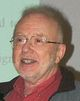

# INTRODUCTION 2 SOFTWARE ENGINEERING 

**LEARNING GOALS**

> This lesson is an introductory lesson. It also contains exercises, but is smaller in scope and less intense than the ones that follow. If you have never dealt with the topic of software engineering, you should work through this learning unit to get a feel for this subject.

**STRUCTURE**

Topics of the learning unit are:

> The terminology of software technology and software engineering.
> The historical development of software technology.
> A look at the current situation and the impact of software errors - you will learn the importance of an engineering approach and software quality.
> Best practices in software engineering.
> The rough phases of the software lifecycle.
> The basic principles of software engineering.
> Overview of the learning units of the software engineering study module.

 **TIME NEEDED**

> You will need approximately 60 minutes to work through the learning unit and approximately 80 minutes to complete the exercises.

---
## INTRODUCTION

First, we want to define the term software technology in more detail.

**Software**

Software cannot only mean the end product of an executable program. There is much more to software itself. For example, this also includes manuals, installation tools, developer documents or demonstration programs. And this despite the fact that software, in contrast to hardware, actually includes all non-physical components that can run on computers. Therefore, a distinction is made between more active data, such as executable programs, and passive data. The latter is all information that is important for the successful operation of the program in the broadest sense.

**Technical / Engineering Aspect**

> Engineering, in its original meaning, means a "craft" or skill. More precisely, it refers to an engineering science or engineering. As an engineer, one is trained to be very proficient in at least one field. Furthermore, knowledge includes such things as: Practical experience in the implementation of theoretical knowledge, analytical thinking skills and a broad general education.

> The term "engineering" corresponds to the English equivalent to be able to solve technical and scientific problems theoretically and practically.

The search is therefore for the right "technology" for the software to be created!

**Software + technik / Software + engineering**

Correspondingly, the IEEE defines software technology as:

> "The application on a systematic, disciplined, quantifiable approach to the development, operation and maintenance of software; that is the application of engineering of software

The term is also perhaps so difficult to understand because it encompasses many other fields (mathematics, production, manual labor, art, etc.). Perhaps this is precisely the appeal of being an artist or creator who can create something, bring it to life, and at the same time make it instantly accessible to millions of people.

---
## HISTORY

The term software engineering emerged in the 1960s and was coined at the 1968 NATO-sponsored Software Engineering Conference in Garmisch-Patenkirchen, Germany.

Some more key data on the history of software engineering:

| YEAR | EVENT |
| :------- | :------: |
| 1950+ | First tools emerge, like "Macro Assembler". First compilers. |
| 1960+ | Second generation of tools: optimizing compilers. First large-scale projects with more than 1000 developers are carried out. |
| 1968 |  Dijkstra writes about the problems of the GOTO statement. |
| 1968 | The date standard YYMMDD is issued. |
| 1970 | Waterfall model of Winston Royce. Unix created in the 70s. |
| 1971 |  David Parnas: Information Hiding |
| 1978 | Structured Analysis and System Spec (SA-Method) |
| 1988 | Spiral-Model by Barry Boehm |
| 1990 | Component-based development / OO development |
| 1994 |  Design Patterns von Erich Gamma |
| 1997 | UML (Unified Modeling Language) |
| 1999 |  Martin Fowler & Kent Beck "Refactoring" |
| 2003 | Agile Modelle: Scrum and Kanban gain more popularity |
| 2003 | Eric Evans und (Domain Driven Design) DDD |
| 2004/05 | UML 2 |
| 2008 |  Clean Code Books and German Clean Code Movement ([Clean Code Developer](https://clean-code-developer.de/)) |
| 2010 | Outstanding book on „Continous Delivery“ by Jez Humble und David Farley |
| 2015 | first research on software engineering in AI / Big Data Analytics |
| 2017 | Alberto Brandolini und Event Storming. Followed by Team Topologies |

The most comprehensive history can be found here.

> „The Technical and Social History of Software Engineering“, von Capers Jones, published by Addison-Wesley Professional, 2013