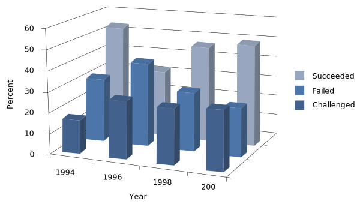
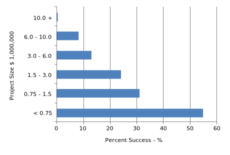
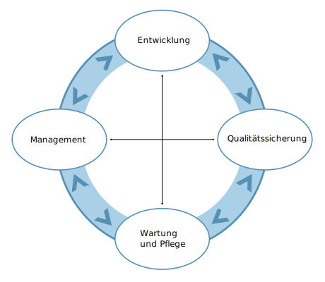
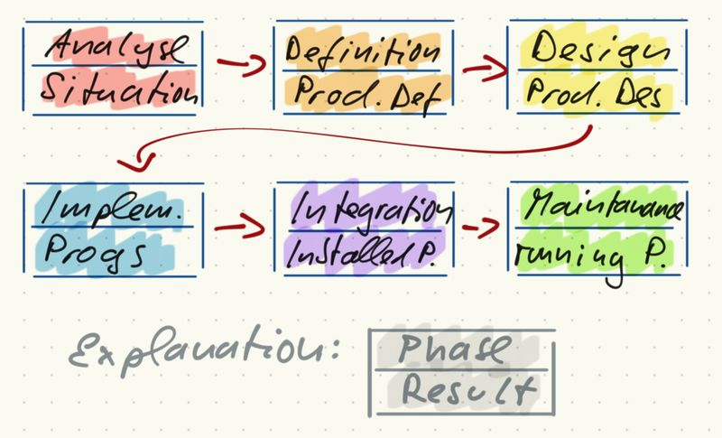
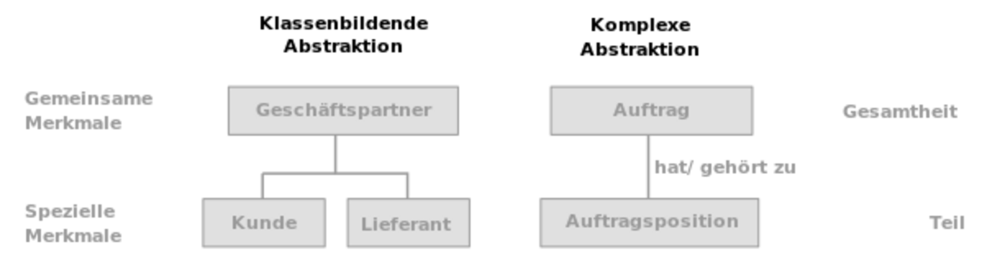
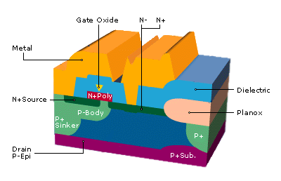
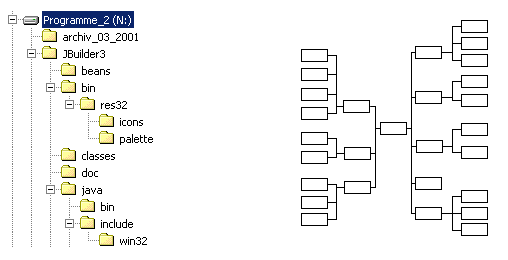

# INTRODUCTION TO SOFTWARE ENGINEERING

(C) Prof. Dr. Stefan Edlich

---

## OVERVIEW

**LEARNING GOALS**

> This lesson is an introductory lesson. It also contains exercises, but is smaller in scope and less intense than the ones that follow. If you have never dealt with the topic of software engineering, you should work through this learning unit to get a feel for this subject.

**STRUCTURE**

Topics of the learning unit are:

> The terminology of software technology and software engineering.
> The historical development of software technology.
> A look at the current situation and the impact of software errors - you will learn the importance of an engineering approach and software quality.
> Best practices in software engineering.
> The rough phases of the software lifecycle.
> The basic principles of software engineering.
> Overview of the learning units of the software engineering study module.

 **TIME NEEDED**

> You will need approximately 60 minutes to work through the learning unit and approximately 80 minutes to complete the exercises.

---

## INTRODUCTION

First, we want to define the term software technology in more detail.

**Software**

Software cannot only mean the end product of an executable program. There is much more to software itself. For example, this also includes manuals, installation tools, developer documents or demonstration programs. And this despite the fact that software, in contrast to hardware, actually includes all non-physical components that can run on computers. Therefore, a distinction is made between more active data, such as executable programs, and passive data. The latter is all information that is important for the successful operation of the program in the broadest sense.

**Technical / Engineering Aspect**

> Engineering, in its original meaning, means a "craft" or skill. More precisely, it refers to an engineering science or engineering. As an engineer, one is trained to be very proficient in at least one field. Furthermore, knowledge includes such things as: Practical experience in the implementation of theoretical knowledge, analytical thinking skills and a broad general education.

> The term "engineering" corresponds to the English equivalent to be able to solve technical and scientific problems theoretically and practically.

The search is therefore for the right "technology" for the software to be created!

**Software + technology / Software + engineering**

Correspondingly, the IEEE defines software technology as:

> "The application on a systematic, disciplined, quantifiable approach to the development, operation and maintenance of software; that is the application of engineering of software

The term is also perhaps so difficult to understand because it encompasses many other fields (mathematics, production, manual labor, art, etc.). Perhaps this is precisely the appeal of being an artist or creator who can create something, bring it to life, and at the same time make it instantly accessible to millions of people.

---

## HISTORY

The term software engineering emerged in the 1960s and was coined at the 1968 NATO-sponsored Software Engineering Conference in Garmisch-Patenkirchen, Germany.

Some more key data on the history of software engineering:

| YEAR | EVENT |
| :------- | :------: |
| 1950+ | First tools emerge, like "Macro Assembler". First compilers. |
| 1960+ | Second generation of tools: optimizing compilers. First large-scale projects with more than 1000 developers are carried out. |
| 1968 |  Dijkstra writes about the problems of the GOTO statement. |
| 1968 | The date standard YYMMDD is issued. |
| 1970 | Waterfall model of Winston Royce. Unix created in the 70s. |
| 1971 |  David Parnas: Information Hiding |
| 1978 | Structured Analysis and System Spec (SA-Method) |
| 1988 | Spiral-Model by Barry Boehm |
| 1990 | Component-based development / OO development |
| 1994 |  Design Patterns von Erich Gamma |
| 1997 | UML (Unified Modeling Language) |
| 1999 |  Martin Fowler & Kent Beck "Refactoring" |
| 2003 | Agile Modelle: Scrum and Kanban gain more popularity |
| 2003 | Eric Evans und (Domain Driven Design) DDD |
| 2004/05 | UML 2 |
| 2008 |  Clean Code Books and German Clean Code Movement ([Clean Code Developer](https://clean-code-developer.de/)) |
| 2010 | Outstanding book on „Continous Delivery“ by Jez Humble und David Farley |
| 2015 | first research on software engineering in AI / Big Data Analytics |
| 2017 | Alberto Brandolini und Event Storming. Followed by Team Topologies |

The most comprehensive history can be found here.

> „The Technical and Social History of Software Engineering“, von Capers Jones, published by Addison-Wesley Professional, 2013

---

## Why Software Engineering? Small Errors - Great Disasters

> Because the process of creating software is apparently quite difficult!

Today, large software projects can have a budget in the billions - $ or even €. Even seemingly small projects can quickly reach six-figure costs. For this purpose, the underlying project plan can simply be extrapolated with the hourly wage of developers of e.g. 50 € per hour. Unfortunately, even a few small errors can paralyze or destroy a complete system.

**Rocket**

> Im Jahre 2005 verursachte ein Softwarefehler, dass sich die zweite Stufe einer russischen Rakete nicht trennte. Die Rakete transportierte einen CryoSat-Satelliten im Wert von 135 Millionen Euro. [Cryosat rocket fault laid bare](http://news.bbc.co.uk/1/hi/sci/tech/4381840.stm)

**Mars Sattelite**

> A Mars satellite missed its target in 1999 because a programmer assumed weight data in pounds in a function, but got the data in kilograms from the calling function. A JPL (Jet Propulsion Laboratories) technician:
> „Yesterday, MCO was approaching the planet to pass within 140 km of the surface and all seemed okay. However, in the last six to eight hours before the approach we saw a 100 km drop and we don't understand why.“ (BBC Online)
> The damage was about the same abount.

**Unemployment Benefit in Germany**
>The system started on January 1, 2005. Surprisingly, unemployment benefits could not be calculated for 5% of the recipients. The error, as reported by Heise Online, was that the account numbers were handled incorrectly.

>Account numbers were set to ten digits by default. For all account numbers smaller than 10 digits, the account numbers were right-justified instead of left-justified. For example, for account numbers that had less than 10 digits, this meant that a result like 47110000 came out. The correct result would have been 0000004711! Imagine if this error had happened with the funds to be transferred. 
[link](https://www.heise.de/news/Hartz-IV-GAU-bei-der-Arbeitslosengeld-II-Zahlung-Update-124331.html)

This list can be continued:

* On June 4, 1996, Ariane 5 explodes because a 64-bit floating-point number had to be converted to a 16-bit signed integer. The 64-bit number had a larger value than could have been represented by the integer. This leads to an exception. Development cost of the new Ariane: $8 billion.
* For the division algorithm, the Intel Pentium processor used a lookup table that should have had 1066 entries. Unfortunately, only 1061 were loaded!
* Already in 1962, for a Venus probe in a Fortran Do loop, a "~" character instead of a comma caused the mission to fail.
  
There are many more examples. Interested readers are referred to the following websites. (Caution: addictive reading and often time consuming!)

* [Collection of Software Bugs](https://www5.in.tum.de/~huckle/bugse.html)
* [Software Horror Stories](http://www.cs.tau.ac.il/~nachumd/verify/horror.html)
* [Aviation Safety Network](http://aviation-safety.net/)
* [Therac-25 - Linearbeschleuniger](https://de.wikipedia.org/wiki/Therac-25)
* [CIO 10 Punkte des Scheiterns](https://www.xing-news.com/reader/news/articles/2605851)

---

## How much and what goes wrong in software projects?

First, let's look at some results from studies that are still valid today and that underscore the need for software engineering.

DOD (Department of Defense) study from 1989:

* 30% ordered but not delivered
* 46% not used
* 19% usable with major modifications
* 3% usable with minor modifications
* 2% used as delivered
The Standish Group from 1995 (Chaos Report USA):

* 31% of projects are cancelled
* 53% of projects cost 189% of the original plan
* Only 16% of projects on time and on budget

How does it look in Germany? In August 2000, Mummert & Partner stated the following in a study:

* 75% of all projects do not reach the planned goal
* 40% of all IT projects fail
The Standish Group has prepared some of the results graphically. Here is a graph that looks at the success of projects in "succeded=successful", "failed=failed" and "challenged=still a challenge" over time:

**Pic:** Successful and failed software projects

**Pic:** Dependence of the success on the project size

The Standish Group study also provides insight into the causes of project failures.

* 13.1% Incomplete / inaccurate requirements
* 12.4% Lack of stakeholder involvement
* 10.6% Resource management
* 9.9% Unrealistic expectations
* 9.3% Lack of support from management
* 8.7% Frequently changing requirements / specifications
* 8.1% Poor planning
* 7.5% No longer needed
* 6.2% Lack of IT management
* 4.3% Lack of technology knowledge

**Hint**
>Außergewöhnlich ist, dass die inhärente Projektkomplexität oder die durch menschliches Handeln herbeigeführte Komplexität von den beteiligten Personen sehr selten als Ursache für das Scheitern von Projekten angeführt wird.

**Weblink**
> Please read the respective [weblink](https://snafucatchers.github.io/)

**Solutions*
Software engineering can deal with some of the points mentioned and propose solutions. In this Software Engineering study module, these points are also considered later. Software engineering cannot get you more support from management, but it clarifies the importance of management support and it provides good guidance on the topics: Requirements, Resource Management, Planning, IT Knowledge and Technology Knowledge.

**Sources of errors**

* 32% Errors in system logic
* 19% Documentation errors
* 18% Processing errors on the computer
* 11% Errors in the code
* 6% Data handling errors
* 5% Errors in requirements
* 5% Process flow errors
* 4% Hardware errors

---
## What is it all about?

How can the engineering hints, advices and knowledge units of software engineering be categorized? What do we learn in the following learning units?

DUMKE takes a division into five categories (Dumke (2001). Software-Engineering. Vieweg. ISBN: 3-528-25355-X ):

1. **Methods**:
Guidelines, strategies and technologies for a systematic, i.e. phase or step-by-step development of software
1. **Tools**:
Computer-aided aids for software development and application.
1. **Measurement systems**:
Set of software measures for evaluating and measuring the properties of the software to be developed with respect to suitability, quality, and especially performance behavior.
1. **Standards**:
Set of guidelines for the uniform and coordinated form of the software development and the software system which can be developed
1. **Experiences**:
(quantified) knowledge about the development of the software as well as the development result itself regarding the employment, the quality and the use (as engineer knowledge)

**More Topics**

There are other topics, such as project management, simulations, implementation, patterns, etc., which more or less fall into the field of software engineering. These also sometimes have a great relevance for the creation of a software system.

> For the standards listed above, there are a number of bodies and organizations that are relevant to software engineering:

* ANSI: [American National Standard Institute](https://www.ansi.org/)
* DIN: [Deutsches Institut für Normung](https://www.din.de)
* DoD: [Department of Defense](https://www.defense.gov/)
* ACM: [Association of Computing Machinary Standards Committee](https://www.acm.org/)
* ISO: [International Organisation for Standardization](https://www.iso.org)
* IEEE: [Institute of Electrical and Electronic Engineers Standards Association](https://standards.ieee.org/)
* DEN: [European Committee for Standardization](https://www.cencenelec.eu/)
* GI: [Gesellschaft für Informatik e.V.](https://gi.de)

*** Best Practices

As a rule, the software project is about so-called "best practices". These are more or less "objective" empirical values that lead a project to success. Methods, tools or measurement systems are used that have proven to be very successful based on experience.

**Methods**

Best practices in terms of methods are represented, for example, by the process models. These can describe which approach has proven advantageous so far. They provide information about specific activities or documents to be created in a particular phase or even which tools can be used.

**Tools**

Tools include development environments (IDE, Integrated Development Environments), CASE tools (Computer Aided Software Engineering), design or UML tools (Unified Modeling Language), requirements elicitation and management tools, and version / build management tools.

**Standards**

Standards include, for example, standards for programming languages such as Java or C, but also design standards such as UML or coding standards such as code conventions (e.g. for Python).

**More Elusive Experiences**

Among the more elusive experiences of software engineering are points of general project / practical experience that one can often only experience oneself after completing several projects.

**Example**

From Peter Coad:

* **No big bang:** never write the entire code together at once
* **Tiny steps:** develop in small steps and closely examine the results each time
* **Frankenstein principle:** code hacked together in one night can keep you busy for years
* **Good politics principles:** first of all, the system elements should be developed that “impress” the customer the most (under KENT BECK's XP, the principle was reformulated in such a way that the greatest business value should be developed first.)
* **25 words or less:** always try to express the meaning of the system to be developed in 25 words or less
* **Don't touch the WHISKEY principal:** avoid the WHISKEY principle
(“Why in the H— Isn't someone Coding Everything Yet?”)

These best practices provide guidance on quality. After all, it's always about quality. But what does that mean?

> Please watch videos from Dr. Gernot Starke on Quality! e.g. [link](https://www.youtube.com/watch?v=g5zLCM3Sm4k)

---
## The Software Lifecycle

These best practices provide guidance on quality. After all, it's always about quality. But what does that mean?

**Software Lifecycle**

> The software lifecycle is the set of all distinguishable phases that the software product and the people involved in its creation go through. This usually extends from the initial idea to the complete installation and even to the replacement of the software product.

The distinguishable phases mentioned can be described as follows:

**Phases of the Software Lifecycle**

A phase in the software lifecycle is a clearly defined period of time in which predominantly similar activities such as requirements analysis, implementation or maintenance are carried out. At the end of such a phase, the results can be evaluated and, under certain circumstances, even tested.

Let's look at some of the "most important" phases in the software development process.

---

### Phases of the software development process

The task of software development is to create a product that has the required quality properties. The development process is generally divided into a series of activities, the results of which are individual sub-products. Such activities are grouped into phases based on time, conceptual, technical and/or organizational criteria.

Pic: Phases of the software development process

**Management**

Software management is required to plan, organize, direct and control the development process.

**DEVELOPMENT**

Development and management in the software development process are often interdependent. The introduction of new methods and tools can lead to changes in organizational structures.

**QUALITY ASSURANCE**

Ensuring the required software quality must be achieved through development-accompanying software quality assurance. A series of constructive and analytical measures must be carried out for this purpose. The quality assurance measures are influenced both by development (the methods, tools and programming languages used require specific security and testing measures) and by management through the organizational assignment of quality assurance to the development process.

**MAINTENANCE AND CARE**

After a software product has been released for use, maintenance and care begins, i. H. It is important to eliminate all errors that occur after commissioning, to adapt the application system to changed conditions and to develop it further if new requirements arise. The type and scope of the maintenance activities also depend on the guarantee of quality assurance, i. H. poor product quality inevitably leads to more frequent errors.

---

### The classification of the phases

In the software lifecycle, the phases can be broken down in different ways. Based on BALZERT [Bal98, p. 567], an initial rough phase classification is proposed below for the study module.

Pic: Ordering of the phases according to Balzert

**RESULTS**

As can be seen from the figure, each phase is characterized by the corresponding results that it produces. Furthermore, necessary activities / work steps and criteria for checking the successful completion can be assigned to each phase. Various phase models (software life cycle models) are used in the technical literature to describe the software development process with the help of defined phases.

**DIFFERENT MODELS**

The problems of the different models will not be discussed in detail here. Phase and procedure models are dealt with in other learning units.

**MULTIPLE PERSPECTIVES**

As already mentioned, there are several perspectives on the cycles in the software life cycle. For example, other authors define the phases before design: problem definition, requirements analysis, and specification.

> **Remark:** In the figure above, note that the arrows between each phase only apply if it is a strictly "waterfall" approach. In other models, these phases are constantly mixed, for example, they line up in spirals with regressions, or all phases are experienced more or less continuously. Double arrows or complete networking of all phases are therefore also conceivable. After all, the term "cycle" in the software life cycle also stands for something recurring.

The objectives, the required activities and the results for each phase are briefly presented below.

---

### Analysis Phase

**Goals:**

* Description of the initial situation
* Definition of the goals for the software solution in the user area
* Resource planning (human, financial, temporal and technical)
  
**Activities:**

* Carry out a preliminary investigation (including market analyses, trends, customer inquiries)
* Survey of the actual situation in the investigation area
* Creating a rough overview of the components of the planned system
* feasibility studies
* Creating a project plan with resources and project steps
* profitability analysis

**Results:**

* Situation study, project calculation / project plan

---

### The Definition Phase

**Goals:**

* definition of the requirements for the planned software system (definition of what it should do) from the user's point of view
* definition of premises for the realization of the software system

**Activities:**

* determine requirements
* define and describe requirements
* validation of the defined requirements (check for completeness, consistency and technical feasibility)

**Results:**

* data model, function model, user interface and project plan
* product definition / product requirements relate to the data, functions, behavior and user interface of the planned application system

---

### Design Phase

**Goals:**

* Development of a software technical draft

**Activities:**

* Analysis of the operating conditions as well as the environmental and boundary conditions
* Definition of the system components
* Design of the system architecture (components, their interaction and arrangement)
* Design of the interfaces and definition of their interactions
* System architecture validation

**Results:**

* Description of the structure of the software design (e.g. composition of the program, program flow, hierarchy, modules, etc.)
* Design of the system components

---

### Implementation Phase

**Goals:***

* Implementation of the design results in a form that can be executed on the computer
* Ensuring the correctness and accuracy of the results of the system implementation

**Activities:**

* Refinement of the algorithms for the individual system components
* Coding / generation of the algorithms
* Transfer of the logical data model into a physical DB concept
* Checking the semantic correctness of the system components
* Testing of the syntax and, if necessary, correction of the faulty system components
* Testing of the interaction of the system components under real conditions
* Identifying and eliminating errors in the software system

**Results:**

* Source code for the system components
* Unit test logs, system tests
* Generated data objects and data structures

---

### Acceptance and Introductory Phase

**Goals:**

* acceptance of the completed software product and introduction to the user

**Activities:**

* handover of the software product including documentation to the customer
* carrying out an acceptance test
* installation of the software product in its target environment
* training of future users of the software
* commissioning of the product

**Results:**

* transferred Software Products
* documentation

---

### Maintenance and Care 

**Goals:**

* Ensuring the productive use of the application system
* Error elimination on the software system in the operating or usage phase
* Realization of necessary change and expansion work

**Activities:**

* Maintenance: Stabilization and optimization of the product installation
* Maintenance: adjustments and extensions

**Results:**

* Satisfied costumers

---

## Principles of Software Engineering

Pic: Example Principles from Feng Shui

**SPEED OF INNOVATION VS. PRINCIPLES**

Software engineering is characterized by a high rate of innovation. This applies in particular to the development of tools and methods. In comparison, principles are general and abstract. They form the theoretical basis, e.g. B. for method development.

**SELECTED PRINCIPLES**

In this chapter, some selected principles are presented in order to create a basis for understanding the methods dealt with in the further learning units.

**ABSTRACTION**

In general, these principles apply to engineering, but are of particular importance for software development, as it is about developing complex and interacting systems. These can be better described, modeled, developed and tested the better one manages to abstract or structure things. This is something that many computer scientists find difficult - it is often too appealing to just develop things immediately.

---

## Principle of Abstraction

Pic: Abstraction

**MAIN PRINCIPLE**

Abstraction is one of the most important principles in software engineering. Abstraction involves generalization, capturing the essential, and omitting the particular and singular. Abstraction is the opposite of concretization.

**RESULT: MODEL**

The result of the abstraction is a model. Such a model of the real world is created by abstracting from the concrete and omitting secondary aspects. Abstraction and concretization are not absolute but relative, which means that the goal of the respective abstraction (modeling) determines which aspects are essential and which are irrelevant. The notion of levels of abstraction is also used to emphasize gradations. In software development, there is a constant interplay between abstraction and concretization.

**SOFTWARE DEVELOPMENT PROCESS**

For the software development process, this means, on the one hand, approaching the system from a very abstract level and making it more and more concrete in its modeling and description. On the other hand, components whose exact structure is clear must be described on a higher / more abstract level in order to be able to represent and communicate at all.

**Class-forming and complex-forming abstraction**

In the context of modeling, two forms of abstraction in particular are known.

* Class-building abstraction
  
The generalization of elements by omitting the distinguishing features is called class-building abstraction.

* Complex abstraction

To abstract in a complex manner means to understand several elements as parts of a new whole and to summarize them under a common term.

Pic: Two forms of abstraction

---

## The Principle of Structuring

The principle of structuring is of great importance for both the software product and the development process.

> **QUOTE** "Structure (in the general sense) is an arrangement made up of parts that depend on each other." Balzert Bal98

> **QUOTE** "Structuring means finding a reduced representation for a complex system that reflects the character of the whole with its specific features." [Bal98, p. 567] Balzert Bal98

**PNP STRUCTURE**

The figure shows a simple PNP structure as an example. A transistor, a diode or an NPN are much more complex in real terms. However, the information can be reduced and structured.

Pic: Example PNP Transistor Structure

**MANAGING COMPLEXITY**

The principle of structuring helps to cope with complexity. It offers:

* approaches to breaking it down into small, manageable units
* a basis for a collaborative approach
* quick familiarization with a complex of tasks

**ADDITIONAL ADVANTAGES**

The application of the principle of structuring brings further advantages [Bal98, p. ”567”] :

* Increased comprehensibility (for product and process)
* Improvement of the maintainability of the software product
* Facilitate familiarization with a third-party software product

**Structure is the way the elements are put together**

**STRUCTURE**

In the context of software development, tree and network structures are the most common forms of structuring. Tree structures are used to represent hierarchical relationships, such as the specification of processes, data and programs (examples: function hierarchy diagrams, data structure diagrams).

**TREE AND NETWORK STRUCTURES**

Network structures can be used to represent functional processes, control flows and to represent relationships between data and functions or between data objects (examples are information flow or entity relationship diagrams).

**GROUPS / CLUSTERS**

But the formation of groups / clusters is also an important element of software engineering, for example when functions or GUI elements are grouped. It turns out, therefore, that the structure of a system is, in general, the way in which the elements are put together, whereby elements with the same properties belong together or can otherwise be organized or grouped geometrically according to properties or abilities.

---

## Principle of Hierarchy

The principle of hierarchization is a special case of structuring. The hierarchy designates a ranking, a superior and inferior order.

**Pic:** Hierarchy

A system has a hierarchy when its elements are **related / ranked** to one another in an order of **precedence**. Elements of the same rank are on the same rank and form one level of the hierarchy. Rankings can be determined based on the **meanings, properties or (temporal) relationships** of the elements of a system. The principle of hierarchization is an important principle for structuring software products and software development processes. The principle of hierarchization is based, for example, on **tree structures**.

---

## Principle of Modularization

**Pic**: Modularization

**BREAKDOWN**

The principle of modularization includes the **breakdown** of a software system into a number of clear, clearly defined and easily exchangeable *building blocks* (modules). A module is **context-independent and self-contained**.

Context independence means that a module can be developed, maintained, tested and understood independently of its environment.

The result of modularization is the representation of a software system as a hierarchical arrangement of modules. The principle of modularization includes that a module has fixed interfaces to other modules, i. H. data is exchanged via interfaces. The principle of modularization is supported by the following concepts and methods, among others:

* Component or subsystem formation in the object-oriented approach
* hierarchical information flow diagrams

Large-scale modularity is closely linked to the principle of abstraction, since modularization also requires the creation of levels of abstraction.

**INFORMATION HIDING**

Closely related to the principle of modularization is the secret principle (“information hiding” according to Parnas), which requires levels of abstraction [Par72]. The secrecy principle means that the internals of the system component or subsystem are hidden from the user or user of a system component or subsystem, i. H. are not visible. For a module that is intended to be context-independent and communicates via a *defined interface*, the application of the secret principle means that only this defined interface **is only visible from the outside**.

A number of advantages result from the application of the principle of modularization:

* Easier to change (easier to exchange and expand)
* Improvement in maintainability
* Better structuring
* Facilitate standardization
* Improvement of verifiability

---
## Principle of Standardization

The principle of standardization is required to unify both the development process and the product. The principle of standardization can be enforced via:

* Compliance with corporate standards
* Setting and complying with branch-specific and operational policies
* Use of internal standards

**ADVANTAGES**

The realization of the principle of standardization brings the following advantages:

* Standardization of the development process and the software product
* Uniform design of documentation and programs
* Facilitate the onboarding and maintenance of software products
* Facilitate adaptation to changing conditions in the basic process

**COST**

An important aspect of standardization these days is cost. In almost all sectors, large projects can only be implemented cost-effectively with the help of standards.

> **Example**: In communications technology, for example, this refers to *protocols*, but it is also evident in the consumer sector, for example in the battle over video formats and data carriers (HD-DVD versus Blu-ray).

**UML**

The design notation UML became the standard much faster, also due to the desire of the industry, so that, among other things, uniform UML tools could be developed and sold.

---
## Summary

* The term software distinguishes between active data such as executable programs and passive data.
* Large software projects can cost millions these days, and just a few errors can cripple or destroy an entire system.
* There is a significant connection between project size and project success.
Software engineering can be divided into five categories: methods, tools, measurement systems, standards and experiences.
* Best practices are more or less "objective" empirical values that lead a project to success.
* The elusive experiences of software engineering include points of general project/hands-on experience.
* The software cycle enables the software engineer to better classify the elements of software engineering and to get to know the corresponding language usage.
* Ensuring the required software quality must be achieved through development-accompanying software quality assurance.
* Development and management in the software development process are often interdependent.
* To describe the software development process with the help of defined phases, various phase models are used as software life cycle models in the specialist literature.
* The principles of software engineering are general and abstract. They form the theoretical basis, e.g. B. for method development.
* Abstraction is one of the most important principles in software engineering. There is a constant interplay between abstraction and concretization.
* Structuring means finding a reduced representation for a complex system that reflects the character of the whole with its specific characteristics.
* A system has a hierarchy when its elements are related to one another in an order of precedence.
* The result of modularization is the representation of a software system as a hierarchical arrangement of modules.
* The principle of standardization is required to unify both the development process and the product.

---

## Excercises

1. Your friend asks you "what is software engineering?" Can you define that in a few sentences?
2. Why is software quality so important? (a few sentences)
3. What is software quality for you? (a few sentences)
4. What are the three biggest problems for you, why software projects go wrong. How would you address these? (>= 9 sentences)
5. Could you now write / draw the phases of the software life cycle on the blackboard? Please memorize and test yourself by noting all phases here.
6. What relation do you have to software engineering? Which areas are you particularly interested in? Do some research and send 2-3 links!

Processing time: 30 minutes