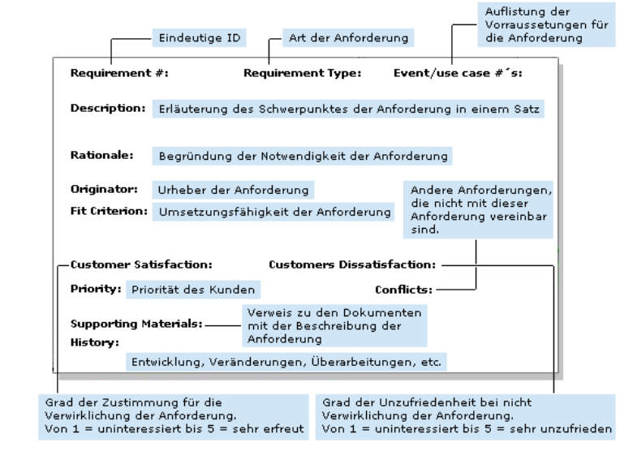

# INTRODUCTION TO SOFTWARE ENGINEERING

(C) Prof. Dr. Stefan Edlich

---

Requirements Engineering (RE) is a specialist area that deals with the collection of requirements - that is, with the requirements for the software system to be created.

**LEARNING GOALS**

The aim of this learning unit is to familiarize you with requirements engineering, to know all the properties, to learn procedures and to get an idea of how a project manager deals with requirements. Every student should have used a tool to record requirements themselves and received feedback from the mentor or project.

After working through it, you should know why requirements engineering makes sense. You will know the main problems of software development and analysis as well as the most important requirement characteristics. You should become aware of the problem of linguistic fuzziness and the degree of commitment.

**STRUCTURE**

This lesson contains the following chapters:

* Introduction
* Problems and tasks of the RES
* Examples and formalities
* Requirements Engineering II
* RE tasks for you to practice
* Finally, you will get an insight into the prioritization of tasks and the "Eisenhower scheme" that can be used here.

**TIME NEEDED**

You will need approximately 120 minutes to work through the learning unit and approximately 270 minutes to complete the exercises.

**LITERATURE**

* Chris Rupp und Klaus Pohl, "Requirements Engineering Fundamentals: A Study Guide for the Certified Professional for Requirements Engineering Exam - Foundation Level - IREB compliant", Rocky Nook, ISBN-13 978-1937538774
* Ru07 Chris Rupp (2007): "Requirements-Engineering und -Management. Professionelle, iterative Anforderungsanalyse für die Praxis" (in German)
* Po07 Klaus Pohl (2007): "Requirements Engineering. Grundlagen, Prinzipien, Techniken"  (in German)
* Eb05 Christof Ebert (2005): "Systematisches Requirements Management"  (in German)

---

## Motivation and Background

Usually you start with small projects. Usually, most software developers have also heard of UML and use cases. And so - when it comes to defining requirements - you start drawing a use case diagram and storing it in a document.

Later there are larger projects and you realize that this topic is much more complicated and that drawing doesn't work that way. Typically, you then have such a large project that rows of initial "use cases" images fly around your ears - and the whole project at the same time. At this point at the latest, it becomes certain that the requirements should have been dealt with much earlier: much more precisely and much more extensively.

That is exactly the purpose of this lesson. As a responsible software engineer, you should have your own concept of how to approach the topic of requirements and implement them as a project manager.

Please take a look at the following picture:

**Pic**: Three problem areas of software development

Every beginning is easy. You can define, get started and the classes grow and everything is a beautiful playground with not that much connection to reality.

However, over time - with more serious or larger projects - three problems will arise:

1. The stakeholder (client) wants more features, he wants the developed differently. If there isn't regular communication here, it's usually a shocking surprise to the team. See the example "The Fall of the Vasa".
2. The source code becomes much more complex. Troubleshooting is getting harder and harder. There are too many dependencies. Server startup and debugging itself takes too much time. The developers then work neither qualitatively / productively nor creatively.
3. The source code becomes so complex that most of the time even the architects or chief developers hardly understand it. In addition, there is often no documented architecture, architecture guidelines or mechanisms for dealing with complexity.
In this lesson, we want to address the first problem. The other two problems are dealt with in their own learning units - such as *"Object-Oriented Testing"* or *"Dependency Injection"*.

**The Fall of the Vasa**

(excerpt from the book *Productive Programming* by Neil Ford)

In 1625, King Gustav II Adolf of Sweden commissioned the proudest warship the world had ever seen. He hired the best shipbuilders, had a forest with the mightiest oak trees raised and began work on the »Vasa«. Again and again the king made new demands that were supposed to make the ship even grander, lavishly decorated all over. Eventually, he decided that the ship - unlike any ship ever built in the world - should be armed with two gun decks so that it would become the most powerful warship on the high seas. And with an emerging diplomatic conflict, he needed it as soon as possible. Of course, the shipbuilder only intended one gun deck when designing the ship, but since the king wanted it that way, he also got his second gun deck.

Because speed was of the essence, there was no time for the usual *"lurch tests,"* in which a group of sailors run from one side of the ship to the other to make sure the ship isn't rocking too much (in other words: that it's not too top-heavy).

On her maiden voyage, the Vasa sank within a few hours. With all the *"features"* added to the ship, it had lost its seaworthiness. The Vasa lay at the bottom of the North Sea until the early 20th century, when the well-preserved ship was raised and placed in a museum.

And here an interesting question arises:

* whose fault was that the Vasa sank?
* The king because he kept asking for new features?
* Or the shipbuilders who built what they wanted without voicing their concerns loud enough?
* Take a look around the project you're working on: are you about to build a Vasa?

**Background**

Requirements engineering consists of the words requirement and engineering, i. H. the engineering approach to the subject of requirements. The requirements are the wishes / services that a certain group of people (usually the customer) places on the software system to be developed or that it has to fulfill. In this context, one speaks of raising requirements.

This topic overlaps with the general analysis activity in the software life cycle. So there is:

* general (IT) requirements
* the concrete software requirements specification
* parts of the (specifications and especially the) specifications must contain requirements
* and requirements management (i.e. RM aka requirements management)

All of these areas will be explored in more detail throughout this unit.

As is so often the case, it is important to avoid mistakes at an early stage, so the initial phase of a project is also very important. Correcting mistakes made when setting the course initially costs much more money and time later. This is often repressed or forgotten at the beginning. According to studies, 65% of all gross errors in software projects are due to errors in the analysis phase. See also the statistics in the lesson: Introduction to software engineering.

Unfortunately, requirement definitions are far too often saved in some Word document by the project manager or get rotten in some use case diagrams. To prevent this from happening, an RE concept should be integrated into the entire project. So the:

* correct,
* complete,
* of high quality

collection and management of requirement characteristics.

Missing requirements in the project are often replaced by assumptions. Furthermore, there is often the case that the client changes his opinion (or his requirements). It is not uncommon for many of the customer's employees to have very different ideas about what the system should do.

GOAL: The aim should therefore also be to establish a procedure in which requirements are managed and documented in a comprehensible manner.

---

## Tasks and Problems

Very good requirements have many advantages for the project. They serve to fix clear objectives and to make ideas more concrete in the early phase - keyword functional specification / specifications / tender / contract. The requirements themselves have a direct and strong influence on the design and architecture of the system. And finally, RE experts also throw in that good, fixed requirements improve the communication of everyone involved in the project. With an overall understanding of requirements, mistakes, bad assumptions and wrong assumptions are avoided.

**Pic**: Seven essential problems

According to RUPP there are seven main problems that play a role in the analysis of the future system:

**1) Unclear objectives**

The group of people who ultimately use it often differs from the people who commissioned the system. Collecting the requirements of all representatives (stakeholders) and bringing them under one roof is difficult, but important.

Worse still, there can be different levels and categories of goals, such as:

* product goals
* project goals
* process goals
* business goals
and these can sometimes even be contradictory or conflicting.

**2) High complexity of the system**

Today's software systems are becoming increasingly complex. There are more and more interactions and dependencies, which makes it more and more difficult to take them into account.

**3) communication problems**

Everyone involved in the project has a different knowledge background and also different wishes. In addition, there is a distributed product development in different languages.

**4) Changing goals and requirements**

These are well known as **moving targets or creeping requirements**. Unfortunately or fortunately, both the people and the project change over time. Good requirements management can help here to record, discuss and adequately consider the really important changes. Without a good RE, it often happens that decision-makers simply change their minds when they feel like it. And reimplementing a system at will is poison for any project.

**5) Poor quality of requirements**

Here, according to RUPP, the following problems can be found in the requirements descriptions: ambiguities, redundancies, contradictions and inaccuracies. The effects of these problems in the requirements are easy to imagine.

**6) Gold edge solutions (gold plating)**

In XP parlance, **“golden taps”** are often used here. This means features that are mostly added by enthusiastic developers, but which are not really necessary and relevant.

**7) Inaccurate planning and tracking of the project**

Based on imprecise requirements, projects are planned too optimistically and then turn out to be too expensive and take too long to develop. So far, for example, performance has not been a requirement; but if this is the case towards the end of the project, it becomes apparent that – e.g. B. from the architecture - a completely different system should have been built.

---

## Sources for Requirements

Where do requirements come from anyway?

All stakeholders must be identified. Typically:

* client
* end user
* Customer developer
* project Manager
* operator of the software
* etc.

**Roles**

It is also important to know their roles. And perhaps hidden intentions!

These must be questioned and, if necessary, relevant documents must be studied. Here, too, there are many models of information gathering:

* interviews
* Brainstorming / Design Thinking
* observation
* prototyping
* competing products
* etc.

**ITERATIVE PROCESS**

As in the procedural model, this is an iterative process with feedback loops, which must also identify risks and, if necessary, communicate them.

**DOCUMENTATION**

The documentation can then be done using good requirements tools that also map the history, since the acceptance tests should always take into account the last and historical requirements.

---

## Requirement Characteristics

After reviewing the literature and some tools, it becomes apparent that requirements should ideally have all of these characteristics:

* correctly
* complete
* clearly defined / delimited
* clearly described
* atomic
* identifiable
* uniformly documented
* necessary
* verifiable / testable
* traceable backwards and forwards
* consistent
* classifiable (jur.)
* validity / topicality
* feasible
* assessable / prioritisable
* consistent
* testable
* customer oriented

Especially when it comes to *"classifiable"*, RUPP points out that legally binding requirements must be able to be marked / grouped. Imagine if that didn't exist in the development of banking software...

When considering which RE tool to use or even build yourself, you could very well consult the above  list of criteria.

**Example**

Here is another example of how this could be noted in the form of cards.

**Pic**: Record criteria on cards

**Requirement Attributes**

Here is an extreme importent list of attributes that can be relevant for requirements:

* id
* date
* author
* short description
* long description
* status
* reference to the use case
* reference to other documents
* who accepts the requirement?
* what is the acceptance criterion?
* priority
* conflicts
* dependencies
* legal relevance
* other remarks
* history
* category

> 

**Excercise**

* Think about which attributes you consider important for your requirements and record them accordingly.

* Are any missing here? Please tell the lecturer if this list is missing items! 🙏

* Do you know of systems that may record other attributes?

---

## Linguistic Blur

Here's an illustrative example from O'Reilly's Head First Software Development:

**Pic**:

> Tom Says: „The customer should be able to search for trails“

* The customer should see a map of the world and then enter an address to search for trails near a particular location.
* The customer should be able to scroll through a list of tourist spots and find trails that lead to and from those spots
* The customer should be able to enter a ZIP code and a level of difficulty and find all trails that match that difficulty and are near that ZIP

Do you recognize the problem?

**AS CLEAR AS POSSIBLE**

Language is often so infinitely fuzzy. The aim must therefore be to define the requirements as clearly as possible according to the previous list of criteria.

---

## Degree of Commitment

**DIFFERENT LEVELS OF LIABILITY**

As can be seen from the requirements of a chess program, there are different levels of commitment. These should also be precisely defined linguistically. The stakeholder should know that using a term that is too weak may result in the feature not being implemented. However, under certain circumstances, too strong a term can also lead to the system becoming much more expensive than planned.

**GRADINGS**

The following classifications of the degree of liability can therefore be found in the literature:

> must (obligation)

This requirement is mandatory. Should / shall is also often used, but this is not so good. The word *"shall"* has a vague component in it and is not as mandatory as it should be in a requirements document. In English, *“shall”* is used in requirements documents. The English *"must"* is even harder, but contradicts English politeness.

> should / shall (wish)

The requirement is not maximally mandatory, but very strongly desired. With this category of requirements in particular, the realization usually comes later that it cannot be financed. For example, the system should be high-performance or be able to process 1000 requests per second if possible.

> will (intention)

One intends to implement a *“will”* requirement. It is likely that this will be achieved, but not 100% certain.

> can (suggestion)

A requirement can be implemented, but does not have to be.

The requirements "will" and "can" are used a little less frequently. Of course, a wish and a suggestion are somehow similar and often even synonymous. So make sure that your documents and everyone involved knows which wording has which effects.

Project managers therefore often define the following structure.

**Pic**: Hierarchical structure of liability

This structure is even supported, specified or checked by some programs.

> **NOTICE**: What's interesting is that this has been supported by an RFC "standard" since 1997!

> Please read about it in RFC 2119 <https://www.ietf.org/rfc/rfc2119.txt> ❗

---

## Priorization

Wichtig und schwierig ist das Priorisieren von Aufgaben. Die meisten Programme geben hier schon ein Schema vor.

Erfahrungsgemäß sind drei bis fünf Stufen völlig ausreichend, um zu priorisieren. Also *„sehr hoch“*, *„hoch“*, *„mittel“*, *„gering“*, *„null“*. Diese sollten dann nummeriert oder mit Ziffern versehen (4 bis 0 oder A bis D) und auf jeden Fall farblich unterlegt werden.

Ähnlich der ABC-Analyse ist es hier interessant, sich alle Anforderungen auch noch einmal unter dem Gesichtspunkt des Eisenhower-Schemas anzusehen.

**Pic**: Eisenhower Matrix / Scheme

The Y-axis is importance and the X-axis is urgency.

**SCHEME FOR EXECUTIVES**

Although the scheme is particularly suitable for managers who can delegate, it is always worth checking out requirements and specific tasks or user stories.

---

## Examples and Formalities

> Formal requirements for a chess program: ♕

1. All best practices should be applied during development.

2. The chess program must be arena compatible.

3. Programming languages:

4. The core must be fast: ⇒ Julia, Nim, C++

5. The wrapper code should be fit for SE tools ⇒ Python

6. The chess program should have a three-level opening library:
* Perfect DB based on FEN + N*[Move weighted with %]
* PrivateDB based on ECO
* Use bigbook.txt

7. The chess program must have a kernel based on fast bitboards.

**TYPE OF PRESENTATION**

In the example, a linguistic representation was selected. However, it is up to you to weigh up when a verbal description and when a graphic representation - for example using use cases - is suitable.

**POSSIBILITIES FOR OPTIMIZATION**

The requirements mentioned in the example are not yet perfect:

* Normally, the first version should not contain any technical details.
* In the first version, they should always be written from the point of view of the user.

---

## Atlantic Systems Guild

