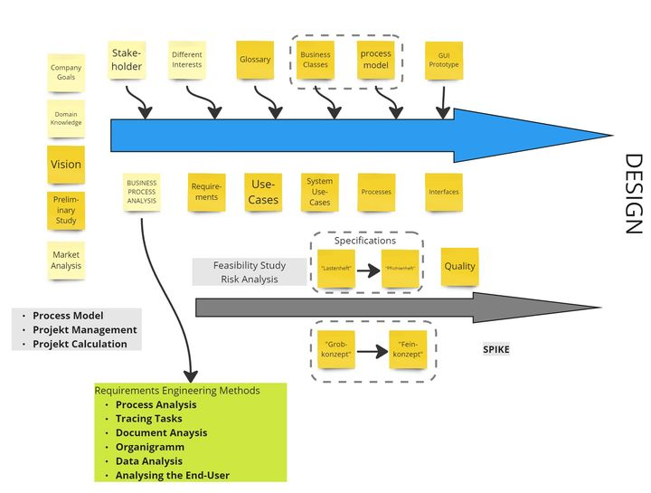
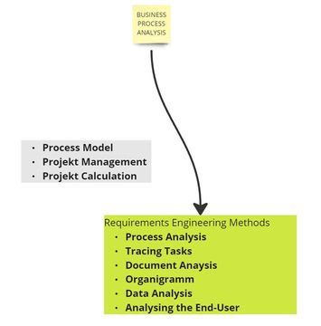
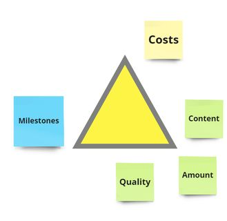
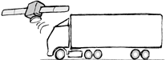

# THE ANALYSIS

(C) Prof. Dr. Stefan Edlich

---

## OVERVIEW

**LEARNING GOALS**

First of all, all essential aspects of the analysis phase should be presented. They should understand which stages and tasks there are in the analysis phase and what has to be done at the beginning and at the end of the analysis. You should be able to classify functional and requirement specifications as well as use cases and requirements.

As an exercise, you will put together your own concept of an analysis

You should then be able to present your own concept in a discussion with the course supervisor and thus deepen your knowledge and application.

The points of analysis presented in the learning unit must therefore be compiled into a separate concept and validated by yourself.

**TIME NEEDED**

You will need 2 hours to actively read this unit.

You need at least 4-5 hours to set up and apply your own analysis.

**LITERATURE**

> Systemanalyse

* Krallmann, H. (1996): Systemanalyse in Unternehmen. München; Wien: Oldenburg Verlag
* Sophist Group / Chris Rupp (2004): Systemanalyse kompakt

> Analyse Phase

* Oesterreich, Bernd (1998): Objektorientierte Softwareentwicklung. Analyse und Design mit UML, Oldenbourg, ISBN-13: 978-3486579260
* oose Innovative Informatik GmbH: www.oose.de/oep/

---

## The Complete Stages of the Analysis

This lesson is not strictly about all points of analysis. In addition to the classic tasks of analysis, there are other important points that should be considered during the analysis, generally in the early phases. This also includes considerations regarding the process model, project management or project calculation. Nvertheless this is a comprehensive list:

**Pic**: Elements of the Analysis Phase

**INITIAL PHASE**

As already mentioned, in the initial phase there are:

* description of the initial situation
* resource planning (human, financial, temporal and technical)
* first project planning
* project calculation with an effort estimation (there are many methods like analogy method, relation method, multiplier method, weighting method, method of parametric equations, percentage method, etc. which can be looked up easily.
* the overall organization of the project and the process model

**DISCRIMINATION IN ANALYSIS**

All points divided in the analysis are divided into:

* The problem analysis / business process analysis, which is often also referred to as the current state analysis, primarily considers the present.
* The TARGET concept of the analysis phase, on the other hand, looks at the future and provides information about what is to be developed.

Everything that describes the future product in the early phases or analysis phases is summarized under the generic term **product definition**. This can be the requirements specification (or a part of it), requirements, GUIs, business classes, etc.

---

## Company Goals

The corporate goals are clearly defined by the questions, what does the company want to achieve (with the product)? It should be noted that it can be either an external or in-house product that is being sold.

**Corporate Goal**

* more profit
* increase market share
* improve internal data flow
* better contact with customers
* higher sales

**Market Analysis**

* what is the market like? 
* can the goal be achieved?
* who are the main competitors?
* how to position yourself?
* are there already products on the market?
* goals often blur or change over time—even during development.

---

## Doimain Knowledge

**COMMUNICATION DIFFICULTIES**

Some projects fail because the contractors or the consultants (consultants) do not speak the *'same language'* as the client or the client company! People do not understand each other and this means that there is no communication among and with each other, which can ultimately lead to the project failing!

What can you do about it?

* read literature
* to hold an interview
* try to understand and speak the language of customers or their stakeholders
* make an internship
* sit next to it and watchIlu
* apply requirements engineering methods

Take this serious. Clients really don't likt it if you are not kn their knowledge level!

---

## Idea for a new System and Vision!

Nothing is more important than **inspiring** all project employees and presenting the idea in a short vision sketch. This should be possible in a **few sentences**!

Analogous to the well-known statement by *ANTOINE DE SAINT-EXUPÉRY*:

> "If you want to build a ship, don't drum up men together to procure wood, prepare tools, assign tasks and divide up the work, but teach the men to long for the wide, endless sea!"

This also includes a concise, intuitive and short **project name**. For example, the address of the website “www.where-to-go-today.net” (which, by the way, was created by one of your online student colleagues) immediately shows what it is about. Or not?

Try to imagine what you would have built on this website!

Many projects do without a short, concise name. Good project names are important self-runners that quickly settle in the minds of many people.

> **Bosporus** A project that combines two fields such as graphics and robotics could e.g. B. simply called Bosporus (or Bosphorus). This project really existed and it was known throughout the university within a month.

---

## Preliminary study and market analysis

The preliminary study depicts the entire analysis process beforehand **"on a small" scale**!

* set **general goals**. The general objective and the boundary conditions to be observed are defined together with the client.

Result documents: Minutes of conversations, etc.

* sources of **information**. Documents are viewed and existing ideas on the problem are incorporated. How is the problem currently being dealt with?

Outcome documents: List of existing sources of information and contact persons.

* **Current State**. The current situation is roughly surveyed using catalogs of questions and interviews.

The general functional and non-functional requirements and objectives of those affected and involved are determined in discussions with the specialist departments.

* **delimit the problem area**. What is no longer part of the task? Where are interfaces to the outside world?

Outcome document: task description, context diagram.

* **identify actors**. Who does what, i. H. which users have which tasks and competencies in the context of the problem area.

Outcome documents: actor diagram, if necessary competence scheme, authorization concept
describe environment. 

* What does the **environment** look like in which the system to be developed is to run?

Outcome Document: An infrastructure model that describes the hardware, software, network and middleware technology and architecture.

* Identify **high-level system use cases**. What are the system use cases called that the system should support? A list of the cases by name already provides an initial orientation on the requirements. If necessary, each system application is briefly explained with a sentence or a few keywords.

Result: system use case overview.

* **Priorities**. Focal points are defined and priorities are assigned. Which problems need to be solved most urgently, which ones have a little more time?
Outcome document: framework concept.

* **alternative solutions**. Possible solutions are developed and compared: Which alternatives are conceivable? In the case of very urgent problems, the question of possible immediate measures arises.

Resulting document: Presentation of the solution alternatives.

* **Recommendation**. The alternative solutions are evaluated (according to previously defined criteria) and economic feasibility studies are carried out if necessary.

Outcome document: recommendation.

* **Further action**. Finally, the further procedure for the alternative recommended or desired by the client is planned.

Outcome document: Recommendations for further action.

---

## Grob- und Feinkonzept (Basic and fine concept)

In industry, one often speaks of the two concept phases, rough concept and detailed concept (especially in Germany).

**BASIC CONCEPT**

The rough concept is used in particular when no agile model is used. In the rough concept of the analysis phase, there are strong overlaps with what would otherwise be done in the specifications or in the preliminary study. Here, too, all requirements should be formulated in a project application and the goals should be recorded.

**FINE CONCEPT**

The fine concept is the detailed and fully documented analysis. In most cases, this description must be so detailed that it can be used to check the service provided. It must therefore also be realizable. For this reason, at least the following points are fully included:

* user interface
* object model
* interface systems

---

## Lastenheft und Pflichtenheft ('Load'-Booklet and Duty Booklet)

If the problem analysis is already geared towards defining the essential requirements for the software product to be developed, then a specification sheet can also be used as a result form for the investigations. The specification contains a summary of all basic technical requirements that the software product to be developed must meet from the customer's point of view. The specifications then contain exactly all the requirements to be implemented.

> **NOTICE**: The load specification comes before the functional specification. As a memory aid, it is helpful to orientate yourself on the alphabetical order in German (L before P). Or you realize that you first have the burden of formulating what needs to be done and then the obligation / duty to implement it.

**Lastenheft / Load-Booklet**

The specification is specified in **DIN 69901-1** to **DIN 69901-5** and should be formulated by the client. In practice, however, it is usually created together with the contractor. The costs for the creation are therefore often passed on to the contractor.

The specification forms the basis for the offer for the project and thus includes the first specification of the product to be created (the "load"). It also contains the first requirements for the product when it is later used (e.g. 1000 hits per second) as well as framework conditions for the product and service provision (hardware, infrastructure, etc.).

Furthermore, the contractual conditions such as e.g. B. the provision of partial services, warranty requirements, risk management, etc. are recorded. The requirements for the contractor (e.g. certifications) and for the contractor's project management (e.g. project documentation, controlling methods) are also formulated in the specifications.

The most common classification is:

* **Defining objectives**: This describes the objectives to be achieved through the use of the product.
* **Product use**: It is determined for which application areas and for which target groups the product is intended.
* **Product functions**: The main functions of the product are described from the customer's point of view. It is important to ensure that the core functions and not secondary functions are described. Detailed descriptions should be avoided. Each function requirement is to be marked by a preceding number with a preceding LF (specification sheet function), enclosed in slashes (e.g. /LF 10/) in order to be able to clearly reference it.[1]
* **Product data**: The main data of the product, which must be saved permanently, are specified (/LDnn/).
* **Product performance**: If there are performance requirements with regard to time, data volume or accuracy for individual main functions and data, then they are listed here and marked with /LLnn/.
* **Quality requirements**: The most important quality requirements should be listed here, such as: B. good reliability, good usability, normal efficiency, etc.
* **Supplements**: Supplements or special requirements are described here, e.g. exceptional user interface requirements.

> **Specification book**: The specification is a contractually binding and precise description of the IT system to be developed.

The requirements for the specification are - like those of the specification - specified in **DIN 69901-1 to 69901-5**. The standard contains detailed descriptions of all possible solutions and, as a rule, the specifications.

Structure of a specification according to Balzert: 

1. Goal setting

* boundary criteria
* desired criteria
* demarcation criteria

2. Product Use

* areas of application
* target groups

3. Product Configuration of Software, Hardware, Orgware

4. Product environment: interfaces, operating conditions

5. Product Features

* function 1
* function 2 etc.

6. Product Performance

7. User Interface

8. Quality Target Determination

9. Global Test Cases

* test case 1
* test case 2 etc.

10. Development Configuration of Software, Hardware, Orgware

11. Supplements

---

## Feasibility study and risk analysis

At the beginning of a project you should at least answer the following questions:

* Is the budget sufficient?
* Is the system technically feasible?
* Can the boundary conditions be met?
* Will the project be an economic success?
* Can we identify and set the criteria for success?
* Is it possible to determine measurable proof criteria for their occurrence?
* Can the project risks be determined and evaluated?
* What are the project risks?
* Can we estimate the probability of occurrence and the extent of the damage?

**RISK ANALYSIS**

As an answer to the last question, measures to reduce the probability of occurrence and to minimize damage should be determined. In addition, the risk should be evaluated according to the probability of occurrence and the extent of the damage, and all project risks should be collected in a list.

---

## Quality assurance concept

Quality is a very broad area. As a project manager, you should be aware of all levels at which quality procedures need to be applied.

* Product **reviews** and code reviews must be defined. For example: At Google, every piece of code has to pass 5-6 reviews before it goes into production.
* **Development guidelines**. For example, style guides, tools, procedures, wikis, etc.
* **Test concepts**: At which test levels must testing be carried out? (See lesson "TST - Object-Oriented Testing and Test-Driven Development")
* **Test plans**: Are tests sufficiently documented?
* **Check work orders**: How is work noted, distributed and reviewed? The process model and the process guide specify a lot here.
* **Review milestones**. Who monitors the milestones? Are there customer acceptances for milestones or "user stories" like in Scrum?

**QUALITY MANAGEMENT**

The processes mentioned are part of a complete quality management system and are carried out and controlled in large projects by individuals or by a group of people (quality officers).

Usually, one tries to measure the quality automatically and to integrate it into the build cycle from the outset. This may include the tools and levels below:

* stylechecker and sugfinder
* unit tests
* architectural metrics (dependency graphs, cycles, rACD, etc.)
Experience shows that projects that do this initially run much better. The code quality is better and the later growing system is better controlled.

---

## Technical Prototype / Spike

It makes sense to create a technical prototype in the early phase.

This is also referred to as a **technical puncture / prototype** - called a **"spike"** in English. Furthermore, it can also be combined with a general prototype if the budget is low or if there is a lack of time.

Most of the time, however, this prototype is there to show if certain technologies work. A technical prototype is also usually well suited for non-functional requirements:

> EXAMPLE: For example, it can be shown that a SOAP or REST client is or miht not performant with 1000 requests per second - bat that an RMI client is.

**MEANING OF THE PROTOTYPE**

On the one hand, the purpose of this prototype is to quickly prove or disprove that the **technology is mastered**, appropriate and mature enough. On the other hand, there is the benefit of receiving quick feedback – be it in the form of experience from the technology or in the form of feedback from the customer.

> ANNOTATION: It should be noted here that in some process models the spike is the first version of the software. This means that you try to map the simplest functionality right away and in the environment that will also be available at the end. Typical here are simple prototypes, e.g. B. in Ruby on Rails, which provide simple frameworks (scaffolds).

---

## Business process analysis and system analysis

The business process analysis usually includes roughly:

* requirements engineering methods
* study documents
* obtain or set up organizational charts
* data analysis
* process, procedure, flow analysis
* user analysis

**DETAILED ANALYSIS**

In many cases, an existing system / company or production structure needs to be analyzed. Therefore, the following parts can be examined and documented in more detail:

1. Organizational Structure

* organizational structure
* description of the organizational unit / business areas

2. Results of the business process survey

* logistics
* procurement / Purchasing
* production
* camp
* quality assurance

3. Results of document collection

4. Analysis of the existing application system (PPS system)

* menu structure
* application functionality
* data structures
* bottlenecks of the available application system

5. Proposal for the structure of the future application system (rough overview)

It's not always about the manufacturing industry, but surely also modern companies in the Web age. In this case there is no manufacturing and the product or service in question must be examined accordingly.

---

## Procedurse and Process Model

It is usually up to the project manager to make initial decisions: to use their own process model or to suitably adapt an existing process model.

Well-known process models in this context are:

* Waterfall Model
* Spiral model
* V model (in Germany)
* RUP / Rational Unified Process (old)
* XP / Crystal Clear
* **Scrum**
* **Kanban**
The last mentioned are the most up-to-date and therefore the most relevant models today.

The following things should influence your choice:

* size and type of project
* company culture and readiness
* Knowledge and willingness of all parties involved

Ask companies which models have had good experiences with what kind of models!

---

## Project Management and Project Calculation

The topics of project management and project calculation are dealt with in the corresponding online course. However, due to their importance, here are a few brief points.

**DEFINITION: Project Management**

According to DIN standard 69901, project management means:

> "Project management is the totality of management tasks, organization, techniques and resources for the execution of a project".

As a project manager you must:

* Communicate and monitor the project specifications and goals
* Determine the structure of the project
* Monitor and define the project phases
* Conduct risk management
* Delegate responsibility and check partial results
* Manage deadlines and costs (see below)
* Carry out or set up quality management
* Manage staff (illness, layoffs?!)
* Carry out communication management (one of the most time-consuming and important points in project management!)
* When dealing with stakeholders, you need to keep the magic triangle in mind.

When dealing with stakeholders, you need to keep the magic triangle in mind. It is therefore necessary to constantly decide which of these adjusting screws can be turned:

**Pic**: Magical Triangle

> **Project Calculation** According to DIN 69905, the project calculation is the "determination of the probable cost-effective project services and their evaluation".

**PROJECT MANAGEMENT**

As a project manager you must:

* initially estimate the project effort
* calculate the actual effort in the project
* determine the deviation between target and actual and derive measures from it

The following procedures are decisive for the project calculation:

* **Expert estimation**: The most popular method. Experts may have done many similar projects and have great experience.
* **Delphi method**: Is the weighting of expert estimates
* **Function point procedure**: A function point is either an input, an output, a request, an interface or a data set. All of this is determined, weighted and converted into money or man-months.
* **COCOMO (I+II)**: stands for "Constructive Cost Model" and calculates a KDSI. This stands for "Kilo Lines of Devlivered Source Instructions", i.e. for 1000 lines of instructions in the source code. Similar to McCabe Cyclomatic Complexity, things like loops, branches or assignments are meant here. 

In COCOMO II, further concepts are then taken into account such as

- code reuse
- composition of programs
- Automatically generated program code
- Object-oriented approaches

---

## Stakeholders and their interests

**SHAREHOLDERS**

Stakeholders are shareholders for whom something is at stake. 'Stake' is the commitment and 'stakeholders' are those entitled or their advocates.

It is therefore always important at the beginning of a project to find all these people, to document this and to classify them correctly. In practice, it is often problematic that important bosses (who can redirect the project from time to time) are often not reached.

So important questions are:

* Who can contribute to the requirements?
Who are the contacts?
* Who are the end customers?
* Who are the departments?
* What interests do the stakeholders have?
* Are there political interests?
* Are there selfish interests?
* What perspectives do the specialist departments have?
* What problems or wishes do the stakeholders have?

---

## Glossary

A globally accessible glossary serves both to explain the terms of all documents and to make known a general technical language and to establish it between the parties involved.

Unfortunately, consultants, project managers and company employees often use different vocabulary in practice.

> EXAMPLE: For example, bankers speak of "roller coster swaps", biologists of "hydrogenase", etc.

A glossary should:

* be easily accessible
* be editable (e.g. as a wiki)
* be filled initially (increases acceptance)

Here is an example of glossary entries, again for a chess program:

* pondering mode - analysis mode - (descriptions, occurrences, link, ...)
* UCI - Universal Chess Interface - (Descriptions, Occurrence, Link, ...)
* transposition table - table for transpositions - (descriptions, occurrences, link, ...)

(Remark for Germany: In this example, all glossary entries happen to be English words, which of course doesn't have to be the case, but often happens.)

A typical example is when German technical terms are translated into English so that the code is purely English...

What can happen then is that remote teams start back-translating English terms so that the confusion is complete. The glossary can be an important help here if you leave technical terms in the code in the original language and translate the glossary here uniformly.

It is also helpful if further references, descriptions or web links to a glossary are given.

---

## Requirements and Use-Cases

At an early stage of the analysis, the following must also be noted:

* What are the requirements?
* What use cases are there?

The details of both points and their overlaps / differences have already been discussed in the learning unit "REQ - Requirements Engineering".

The use cases mostly cover the **functional requirements**. They answer the question: what does the system do?

The other requirements often also cove* r the **non-functional requirements**, such as:

* usability / usability requirements
* performance requirements (efficiency)
* reliability requirements and
* supportability requirements such as: changeability, maintainability, manageability

---

## Use Cases and Processes

**CREATION OF SIMPLE BUSINESS PROCESSES**

After the preparation, the creation of the first simple business processes can now begin. For the sake of simplicity, these can also be noted as use cases at the beginning. This means that all actors are taken into account. More precise activity diagrams can then be created for each business process.

Mind you, we're not in the UML design phase here! Nevertheless, productive UML tools and suitable diagrams can already be used in the analysis.

The key business use cases captured are often referred to as **business use cases**. It describes:

* these in card form / text form / catalog form
* whether these are "stable" - will probably not change anymore
* the triggers of the specific use case
* the prerequisites for an application
* the boundary conditions for an application
* unclear areas that cannot yet be captured.

**IDENTIFY SYSTEM USE CASES**

Adapted to the specific system to be created, the following is now worked out in more detail:

* Decision for each existing business use case as to whether it should be implemented in the system.
* Addition of any missing technical exceptions and variants, for example technically meaningful termination options.
* Breakdown of the business use cases to be implemented in terms of system technology into temporally coherent system use cases.
* Create a system use case model.
S
> EXAMPLE: For example, renting a video can be done in a number of ways. Different (IT) system application processes must therefore be designed here.

---

## Business / Domain Classes

Already in the analysis phase one should know which essential business classes exist. These are usually also called business classes (or domain classes). Here you can already work out associations and multiplicities and recognize the first connections or problems.

Of course, a detailed class diagram of all components belongs in the design phase - but then usually with all fields and methods. In the analysis phase, however, a rough overview (without fields and methods) is usually very useful.

Usually these are Domain- / Businessclasses like: **person, address, account, product, customer**, etc.

In the chess programming example, the most important base classes are:

* UciHandler - Communicates with the user
* MoveGenerator - Generates the trains
* OpeningManager - Manages the opening books
* GameInfo – information about the current game
* Board - The board representation
* Engine - the logic that can play

Real business classes in this example are only *GameInfo* and *Board*, all other classes are usually only taken care of after the analysis phase.

---

## System Interfaces

System interfaces often have to be identified for each use case.

In small projects, these are usually not immediately recognizable. In larger projects, however, it quickly becomes clear that, from a technical point of view, a project cannot be viewed in isolation. The system interacts with other IT systems or with the real world.

> EXAMPLE: Consider the [“Toll-Collect”](https://www.toll-collect.de/) example. There are satellites, motorway bridges with transmitters, terminals at rest stops, the normal postal service and much more.

All these interfaces must be taken into account. It is often with such interfaces that the most problems arise.

Examples of **system interfaces** are:

* Dialog interfaces (good / bad GUIs?!)
* Output artifacts (letters, reports, etc.)
* Data interfaces (legacy systems, web services, REST, etc.)
* or purely functional interfaces to external systems

---

## Exploratory interface prototype / GUI

**OUTLINE DRAFT**

A first **rough draft** of the graphical user interfaces, the GUIs (Graphical User Interface), should already be available in the analysis phase, which is best sketched out on the whiteboard with colleagues or the stakeholders.

However, a detailed GUI can only be created in the design phase.

**FEEDBACK**

With agile models in particular, it is important that the results of the user analysis are included at an early stage – possibly even through the **prototype**.

**Early feedback** helps avoid design errors that can become expensive later!

At this point the analysis would end. In larger projects, you should definitely work through all the steps mentioned in this learning unit.

What now follows is the design phase. There it is also about UML, but in particular its application and modeling and architecture knowledge.

---

## Summary

This lesson introduced:

* The stages and tasks listed in the analysis are divided into an actual analysis and a target concept.
* What describes the future product in the early phases or analysis phases is summarized under the generic term product definition.
* In addition to considering the company's goals, a market analysis is important.
* The lack of communication between those involved can lead to the failure of the project.
* Vision sketches serve to motivate and inspire.
* Preliminary studies depict the analysis process to a lesser extent.
* The detailed concept should be suitable for checking the service provided.
* The specification is defined in DIN 69905, like the specification.
* The feasibility is checked by means of a feasibility study and risk analysis.
* Quality assurance covers several levels and the procedures used are part of quality management.
* Prototypes show that the technology is mastered and that it is appropriate and mature enough.
* The business process analysis includes numerous other analyzes whose results can influence the project.
* A glossary serves to make a general technical language known and to establish it between the participants.
* Use cases cover functional requirements, the others also cover the functional requirements.
* The most important business use cases are referred to as business use cases.
* The essential business classes are usually also called business classes (or domain classes).
* Design errors can be avoided through user analysis using prototypes and GUI drafts.

---

## Excercises

1. From all points of the learning unit "ANA - Analysis" think about your own **checklist / cheat sheet** (on an extra DIN A4 page) with the points that you consider relevant for your project.

2. Conduct an analysis on your semester project / your favorite project.

Even better: You have a **start-up idea** and would like to submit this analysis as part of a large documentary!

Write enough for each item to make up at least 2 pages.

Expect to have a fishing rod for the start-up chapter soon. If successful, you would get a lot of "money" to do the design later and be allowed to implement it. So get your start-up off to a successful start!
