# UML

(C) Prof. Dr. Stefan Edlich

---

## LEARNING GOALS

The aim of this lesson is to familiarize you with the UML. In addition to the introduction, static structure diagrams and dynamic diagrams (behaviour diagrams) are presented.

You should be able to assess the appropriate use of UML and apply UML practically in your own project. The various elements of UML should be used and the advantages and disadvantages of this form of representation should be recognized and described. The critical use of this industrial language should definitely be mastered.

As a result of the practical exercise, you will be able to assess which UML diagrams to use and in which order to achieve your modeling goal.

## STRUCTURE

* Introduction
* Background and history of the UML
* Presentation of static structure diagrams
* Presentation of dynamic charts
* Knowledge review and exercises

## TIME NEEDED

You will need approximately 120 minutes to work through the learning unit and approximately 170 minutes to complete the exercises.

## LITERATURE AND REFERENCES

When designing, when working with UML tools and in project work, it is extremely important to use good literature in order to be able to look up the subtleties and the meaning of the notation elements correctly. The books referenced here also contain many examples.

Three works should be mentioned here in particular, which were also helpful in the creation of the study module:

* Fowler, Martin (2003): UML Distilled, Pearson Publishers
* Jeckle, Rupp, Hahn, Zengler, Queins (2012): UML 2 crystal clear, Hanser
* Oesterreich, Bernd (2006): Analysis and Design with UML 2.1, Oldenbourg

more REFERENCES:

* [Programming and learning UML](http://www.highscore.de/)
* [Free UML Web Tutorials](http://www.michael-thomas.com/tech/uml/index.htm)
* UML Reference Card from DZone (can be found in the module author's GDrive or directly after registering with DZone)
* [OOSE notation overview](https://www.oose.de/wp-content/uploads/2012/05/UML-Notations%C3%BCbersicht-2.5.pdf)
* OOSE (Gdrive) Methodology Guide

---

## UNIFIED MODELLING LANGUAGE (UML)

> DEFINITION: The Unified Modeling Language is a set of notation elements that can be used to develop models for software systems. This concerns the analysis, the design and in general the presentation and documentation of the software elements or the software behavior.

The UML was developed by the [OMG](https://www.omg.org/) and is specified in over a hundred pages. It has established itself as the most important notation / language for the specification of software systems. One of the most important tasks is to make the design and the associated architectures transparent for other project participants or outsiders. What is important about UML is that it does not have to be applied in an absolutely dogmatic manner.

**GOAL**

The goal of UML diagrams or descriptions is essentially that other people understand the message. So there is no committee that decides on the right and wrong UML. UML itself can be interpreted in many places.

**BETTER GOOD DESIGN**

It's certainly better to put energy into good design than into 100% correct UML. The use of representations and methods that are not UML are important for this.

> For example, decision tables are often required for issues. These are not part of the UML, but are extremely useful.

Experiment with UML as well as non-UML and keep talking to people who have experience in the field!

> For example, many architects find that a good whiteboard design session without strict UML is worth more than lots of UML diagrams on paper.

> *REMARK*:  The OMG manages other interesting standards such as CWM, MOF and the exchange format XMI, which is important for UML.

---

## UML TOOLS

You need a UML tool so that you can try out everything in practice right away.

Numerous UML tools can be found on the Internet. The well-known company OOSE in Germany also has a good tool site. **It will take some time before you have found "your" tool!** Make time for this! Often some settings get stuck and the tools don't show what you want or even generate faulty program code.

> *NOTICE* At this point, only a few tips can be given as to which tools have already proven themselves here and there:

* StarUML <https://staruml.io/> - Loved by Students
* Together <http://www.borland.com> - Known as a powerful and flexible tool
* Omondo <http://www.ejb3.org> - Very nicely integrated into Eclipse, unfortunately only up to the "Indigo" version.
* Rational Rose <http://www.ibm.com> - Not free, powerful, built into the rational tool suite, has a reputation for being a bit clunky
* Magic Draw <http://www.nomagic.com> - Paid
* Argo UML <http://argouml.tigris.org>
* BlueJ <http://www.blueJ.org> - Originated as a teaching tool, is closely linked to development and can only do class diagrams
* Fujaba <http://www.fujaba.de> - A well-known free tool from the University of Paderborn
* Astah <http://www.astah.net> - Comes from Japan
* ObjectIF <http://www.microtool.de> by Microtool from Berlin!
* Innovator <http://www.mid.de> - various forms for various perspectives (DB, architect, developer, etc.)
* Enterprise Architect <http://www.sparxsystems.com> - Very powerful and comparatively inexpensive modeling tool for UML and other languages.

Other Recommendations:

* <http://topcased.org> CAE tool (currently unavailable, 6/28/2021)
* <http://umlet.com> Free UML tool for quick UML diagrams

Also check out the online tools:

* <http://lucidchart.com> Smart charting application
* <http://gliffy.com> charting software
* <http://creately.com> Visual Workspace

The generators are also great:

* <http://plantuml.com> UML as textual description! Versionable!
* <http://planttext.com> for live demos and live generation
* <http://diagrams.net> also has Mermaid syntax notation: diagrams.net/blog/mermaid-diagrams
but here too there are many alternatives such as D2

**Advantages**:

* Versionable in e.g. Github!
* Can be integrated into the CI/CD cycle for the documentation!

**Disadvantages**:

For larger projects, the layout is difficult

Check out all text to graphic tools:

<http://smusamashah.github.io/text-to-diagram>

---

## DIAGRAM OVERVIEW

Structure diagrams and architecture diagrams are also known as static diagrams. Behavior diagrams and interaction diagrams are also often referred to as dynamic diagrams.

**Structure Diagrams**

|Name|Task|
|--------|--------|
|Package Diagram  |Shows the concrete structure of the software in namespaces or packages with their dependencies.|
|Class Diagram|Represents the classes of the respective programming language with their relationships.|
|Object Diagram| Shows objects - i.e. in which state the classes can occur, for example.|

**Architecture Diagrams**

|Name|Task|
|--------|--------|
|Deployment diagram| Shows where the (mostly hardware) systems and their components are installed in their parts on computer nodes.|
|Component Diagram| Shows the component structure with the relationships between each other.|
|Composite Structure Diagram| Shows the components with their very specific exported and imported interfaces.|
|Subsystem diagram| (Subsystem Diagram) Architectural relationships between components.|

**Tab. 4: Behavior Diagrams**

|Name|Task|
|--------|--------|
|Use Case Diagram|Represents the actors with their use cases (quasi wishes).|
|Activity Diagram|Shows how the program runs using actions, transitions and branches.|
|State Diagram|Object states are shown here. There are transitions between states. An automaton can specify the order of the transitions even more precisely.|

**Tab. 5: Interaction Diagrams**

|Name|Task|
|--------|--------|
|Sequence Diagram|Represents how classes or components interact/communicate using messages.|
|Interaction Overview| A combination of activity and sequence diagram.|
|Communication Diagram| Graphically arranges the exchanged messages for convenient presentation.|
|Timing Diagram|Describes the time sequence of the object states (often used in telecommunications and control / regulation technology).|

---

## UML HISTORY

**THE BEGINNING**

Dealing with the topic of object-oriented analysis / design only gained momentum in the 1990s. Authors who made a name for themselves early on were **ADELE GOLDBERG, GRADY BOOCH, PETER COAD, EDWARD YOURDON, JAMES RUMBAUGH, BERTRAND MEYER and IVAR JACOBSON.**

**ANALYSIS VS. DESIGN**

The methods of JAMES RUMBAUGH and GRADY BOOCH prevailed early on. However, both competed. RUMBAUGH's method appeared to be better for analysis and BOOCH's method was arguably more advantageous for design. JAMES RUMBAUGH was also hired by the Rational Software Cooperation in 1994, where he was also responsible for the further development of the IBM tool suite.

**UNIFICATION TO UM**

Joined by the powers of **IVAR JACOBSON**, RUMBAUGH and BOOCH then attempted to bridge their differences and create a unified language. This of course partly due to pressure from the industry. After all, money could definitely be made with the appropriate tools and process models based on UML.

IVAR JACOBSON's company Objectory was then also bought by Rational and the **"Unified Method" (UM)** arose from the standardization of the methods.

**Pic**: UML History

BOOCH, RUMBAUGH and JACOBSON were henceforth called **the three amigos**. A self-critical statement by JACOBSON is known from the time of their fierce battles over methods, the discussion process and the difficult negotiations, which is often quoted:

> QUOTE: "What's the difference between a terrorist and a methodologist?
> You can negotiate with a terrorist!"
> Ivar Jacobson
> FROM UM TO UML

However, the pressure grew to develop a non-proprietary language based on UM: the "Unified Modeling Language" (UML). An international consortium developed the UML in 1996 and then handed it over to the OMG. This is how UML 1.1 came about in 1997. It then gradually developed into version 2.0, which was the last officially downloadable version until 2006. Version 2.5 from June 2015 is currently available in the OMG download area. But there might be later versions.

---

## UML STRUCTURE

The latest UML specification can be downloaded from the [OMG](https://www.omg.org/)  website – older versions are also available there.

It's worth poking around the UML websites for a moment.

The specification is divided into the following parts:

**UML 2.0 Infrastructure Specification.**

Basic elements of the UML are presented here, which are a prerequisite for the following specifications. Elements such as class, association or multiplicity are presented.

**UML 2.0 Superstructure Specification**

The actually known elements of the UML are defined here and presented with use cases and deeper concepts.

**UML 2.0 Object Constraint Language**

The last document specifies boundary conditions for some types of diagrams. She is e.g. B. important for class diagrams (see chapter "Class Diagram") or sequence diagrams (see chapter "Sequence Diagram"). There, invariants, pre/post conditions or guards restrictions can be specified. For example, it is very helpful to specify pre- and post-conditions for methods or to note boundary conditions for fields (e.g.: "must never be < 0"). These boundary conditions are then z. B. also important for machine processing of the UML.

**UML 2.0 Diagram Interchange**
A fourth part specifies the layout of the diagrams. With this specification, the layout should no longer get lost with the cross-tool exchange of diagrams, since each diagram is described using a graph (nodes, edges, leaves).

---

## HOW TO USE UML?

UML may be a nice notation, but some might not yet be able to see what areas of application there are.

**Communicate and Abstract**

**COMMUNICATE IDEAS**

The real purpose of the UML is to **communicate ideas**! The question is always what is the best and quickest way to get the design of a system across and how to document it. It is clear that UML may not always be the best tool, nor can it be complete.

**CRITIC**

Therefore there are also many critics who say that UML is too big and too complex. UML tries to please everyone. Nevertheless, UML has established itself over all of its previous notations. It is the language that has prevailed in the industry and which you should definitely master, but still look at critically.

**ADVANTAGE: HIDE DETAILS**

Another important benefit of the UML is that it allows you to hide details and later refine them with or without the UML. In many cases you need to approach the system top-down and specify concrete parts or components from the vision/analysis.

*UML DIAGRAMS HELP*

How do you do this? UML diagrams can help here to define the rough structure/requirements and then to write them down in finer diagrams. But often you just have to talk to other designers, analysts, stakeholders, project managers or clients who sometimes have no idea about IT. How do you present the system to them? Although many of the groups of people do not have extensive IT skills, most do have an understanding of UML and are familiar with the meanings of some diagrams. You will soon be able to explain the meaning of a use case or deployment diagram well enough to convey the basic structure of your system.

**Reverse Engineering**

**TOOLS GENERATE UML DIAGRAMS**

One possible application of UML that has so far been little documented is reverse engineering. You may already have a system that is to be further developed and you would like to get an overview of the system. Good tools can analyze the existing code and generate various UML diagrams from it. It can be very helpful to start by showing a few diagrams (e.g. class, package or component diagrams) from a mountain of code so that you can first understand the program “meta”.

**COMPETITIVE ADVANTAGES IN INDUSTRY**

Reverse engineering is an approach that should not be underestimated in the industry when it comes to achieving competitive advantages. A well-known example of reverse engineering is the "Lotus 1-2-3" spreadsheet: The program was "disassembled", "understood" and rebuilt as "MS Excel" by Microsoft. That too is reverse engineering.

**Sketch / blueprint mode**

**INFORMAL UML**

In addition to the written documentation of an architecture by architects, UML is often used more informally in team discussions, so to speak, as a sketch. In sketch mode, informal UML is used and the UML diagrams presented mostly only show the interesting parts of the system that is about to be discussed.

In the first-mentioned blueprint mode, the architect of the system is usually busy depositing the design of the software more or less completely (blueprint = blueprint; a term from architecture).

Sketch and blueprint mode are not to be used synonymously. Sketch is a little discussion about snippets. Blueprint is a larger architectural specification.

**Programming Language / MDA**

**FURTHER PROCESSING BY MACHINES**

An important element of the UML is that it can itself be further processed by machines. The UML and the associated languages such as XMI (XML Metadata Interchange) are read by frameworks, which can then also generate code.

Developing software is relatively expensive - European IT companies in particular need to see how they can create high-quality (!) high-quality software competitively and quickly.

**AUTOMATED CODE GENERATION**

This can certainly be done in part by automatically generating code. If UML diagrams describe the components, packages, classes and even the behavior of software, why not generate as much code as possible? In this case, the UML itself would be something like a high-level meta-programming language.

**MODEL DRIVEN ARCHITECTURE**

This approach leads us to the research area of MDA (Model Driven Architecture), for which there are already a surprising number of powerful frameworks. Unfortunately, many of these toolkits are hidden in the industry. But there are also some good free toolkits, e.g. B. under AndroMDA.

MDA is part of a study module "Model-based software construction" and is dealt with more intensively there.

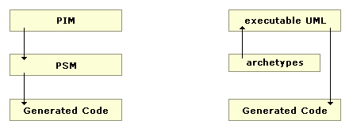

The most important branch is shown on the left. You model in UML. From this you can, if necessary, create a model - the **Platform Independent Model (PIM)** - which is more concrete, but still independent of the underlying technology.

**PLATFORM SPECIFIC MODEL**

In the next step you would (all with MDA Tools) generate a PSM (Platform Specific Model) that contains concrete and executable code for a platform. E.g. code for a .NET or J2EE platform. That means there are actually frameworks that can generate executable code for you - sometimes even executable applications that work a lot with templates or ready-made building blocks.

**EXECUTABLE UML**

Another approach is **executable UML**. Here the intermediate step - the PSM to be created - is skipped and the code is generated immediately afterwards. Archetypes help to describe how the coding step from UML to code should happen.

---

## DESIGN-FLOW

When dealing with design, the initial difficulty often lies in knowing what the concrete procedure looks like. The priority here is to clarify which diagram should be selected first and why.

> "What order is best?" 😵

Of course, this question is difficult to answer and depends 100% on the system to be designed. 

Nevertheless, a suggestion should be dared here, which is based on project experience and takes into account the degree of abstraction of the diagrams:

**Level of abstraction of diagrams**

1. **Use Case Diagram**

The use cases are certainly one of the most abstract. What the user wants from the system should usually be known first and belongs more in the analysis than in the design.

2. **Deployment Diagram**

Since it is shown here where which rough component runs, this is also very abstract. Here it is more or less about physical locations for large projects - i.e. server X here, many clients there, an accounting server there, etc. That is abstract and usually belongs far ahead.

3. **Package Diagram**

The packages mostly contain namespaces for the collection of components and classes. This is usually also defined early in the project so that developers already have a playground to test things before things really get going. Indirect responsibilities are also defined here.

**Component Diagram**

Packages usually contain components, which mostly consist of a collection of classes. Therefore, component diagrams must be created before class diagrams.

**Class Diagram**

For this reason, class diagrams should be created after packages and component diagrams.
[Composite Structure D, Subsystem D, Object D]
The diagrams mentioned here are not used all that often and are often thrown in at any point throughout the design phase.

**Activity Diagram**

An application's activities are typically specified much earlier in this order, so that the flow structure of the application is clear. This can often be the premise for the designer to understand the components. Sometimes even before the deployment diagram but after the use cases. For the sake of clarity, it is located here after the static diagrams with the dynamic diagrams.

**Sequence Diagram**

They show the behavior of components or classes. As a rule, components or classes must first exist so that the sequence diagram can be modeled.

**State Diagram**

The state of the application, the components or classes can also be modeled at any time in the design phase. Usually this happens after the use cases, deployment and activity diagrams have been created.

**[interaction overview Diagram, timing Diagram]**

These less commonly used charts can also be used anywhere if needed.

Exersise: 

So it would be ideal now if you take your own motivating (private) project and model it and accompany it over a longer period of time.

Perhaps the above orientation in the design process and the following explanations of the specific diagrams in the "Static Structure Diagrams" and "Dynamic Diagrams" chapters will help.

---

## UML ASSESSMENT

**CONTROVERSIAL ISSUE**

In reality, the importance of UML is much more controversial than it appears.

**ACADEMIC AREA**

In academia, UML is taught in many places, as there are still many advocates on the part of the university. It is not uncommon for this to be adopted uncritically in industry.

**IN COMPANIES**

However, there are companies and movements that value the usefulness of UML much less. Especially in an agile environment, other techniques are therefore often used. This can already be seen from the now quite "old" XP model, which also does not provide for extensive UML artifacts. **In some major companies such as Google, UML is even banned**!

This is not to say that UML is completely forbidden. If two developers really want to "talk" with UML, this is not a problem. However, the power of a prototype or a prototypical architecture is considered much more efficient in the corporate culture than a UML paper.

**JUDGE YOURSELF**

It is therefore crucial for every software engineer to know the range of tools or means of communication and to be able to judge for himself to what extent UML is a suitable means or whether other methods are more suitable.

> **IMPORTANT NOTICE**: Here, for example, the **https://c4model.com/** model should be mentioned that feels like a subset of UML. What do you think, which UML diagram goes somewhat with the four C4 diagrams?

---

## STATIC STRUCTURE DIAGRAMS

This part introduces the static structure diagrams:

* **Deployment Diagram**: How are the software components physically distributed?
* **Component diagram**: What units / components does the software system consist of?
* **Package diagram**: Which specific packages / namespaces are used to hierarchize the components?
* **Class Diagram**: What classes are there (in a namespace)?
* **Composite Structure Diagram**: How are components related in more detail?
* **Object Diagram**: Which objects exist at a certain point in time?

---

## DISTRIBUTION DIAGRAM

Deployment DiagramThe deployment diagram is specified relatively early. Relatively soon after the use cases. The point of this diagram is to show the physical structure of the entire application - which components are running where and on which physical devices.

This is often difficult for students to understand, since you usually only write small projects that only run on one computer.

For example, in the Toll-Collect project, there are various data centers, satellites, devices on highways and devices in rest areas. Very different software is running on very different computers in many places.

The goal of the distribution diagram is to provide a coherent representation of the physical distribution. Here's an example:

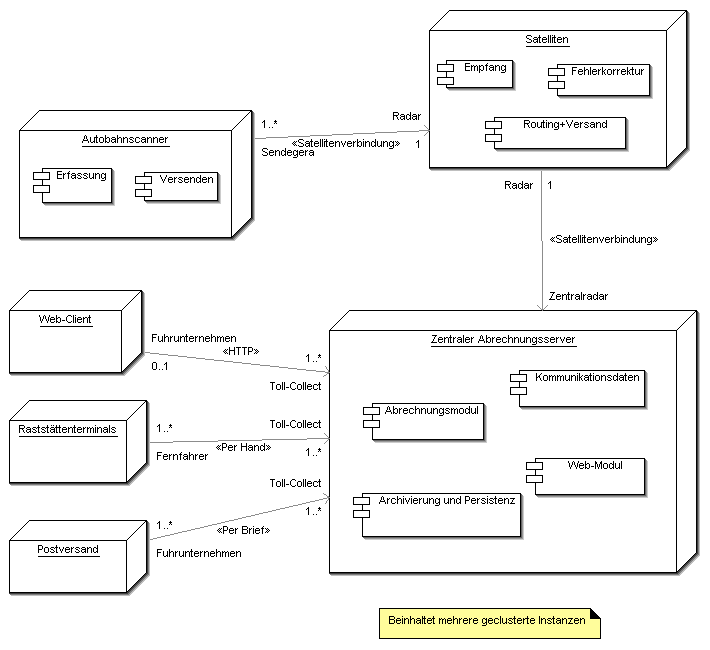

Pic: Deployment Diagram of the Toll-Collect system

> Here we see an example of the Toll-Collect toll collection system. Trucks are detected on the freeways. This data is then sent to the control center via satellite. There, the components in the central system show which tasks the components perform. For example, users can either go to the rest stops or pay online or by post. This example is intended to help you understand the physical distribution of such large systems.

**Notation**

The individual physical locations / nodes (possibly servers) are represented by boxes / cuboids. The boxes are connected to each other by simple lines and represent the communication between each other. Components or artefacts can be displayed in the boxes. Artifacts can be, for example, files of different formats such as jar, dll, war.

The connections of the nodes describe the type of communication connection. Multiplicities can also be specified.

>EXAMPLE: For example, you can specify that up to 1000 clients can connect to the server at the same time.

**TASK**

For practice, it is advisable to simply model a larger system than what you later want to build or specify more precisely. This leads to a more comprehensive distribution diagram. Alternatively, plan your application as a more complex distributed system.

**NOTICE**

Imagine the system administrator comes to you knowing he has work to do and wants to know what hardware he needs to deploy. The distribution diagram helps him with this. With the additional components in it, he also has the opportunity to understand what the system is supposed to do roughly and can also estimate the costs right away.

---

## COMPONENT DIAGRAM

The component diagram describes a specific set of components. The component diagram is the answer to the question of how the specific system is structured.

As a rule, there are several classes, but it can also be just one class, but it does not show any details. The deployment diagram already showed a number of components that individually or together fulfill one or more specific tasks.

It is important that you can and should specify dependencies of the components. Components provide interfaces that can be used by other components. 

BERND Österreich writes:

> QUOTE:  “A component is instantiable much like a class and encapsulates complex behavior. With it, units are formed that have a high level of technical coherence. In contrast to a class, the basic interchangeability (substitutability) of a component is also striven for. A technical platform for components is, for example, Enterprise Java Beans (EJB).” [Oes98] 

**Notation**

The component is a rectangle with the typical "Lego icon" in the top right corner. It contains the keyword \<\<component\>\>, which is often not shown for the sake of clarity. A component can be identified by \<\<component\>\> and/or by the Lego symbol.

It is allowed to insert other elements - like objects or components - into the object, but this can easily lead to very complex diagrams (packable element).

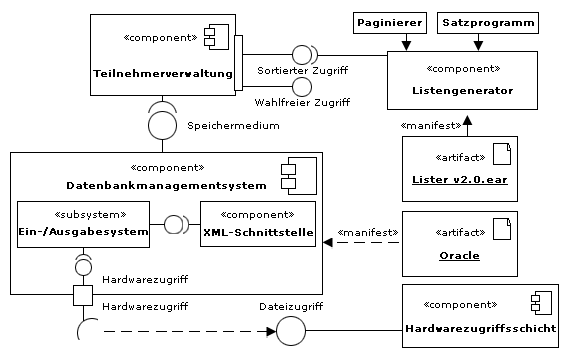

Pic: Example Component Diagram

**What does this diagram show?**

* Some components (denoted with the Lego symbol or \<\<component\>\>)
* Some artifacts on the right. This can be paper or software.
* The balls that the semicircle engages with are also interesting. The sphere is the provided interface. The semicircle the required interface.
* With small squares, there are still ports that implement access to the component that is not based on interfaces, so to speak.

In diagrams, the keywords \<\<realize\>\> or \<\<reside\>\> (from which class is this component realized) or \<\<implements\>\> from different UML variations are still floating around. The latter describes the concrete interface that this component also implements.

Again, one can imagine that this diagram is not only used for internal communication, but also for dialogue with developers and clients.

**Some examples:**

* The customer wants to know how the new components interact with the old ones.
* The client wants to know and then decide for himself which components (or modules) he can buy when and how they then fit together.
* The junior developer would like to know from you in which components he put it, e.g. B. full-text indexing system. He asks how it works, how to build it. You draw a diagram with components such as the parser, configuration of the search engine, configuration of the external modules, activation of the engine, handling and processing of the results, etc. Result: The junior developer understands and has an idea of the structure.

> Design patterns such as **MVC** are often reflected here!

> **IMPORTANT**: In this context, it is important that UML also has the *Subsystem* stereotype, which is often used in component diagrams. Basically, only a container for other components is set up here - represented as a simple box with the *subsystem* stereotype.

---

## PACKAGE DIAGRAM

The package diagram structures the namespace of packages, components or classes.

**HIERARCHICAL STRUCTURE**

It usually corresponds to the packages in Java or to the namespaces in C#, for example *de.vfh.portal.database*, which can contain the access layer class. A hierarchical structure that enables the model element to be clearly identified is important.

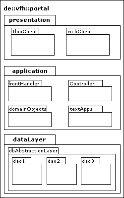

Pic: Package Diagram

The figure shows that all the packages drawn should be classified under the **de::vfh::portal** namespace.

A presentation package will appear at the top. This contains a package for a rich client, such as B. for a swing GUI and a thin client, such as e.g. B. an old JSP application.

In the middle you can see the application package, which contains four sub-packages. A front handler for communication with the GUIs, a controller for flow control, the domain objects (i.e. the business objects) and a package for management with external applications.

Below you can see different layers for the database connection.

The package diagram thus shows the hierarchical structure of the model elements and reveals layers and component blocks.

There are also package merges in the notation, which are not explained further here and are not very important in practice. Try to find something about it yourself.

**BACKGROUND KNOWLEDGE**

Why are package diagrams so important?

* In practice, package diagrams are important because the developers ask for a "playground" early on and want to develop test code.
* Packages, like component diagrams, can reflect the real architecture of the system. Design patterns and layers in the application become transparent here. It is important that transparency is provided at an early stage, that it is discussed sufficiently from the outset or that experienced designers are used.

**DEPENDENCIES**

Package diagrams are the most important because you can use them to model the **dependencies**. So try to draw the package and then ask yourself: who is using whom? Draw this on the diagram with arrows. This will show you the "Used Structure". This used structure is extremely important for good design or architecture.

**CONFUSED STRUCTURE OR FLOW?**

Is there a completely confused structure here, who uses whom? Or is there a clear flow from top to bottom? The latter is very important for a mutable architecture.

> **For example**, in a package diagram that contains used relationships, you can also see very nicely whether there are cycles in use - so package A uses package B and vice versa? If this is the case, a redesign is often necessary.

**OUTLOOK**

In the last chapter we see that there are many tools that automatically analyze the **uses relation** between packages and point out problems.

But now you can experience this for yourself by designing a package diagram in such a way that there is a hierarchical used relation in addition to the hierarchical namespace. Your code becomes more maintainable and less sensitive to changes.

---

## CLASS DIAGRAM

A class diagram visualizes classes in several ways. For this purpose, the classes themselves are shown, possibly also their relationships to one another and possibly also their inner structure. Two goals are common:

* Representation of classes and relationships: Different classes of a package or component are represented in the diagram. It is important to show which classes exist and which class is used by others. The latter is called associations.
* Representation of the internal structure: The author of the class diagram then wants to show or define which attributes or methods the classes have.

**COMBINATION**

Both forms are often combined with each other and then form a detailed class diagram.

But more information can be accommodated in the class diagram:

* Which stereotype does the class correspond to, for example a display class, a controller class, etc.? This will be explained in more detail later.

* What is the structure of the attributes and methods? Which signatures do the methods have? This is about visibilities like public / private, the types like int or string or the parameters like int b, string c.

**Example: Simple class diagram**

The following example shows a simple class diagram, which shows attributes and methods with their visibility (+ and -), but no extensive associations:

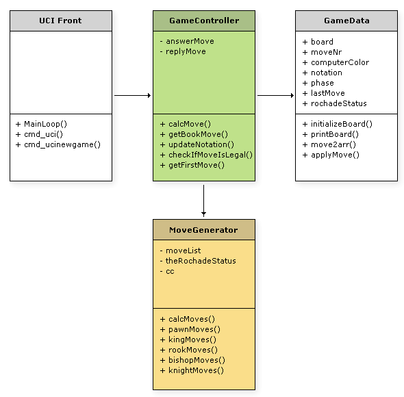

**DISTINCTION: OPERATION AND METHOD**

In UML 1, a strict distinction was made between an operation and a method – as an implementation of an operation. However, this is no longer the case since UML 2.

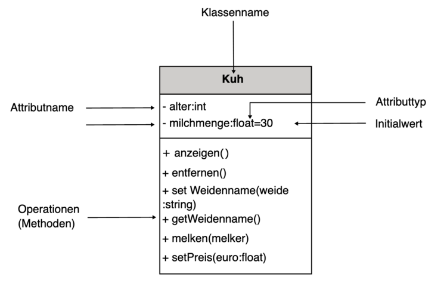

---

## NOTATION

The class itself is shown in a rectangle containing 1-3 areas. At the top is the class name, which is usually shown in bold. Below that are the attributes and then the methods. Class names are capitalized in almost all languages.

> NOTICE: It makes sense to state the responsibility of classes as a comment, i.e. what the class itself is supposed to do, as long as this is not trivially evident from the class itself.

Following are the attributes, which can be specified with or without parameters or visibility. Here, too, visibilities, types, parameters, assertions (constraints) or initial values are optional.

Class attributes are represented in the same way and are unique to each class instance, i. H. all instances can access this attribute.

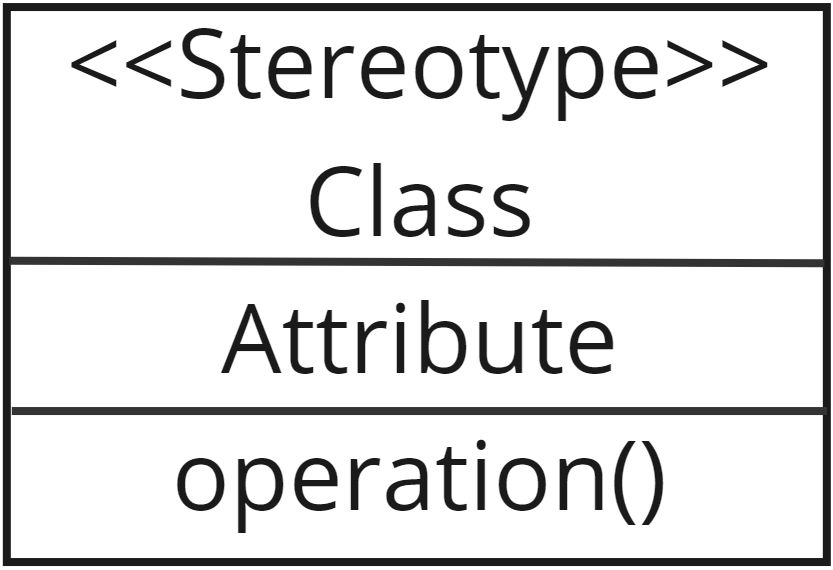

Abstract classes can be marked/marked in both italics and bold. *{abstract}* is usually written under the class name.

Usually the **visibilities** are *public +, protected #, private – and package ~*! These are noted with the given symbols in front.

Derived attributes can be represented in the UML with a slash "/".

**FIRST NAME, THEN TYPE!**

It is interesting that – unlike in most programming languages – the name is displayed first and then the type. So don't get confused here.

**An example:**

    person: String = "Catherine"

This also applies to the parameters of an operation / method! So is

    getVAT (amount: integer)

a valid specification for a method.

---

## INTERFACES

As further awards for classes there are e.g. **enumerations** or int**erfaces. Enumerations are noted with \<\<enumeration\>\>. The enumeration sets (e.g. red, green, blue, etc.) can then be found in the body of the enumeration.

Much more important are **interfaces**! Interfaces specify a **contract** to be implemented in the form of method specifications. They are noted with the \<\<interface\>\> keyword above the class name.

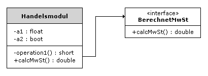

Pic: An example interface

It is said here that the trading module **realizes** or **implements** the interface that calculates the VAT.

Attributes are not noted in interfaces (but it is not forbidden either), since it is about an access contract and not about the inner structure of the class.

Since interfaces are strict contracts, you can find further specifications such as exceptions, invariants and pre- and post-conditions here.

Another way of noting interfaces is to represent them as a sphere and a semicircle. The sphere implements the interface and the semicircle is the interface to which it is “docked” so to speak.

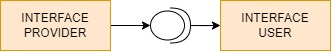

Pic: Interface as a speric and a half speric

In addition, you can use one word to describe the semicircle, which property this class then implements (e.g. serializable or sortable).

---

## STEREOTYPES

> **DEFINITION**: A stereotype is a consistent pattern that occurs or can be reused. The term actually comes from psychology and sociology and describes the same behavior of people or groups.

Transferred to the UML and classes, this means that a class or other UML elements can be marked / classified with a stereotype. They thereby allow the use of platform- or domain-specific notation, effectively marking them as implementing a particular behavior.

> **EXAMPLE**: For example `<<Stateless>>` for a stateless session bean.

Since UML 2, classes can contain multiple stereotypes. Most UML tools allow stereotypes to be assigned directly to elements such as classes, dependencies, components or packages. Stereotypes are then often presented in the same colors.

The UML already specifies a series of so-called "standard stereotypes" that are available to you for your modelling. Below are some of the relevant standard stereotypes:

**Relevant standard stereotypes**

* `<<focus>>` states that the classes so marked define the central logic or the central flow of control.
* `<<auxiliary>>` typically implement secondary logic or control flow, thereby acting as a support for other classes that are central to the model.
* `<<utility>>` define a collection of static attributes and class operations that can be accessed from all classes.
* `<<create>>` can be one of two predefined stereotypes, one applicable to dependency relationships and one to operations.
* `<<destroy>>` is the inverse of create and means that the operation destroys an instance of the classifier that contains it.
* `<<call>>` indicates that a dependency relationship marked in this way has operations or classes with operations at its ends to which the association refers.
* `<<instantiate>>` attached to a dependency relationship means that operations of the consumer create instances of the provider.
* `<<interface>>` is an interface. No instances can be created from it, it contains no attributes and its operations cannot be implemented in methods.
* `<<send>>` is applied to dependency relationships and indicates that the source of the relationship (an operation) sends a signal.
* `<<type>>` is attached to a class, stating that that class groups a set of objects in terms of the operations that can be applied to those objects.
* `<<responsibility>>` implies an obligation or contract between two model elements.

---

## ASSOTIATIONS

The association describes a relationship between the classes in which one object uses the other.

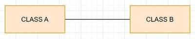

**Pic**: Assotiation

Here's an **example**: Let's assume a customer would be the class. Several invoices can be assigned to this class. The customer object must be able to access invoice objects.

Aggregation and composition are special cases of association.

The simple association is represented with a simple line.

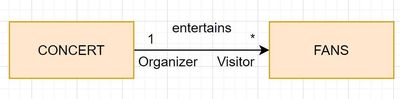

**Pic**: Qualified Assotiation

Important here are the multiplicities, which are used to indicate the number of times the two objects are linked to one another.

> **Examples** are: **0..1, 0..42, 1..1, 1..42, 0..\*, 1..\***

In Database E/R diagrams they are often referred to as **1:1, 1:N or N:M** relationships. In general, relations are important information when, for example, objects, database schemata or database mapping information are specified.

Furthermore, associations can be qualified by marking the line with **roles** and pr**operties.

Finally, there are multi-level associations, where multiple classes are linked. In this case, the lines converge into a small rhombus.

**Directed Association**

The directed association describes that you can get to the target class via the source class, but not vice versa. It is therefore a one-way relationship.

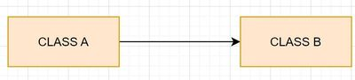

**Pic**: Directed Association

If you want to be able to navigate in both directions – i.e. **bidirectionally** – then two arrows can be combined into one. These can then also be provided with roles and properties.

**Aggregation**

An aggregation is a special case of an association. It is called the **part-whole relationship**.

**Pic**: Aggregation

Therefore, one often writes "consists of" as a property on the arrow.

**EXAMPLE**: An example would be a "party" as a whole, made up of many participants. If the "party" and thus the aggregation are dissolved, the participants are still able to survive! You do not necessarily need the party, but the party only results from the aggregation of the party participants.

If you are in doubt as to whether an aggregation is present, you can use an association without making a big mistake. However, a clear markup is always more legible and useful.

**Composition**

In contrast to aggregation, a composition is drawn with a filled diamond.

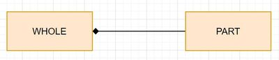

**Pic**: Composition

It is the strongest form of aggregation. The parts are dependent on the existence of the whole.

**EXAMPLE**: The best-known example here is the invoice with its invoice items. If the invoice is deleted, the invoice items also cease to exist.

It's different with an association (aggregation) to its members. When a club is deleted from the official register, the existing members want and can still live on :-)

---

## INHERITANCE / GENERALIZATION / SPECIALIZATION

With inheritance, all attributes and methods are also available in the subclass. This is noted in UML with an **arrow** that is **not filled**.

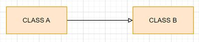

Pic: Interitance

Linguistically, a distinction is made here between **generalization** and **specialization**:

* *Generalization* denotes the more general properties of superclasses.
* The *specialization* designates the subclasses that add further special properties (attributes) and methods to those of the superclass.

**INHERITANCE**

In many cases, delegation makes more sense than inheritance because it does not violate the secrecy principle. In many cases - such as B. in graphics libraries - but inheritance makes sense. Remember to always analyze this well yourself.

Multiple inheritance is allowed in some programming languages. In this case, or if several subclasses derive from a superclass (upper class), arrows can be combined.

---

## COMPOSITION STRUCTURE DIAGRAM

The existing diagrams are often not sufficient to show which elements make up a class or a component.

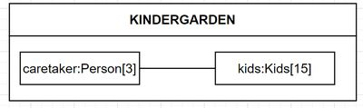

Pic: Composition structure diagram

**DEPICTION**

This diagram is drawn with the parent component in a box. This contains two sub-elements. In these elements, the name of the part (part) followed by a colon and a type of the part can be represented.

The multiplicities are given behind them either in square brackets or in superscript (as in the square). The parts can in turn be connected to a role.

---

## OBJECT DIAGRAM

The object diagram shows the exemplary state of one or more objects in a system. It's like a photograph of the system in which the objects may have particularly interesting values right now. It is like an instance diagram in which concrete attribute values can be specified.

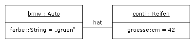

Pic: Object Diagram

So this picture shows classes in a **certain state**.

A few more points:

* You are very free in defining the object class or the attribute type. These elements can also simply be omitted.
* This diagram can also be useful if OCL expressions are also specified. This would e.g. For example: contect tires inv: size > 20 (thus, tires that are too small are not allowed).
* As shown above, links can also be drawn between the objects. These are then the associations, so to speak, and are only further refined with the role.

The figure below shows another example:

Pic: Example Object Diagram

---

## DYNAMIC DIAGRAMS

This part continues with the dynamic charts, where interaction happens:

* **Use case diagram** → What use cases are there?
* **Activity Diagram** → What does a web look like through the application?
* **State diagram** → Which states can the program assume?
* **Sequence Diagram** → How do classes/objects communicate with each other?
* **Interaction diagram** → An activity diagram that replaces individual activities with interactions
* **Communication Diagram** → Represents complex communication processes
* **Timing diagram** → status lines for the embedded or electronics area

---

## USE CASE DIAGRAM

Use case diagrams are called use case diagrams in both English and German. This diagram is quite important and is almost the first UML diagram drawn in projects, because it is as much abstract as possible.

**GOAL**

The aim is to show as simply as possible what you want to do with the software system to be built. So what cases of application there are! We know from the analysis phase that use cases need to be documented. It describes work processes in the system that should be possible. In the UML, this should now be supported even more easily with simple graphics.

**ACTORS AND USE CASES**

The diagram shows so-called **actors** as stick figures. This can be people such as customers, administrators or any other user. It is important to mention them all.

From them, dashes go to the respective use cases, which are written in an ellipse. In order to group this all, you put all related use cases in a box.

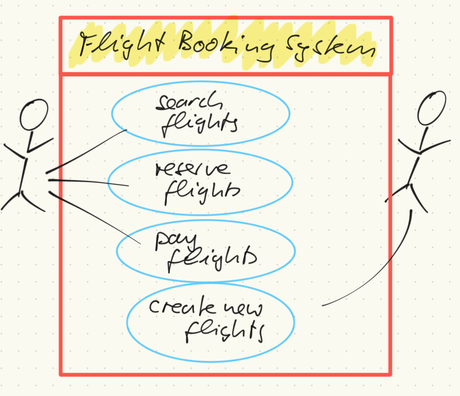

Pic: Use Case Diagram

**USE CASES COMMUNICATE**

With the use case diagram, the use cases should be communicated as simply as possible - for example to the management. A glance at such a diagram is usually enough for the viewer to immediately develop an idea of the system or suggest their own ideas. This is often more efficient than reading extensive use case documentation.

**DESIGNATION**

The lines between the actors and use cases can be named and provided with cardinalities as in the class diagram.

**EXAMPLE** Only two pilots want to have programmed the use case "switch off autopilot".

Notice in the example above that it feels like the actions are top-down, but:

> **IMPORTANT**: Use case diagrams are not directed!

**Activity diagram**s are there for the chronological sequence. Mixing diagram types is a common mistake made by UML newbies. Connecting complex use cases in a use case diagram with many arrows is not correct.

**Other Use Case Relationships**

* A dashed arrow indicates that an implementation is available. This means that the use case "go to the registration office" can be implemented, for example, by having two cases connected by a dashed arrow, which e.g. B. can mean “drive to the registration office by car” and “walk to the registration office”. Both together realize the main application.
 
* If you write `<<include>>` next to the dashed arrow, the use case pointed to is included. Sort of like you know it from programming languages. So if the use case internally consists of three parts A, B, C, you can outsource part A as a use case and connect it with `<<include>>` and a dashed arrow and, if it is important, display it again separately.
 
* Conversely, with `<<extends>>` and a dashed arrow you say that a use case can be extended with another one. The arrows always go from the extend / include object to the main object that uses it.
 
* A specialization arrow (similar to that in the class diagram) indicates that several "sub-use cases" make up a more general use case. For example, a use case can be "standard authentication", which is carried out either with an "electronic ID card authentication" or with a "mobile phone number authentication".

---

## ACTIVITY DIAGRAM

The activity diagram is called an activity diagram in English. It is one of the most complex diagrams with its many elements. Not all elements can be reproduced here, but they can easily be looked up in the OOSE UML overview.

> **WEBSOURCE**: [UML Notation Overview 2.5 (PDF)](https://www.oose.de/wp-content/uploads/2012/05/UML-Notations%C3%BCbersicht-2.5.pdf)

We limit ourselves here to the most important elements.

**SHOWS THE SEQUENCE**

The activity diagram is usually applied quite early in the modeling phase and shows the sequence in which the user is guided through a possible path of application. There are **action nodes**, **object nodes** and **control nodes**. The latter allow branching and making decisions.

**VISUALIZATION**

Activity diagrams visualize and explain the flow of the program, which is often very difficult to describe with natural language or the written word.

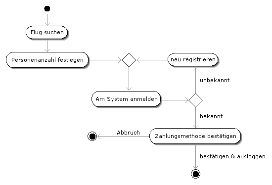

**Pic**: Activity Diagram Example

You can see some action nodes in this diagram (still called activities in the days of UML 1), as well as a start node and an end node. There is a branch on the right. Object nodes are not shown. You could insert objects at various points that are then available at this point.

> For **example**: a flight object that is selected by the customer after a successful search, or an object that represents the entire flight including customer and payment data.

**PARTIAL STEPS**

As in many UML2 diagrams, it is possible to put diagrams in a box and thus illustrate that an activity can consist of several sub-steps.

**Control Node**

Branching, merging or decisions are represented with control nodes. In the case of merging, conditions can be specified and in the case of branches, conditions can be written to the outgoing arms.

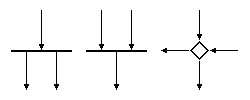

**Pic**: Control Nodes

For merging nodes, conditions can be formulated like this:
* `{joinSpec=(X or Y) and (M or N)}`
Conditions can be specified in square brackets for branches:
* `[X < 0]`

**Additional Elements**

* **Parameter Pins for Object Nodes**: Pins represent in and out parameters for objects.

* **Swimlanes**: Swimlanes can represent areas, as can be the case in sequence diagrams.

* Sig*nals: Signals can be embedded in the control flow of many diagrams. These are presented as below.

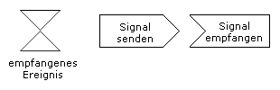

**Pic**: Signals

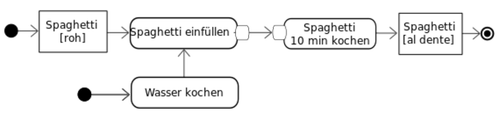

**Pic**: Example of an activity diagram for cooking spaghetti

---

## STATE DIAGRAM

The state diagram describes the behavior of a system when certain events occur. Such a state machine goes back to old attempts at modeling *Mealy* and *Moore* machines.

A state machine contains:

* nconditions (this also includes composite states and entire substates)
* transitions
* regions / areas
* start and end state

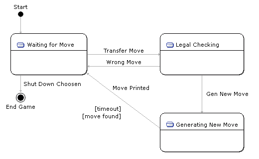

**Pic**: Example for a State Diagram

**NOTATION OPTIONS**

The notation possibilities differ greatly from application to application. In the simplest case, there is only one box for each state, in which the state is described. In this case (unlike in the picture here) the horizontal line should be omitted. Shown here are the three simplest states of a (chess) program, which can assume three states.

Usually, each diagram is framed with a box in which the name of the entire state diagram is at the top.

It is also possible to refine use cases in the use case diagram using state machines. This will e.g. B. often done during authentication.

**NOTATION ELEMENTS**

A state is usually (but optionally) provided with an understandable name in the upper box.

The following information about states can be made in the state:

* **entry** / activity → entry activity

* **exit** / activity → exit activity

* **do** / activity → ongoing activity

* **Trigger / defer** → delay, a distinction is made between:
  * SignalTrigger
  * CallTrigger
  * TimeTrigger
  * ChangeTrigger and
  * AnyTrigger for everything

> A guard is a condition that can be specified at a transition.

**OTHER ITEMS**

Other elements are already known from other diagrams (such as activity).

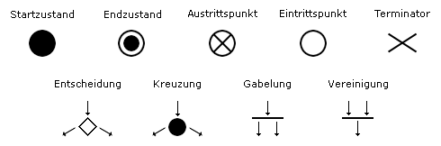

**Pic**: More Diagram Elements

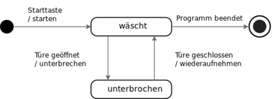

**Pic**: State Diagram Example for a Washing Machine

---

## SEQUENCE DIAGRAM

Sequence diagrams describe a dynamic view of the system. So you use them when you want to show how classes interact.

Since method calls between classes are also referred to as messages that are sent, the diagram shows the messages in chronological order.

**POSSIBLE ELEMENTS**

(Underlined) objects are shown above. However, classes or even coarser units are also possible. They have lines down: so-called **swimlanes** or **lifelines**.

Blocks on these lines show how objects are instantiated. **Messages** then go from them to other object (blocks). These are shown as **horizontal arrows**. Messages can have return arrows. The diagrams allow the display of synchronous (filled arrows) and asynchronous messages (open arrows).

At the same time, signals can be received as in the previous diagrams, or branches, iterations and recursions can be displayed. To do this, boxes are drawn in the diagram and then, for example, loop (loops) or alt (if) are drawn in.

An initial start message (found message) can start the sequence diagram.

> **EXAMPLE** The diagram below from SUN Microsystems shows one of the best and most typical use cases for sequence diagrams - design patterns. A good data access architecture is shown here:

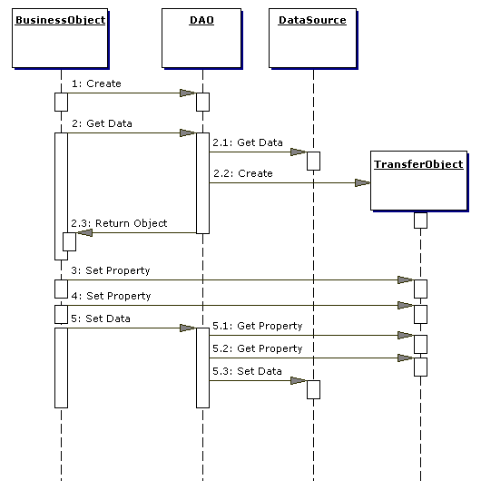

**Pic**: Sequence Diagram Example

**EXPLANATION OF EXAMPLE DIAGRAM**

What's happening here? The **DAO** pattern is shown. It contains four objects. Let's go through it for a moment. Not to understand the pattern, but to show why sequence diagrams are useful.

* A business object requires data from the persistence layer (the data access layer, ultimately from the database).

* It addresses a DAO object that is responsible for all database connections.

* This DAO knows which data access is currently current and gets the database connection via the DataSource.

* A data transfer object then contains the data in a suitable form (e.g. better than ResultSets) and this is returned to the business object in 2.3.

What follows from 3 to 5.3 is the reverse direction, the content of which need not particularly interest us here. For the sake of form: instead of data e.g. B. writing back via **JDBC**, it is state-of-the-art today to change the transfer object and then have it saved via the DAO.

**TRANSPARENT PRESENTATION**

You saw from the scenario how useful sequence diagrams are. The communication of four important objects in the data management layer becomes more transparent through the representation. Together with the **Active Record Design Pattern**, the example shown shows the most important design patterns of the data management layer.

**TWO COMMUNICATION SCHEMES**

It is interesting that there are often two types of communication schemes in sequence diagrams:

* **Centralized Control**: One object does the work (calculates or controls the threads like a spider) and everyone else does the work.

* **Distributed Control**: All classes/objects have equal rights and “calculate” as it were. There is no central control.

In many cases, the second structure is more advantageous and allows for more object-oriented concepts (polymorphism, overriding, etc.).

> **TASK**: For more in-depth look at the following tutorial:
> Link: [Tutorial UML Sequence Diagrams.pdf](https://vfhswt.eduloop.de/mediawiki/images/vfhswt.eduloop.de/7/71/Tutorial_UML_Sequenzdiagramme.pdf) (in German)

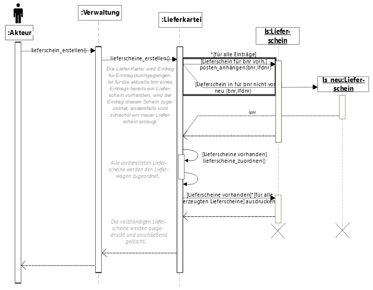

**Pic**: Another Example for a Sequence Diagram

> **WEBSOURCE**: You can find another example [here](https://technet.microsoft.com/de-de/library/dd409377(v=vs.120).aspx) (in German)

---

## INTERACTION DIAGRAM

An interaction diagram is a mixed form of an activity diagram in which individual activities are explained in more detail using an interaction diagram.

In concrete terms, there is an activity diagram in which individual states are to be explained in more detail. Then these states are enlarged in the diagram and an interaction diagram is embedded, i. H. displayed.

This is always used when states in activity diagrams are very complex.

---

## COMMUNICATION DIAGRAM

The communication diagram represents more complex communication processes.

**Pic**: Example Communication Diagram *© uml-diagrams.org*

What we're seeing here is an attempt to get a complex sequence of events right.

* Checking the inventory
* Interested in buying
* Check the inventory
* Get the book
* etc.

FIELD OF APPLICATIONS IN THE IT

In computer science, such a diagram is always used when the contents of the states, transitions and data are not important, but the elements should be shown in a diagram.

EXAMPLE
This means, for example, that the tasks or data of the press are not important, only that they exist and how they interact.

---

## TIMING DIAGRAM

**AREAS OF APPLICATION**

Timing diagrams are mostly used for the embedded area or for electrical engineering applications. It is only in these areas that there are processes or occurrences that are so precise that they have to be presented in terms of time.

**DELIMITATION**

In the otherwise usual modeling of software processes - such as B. in an activity diagram - the chronological sequence does not matter. A booking process can take seconds or even hours.

The graphs look like signals on an oscilloscope and include:

* timeline,
* conditions and,
* messages that can lead to a change of state.

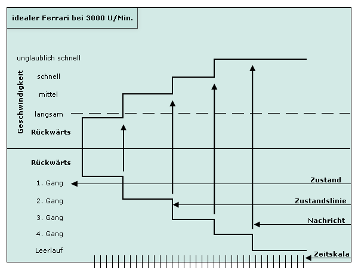

**Pic**: Example for a Timing Diagram

---

## SUMMARY

This lesson introduced:

* As a set of interaction elements, the UML serves as a method with the help of which models for software systems are developed.
* UML helps determine the design flow.
* The fathers of UML are GRADY BOOCH, JAMES RUMBAUGH and IVAR JACOBSON. They are also called "The Three Amigos".
* UML is not a dogma and not absolutely necessary for the development of a software system.
* The purpose of UML is to communicate ideas. By using different diagrams, facts can be represented that would be difficult to represent in writing or in language.
* Various types of diagrams are used for representation in UML. There is a division into:
  * **static structure diagrams** (To show the structure of modules of a software system. The UML knows six structure diagrams - class diagram, composition structure diagram, component diagram, distribution diagram, object diagram and package diagram.)
  * **dynamic diagrams**, also behavior diagrams (To represent functional processes. In the UML, seven behavior diagrams are used - activity diagram, use case diagram (also - use case or use case diagram called), interaction overview diagram, communication diagram, sequence diagram, timing diagram and state diagram.)

There are a variety of tools that support modeling with UML.

---

## EXCERCISE UML

**Submission task UML**: 

Choose your own UML tool and create diagrams. Find a UML tool for yourself!

Then design a big system of your favorite project with UML.

To do this, design at least **five** diagrams!

A class diagram must be included.

The class diagram should:

* contain at least seven classes,
* also a few cardinalities or
* contain an aggregation/composition.

(Processing time approx. 60 minutes)
