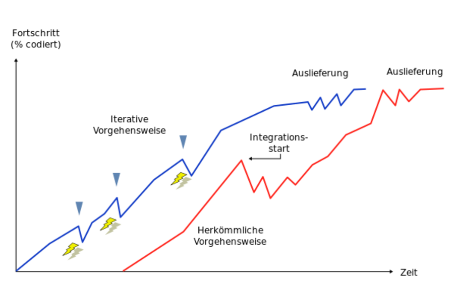
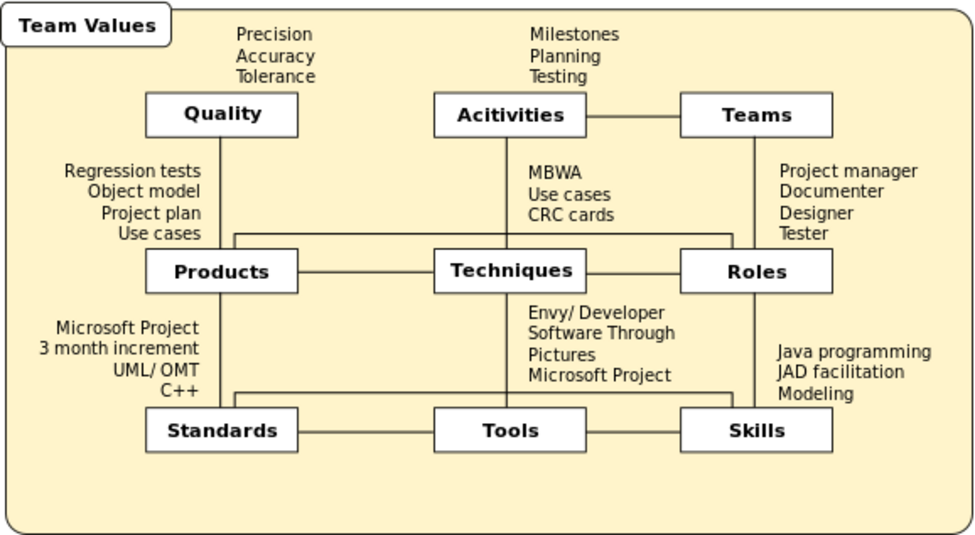
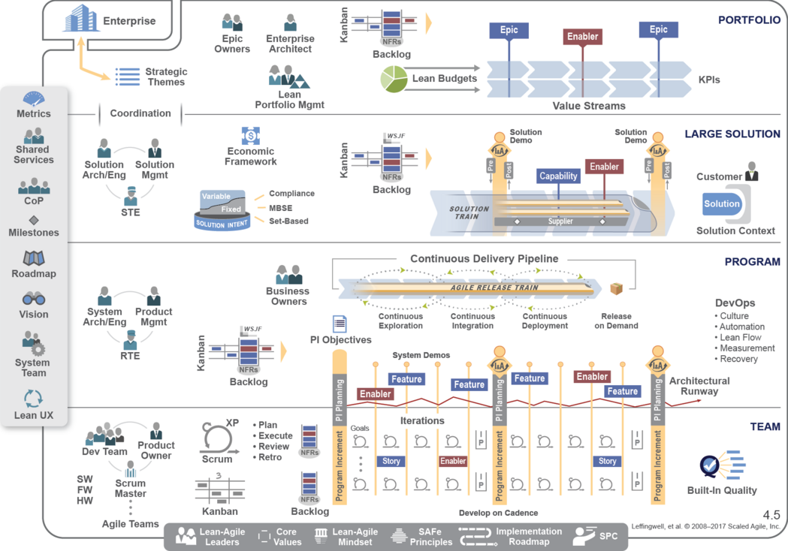

# PROCESS MODELS

(C) Prof. Dr. Stefan Edlich

---

## OVERVIEW

Process models are comparable to a bird's eye view. They provide a helpful overview of the entire project. After the "what" has been clarified, the "how" must be dealt with, more precisely, how should the project be organized and how should the general procedure be carried out. The question should also be answered: "What do we do when?" It is usually determined in which time, which resources do which work and which artifacts (e.g. documents or programs) are to be created.

Process models can be divided into the categories "old", "heavyweight" and "agile".

* **Old** process models have almost only historical value.
* Rather **heavyweight** process models also have a longer history and have - more or less - been updated in terms of agility.
* **Agile models** - agile in this context stands for something mobile, lively, or nimble.

This learning unit serves as an introduction, relevant terms are clarified and models are related to each other. The handling and use of process models in current projects is part of this learning unit.

Practical experience with process or agile models is advantageous and forms a good knowledge base for in-depth study. It is therefore advisable to document procedures or good ideas in your own software or exercise projects and to use them. In this way, one gains experience of how process models can be used most skilfully and most appropriately!

## LEARNING GOALS

At the beginning, terms for process models and essential elements are presented. These are rounded off by a subsequent look at history.

This is followed by waterfall and spiral models as well as the characteristics of agile models.

Finally, the lighter and agile models are considered. XP is presented in more detail, Crystal Clear and SCRUM can only be briefly touched upon.

##  TIME NEEDED

You will need approx. 180 minutes to work through the learning unit and approx. 130 minutes to complete the exercises.

---

## WHAT ARE PROCESS MODELS?

With the help of process models, the following questions should be answered in software engineering:

* What **parts** can the process be broken down into?
* In what **order** can the sub-steps be carried out?
* What **resources** (people, information) are required?
* What **information** must be available as input variables?
* Which **results** are generated by which sub-steps?
* Which **modeling technique** is useful for which process control steps?

The latter is particularly important in the OO context, because some projects require specific attention to creating reusable code and components. In other projects, on the other hand – e.g. B. in projects with functional programming languages - this is less important.

> ANNOTATION: So what, how and with what!

---

## TERMS: PROCEDURE MODEL AND PROCESS GUIDE

When considering the terms process model and process guide must be distinguished.

The process model is the abstract and superordinate answer to the questions of what, how and with what is to be carried out. Let's look at a definition:

> DEFINITION: process model

> "A **process model** divides the process of organizing into different, structured phases, which in turn are assigned corresponding organizational methods and techniques. The task of a process model is to present the tasks and activities that generally occur in a design process in their logical order.”

[...]

> “What all process models have in common is the **step-by-step path** from the problem to the solution and their systematically **rational approach** (in contrast to **trial and error**, see decision-making style). The individual phases are ideal types. In practice, it is often necessary to proceed iteratively and 'jump back'. Phase-oriented milestones are designed to minimize the risk and cost of failure.”

(Source: wikipedia)

**PROCESS MODEL**

A process model is often spoken of in a slightly different context, which refers more to a technical description of business processes. Applied to the procedure for creating software within a project, a process model describes the steps and activities that occur in the project. It does not describe the business processes in the classic sense of a "company business".

**PROCESS GUIDE**

If you continue to look at the procedure in the software project, the process guide is a document that is derived from the process model and adapted. It provides concrete steps and instructions for the project, whereas the process model remains rather abstract.

A typical process at the start of a project is to set up and specify the procedure model in such a way that it fits - of course in relation to the company and the problem to be solved. This process is called "**tailoring**". The process model or models are tailor-made - the right things are taken out and adapted to the project.

---

## PROCESS MODELS IN GENERAL

The process guidelines derived from the process models provide concrete steps and instructions. Typically they contain the description of the following points:

* **Phases**: Periods of time are established or outlined in which certain similar activities are located. For example, there could be an explicit phase for quality assurance.
Iterations: Here the question arises as to when and how a return may take place or how steps may be repeated.
* **Milestones**: Which important project or software states should be reached and when? The formulation of milestones is well known from project management and is supported by many tools. The binding commitment is important.
* **Activities**: Description of the activities that must be carried out as part of the project. e.g. B. interviewing a person, writing a report, developing a component or testing a module.
* **Processes**: The focus here is on the chronological and logical sequence of activities. This represents a kind of workflow.
* **Actors**: What skills and areas of responsibility are necessary and to which people can they be assigned.
* **Results**: Which results (e.g. documents) must be available after which phases?
* **Documents**: Which documents must be available as a result after a phase? The term artefacts is also used for documents or other results - from the Latin "factum" = the made.

**Practical experience with process models: [+] and [–]**

In theory everything is fine:

[+] Today's knowledge of procedural models has been available to a large extent since the 1990s and will certainly look familiar to the viewer. However, there are some new approaches, especially with regard to the topics of object orientation and agility, which are also reflected in the technical support.

[+] The latter actually also means that the engineering application of the procedures from process models is theoretically not a problem.

In practice always problems:

[–] Unfortunately, things look different in practice. In particular because resources such as money and time are always limited. All too often it is said: *"Yes, in principle we use a process model like the XY" or "we don't have time for certain specifications such as quality assurance, documentation, etc."*. This aspect should also be considered here.

[–] The “tailoring” of procedural models also costs a lot of time and money, of which unfortunately there is never enough available. Every company should be able to conjure up an adapted model (like: we can and would use OOSE-LIGHT-COMPANY-X), but without paying attention to an individual adaptation and without the necessary calm and maturity in the tailoring process allow.

[–] In fact, in most cases, a process guide or practical guide falls by the wayside. The model of the adapted process is then usually anchored solely in the head of the project manager and therefore no external control or adjustment can be made. What staff and developers are left with are coding standards guides and rarely more.

---

## HISTORY OF PROCESS MODELS

A look at history shows that planning euphoria prevailed in the first few years for larger software projects.

**AT FIRST...**

In the beginning, it was believed that everything had to be planned precisely and that everything could be precisely documented both before and after. So you just have to specify everything in advance long enough and extremely detailed and then it will work...

**WATERFALL MODEL**

This approach led to the first models, which are now called - somewhat contemptuously - waterfall models.

The Department of Defense (DOD) continued to adhere to models consistent with the waterfall models into the late 1980's.

**LATER...**

Later, however, the first models emerged in which work was carried out iteratively or in cycles

Pic: History of Process Models

---

## WATERFALL MODEL

The waterfall model is the classic among the models. It describes the course of the development process in such a way that the results of one phase fall into the next phase - like a waterfall. The figure shows the waterfall model with the classic phases.

Pic:: Rigid process in the waterfall model

The waterfall model was gradually adapted to the practical requirements and expanded, so it was able to spread (strongly) to this day as a classic process model in software development for industry and authorities. One reason for this lies in the simplicity and comprehensibility of the model, which can be handled with little management effort.

**Important Elements**

The essential characteristics of the waterfall model are that....

* the activities are to be carried out in the **specified order**.
* A completed **document** is available at the end of each activity.
* The model is based on a top-down approach.

It is interesting that although no step-back was originally intended (i.e. different from the drawing), a step-back was introduced very quickly, which greatly improved this model. Nevertheless, the old variant got stuck in the name.

**Very good plannable**

Positive features of the waterfall model:

[+] Tasks and phases are clearly outlined

[+] The project is understandable and easy to manage

[+] Planning and monitoring are (apparently) easier

**Project does not often fit into this scheme**

Obvious cons:

[–] Project risks are recognized late!

[–] Returning to previous phases is not so easy. The result is usually a longer time delay!

[–] The project is strongly documentation-driven. There is hope that a sufficiently extensive specification and documentation will steer the project on the right track.

The waterfall model should therefore be viewed with both admiration and skepticism. In many areas it can simply be the right model, e.g. B. the requirements are clear. As a rule, requirements are not clear and also change during development. In these cases, iterative or more agile models are more appropriate.

---

## SPIRAL MODELS

Spiral models became popular in the late 1980's and early 1990's. Starting from the middle, the four phases are run through in an iterative process. Here, the planning can be improved in the second and nth run and changes can be reacted to - albeit still quite late.

Pic: Processes in the spiral model

Spiral models quickly formed the basis of **incremental software development**. Many companies have developed their own models on this basis and then tailored them to specific sectors (e.g. banking).

> **Features of spiral models**

* **time boxing**
* Time pressure is at the expense of the range of functions.
* Specifying fixed timeframes is considered time-boxing.
* Point in the direction of evolutionary software development.

---

## MODERN METHODS AND MODELS

Modern methods are initially characterized by an **"incremental-iterative approach"**. The disadvantages mentioned in the case of the waterfall, such as **project risks**, should be eliminated. Problems should be recognized earlier and resolved more quickly.

People like to speak of an **evolutionary approach**. Just as living things go through generation cycles and adapt and possibly improve, the project adapts with its iterations to the circumstances.

**DOES ITERATION CREATE UNCERTAINTY?**

Interestingly, the problem with iterative models is that they can create uncertainty at the beginning. With the waterfall model, everything was so easy to plan.

But questions keep popping up here:

* If it all starts all over again, when are we done?
* How many iterations do we actually need?
* How can we plan this?
* How can we reflect this in the contracts, the milestones and the timelines?

---

## AGVANTAGES OF AGILE MODELS

From the year 2000, the IT world was overwhelmed by an agile wave. The topic has also been discussed in countless publications and at conferences.

> WEBSOURCE: The way of thinking has manifested itself in the well-known **"Manifesto for Agile Software Development"**, the principles of which you can read through (!): http://agilemanifesto.org © 2001 Ward Cunningham

In the meantime, a wide circle of “procedure model professionals” has come to the conclusion that more flexible, i.e. more agile, models are generally superior to the “old” models.

There are solid facts and advantages behind agile models:

**Better risk management**

If a problem occurs, it is eliminated by a simpler jump back to earlier phases.

**Ongoing planning**

Planning adapts more to the project and not the project to the planning.

**Continuous integration**

Integration risks can be recognized early.

**Visible project progress**

A prototype can be created early on and there is therefore the possibility of receiving feedback earlier.

**Test strategies**

These are part of the project and ensure more quality at an early stage and help to identify and avoid expensive mistakes.

**Optimization of the process**
If something does not fit in the process model or in the project as a whole, it can be adjusted more easily.

**Flexible delivery**

Parts of the project can be delivered earlier and thus tested earlier by the end user.

The figure below illustrates the risk aspect and shows that agile models can be integrated earlier and therefore adjustments can be made more quickly.

Pic: Early tests, integrations and prototypes hurt, but steer in the right direction

---

## EXTREME PROGRAMMING

There is hardly a process model that has caused more of a stir than XP.

Initially criticized sharply, there is now a large worldwide XP community. Many of XP's ideas have meanwhile also been established in large projects.

It is fair to say that XP started the mindset and hype of the agile approach and helped it to become widely popular with its "extreme" ideas. **KENT BECK** consciously wanted to provoke with extreme ideas in order to form a counterpoint to the old, immobile models.

>**NOTICE**: Brief description of the Extreme Programming XP => "XP is a way of developing software in projects. It contains practical instructions for developers and project managers that place particular emphasis on **values** and human social interaction. Some food for thought is quite *extreme* especially when viewed from the perspective of the last century. XP sees itself as a controversial and agile model that can react in the best possible way to **changing requirements**."

**MOTIVATION FOR XP**

In March 1996, KENT BECK became project manager in the legendary **C3** project at Daimler Chrysler. Together with **WARD CUNNINGHAM and RON JEFFRIES**, a uniform payment system was to be developed on the basis of Smalltalk and GemStone.

Interestingly, something went wrong with this project. The system did not meet his expectations. The project was stopped on February 1st, 2000. During this time, KENT BECK learned painfully that many things go wrong in software projects. At the same time, however, many principles of good software development – such as B. testing - were known, but were not used sufficiently and well enough. With this motivation, KENT BECK developed and published “XP”. The legendary book *"Extreme Programming Explained"* was published in 1999.

At the XP conference in 2000, a DaimlerChrysler manager even announced that XP would be banned internally! But only some time later, Daimler Chrysler reintroduced the XP methods.

> NOTICE: **Goals of XP**

* XP tries to put people first and thus increase productivity.
* XP tries to take into account the social aspects of the interaction of people in the project.
* XP is constantly trying to open the possibility to improve the project, the process and the code.
* XP tries to establish a new style of dealing with code.

The way software is developed is radically changed by many principles introduced later.

---

## Principles and Core Values of XP

Before we get into the exciting and practical principles of XP, let's first talk about the core values of XP. While these sound fairly general, it is interesting to see how these translate into the principles that follow.

The principles below also show what may have gone wrong in past "fat" or waterfall-type process models.

**Communication**

Communication is very important – not only in projects. According to the "old" and conventional way of thinking, definitions and votes must also be made via documents. So it was a very **document-centric approach**. Under XP, all people should be more closely connected and - also via the code - form a kind of community with "**shared knowledge**". Several factors contribute to this, such as constant communication, the use of metaphors, constant cooperation with the user and encouraged feedback.

**Simplicity**

Simplicity is a principle and at the same time the only activity that appears in the description of the activities in the next few pages. In the project, the focus is initially on the simplest functionality. Everything implemented is kept **as simple as possible**. A further development is then carried out by means of refactoring. This means that you don't work with particular foresight and initially define the final design, but "evolve" towards the final design. This is also where one of the strongest points of criticism comes in, that refactoring to a design can be more expensive and time-consuming than the initial definition of a design.

**Feedback** => nothing is more important!

* Feedback from the customer (Customer)
* Feedback from the team, e.g. information about the duration of developments, internal feedback, etc.
* Feedback through the production cycle by evaluating the tests. Changes are thereby also monitored.

**Courage**

In the project, this means showing courage. The courage not to program very far ahead. Courage to refactor your code so that it can still be better adapted in the future. The courage to compare one's own design perspective with colleagues and thus find a more objective solution.

**Respect**

This point was not in KENT BECK's principles at the beginning. Nevertheless, he was soon added as a fifth point. 

Respect can mean:

* Never contribute code that breaks the system, has obvious errors, or doesn't compile
* Don't contribute code that fails the tests
* Don't freeze the other developers or steal their time
* Acknowledging the perspective of others and looking for the best solution. Then try to implement these solutions using refactoring.

NEXT...

Now let's look at the **28 "exciting" rules of XP**!

---

## XP RULES - CATEGORY PLANNING

The order is based on the XP explanation on the web and not on the original order as given in the literature.

> WEBSOURCE: http://www.extremeprogramming.org

1. **User stories = idea of a "use case"** [HOT]
In one of the first project meetings, use case ideas are collected and recorded on storycards. The aim is to easily record a use case in order to estimate the effort required for its implementation and to advance release planning. This usually consists of about 3 sentences on an index card. So no long requirements documents! They do not contain any technical details (no technologies, algorithms or E/R models), and can simply be torn up and rewritten if necessary, if, for example, the “story” turns out to be incorrect or simply needs to be adjusted.

Pic: Example of a story card ((C) Robert Armstrong @ Pixabay)

A “story” can also be the driving force for an acceptance test. The story map isn't supposed to be that detailed right now. However, it should be sufficient for an effort estimate. However, when it comes to implementation later, a direct description from the customer is of greater value.

It is usually estimated how long the story ideally needs to develop. If this time is > 3 weeks, then the story should be broken down again. The following figure is intended to illustrate this:

Pic: How user stories are included in the planning

The [HOT] label is used on the following pages to mark a particularly well-known, central or controversial feature of XP.

2. **Release planning**

> CONTAINS CONSTANT LENGTH ITERATIONS

XP provides for the creation of a release plan. A release plan contains the stories that should be created for a project status at a specific time/milestone. The release plan in turn contains iterations, i.e. H. Time elements/cycles in which success is measured and adjustments can be made. These iterations should have a constant length (e.g. 2 weeks). Iterations should not be planned in advance for more than one unit. This makes it possible to react optimally to changing requirements.

Release planning is a tribute to technical planning and business planning, which must plan and monitor both resources and finances.

3. **Small releases = small release cycles**

> SMALL CYCLES → MORE AGILE PROJECT

The aim of small releases is to quickly implement new and small functional units and to quickly show them to the customer. This allows for feedback that is extremely valuable early on and can be incorporated into further planning/coding. Being able to implement customer requests later is more expensive and there may simply be no money or time left for it.

4. **Project velocity = measure of project progress**

> NUMBER OF USER STORIES PER ITERATION → PERFORMANCE / HEARTBEAT OF PROJECT PROGRESS

To measure project progress, the number of user stories / technical tasks that were completed in this iteration is taken. In the meetings in which the iterations are planned, the customer / client can “commission” the same number of stories for development as in the previous iteration. The experiences in the iterations should be used to adapt the higher-level release plans.

An important and difficult point is the initial planning of the first iterations, because you don't know how problematic the tasks are or how effective the team will be. KENT BECK recommends taking the first iterations and then adapting quickly. In this way, the experience can then be used to better estimate the overall effort, better than writing detailed specification documents.

Today this would be the DORA Metrics.

5. **Iterations +**
6. **Iteration Planning**

Iterations within a release have already been discussed.

Pic: Contains iterations of constant length (© 2000 J. Donovan Wells Source: www.extremeprogramming.org)

What happens in iteration planning and in an iteration?

Iteration planning creates an acceptance test. If this fails, adjustments must be made for the next iteration. Work steps (tasks) are determined from the user stories and recorded on index or CRC-like cards. These tasks are written in the language of the developer and represent the detailed plan for the iteration.

The work steps coordinated by the developers contain concrete cost estimates. It is therefore important that the developer himself has determined the effort!

7. Move people around

> CROSS TRAINING REDUCES PROJECT RISKS

Moving people around in the project sounds difficult. But what is meant?

* Developers take on other areas of responsibility
* Developers exercise sovereignty over the code of others, thereby avoiding "bottlenecks". Developers can get sick or leave the project.

KENT BECK describes this as "**cross training**", in which "**islands of knowledge**", i.e. the concentration of knowledge on one person, are avoided. An important principle that is also used in the pair programming described later.

8. **Daily Stand Up Meeting**

Almost everyone knows the reputation of traditional meetings. There are now [games](https://de.wikipedia.org/wiki/Buzzword-Bingo) where you collect buzzwords during a meeting, like bingo, and play against each other. During the meeting!

KENT BECK (as today also Alberto Brandolini) notes that in traditional meetings a lot of time is wasted on little information and suggests the following alternative:

>QUOTE: "Have a standing meeting every morning!"kent beck

This has several advantages. Normal meetings are no longer so necessary. Everyone tries to be as **brief** as possible for obvious reasons. This can be anywhere, or even in front of a computer to give a quick picture of things. Here, problems should be pointed out briefly and solutions presented.

In the experience of the module author, these meetings work surprisingly well. You are **focused** and still generate **team spirit** and a sense of togetherness. These types of meetings are definitely worth trying.

9. **Fix XP when it breaks**

> IMPROVE XP

The XP rules are **not a panacea**. If these do not fit, they should be adjusted. However, every developer should be clear which rules apply and what one can expect from colleagues or has to contribute oneself. Stand-up meetings are also great for suggesting improvements to XP in the project. Every project and every team is individual. XP can not always fit.

---

## XP RULES - CATEGORY: CODING

10. **The customer is always available [HOT]**

A client should be constantly available / approachable. Ideally, the client should be part of the team that carries out and develops the project. This point is particularly related to the principle of communication. In too many IT projects today there is still an incredible distance between contractor and client. XP suggests making a stakeholder **truly part of the project**, even an employee! This has two very important advantages:

1. Firstly, questions can be clarified on site. Quick and informal contact is often worth its weight in gold. As a rule, this client will not change his mind every day in the project, so you will be annoyed that you did not record requirements.

2. Secondly, with the client on board, it essentially becomes an internal project for the client. Time and again, there are problems with projects after they have been submitted because of many additional demands and it is not uncommon for the parties to end up in court. If the client himself is part of the project, he will also be part of the solution and will be available to assist in the event of a dispute. The shared responsibility is great and a client who acts for the project and therefore also for the contractor is valuable.
The proximity to the client makes it possible to clarify things quickly.

11. **Code Standards**

Developers should adhere to coding standards that were agreed upon at the beginning. An example is the Java Code Conventions.

> Example: The ancient http://java.sun.com/docs/codeconv/html/CodeConvTOC.doc.html

12. **Code the Unit Test First [HOT]**

The goal should be to code a test first. This principle is known as “**Test-First**” and is discussed in more detail in the “Testing” learning units.

It turns out that you **code better** (you think/act differently, so to speak) when tests are coded first. In the extreme case, these tests take on a form of **requirements**, as they require both the OO interface and the expected behavior of the methods.

The tests give you a **great sense of achievement** with minimal initial investment if the test is successful.

The **design** is positively influenced by the test-first approach. It is developed so that the programs are more testable. Including tests afterwards is much more problematic than carrying them out from the start. And test can always be easily generated by LLM assistants.

13. **Pair Programming [HOT]**

This is probably the most well-known point about XP. Unfortunately, you hear far too often: “XP is when two people sit at the computer.” In fact, this rule means that two developers should develop on the same computer/monitor.

KENT BECK notes that the software quality will be increased without affecting delivery times. It's supposedly counterintuitive, but two people deliver just as much functionality with higher quality. The higher quality pays off later in the project.

Unfortunately, KENT BECK does not provide any quantified evidence to support his claims. In fact, this has become a point of contention, but also an interesting point of research. Intensive has here e.g.6nbsp;B. WALTER TICHY from the University of Karlsruhe conducted research. [Mue05 p. 294-302]

Empirical surveys show that there are actually tasks or project constellations for which the assumption is correct. But not always. So when it comes to evaluating this question, it depends again.

Of course there are other critical aspects. For example, there may be bosses who assume that with “pair programming” they will lose performance because programming individually is “twice” as effective.

Pair programming is not meant to be “extreme”. Nobody can sit at the computer with a colleague for eight to n hours a day every working day of the year. People also need freedom or sometimes privacy. Here, too, the project situation probably depends on the ideal “mix” of pair programming and solo programming or solo time.

Pic: Pair programming in the XP context (© 2000 Donovan Wells, Source: extremeprogramming.org)

It's definitely worth trying out pair programming. In the meantime there are even some (virtual) companies that work completely with XP and live this working style.

14. **Sequential Integration + 15. Integrate Often [HOT]**

New code has to be integrated at some point and that can become a problem. If this happens at the same time in version control repositories, for example, the integrated software can no longer run.

KENT BECK does not consider a dedicated person or a team as an integration manager to be appropriate here. Instead, he proposes a sequential integration that also uses the idea of the code community. The group of developers is responsible for ensuring that the integrated code is executable. In order to be able to sequence, a type of lock must be introduced. This can be done using a simple token, e.g. B. by a release computer that acts as a token.

It should be integrated as often as possible. Preferably every few hours if possible. This is the only way to prevent developments that diverge.

16. **Collective Code Ownership [HOT]**

This principle has already been mentioned. The code should belong to everyone and developers should not only deal with their own code - but maybe also take responsibility for the code of others. In some places this goes so far that everyone should be allowed to fix or refactor other code!

17. **Optimize load**
This principle is much older than XP. Nevertheless, it is mentioned in connection with XP: Do not optimize initially. There are good examples where the code was initially trimmed for performance, but then the actual project goal or core functionality was no longer achieved before optimization.

Therefore, it should only be optimized at the end. It should never be guessed what the "bottleneck" of the system might be. Only at the end do the real bottlenecks often become apparent.

18. **No Overtime**

Overtime should never be requested. According to KENT BECK, this is of little help. Buying additional staff does not make sense either. Instead, a release planning session should be held and the range of functions should be rotated.

---

## XP RULES - CATEGORIE: DESIGN

19. **Simplicity [HOT]**

>KEEP THE DESIGN SIMPLE

Describes the pursuit of a simple design and the simplest solution that still accomplishes the task. Complex codes should always be replaced.

Simplicity has already been introduced as an initial principle.

20. **Choose a System Metaphor [HOT]**

Good metaphors for the system make it easier to use the language. This applies to all granularities: from project names to user stories to class and method names.

21. **Use CRC cards**
CRC cards promote design and help to think less functionally. The cards themselves are then objects and can be requested and used again.

Pic: CRC card example

22. **Create an early Spike Solution**

TECHNICAL puncture

Here spike means to pin the problem down. The idea is a piece of wisdom that has been known for a long time and is usually called “(technical) piercing” in German. If there are any technical issues or design issues, the goal is to build a quick prototype that abstracts from everything else, clarifies the problem, and allows for a quick response.

23. **Never Add Functionality Early [HOT]**

Originally there is another allusion to simplicity - the "**Business Value First**". It should start with the core functionality and not add "golden faucets". So there is no need to add any functionality that you think will be needed later. Here the (80/20) experience is often cited that little is really needed that is not core functionality.

24. **Refactor Mercilessly [HOT]**

Refactor Mercilessly means merciless refactors, i. H. Refactor code, rebuild, improve, etc. Anything that has already been built can be modified. Refactoring code takes effort, but it's worth it. Throwing out redundancies, improving designs and getting rid of unnecessary pieces of code is always worth it. However, this is often not easy, as it also means admitting mistakes. As a developer, you should be brave enough to grow from mistakes.

---

## XP RULES - CATEGORY: TESTING

25. **All code must have unit tests [HOT]**

NEW TOOLS FOR TESTING

Tests have already been addressed in principle "test first". They are much more one of the rules/principles in XP. It starts with KENT BECK joined forces with colleagues to solve the following problem.

Everyone knows tests are important. So why is no one testing? Simply because it's usually not fun! So a  test framework had been developed that makes testing easy and fun at the same time.

> EXAMPLE: An example of such a framework is JUnit. JUnit is listed in the TST - Object-Oriented Testing and Test-Driven Development lesson in the JUnit Example chapter here in Software Engineering.

The motivation for this new type of testing is a green bar that shows how many of any number of tests could be completed positively.

The second important aspect is that any number of tests can be automated. The framework can even submit a report if needed. The tests are therefore ideally integrated into a cycle in which prototypes are created quickly and a lot is integrated.

26. **All code must pass unit tests before it can be released**

Only tested and correct code can be released and integrated. Otherwise it would paralyze the colleagues and delay the project.

27. **When a bug is found tests are created**

COMBAT ERRORS GENERALLY AND NOT SPECIFICALLY

At least as important as fixing a bug (that wasn't caused by testing) is developing tests that can uncover this and similar bugs in the future (see regression tests).

This applies both to developers who discover a bug (and then cover it up with further JUnit tests as far as possible) and to other users who create an acceptance test to enable a perfect reproduction of the test.

28. **Acceptance Tests**

THE STAKEHOLDER CONFIRMES THE STORIES

Acceptance tests are created from the user stories (also commonly called **functional tests** outside of XP). The developer describes one or more processes that, after correct processing, confirm the "correct" implementation of the user story. These acceptance tests can be automated where possible, or done in-house by the developers to be more efficient. However, the final acceptance is only made by the user.

---

## XP VIEWED CRITICALLY

Some principles of the XP provoke and would like to change the traditional to some extent. Kent Back knew that XP was not a panacea. For example, regarding project size, BECK said (translated here):

> QUOTE: “XP isn't for 50-person projects, and probably not for 20-person projects; but definitely suitable for 8 or 15 people.” Kent Beck

Nevertheless, there are successful XP projects with over 100 developers.

> QUOTE: "Any one [XP] practice doesn't stand well on its own (with the possible exception of testing). They require the other practices to keep them in balance." Kent Beck, Cynthia Andres

There are now books that thoroughly critique XP and suggest improvements or put it in the right context.

**Criticisms and things to consider**

* Point 10 mentioned that you have an on-site customer on site who **can easily change requests** and informally communicate this. This is of course critical. Formal change requests that have been approved by a higher authority can also be much more advantageous here. It is therefore important to ensure that **uncontrolled changes** ("scope creeps") are not simply shot out, which later have to be corrected at great expense.
* XP is **the opposite of document-heavy**. It is poor in documents. This is not possible, for example, in some security-critical sectors such as banks, since legal regulations or authorities (BASEL, BAKred) already prevent this. User stories, tasks, CRC cards and acceptance tests are the only documentation. This is debatable and can be fatal in many situations.
* There is no **forward-thinking design**. Some critics claim that a good designer can save a lot of refactoring initially and thus a lot of time and money. According to XP, an incremental design is much more appropriate and better since everything is going to change anyway. It also depends here (as is so often the case) on how much the goal to be achieved is moving or whether e.g. B. hardly any new experiences can occur in the project.
* **Programming in pairs** is controversial. However, almost everyone agrees that this type of cooperation is a valuable experience and should be tried out. Hence it depends...
* The **on-site customer** can also simply "screw things up" so that the order fails in the worst case. A sole contact person is always a single point of failure, especially when there are many different users whose interests cannot of course be optimally taken into account.

---

## OTHER AGILE MODELS

This chapter presents other agile process models.

In particular, the SCRUM (http://www.controlchaos.com) and Crystal Clear (http://alistair.cockburn.us) models are presented.

Qualified knowledge of these two process models is only possible through intensive study of these models and sufficient practical experience.

Both are therefore only presented here to round off the picture of the agile models. The reader should be familiar with these models by category and name. A deeper claim does not exist.

---

## CRYSTAL CLEAR

Crystal Clear was largely developed by ALISTAIR COCKBURN and is also one of the agile models. Crystal Clear has the following characteristics:

* Specially designed for small project teams
* Lots of mechanisms to increase team communication
* Frequent deadlines
* Simple and uncomplicated contact with the end user
* "Reflection workshops" are planned, which serve to continuously improve the development process
* After each iteration, a feedback session is held with all project participants. Problems that arise in the process are discussed and possible solutions discussed and decided upon.

IT PROJECTS AS A GAME

COCKBURN does not see a software project as an engineering project in which specifications and models have to be created initially. Rather, the project is much closer to a game. **Games** are much more **goal-oriented**, also cooperative and contain finite cycles (the latter analogous to an adventure where you have to improve in the next level).

Pic: Overview of some elements of Crystal Clear

**CRYSTAL ORANGE FOR LARGER TEAMS**

Crystal Clear was developed for 3-8 people. However, there are adjustments to other project sizes with '**Crystal Orange**' (COCKBURN assigns colors to certain project sizes).

> WEBSOURCE: You can find out more about the Crystal Clear philosophy on the Internet: http://alistair.cockburn.us

The most important book on Crystal Clear is the work shown on the right, which received the best reviews with 5 stars: [Co04]

However, Chrystal Clear has not caught on historically.

---

## KANBAN

Kanban goes back to Mr. TAIICHI OHNO who worked at Toyota. The idea was developed in 1947. It was about production flow control. The word "kan" stands for signal and "ban" means shield or card.

> **IMPORTANT**: The following quote from OHNO is well known: 

> “It should be possible to organize the flow of materials in production according to the supermarket principle, that is, a consumer takes a product of a certain specification and quantity from the shelf; the gap is noticed and filled again.” Taiichi Ohno

**PROCESS CHAINS AND MATERIAL**

Basically, it was about just-in-time process chains and the material that was needed back then. Signal cards can therefore indicate when tasks are complete and when new material is needed. i.e. if material is missing in the chain, this is signaled, the material is replenished and work can continue. That is, there is a **pull system**. Gaps are discovered and material jams are also discovered. The whole thing was then found in the Toyota Production System (TPS).

**ADAPTATION TO THE IT WORLD**

These ideas were adapted to the IT world by *DAVID J. ANDERSON*. Here, too, it was observed that there are always bottlenecks in software development. Studies show that a very high proportion of work efficiency in process chain-like environments depends on the environment and not on people.

**KEY ELEMENTS**

Core elements are:

* Kanban is **easy** to set up and has simple and understandable rules. You start with what you are currently doing!
* Everything revolves around an incremental and **evolutionary improvement** of all processes and structures. No big bang changes
* **Consider** current roles, processes and responsibilities
* Management responsibility at all levels. **Lean management**.

**TODAY'S USAGE**

How do you do that today?

* You visualize the workflow with all tasks / tasks. Everything becomes transparent to everyone.

Pic: Visualization in Kanban (© Gerd Altmann Pixabay, 4054377)

* **WIP** (work in progress) is then decisive. This denotes the amount of parallel tasks. This prevents too much multitasking.
* In this way you can see whether there is really a **flow** in the system or whether there is a problem somewhere. This minimizes risks.
* All participants **agree** on such a process with all parameters.
* Regular (stand-up) meetings ensure knowledge transfer and, above all, **feedback loops**.
* All teams work together and have the same vision and understanding. This also helps with the desired suggestions for improvement.

**THE PHILOSOPHY**

So Kanban is much more than just sticking tasks on a board. It's a philosophy!

Good reference: Leopold, Kaltenecker, "Kanban in der IT", Hanser Verlag, ISBN 978-3-446-45360-9

---

## SAFe

SAFe is the abbreviation for **Scaled Agile Framework**.

The objective is already clearly described: Agile models should be scaled, i.e. H. remain applicable for multiple and larger teams.

> WEBSOURCE: SAFe is provided freely by Scaled Agile Inc.: http://scaledagile.com

There are four variants:

1. Essential,
2. Portfolio,
3. Large Solution,
4. Full,

which cover ever larger teams in large projects/companies.

The SAFe idea was initiated by *DEAN LAFFINGWELL* with a book from 2007.

Essentially the three points are addressed:

* agile software management
* lean product management
* a systems thinking

**PROBLEMS IN LARGE COMPANIES**

In large companies with many teams, many new problems usually arise:

1. In large companies there are many responsible bodies. Scrum, on the other hand, only knows the Product Owner.
2. With large projects, there are usually much larger planning horizons, e.g. B. over 1-2 years.
3. With Scrum, agility lies in the small development teams. At the management level, there are no ideas for agile management.
4. The artifacts and results need to be synchronized across many teams. How does this happen?

**ANSWER: SAFe**

SAFe tries to provide answers here. So we continue to work with Scrum and control product development with Kanban-like pipelines.

**CRITICISM**

At the same time, SAFe is also strongly criticized for making too many specifications and thus alienating the agile idea. Other models can come into play here, such as *LeSS* or *Nexus*, which also scale agilely and describe/prescribe less and may be a little more flexible.

**Other properties**

SAFe therefore addresses both the scaling of developers and the addressing of operational or strategic management.

Here too there are **four values**:

1. **Alignment**: Alignment with well-known and established products and process models such as XP, Scrum and Kanban. i.e. also provide for quick learning cycles.
2. **Quality**: High value on quality. This also means that the product is always in a condition where it can be delivered. i.e. the CI/CD philosophy.
3. **Program Execution**: Fewer documents and plans and more execution of real business functionality. So take a business perspective.
4. **Transparency**: This is where Kanban is used operationally and lean in management / d. H. lean methods worked. There are then roles such as product manager, system architect, release train engineer (RTE) and business owner.

An example overview:

Pic: SAFe example model Levels, people and processes in SAFe, © Scaled Agile Inc., Source: www.scaledagileframework.com

There is also good documentation in the form of videos, white papers, articles, etc.

> WEBSOURCE Other good references:

* [Wibas](https://www.wibas.com/de/scaled-agile-framework-safe)
* [T2Informatics](https://t2informatik.de/blog/safe-die-naechste-revolution-unserer-arbeitswelt/) (in German)

---

## OTHER PROCESS MODELS

Of course, there are many other models or related processes and tools. A few should be mentioned here, even if they are sometimes not procedural models for software development / software technology in the strict sense.

**OKR**

OKR stands for

* **o**bjectives
* **k**ey
* **r**esults
and is a **management system** developed by Intel and distributed by Google, which is also often used in the software industry. As you can already see from the name, objectives are goals / targets that are set for an employee or which they choose (OKRs). This goal is broken down into key results in such a way that it can also be **measured**. Therefore the latter are also the way.

A period of three months is often used here.

Other features are:

*OKRs are linked to the company goals and mission statement.
*This creates transparency and the employees know what and why they are doing something. OKRs are public.
*The goals are challenging, but the OKRs are achievable. Typically 70-90% is targeted.
*There are no penalties if targets are not met, but an adjustment in the next cycle. So it is not an evaluation model for the bonus, but an approach to intrinsically motivate employees.
*There are OKR plannings, weekly OKR reviews and OKR reviews at the end of the cycle.
*OKRs are easy to understand.

**aim42**

Information about aim42 can be found at http://aim42.org and was initiated by Dr. GERNOT STARKE back. The three phases are characteristic:

* Improve
* analysis
* evaluate
and the 90+ (!) rules and tips for each phase of how to check the architecture. More information can also be found on [Github](http://aim42.github.io/).

---

## SCRUM

**ORIGINS OF SCRUM**

One of the best-known agile methods is Scrum, which was already developed back in the 1990s by KEN SCHWABER, JEFF SUTHERLAND and MIKE BEEDLE. It includes a simple process model, clearly defined roles and a simple set of rules that can be used not only to control large projects, but even to manage entire organizations. Many even huge German companies, including Xing AG, SAP AG and 1&1 Germany, are now successfully using Scrum since a very long time.

**ALREADY KNOWN**

SCRUM has a reputation for being a *“hyper”* productivity tool. Surprisingly, it was initially documented in the Harvard Business Review in **1986** (!) with the title *“The new product development game”*.

**COMPARISON WITH RUGBY**

They used the word Scrum from rugby to describe that product development is about collaboration between multiple disciplines. This image also represents the cohesion that a Scrum team can develop and only a few rules that are necessary for this. Similar to the rough sport of rugby, these should be adhered to and implemented precisely.

**FRAMEWORK**

The term was then expanded through various other publications, especially by KEN SCHWABER, JEFF SUTHERLAND and MIKE BEEDLE, as a framework for developing software and later further developed to organize entire companies and divisions.

**Literature reference**

Schwaber, Ken (2004): Agile Project Management with SCRUM, Microsoft Press, 03/2004, ISBN 073561993X

---

### SCRUM – A PROCESS MODEL

(by Ina Fischer)

Scrum is a process model that focuses on the process flow and does not prescribe the use of special tools such as UML. Rather, Scrum defines the framework within which all product development activities take place. This includes various roles, which are explained below, as well as special meetings and artifacts, which are then explained in more detail in a brief description of the Scrum process flow.

**The roles in Scrum**

1. **Product Owner**

The Product Owner is the customer's representative and manages the development requirements. In the end, he decides which functionalities should be developed.
 
2. **Team**
Depending on the size of the project, there are one or more development teams. The team consists of five to nine people, organizes itself and implements the development products.
 
3. **Scrum Masters**
In principle, the Scrum Master is not ranked higher than the team, but has the task of maintaining the values and rules of Scrum and removing obstacles in the process.
 
4. **External roles**

They are not part of the actual Scrum process, but they influence it, for example by commenting on the results in review meetings.

* User
* Buyers and/or sellers
* Higher management

---

### THE SCRUM PROCESS – A BRIEF OVERVIEW

**Product Backlog**

At the beginning of the Scrum process there is the idea of a new product, which the so-called product owner has developed into a product vision. Alone or with the help of team members, he develops the product functionalities, which are referred to as **product backlog items**. All product backlog items are recorded in the so-called **product backlog**. Similar to a requirement specification, the product backlog represents the basis of the required performance.

**Pic**: Scrum Process Model

**Effort estimation**

For each **product backlog item**, the effort is estimated by the team members and the priority is determined by the order. There are different types of effort estimation - one of them, for example, is **Planning Poker**. In this variant, the effort is estimated by dividing it into effort categories, for example category 1 for “very low effort” and category 13 for “extremely high effort” and corresponding categories in between.

After the product backlog is estimated, all team members have an idea of what the desired product should look like and the product owner has an initial estimate of the financial effort.

|Priorität|Nr.|Beschreibung|Aufwandsschätzung|
|--------|--------|--------|--------|
|Sehr hoch|12|Bugfix: Speicherung der Adressdaten|2|
| |15|Single-Sign-On|13|
|Hoch|14|XML-Export der Kontaktdaten|1|
| |7|Performancetuning|3|
|Mittel|5|Setup erstellen|1|

**Sprints**

Once the project is approved, the development team begins its work. For this purpose, the entire project duration is divided into clearly defined time intervals, so-called **sprints**. Each sprint should last around two to four weeks - during this time the team has to develop its part of the product backlog into deliverable software, the so-called "**usable software**".

**Sprint Planning Meeting 1: Sprint Goal**

At the beginning of each sprint there is tactical planning, which is divided into two planning meetings. At the **Sprint Planning Meeting 1**, the product owner, the team, the management and the users of the product set the goals of the sprint, the **sprint goal**. You select the highest-priority product backlog items that can actually be delivered in the sprint. The sum of these agreed product backlog items is the **selected product backlog**.

Sprint Planning Meeting 2: Tasks and implementation plan
In the subsequent **Sprint Planning Meeting 2**, the team discusses the tasks resulting from the **Selected Product Backlog** and develops an implementation plan, the so-called **Sprint Backlog**, which contains concrete solution approaches and detailed tasks.

**Daily Scrum Meeting**

During the subsequent implementation of the Sprint Backlog, the team members coordinate their daily tasks with each other in a so-called **Daily Scrum**. The **Daily Scrum Meeting** is an informal meeting of **15** minutes maximum. At this meeting it will be announced:

* What have I achieved since the last Daily Scrum?
* What do I want to achieve by the next Daily Scrum?
* What impediments (obstacles) are in my way?

**BURNDOWN CHART**

The burndown chart is also updated every day: Each team member estimates the remaining effort required for their tasks. This chart becomes more concrete from day to day and allows an analysis of progress for the current sprint.

**Pic**: Burndown Chart

**Preparation of the next sprints**

During the sprint, the team members, together with the product owner, prepare the next sprints. The **Product Backlog** is updated and **estimates for new backlog items** are created and updated if necessary.

**Sprint review**

In the **sprint review**, progress is demonstrated at the end of the sprint using the usable software developed. This demonstration usually leads to new ideas and clearly shows the project progress. If the **functionality**, i.e. the functionality of the product, has progressed to such an extent that the product can be released for production, the corresponding measures are then carried out.

**Sprint Retrospective**

After the Sprint Review, the team conducts the **Sprint Retrospective**, in which the team members' approaches and problems are discussed in order to make them more efficient and pleasant in the following sprints.

---

### IMPLEMENTING SCRUM

In order to get a better idea of how Scrum can be implemented, the requirements for the Scrum team are explained below and a selection of tools are presented.

**Scrum values**

Successfully applying Scrum is a learning process that requires self-organization, initiative and communication. The programming outsider (nerd), who only works through his set of tasks in a quiet room, is not in demand.

Because a Scrum team is not just about delivering working code at the end, but a piece of product in its entirety. This requires multidisciplinarity and interdisciplinary work. Each team member should contribute their knowledge and creativity towards a common goal.

**5 VALUES FOR COLLABORATION**

KEN SCHWABER and MIKE BEEDLE have defined five values for their collaboration. These affect not only the development team, but everyone involved:

**Obligation**

The teams should say what they can deliver and deliver what they promised. [Glo08]
 
**Focus**

Scrum promotes and requires concentration on the essential tasks.
 
**Openness**

Scrum is intended to achieve transparency and practice knowledge management: everyone should pass on their knowledge instead of keeping it to themselves.
 
**Respect**

Communication and behavior between each other should be respectful.
 
**Courage**

Scrum not only supports, but also requires the courage to talk about problems and obstacles and to ask for or offer help.

These values are the actual core of Scrum - they are the only things that make Scrum work. Actually and completely implementing it in a corporate culture requires a lot of time and patience and will certainly not work right away in the first sprint.

Through a reflective way of working and, for example, exchanging experiences at the end of a sprint in the Sprint Retrospective, these values can be implemented step by step.

---

### SCRUM TOOLS

**SUITABLE TOOLS**

A suitable tool is essential so that everyone involved has an overview of the project. The first place in the visualization is the so-called taskboard, on which the backlog items are displayed. There are also other artifacts, such as the burndown chart or the impediment backlog, which are updated regularly.

**TASK BOARD**

The taskboard will now be presented in more detail below. This records the current processing status of all backlog items. The backlog items can be formulated in the form of user stories. This means that the software requirement is deliberately kept short and formulated in a maximum of two sentences. At the beginning, the user stories are divided into concrete activities, so-called tasks.

**ALLOCATION OF TASKS**

Over the course of the sprint, these tasks are then assigned to one of the three columns, depending on their processing status:

* “**Not Done**” or “Not yet started”,
* “**In Progress**” or “In Process” and
* “**Done**” or “finished”.

Pic: Scrum Taskboard

**VISUALIZATION**

The simplest means of visualizing the taskboard are the pinboard, the whiteboard, the magnetic board or just a sheet of wrapping paper. For example, different priorities can be signaled with various colored pins, stickers or magnets.

These boards are directly in sight of the Scrum Team and are updated every day after the Daily Scrum. For distributed teams, webcams can be used or photos can be sent after each daily scrum.

**WIKIS, SPREADSHEET AND OTHER TOOLS**

In addition, some companies use wikis or distribute the good old spreadsheet. In addition, there is now a very large selection of software tools, including many open source tools, which are, for example, web-based and are therefore also suitable for controlling (globally) distributed projects (see links in the appendix).

---

### EVALUATION OF SCRUM

Scrum currently plays the leading role among agile methods - this can be justified by the success factors, some of which are even measurable, from which more and more companies want to benefit and are therefore introducing Scrum. Despite all this, there are critics who see the freedom of Scrum as a lack of guidelines and therefore view this approach as unsuitable for certain projects.

**Success factors**

If Scrum is implemented correctly, it can be of great benefit to a successful project:

**Problems are identified early**

The principle of time boxing, i.e. software development within a set period of time, achieves more efficiency in implementation: Requirements are implemented according to priority until the end of the time box is reached. At this point, problems in the development become apparent early on and there is an opportunity to develop options for solutions, take appropriate action, and steer the project in the right direction as it progresses.

**Improving employee satisfaction**

Active participation and self-organization increase employee satisfaction. Well-defined meetings such as the Sprint Retrospective promote collaboration within the team. In addition, the freedom to assess for yourself what work can be completed within a sprint and the work without external control leads to better motivation.

This is how 52 percent of Scrum project employees at Yahoo! the question about improving team morale through Scrum was positive in a survey.

**Increase productivity**

By focusing on the most important requirements, increasing experience from sprint to sprint and avoiding undesirable developments through active participation, Scrum increases productivity. In addition, finished product parts are delivered with each sprint, which can be tested and integrated directly.

At Yahoo! For example, an improvement in productivity of 68 percent was determined through the use of Scrum. 

**Increasing customer satisfaction**

Working closely with the customer in the role of product owner and involving them in requirements workshops and sprint reviews, for example, ensures that the resulting software meets customer needs.

And although the requirements are not exactly specified at the beginning and the contracts with the customer therefore have to be designed more flexibly, for example in the form of project-related contracts, companies like Payback have even had good experiences with this. The likelihood that the scope of services predetermined in a waterfall project will actually work without improvements is very low anyway. 

**CRITICISMS**

**LACK OF REQUIREMENTS**

Despite the success factors mentioned, there are critics who sometimes criticize exactly the points that are highly praised by others. The freedom of Scrum is seen as a disadvantage by those for whom the process model is not sufficient and who demand more details for planning and design or a clear development methodology. According to critics, the lack of these specifications means that Scrum is not suitable for large or distributed projects or for safety-critical projects.

**MECHANISMS NOT SUFFICIENT**

For larger projects, more formalized communication and coordination mechanisms beyond verbal exchange through meetings would be needed. In addition, additional planning mechanisms - not explicitly specified by Scrum - would be necessary for troubleshooting and maintaining existing software applications as well as the combination of support and new functions.

**SECURITY**

In addition, more formalities would also be necessary for safety-critical aspects so that architecture and design are not defined or improved by the team within each individual sprint. This would be too risky and ineffective and should instead be fixed across sprints in a binding document. 

It is certainly clear that Scrum alone cannot be a guarantee for successful projects and that success depends heavily on the individual skills and motivations of everyone involved in the project. The self-responsible way of working cannot be implemented by everyone. Some people prefer to have guidelines about what they have to complete and by when. This can lead to conflicts and possibly result in employee turnover when Scrum is newly introduced.

---

### CONCLUSIONS ON SCRUM

**SIMPLE PRINCIPLES AND FLEXIBILITY**

In contrast to classic software development methods, Scrum contains simple principles and allows for a lot of flexibility in the development process. Thanks to its uncomplicated set of rules, it is possible for almost anyone to use this method - practical tools support the work.

**LIVE VALUES**

When used correctly, the values of agile software development can be lived in an excellent way. As a result, the use of Scrum, when applied correctly, can not only have a positive effect on collaboration with customers and measurably improve productivity, but can also have a particularly positive impact on employee satisfaction.

**MOST POPULAR METHOD**

So it is not surprising that Scrum has now become the most popular method in agile application development. Last year, market researcher Forrester found that a good third of almost 1,300 IT specialists surveyed now work with agile methods - one in ten companies uses Scrum. The reason given is the simplicity of this approach. Instead of a fixed way of working in a rigid process, the focus is on the results. The waterfall method, on the other hand, is only used in thirteen percent of companies.

Pic: Forrester survey from 2009: Which development method is closest to the one you use?
(Taken from: [WG10])

**JUST A FRAMEWORK**

When deciding on Scrum, it should be borne in mind that this process model only represents a framework: it provides framework conditions in the form of a process that includes certain roles, artifacts and meetings. It also determines the rules for interpersonal interaction. What the players, i.e. those involved in the project, make of it depends on their individual knowledge, skills – and will. The discipline necessary to adhere to Scrum principles in daily work should not be underestimated. It requires time and patience. Openness, communication and personal responsibility are required. Everyone not only has the opportunity, but also has the obligation to participate intensively in the development process and to contribute as part of the bigger picture.

**AVOID WATER SCRUM**

Only by strictly adhering to the rules and avoiding “Water Scrum”, as Scrum’s founding father JEFF SUTHERLAND describes an intermediate between agile application development and the classic “Waterfall Model”, can Scrum achieve its full positive effect. [Time10]

## SUMMARY PROCESS MODELS

* The process model is the abstract and overarching answer to the questions of what, how and with what something should be carried out.
* The process model - applied to the procedure for creating software in a project - describes the steps and activities that occur.
* The process guide is a document that is derived and adapted from the process model.
*The waterfall model describes the development process in such a way that the results of one phase fall into the next phase.
* Spiral models became the basis of incremental software development.
*The view has become widespread among “procedure model professionals” that more agile models are generally superior to the “old” models.
* XP contains practical instructions for developers and project managers that place particular emphasis on human values and social interaction.
* The XP principles are: Communication, Simplicity, Feedback, Courage and Respect.
* There are 28 XP rules. About a dozen of these are important core principles.
* Kanban and especially **Scrum** are important representatives of agile models

After the following exercises, the reader should first be “in the know” and then try to gain practical experience.

---

## EXCERCISES

1. Decide on a process model (preferably Scrum or Kanban ;-)

2. Do some research on scrum/kanban and scrum/kanban tools!

3. Experiment with Scrum / Kanban tools!

4. Create the first backlog for your (part!) project with one of these tools and plan the first iteration thoroughly!

Send a short description, links and screen shots as a Github Link, PDF, etc. document! Point 4 is the most important. However, points 1-3 should be briefly described on one page.
