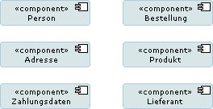
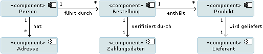
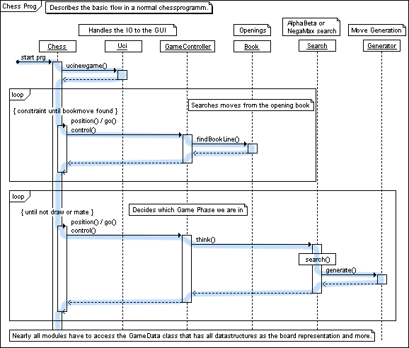

# (OO) DESIGN

(C) Prof. Dr. Stefan Edlich

---

## Learning Goals

After completing the learning unit, you should:

Be able to explain the importance of architecture in the design process.
Gain your own idea of the steps in the design process and apply and justify them to projects.
Assess the importance of UML in the design process and be able to explain it to other people in a comprehensible manner.
Collect and document design experience for your own projects.

## Structure

* The concept of design in software engineering
* Design and architecture
* Domain Driven Design DDD
* Application architecture
* Technical components
* Component-specific class model
* Design principles
* Dynamic models
* Interfaces and dependencies
* Test definitions
* Attributes for components/classes
* Design of the user dialogs (GUI)

**Time needed**

You will need around 90 minutes to work through the learning unit and around 120 minutes to complete the exercises.

> It is very important to go through a design process yourself and get feedback.

---

## REFERENCES

* Lahres, Bernhard; Rayman Gregor (2009): Objektorientierte Programmierung. Das umfassende Handbuch. Rheinwerk Verlag (ehemals: Galileo Press), ISBN-13: 978-3-8362-1401-8
Auf der Webseite des Rheinwerk Verlags ist eine Leseprobe verfügbar (Stand 10/2020).
* Oestereich, Bernd; Westphal, Stefan (2006): Objektorientierte Softwareentwicklung. Analyse und Design mit UML 2.1. Oldenbourg, ISBN-13: 978-3486579260
* McLaughlin, Pollice, West, (2006): Objektorientierte Analyse und Design von Kopf bis Fuß. O'Reilly, ISBN-13: 978-3897214958

## Weblinks

* [The S.O.L.I.D Principles in Pictures](https://medium.com/backticks-tildes/the-s-o-l-i-d-principles-in-pictures-b34ce2f1e898)
* [Aus dem OEP der Teil über Phasen / Entwurf-/Architekturphase](http://www.oose.de/oep/index.htm)
* [Object Oriented Design, Kenneth M. Anderson](http://www.cs.colorado.edu/~kena/classes/5828/s07/lectures/20/lecture20.pdf)
* [Object Oriented Design, Ian Sommerville 2004](http://ifs.host.cs.st-andrews.ac.uk/Books/SE7/Presentations/PDF/ch14.pdf)
* [Thoughts by Jack Reeves](http://www.developerdotstar.com/printable/mag/articles/reeves_design.html)
* [Design-Buch von MIT Press; How to Design Programs](http://htdp.org/2003-09-26/Book/)
* [Wikipedia](http://en.wikipedia.org/wiki/Software_design)
* [Balsamiq Wireframes: exzellent GUI-Design-Tool](http://www.balsamiq.com/products/mockups)

---

## THE CONCEPT OF DESIGN IN SOFTWARE ENGINEERING

>DEFINITION: Software design => (Software) design is the process between analysis and implementation. It is important to define the basic architecture, specify components and make interactions transparent. The design is often the basis for the start of a concrete implementation.

In the classic waterfall process, the analysis would be followed by a long design phase in which at least a few components are specified. A comprehensive analysis also presents architectural considerations and explains collaboration with dynamic UML diagrams.

This is a little different with more agile methods. This often starts with a prototype that contains the basic architecture. Only a few components are specified at the beginning. Interaction models are rarely created at the beginning. i.e. the spike (prototype) represents a small excerpt from the design of the software. This prototype gives you quick feedback as to whether the architecture makes sense or not. It quickly becomes clear whether the selected components are optimal and which components are missing. The object interactions are (hopefully) visible in the concrete implementation. Weaknesses are discovered early. The next milestone iteratively expands this design area.

The design phase is also called the **architecture phase** because the definition or design of the components should result in an architecture!

At the beginning of the design phase - i.e. after the analysis phase - all use cases should be known as well as possible. They should therefore be documented with names, the triggering events and the resulting results. The same applies to many other things: You can't decide everything in advance, but you should have as good an overview as possible. This applies to all points from the analysis phase, such as: B. all non-functional requirements.

**Documents for the design process**

According to IEEE Standard 1016-1998, the following documents must be created in the design process:

* Introduction
  * Design overview
  * Requirements traceability matrix

* System architecture
  * Chosen system architecture
  * Discussion of alternative architectures
  * System interface description

* Detailed description of the components
  * component n
  * Component n+1

* User interface (UI)

* Additional material (appendix)

What is not explicitly mentioned in this description are dynamic collaboration models. These are included in the next pages.

---

## DESIGN AND ARCHITECTURE

It is difficult, especially for inexperienced designers, to get from a collection of components to an architecture. Two classic problems need to be solved:

* In the classic component diagram, the designers initially cannot think of enough components.
* The components do not form an architecture.

The first problem usually results from the fact that the designer is not yet deep enough into the design of his system. The parallel development of a prototype often helps here. During the actual development, many more components come to mind instead of the initial 10 components.

**Exchange of experiences**

Sharing information and discussing with experienced designers/architects can also help with both problems. Experienced designers quickly identify which typical components are missing (e.g. database access or security). What is much more important, however, is that architects can incorporate a variety of components into a powerful architecture. An example of this is to sort the components into a 3, 4 or 5 layer model, for example taking an MVC model and assigning the components there. This seemingly trivial step alone helps to structure components much better.

**Architectures and frameworks**

The design result can then be better compared with products, frameworks or the resulting architectures. For example, an SOA architecture often has to be implemented or frameworks such as Spring or EJB / JEE must be used. These architectures or frameworks must be reflected in the architecture. As a rule, experienced architects have already carried out many (e.g. SOA, JEE, EJB or Spring) projects with such architectures and take this resulting non-technical architectural requirement into account in the component architecture. Many of these frameworks also document the architecture they enforce (see Ruby-on-Rails).

**Criteria**

As with normal software, there are criteria that a good software architecture/design must meet:

* **Changeable**: This criterion is usually **the most important** feature in large projects. How is it ensured that changes to the system have as little impact as possible? (Keyword DI or architecture metrics)

* **Testable**: Can I test my components well? This is usually related to the first criterion.

* **Understandable / Readable**: A difficult point, as making the code easier to change may also result in the code being less readable. A balance must be found here.

* **Reusability**: For example, are classes well encapsulated? Does a class even provide a service? Does a class only care about its data? There are a lot of criteria here that enable good reusability. It should be noted here that this does not necessarily mean inheritance, but components can also provide useful services everywhere via delegation (instead of, for example, a rewrite of a component “something like that”).

But how do you determine these criteria? Can these perhaps also be checked automatically and visualized well?

That works! There are now some good tools on the market with which - if you start small - you can define and monitor architectures and architectural qualities free of charge.

The following figure shows an architecture. Rules can be defined here, for example that technical layers (GUI, controller, domain logic, data layer) are only allowed to access from top to bottom. However, each of these technical layers is allowed to access additional help packages (Common, Util, User, Connection).

Pic: Definition of an architecture

The following figure shows the usage hierarchy. If packet accesses occur that are not allowed (e.g. bottom-up accesses or cycles), then these would be displayed in **red** 🧯.

Pic: 77: Hierarchy

**More tools**

* SonarJ from hello2morrow.com
* SotoArc and SotoGraph from hello2morrow.com
* Structure 101 Headway Software

* Quality analysis tools

* Sonar from Codehaus.org (until April 2015)
* XRadar, Panopticode, etc.

More is to come in the metric chapter.

---

## APPLICATION ARCHITECTURE

When defining the application architecture, it is first important to define a rough picture of the components, which is then continually refined. Therefore, you usually start at the highest level with the deployment diagram.

**Deployment**

A good place to start is to create a deployment diagram.

> **EXAMPLE** see the example “Toll Collect” (from the chapter “Distribution diagram” of the learning unit “UML – Unified Modeling Language”)

The same applies to the deployment diagram: Even if you think it's a small system, you later realize that there are more interaction paths or different systems. As a rule, there is more to draw or design than just a server and a web client. The difficulty is to think of all possible interaction paths or systems right from the start and to take them into account in advance...

The first 5-10 rough components can already be visible in the deployment diagram. These should be the components that are then specified in more detail in the component (or package) diagram.

**Layers and components**

In the component model - which can be described with a component diagram - there are usually 15-50 components visible. The design effect is:

*Identification of as many **components** as possible. These can then be differentiated much more easily and distributed among developers.
* Layers can become visible by forming **groups**.

All components visualized in the diagram can usually be grouped. For example, the following groups often occur:

* GUI components/views
* Controller components / application control
* Business / Domain / Entity Objects Components
* Application logic / - Services / - Services
* Data storage components / data connections

So you usually have two cuts through the components:

* The vertical layers mentioned above, perhaps even accessed from top to bottom via a small interface.
* The technical horizontal cuts within the layers. So there is e.g. B. in the layer of domain objects components for people, addresses, products, suppliers, etc.

It is therefore always a good practice to enter all components in such a grid (horizontal → technicality and vertical → layers). If the accesses are then drawn with their direction, the architecture becomes visible and the meaning becomes transparent.

This arrangement also makes it easier to detect missing components. For example:

* Security / Access Control
* Transfer objects
* Logging / Transactionality
* User management

The figure shows an example of simple layering.

Pic: Division into layers

Three layers are visible in this graphic. The GUI layer, a database layer and a middle layer that contains the logic. Here too, the logic layer is not optimally specified. Important domain objects such as person, address, company, etc. - here GAMEDATA (the master data of a game) - could be displayed separately. Of course, aspects of a multiuser architecture such as user management or security that could occur in other real applications are also missing.

The framework conditions must also be checked at this point, as they imply the framework to be used later. As a rule, the components themselves do not take care of the process control. The framework calls components according to the Hollywood principle if they are registered.

For example, in the *Ruby on Rails* web framework, there are, by definition, four locations for classes:

1. **controllers** – All controller classes. You implement the flow control of the use cases.

2. **models** – The domain objects, i.e. all basic data structures such as Person. In Rails, these are automatically mapped to databases and all database code is generated automatically. With scaffolds, example views can even be created immediately from these models.

3. **views** – All view classes in the form of HTML code, e.g. B. contain dynamic tags: <% Prog-Code %>

4. **helpers** – Other services that need to be implemented and do not fit into the above scheme. This shows how good frameworks enforce a layered architecture and thus partially ensure who communicates with whom.

**Checklist**

* Have I drawn a deployment diagram?
* Will there be more systems in the deployment diagram later?
* Have you already entered as many rough components as possible into the deployment diagram?
* Have I identified all the layers in the component diagram?
* Have I identified and entered a lot of components in the component diagram?
* Who should or may use whom?

---

## CORE / DOMAIN COMPONENTS

The deployment diagram usually shows the first 5-10 very rough components. These are then broken down into components again in the component diagram. At this point it is important to consider whether these are already class-level components. This means that every component that has arisen so far should now be broken down to the class level.

> **NOTICE**: Here we continue to use the language class as the smallest element of a component. Classes usually consist of data and methods. However, data groups (such as structs) or pure modules are also meant in a broader sense. The latter can only consist of methods and do not contain any data. In this sense, both structs, modules and methods are components. We limit ourselves here to naming classes. Nevertheless, components are usually larger units, e.g. B. can have to do with items, customers or orders.

Pic: Domain classes

**External components**

Every system has **external interfaces**. These can be GUI, web services, external databases, etc. These should be recorded early enough and presented with suitable components.

**Workflows**

In a software system there are not only specialist classes, but also classes that are responsible for the process. In small systems, this is usually a controller class. In larger systems, the controller classes usually pass on functionality to workflow components.

For example, a user can enter their address data in the system. Since this can sometimes be a very complex process - just think of error handling and troubleshooting - there are often workflow components for the corresponding process control. For example, think of a component for each of the specialist classes shown above that controls the specific process.

This often results in a connection with the use cases that you defined in the analysis. Registering a person in the online shop could be exactly one use case. If successful, this registration ends with one or more address classes and the processing and control of the entries in the GUI could be carried out by one or more workflow components on this topic.

**Form groups**

The figure shows that it is helpful to divide the components into groups and think about relationships.

Pic: Division into groups

In many cases it turns out that related specialist classes can also be treated together. For example with a workflow component.

**Checklist**
Do all components from the component diagram have been broken down into the smallest possible units?
Do all external components have been identified?
Do all workflow components been have identified?
Do all other logic and auxiliary components have been identified?
Do some relationships already have been identified?

---

## COMPONENT-SPECIFIC CLASS MODEL

In the component-specific class model, the individual entities are worked out precisely, i.e. H. specified. This is done in individual steps. In the previous chapters, the specialist classes were only roughly defined. In some circumstances, no associations were defined. This all needs to be done now:

* Initially, you should define a solution concept not only for the specialist classes but for all classes. Surrounding or further classes must also be considered.
* Next, all associations should be defined, if not already done in the previous step.
* You should then consider for each class what responsibilities it has and what states it can assume.
* Finally, the class itself should be developed.

Let's go through the points one by one using examples.

1. **Identification of all final subject classes**

A Requirements component may have previously existed in a system. So a module for determining and managing requirements. This component is still far too coarse for a finer design and needs to be further divided. Requirements are created by people. This also needs to be recorded.

So there are at least two components: `Person - Requirement`. But people must have an address. If you have any questions about a requirement, you must be able to contact the author immediately. You may also need to know which project he is currently working on and which project he has worked on so far. This quickly results in a graphic with four components. `Address - Project - Person - Requirement`. In general, the deeper you look into the exact definition, you see more and more classes.

Pic: Requirements - components

2. **Determination of relationships**

The analysis of the relationships is only superficially simple. In our example, one person would create many requirements. A person could have multiple addresses and also have participated in many projects over time. From the latter you could then determine the current project.

Pic: Relationships

* Two things are important here that must then be documented:

* What do the classes represent?

What states can the classes assume? So in our example:

* **person**

  * A person represents someone who created a requirement.

  * Conditions could e.g. For example, it should be noted whether this person is an internal person or an external consultant.

* **Requirements**

  * A requirement represents a concrete definition of a requirement.
Requirements can have different states: open / closed or functional / non-functional.

  * In general, you can of course think about all properties/attributes for states and document them in the last step.

3. **Exact component specification**

The exact component specification could then contain all attributes and methods textually. Alternatively, you could also work in UML notation:

**Person**

    name : String
    position : {EXTERNAL, INTERNAL}
    addresses: collection
    projects: collection

**Requirements**

    id: int
    name : String
    date : Date prio : {LOW, MEDIUM, HIGH, CRITICAL}
    status : {OPEN, CLOSED, PENDING, DELETED}
    description : thong
    docs: collection

The developer can generate real classes with this information - unless he already has defined this by himself.

Additional boundary conditions would be helpful. Name `must` not be null or `date` must be before January 1st, 1900. As a designer, you can certainly think of other options here.

**Checklist**

Have all classes been defined?

1. Is a coherent design concept still visible?
2. Have all associations been defined?
3. Are all association parameters defined? (Navigability, stereotypes, roles, etc.). Are there enough keys for navigability?
4. Do all states and attributes match the role of the class? Are the responsibilities correct?

---

## DESIGN PRINCIPLES

The exciting question in design is: How do you get to a good component design after all the component drawing?

We assume that the designer is a good architect and has read relevant learning units and books. What resources does he have at his disposal to create a good design? In the following, we want to limit ourselves to the components themselves and their interaction. Design is more than just the arrangement of components (this also includes GUI design or making interactions “transparent”). However, the arrangement and interaction of components are the most important core feature of a good design.

**A. Consideration of the environment:**

As a designer and architect, you will take into account both the environment and the task, the team and the framework conditions (standards, frameworks).

**B. Division into packages:**

A tool available to the designer is the division into packages. Analogous to the “ARC software architectures”, there are higher levels, but these should only be taken into account implicitly here. A designer will therefore think about the package structure in the best possible way and divide it into N dimensions - technically, professionally or in other constellations.

These dimensions can be easily visualized graphically and represented at least two-dimensionally in the package structure:

A dimension in the concatenation of the namespace

    level1.level2...level up

    (e.g. de.sun.com.procect.app.persistence.dao)

and once within a namespace on a level

    level1.level2.[partA|partB|part C...]

(e.g. de.swt.app.interest calculator; de.swt.app.pension calculator; de.swt.app.tax calculator; etc.).

According to many architects, paying attention to Part B already contributes a lot to a good design:

* Arrangement of components
* Visualization of the components as a definition
* Visualization of the components in concrete access
* Checking access rights from package A to package B or from component/class A to B
* Evaluation of access behavior metrics (e.g. with JDepend or Sonar)

**C. Division into classes:**

Which classes are within the packages. How are these meaningfully named? Are they well structured in themselves?

**D. Interaction of packages:**

The designer clarifies the question: How do these packages communicate with each other. Can every package communicate with everyone? Is communication channeled? As explained in the previous chapters, the designer/architect should have a clear idea of which package can communicate with which.

If necessary, communication can also take place via defined interfaces, such as: B. Proxies. As already mentioned, there are powerful tools that can visualize and check this (SonarJ, Soto*, Structure101 or even simple Java frameworks like Macker) and throw out enough metrics on this topic.

**E. Class interaction:**

How do the classes communicate with each other? What this essentially means is the communication within the packages. Are design patterns used? Is a dependency injection framework used? There are a variety of questions here that will be discussed in greater depth later and are also part of the “ARC - Software Architectures” learning unit.

**F. Design of the classes themselves:**

Although the inner design of the classes itself already extends into coding, a clean coding can already contribut a lot to good design. This shall be illustrated with a few principles:

---

## DRY AND SRP PRINCIPLE

**DRY principle**

DRY stands for **Don't Repeat Yourself**. This is one of the most violated principles! The same or similar code should be grouped together as this makes it more maintainable and results in fewer errors. This applies to both code (with methods) and data (that's what normalization is for).

One of the top mistakes in software development is copy and paste errors because copy and paste is easy and fast. Unfortunately, it is also extremely error-prone. Modern continuous integration frameworks or code analysis tools check copy and paste in applications and warn. Paying attention to DRY in the design phase creates a better design.

**SRP – Single Responsibility Design Principle**

Classes should only take on one task. Why? Because the code has to be changed at some point and changes to a class should only affect one task and not another. If a class does two tasks:

1. Encryption of a password and
2. Calculating the hash value of a password,
problems could arise.

If the class in the project is used in just one place in the code to encrypt a password and then renamed, problems can arise in 100 other places: namely exactly where the functionality for hashing is used, which may have nothing to do with that has to do with password encryption. Attention to SRP reduces sensitivity to change. No SRP leads to a higher degree of coupling and therefore more incomprehensible code. In a partial form, this principle is also called the “**Separation of Concerns**”.

One implication of this pattern is to implement components in such a way that fewer unforeseen events occur: **The principle of least astonishment**. The component should only do exactly what can be deduced from its name (and, if applicable, the interface documentation).

> Websource: A great ressource here is https://clean-code-developer.de/

---

## INFORMATION HIDING (TELL, DON'T ASK)

Knowledge should be in the right place and not carried out. This applies to both classes and perhaps also packages. Even getters in classes violate the principle of information hiding in a certain way. The requesting class B accepts values from A and thereby performs logic that would perhaps be much better served in A. Namely where the data was stored in A. As a rule, A should not be a pure class for data storage, but should contain logic. Then the objects are loosely coupled and not connected to each other via the data.

Of course there are always exceptions. Pure data objects such as DTOs (Data Transfer Objects) are only temporary living objects that do not need any logic. However, such examples also have logic that allows data to be transferred from the database to the target format.

Additionally, it is extremely important to bring and keep the design alive. There are many projects in which extensive design is carried out and after a little while the design becomes outdated. Then it lost its meaning and perhaps it could have been saved. A design must be able to adapt to developments. It is the designer’s responsibility to find the right tools.

These can either be UML tools for reverse engineering. Just as interesting are the tools for architecture analysis mentioned above and previously, which can analyze, (reverse) visualize and enforce package structures.

>**Exercise Packet structure and communication paths**

Answer the following questions about your project and prepare to present and explain the structure of your project in a discussion.

* nWhat is the package structure in your project?
* How do the packages and classes communicate with each other?
* Do you have an idea of the communication channels in your (component) design?
* Can you visualize incorrect communication paths (cycles or upward communication) or then automatically enforce warnings using (unit) tests?

Processing time: 20 minutes

---

## DYNAMIC MODELS

The dynamic models are suitable for designing and modeling for two main reasons:

* Illustration of processes for team members

* Easier to check for completeness

**Illustration of processes**

Developers often find it difficult to understand existing or yet-to-be-built systems. However, most of the time there is an architect who either knows the system or already has the interactions in the system to be built in mind. Dynamic diagrams help here by illustrating facts and the interaction of components - the so-called collaboration models in sequence or collaboration diagrams.

**Easier to check for completeness**

Actions in a system can often be broken down top-down. A flight booking system initially consists solely of the process in which the user logs in and books a flight. The closer you look, the more you see that all processes and interactions of the components have to be broken down. A flight booking usually consists of logging in, searching, selecting, setting parameters, entering payment details and completing the process. In a real system, each of the processes mentioned here can be represented in individual components of a dynamic diagram.

The modeling depth generally depends on the type of project and the project requirements. In many projects, however, the most important components and processes are not visualized enough. The developers lose sight of the “big picture”. Conversely, too many UML diagrams are created - often in the start-up phase - which can then no longer be kept up to date and are therefore worthless. It is therefore important to find the right balance - to create useful and efficient diagrams that can always be kept up to date.

**Activity diagrams**

Activity diagrams are modeled in the design phase for all use cases. As a rule, this is done roughly first and then parts of the activity diagram are refined. These parts of an activity diagram can then also be the starting point for the subsequent sequence diagrams, which model a sub-process of the application from the perspective of the components involved.

Pic: Example sequence diagram

**Interaction models**

To illustrate the process, sequence or interaction diagrams must be drawn up. As already shown in the chapter “UML diagram overview” in the “UML – Unified Modeling Language” learning unit, component interactions can be illustrated – for example, the communication process in the DAO pattern between the logic and database components.

**State models**

As modeling progresses, state models can be interesting. For example, a state diagram can contain the states from a flight booking.

* User unknown vs. user known
* Flight unknown vs. flight known/selected
* Flight unreserved vs. flight reserved
* Payment data unchecked vs. payment data checked
* Order not completed, order accepted and submitted
* Money not debited, money debited

Often these points correspond to fields in components or even table columns in the databases.

---

## INTERFACES AND DEPENDENCIES

Interfaces are a **significant part** of any software system. The definition of an interface specifies the cooperation between the parts of the software system. If an interface is poorly or incorrectly defined, there will also be poor and incorrect interaction between the components. It is therefore not surprising that in larger projects, most of the work is invested in the areas that concern interfaces.

In the design phase, three types of interfaces are distinguished:

* Component interfaces are the interfaces of each component
* Internal interfaces between component groups
* External interfaces

On the following pages we examine all three types of these interfaces and their importance in the design phase.

---

## COMPONENT INTERFACES

In many programming languages, interfaces can be formulated explicitly. In Java, for example, this happens with interfaces. These essentially represent a contract between the provider component and the consumer component, which results in a number of advantages:

**Secret principle**

The consumer of the component service only needs to know the interface and can rely on the provision of the service. Any additional public components are of no interest: they may not be used because they can probably change significantly more than interface methods.

**Responsibility**

With an interface there is a clear division of responsibility. Everyone relies on each other on the contract. The consumer trusts in correctness, completeness and also in the fact that the interface does not change. The producer trusts that he only has to worry about fulfilling the interface and nothing more.

Testability

Component interfaces can be tested and since they should always be tested in a good project, the consumer can be confident that the contract is being fulfilled correctly. The principle of the smallest surprise is then satisfied. In test-driven development, this goes so far that it makes sense for the client to define the interface and also be the first consumer, even before the actual component has been written. Interfaces are defined from the outside in and unnecessary solutions (YAGNI) then have no chance because no client requires them.

For this reason, it is completely advisable to always program against interfaces. Even on a small scale and not just between packages. Here “against” means, if possible, never to instantiate the class, but always to create the class from the interface.

Let's look at two examples:

    public interface ICmds {
         public void execute();
         public String identify();
    }

The client/developer recognizes that it is an interface (name and keyword if necessary). It is therefore an interface that must implement all commands. A command could e.g. B. “Stop”, “Pause” or “Restart”. The client can therefore simply execute a command with execute. Furthermore, every command is guaranteed (and checked with tests) to return its string representation with identify(). The consumer can also rely on this.

What is noticeable is that the interface is pleasantly narrow. This reduces additional dependencies and later difficulties in changing or adapting. Interface design should therefore always adhere to the KISS principle (Keep it simple, stupid).

Many useful interfaces can be found in the .NET and Java packages.

An example is the principle of the **iterator** pattern from the Java package jav.util:

    public interface Iterator<E> {
         boolean hasNext();
         E next();
         void remove();
    }

A standard has been established here for a recurring task: iteration through lists with the option of retaining the elements, deleting them or checking for the end of the list.

An advantageous factor that should not be underestimated is that interfaces allow the use of **dependency injection containers**, such as: B.** Spring or Google Guice**. Here too, you implement against an interface, but the specific implementation and especially its name are decoupled. Both the name and the implementation itself can easily be exchanged. But interfaces are also helpful for many other things such as simple unit tests or the use of mock objects.

---

## INTERFACES OF THE COMPONENT GROUPS

The aim of a good architecture is also to **reduce overall dependencies**. An important tool here is to group the components - usually in packages - and try to minimize access between the groups. As the graphic below shows, it would not be desirable if A, B and C from group M accessed X, Y, Z from group N:

Pic: Component groups

One method of reducing access is to introduce proxies for component groups/packages that channel or mediate access. In this case, the proxy for the package is the analogy of a public method to a class. Furthermore, it allows the developer of package N to change the class names internally without affecting group M since the proxy remains stable.

Pic: Component groups with proxy

The whole thing is clearly shown again using complete packages:

Pic: Packages with multiple proxies

It is therefore always advisable for the database expert Jim, for example, to coordinate not only the interfaces of his service classes, but also the proxies of his packages. This means that logic developer Sabine can access the database level in a much narrower manner.

---

## EXTERNAL INTERFACES

In the design phase, it is important to look closely at the external interfaces and describe them. Most large systems interact with their environment in some way. As a rule, you initially only think of a GUI, but there are usually even more interfaces such as:

* Documents / (scanned) letters
* XML / JSON / YAML from other sources
* Legacy systems
So check your system to see if there might be any sources related to this. Keeping these in mind from the beginning during the design phase will help a lot later. It is important to precisely describe the data sources and their behavior and expectations. As a rule, the non-functional boundary conditions of the interfaces (format, timing, interface, etc.) cause the biggest problems.

**Conclusion**

Which diagrams can now be used for the interface description? Assuming you want to make relationships/dependencies transparent and not design the interface itself in a UML class diagram, there are actually only two that could be used:

* The component diagram
(see also chapter “Component diagram” in the learning unit “UML – Unified Modeling Language”)
* The composition structure diagram

> As an example, take a look at the composition structure diagram of a stereo system or radio:

Pic: Component diagram of a stereo system

Such UML graphics can be used well both in general and for package proxies and make the dependencies and services transparent.

---

## TEST DEFINITIONS

At this point there is a brief introduction to the learning unit “Object-Oriented Testing and Test-Driven Development”.

In this phase of the design, the requirements for the components are already relatively clear. There are also use cases that describe the application process in relation to defined requirements. Developers could now start and try to develop these components according to the specification. The question is: who then checks the result? The project manager, a colleague, the client or a machine? This question shows that the quality concept must be in place before implementation. It has already been defined in the analysis.

However, this also means that checking the results must be an issue even before the components are developed. This is exactly the topic of test-driven development, which has proven itself many times over.

As already mentioned, when it comes to test definitions, there are many levels at which tests have to be prepared, including in the design phase.

**Testing for use cases**

For each use case, tests must be developed to test the processes. This applies to both the data and the expected result.

**A.** For each application it must be clear which input variables are present and which result is expected after the user's operations. For example, when placing an order with a discount coupon, the correct price including VAT must be available. There are many use cases where this can be checked manually. i.e. Ideally, the processes must be checked by the client.

**B.** In the example above, however, the results of entire component processes can also be tested under certain circumstances. If component A uses components B and C to calculate a result (for use case X) and C still uses D, then the final result that component A delivers is tested here. This is in contrast to unit testing, where component A is tested as isolated as possible, i.e. H. B and C are replaced by mock objects!

These cases should be documented right from the start and appropriate tests should be prepared or implemented - this would then be an early part of the **implementation phase**.

**Class tests**

In contrast to the previous tests, class tests only relate to testing the methods. This is why we also speak of unit tests. Tests have to be designed for each method - which can then be built later in the implementation phase. As already mentioned, the methods are tested in isolation. i.e. Any dependencies on other components should be replaced by mock objects.

If it was well analyzed and designed, then boundary conditions were also specified for the methods of the classes. Let's take an example.

    /* ... Boundary conditions...*/
    
    class Person {
     ...
     /* ... Boundary conditions...*/
     void setAge(int aAge){...}
     ...
    }

Here, boundary conditions could have already been specified during the design, such as that an age must not be smaller than zero. This could be taken into account in the test plan for all methods of a class. Incidentally, all further tests such as limit value tests etc. are also planned here. The topic is covered in the learning unit “Object-Oriented Testing and Test-Driven Development”.

**Tests for external interfaces**

External interfaces are always viewed particularly critically in all applications. This is because these interfaces are always underestimated and not under control. An example:

> **EXAMPLE: Call center application** A call center application is to be developed that makes it possible to support telephone employees on any computer. At the same time, existing telephone systems must be supported. So the system must be able to fetch/get names, phone numbers and events from the telephone system. It is assumed that the data is always available, is transmitted correctly and no side effects can occur.

Unfortunately, this is rarely the case. Tests for external interfaces are usually small prototypes that can reveal vulnerabilities early on. Defining and carrying out these tests early on prevents bad investments in the core area because, for example, an incorrect interface cannot be changed.

**Prepare in-class tests**

When defining the classes, it is important to specify all boundary conditions in addition to the signature definition of all methods and fields - as mentioned above. If these are present, it can be assumed that they have already been taken into account in the class tests. Simply knowing that such boundary conditions are being tested should lead the designer and developer to immediately consider class-internal tests.

The designer has therefore already noted in the class that the age cannot be less than zero. A test was also prepared for this. In this case, the test checks whether an exception was thrown correctly. The designer or developer must therefore be internally prepared to throw an exception, either by noting it in the design phase or by implementing it later.

    void setAge(int aAge){
     /* Assertion for age < 0 */
     assert aAge >= 0; /* This line soon or later */
     this.age = aAge;
    }

Sun pointed out in the early years that it is better to throw RuntimeExceptions when checking the parameters! The code is therefore only to demonstrate the assertion.

It is worthwhile to think about class-internal exams early on - **Assertions** -, for example:

* assertions for preconditions
* assertions for invariants, i.e. H. for states in the code
* assertions for postconditions

An example of the latter case is checking the return value. Many errors arise because "null" is returned or because the object does not have the correct range of values. A check using assert is trivial to integrate and helps ensure that the component fulfills its contract, at least in terms of the return value.

**Prepare test automation**

Unless these are flow tests that do not allow machine testing, the tests must be automatable as much as possible - i.e. H. be integrated into a system that enables automated testing. In the simplest case, this can be a build language (Ant, Maven, Rake, Gradle, etc.), in the best case a continuous integration system such as Jenkins, Cruise Control, Bamboo or the hosting system itself (sf.net), which carries out the tests independently initiates.

To encourage this way of thinking, in 2008 KENT BECK wrote a JUnit extension called JUnit Max that runs all tests on every save. This ensures that only correct code can be checked in.

**Conclusion**

It turns out that the quality concept must also be implemented in the design phase and that all quality levels should be addressed. The learning unit “Object-Oriented Testing and Test-Driven Development” will show that there are even more test levels than those discussed so far, such as load tests or integration tests.

**Checklist**

* Are all use cases covered with tests?
* Which high-level tests for use cases have to be carried out manually and which can be carried out automatically?
* Are all class tests prepared?
* Have all interfaces been recorded and tests planned for them?
* Is it ensured that the classes/methods themselves are tested sufficiently internally to reliably * fulfill their contract?
* Can all tests be started with one click or triggered on a timer basis?

---

## ATTRIBUTES FOR COMPONENTS/CLASSES

At the end of the design phase, the attributes of the components/classes can be defined. The following things need to be taken into account:

**A.** Are all attributes recorded?

**B.** Is this attribute a basic type or is it better an object of another class? The question is whether the class design is truly balanced or not. For example, an Address field in a Person is a string with this content:

    "Wilhelmstr.25, 16356 Augsburg, Germany"

Or should the address be an object, so that the Person object refers to the address 1:1 or 1:n? In the case of an association, all cardinalities must of course be checked again.

**C.** Is the attribute perhaps a key or a collection, i.e. H. a list, a set or an array of values? If the latter is true, which collection? In many application areas, certain collections are mandatory or better/faster than others.

**D.** Are the responsibilities of the attributes clear? Attributes are often defined in which another class is suddenly much more interested. In the learning unit “REF – Refactoring” in the chapter “The Refactoring “Smell”” and in the chapter “Problem and Healing” “envy” is also mentioned. The aim is therefore to reconsider whether the corresponding attribute might be better off in the class that is constantly interested and inquiring about it.

**E.** And then of course there is the question of whether there are assurances for each attribute. This is also included in the next part of the GUI design and often affects the GUI directly. So any type of format or value range conditions are important here.

Of course, standards of the company and the framework must always be taken into account. For example, working with Hibernate Annotations (Java Annotations for the Hibernate persistence framework) for persistence can lead to the need to introduce key fields in the class from the outset that ensure the navigability of the objects.

Let's take another look at the attribute definitions from the component-specific class model:

    Person
    
    id : int
    name : String
    position : {EXTERNAL, INTERNAL}
    adressen : collection
    projekte : collection

    Requirements
    
    id : int
    name : String
    datum : Date
    prio : {LOW, MEDIUM, HIGH, CRITICAL}
    status : {OPEN, CLOSED, PENDING, DELETED}
    beschreibung : String
    docs : collection

This could be translated into the following code:

    /** ... comments **/
    public class Person {
        int id; /* No default value, always > 0,
                   Is there enough space or is it better long? */
         String name; /* Cannot be null or empty */
         String position; /* Can only be EXTERNAL or INTERNAL.
                             Possibly Enum */
         List <Addresses> addresses;/* Must contain at least one address */
         List <Projects> projects;/* Can also be empty */
    }

    public class Requirements {
        int id; /* No default value, always > 0,
                   Is there enough space or is it better long? */
        String name; /* Cannot be null or empty */
        Date date; /* Date the requirement was first created.
                      After January 1, 2000. */
        Enum priority; /* Can only be LOW, MEDIUM, HIGH, CRITICAL. */
        Enum status; /* Can only be OPEN, CLOSED, PENDING,DELETED. */
        String description /* Detailed text > 20 chars.
                              Must be different from the name! */
        String docs ; /* Path to the attached file. Must be correct
                         Have path syntax and be validatable. */
  }

---

## DESIGN OF THE USER DIALOGS (GUI)

Finally, the dialogs for the users must now be designed.

The figure shows an example of what this could look like for an application that includes project management and requirements management.

Pic: GUI for an example application

> **Question**: What do you notice? What could be improved? What is missing? Think about it for a moment before looking at the answer!

When designing, consideration should always be given to which devices the user is supposed to operate. As a rule, comprehensive applications have at least three input options:

* A rich client on the desktop.The complete logic is installed on the desktop computer.
* A thin client - i.e. H. a web application for all users who want to access your application via a web browser.
* A mobile client for access via cell phone. 
* iPhones and Android are becoming increasingly easier to code against.
* Normal Java / Kotlin programming is possible under Google Android

And many low code platforms are about to emerge

**What else to consider?**

* Of course, ideally there should be time to create a prototype (spike) and evaluate it. So it's best to give the users a task and film their work with the tool and measure the times. The evaluation from such an analysis is always the best feedback (German: Feedback).

* GUIs should always have several easily visible cancellation options and allow you to go up a level.

* It's always a good idea to make navigation visible. Where am I (in the tree)?

* It is important to check: Are all use cases visible in the GUI? And of course vice versa: Are all GUI elements assigned to use cases?

* Care should be taken to ensure that the paths are easily accessible. Grouping something and showing it visually is always a good idea.

* On consistent d. H. Uniform representation of all masks must be ensured. At the end, place all the masks on top of each other and compare.

* Dialogues are used in different contexts. This must be taken into account, e.g. B. from people with completely different roles or e.g. B. a travel booking with or without prior login.

* It has proven useful to take the evolution of the GUI into account right from the start - for example through an advanced mode or GUIs that can be activated later.

* Boundary conditions for each field are also very important. For example:

  * Default values: What initial values do the GUI elements have?
  * Limit values: Which limit values are actually permitted? -80000 € for a donation? 300 years for one age?
  * Validation rules: Almost every field has validation rules! Ideally, these are already specified in the UML tool so that they are available for MDA. What is e.g. B. with rules for email validation such as:
    %r{^(?:[_a-z0-9-]+)(\.[_a-z0-9-]+)*@([a-z0-9-]+)
    (\.[a-zA-Z0-9\-\.]+)*(\.[a-z]{2,4})$}i?

> TASK: Choose a GUI design tool to design the user dialogs!

Tip: Figma or Balsamiq mockups or many others are suitable

---

## SUMMARY (OO) DESIGN

In the design phase, too, you work from the general to the specific and specify more and more precisely. As a designer, you should come up with an approach that e.g. B. can consist of the elements listed so far:

* Architecture design
* Definition and arrangement of components
* Class design
* Make class interactions transparent. Definition of collaboration models.
* Analysis of the interfaces and dependencies among each other. If necessary, reduce this.
* Design and definition of quality specifications and tests at all levels
* Design of the GUI dialogs

The question always arises as to how much design is actually necessary. Some agile models (like XP) claim to do without a design at all and prefer to develop the design iteratively - which may result in a higher refactoring effort. As a designer you have to find a balance between the two poles:

**A.** **No design, rather iterative design development directly on the code**

  * **Advantages**: No initial paperwork required. Application can be better aligned to situations/designs/architectures that only arise during development.

  * **Disadvantages**: If there are obviously good designs/architectures, they can be achieved more quickly even with less design effort. So you waste time trying things out where “best practices” might be obvious.

**B.** **Lots of design, no experimental development**
  * **Advantage**: Reach a defined position more quickly without perhaps knowing exactly whether this position is good. Not spending time on live experiences.

  * **Disadvantage**: A lot of paperwork beforehand. Perhaps the design at hand is driving a solution that is not optimal but that one person prefers.

**Conclusion**:
What you choose as a designer certainly depends on what the task is, how fit the team is and whether there are any guidelines. Often there are already reference implementations or reference experiences. If this does not exist, a mix of both variants is usually ideal. You can also consider not specifying things completely. In English we speak of “Perfect Design” and “Good Enough Design”.

---

## EXERCISES 

* Do a 'classic' design of your project with components, layers, interactions, GUI, etc.

Describe the principles you took on. In total >= 3 pages.
