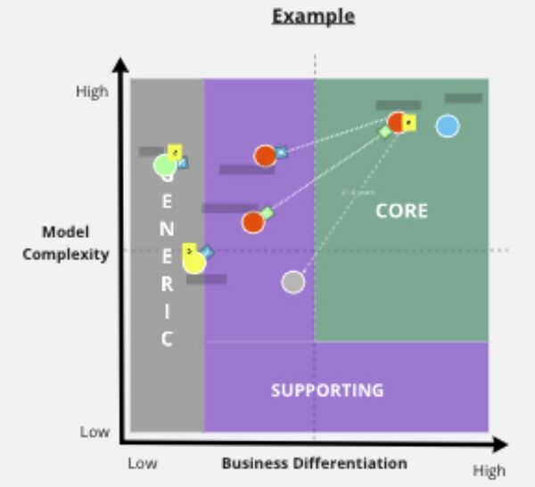

# DDD & EVENT STORMING

(C) Prof. Dr. Stefan Edlich

---

## INTRODUCTION

One of the most important design approaches is called domain-driven design and was described in great detail by Eric Evans in his book of the same name at Addison-Wesley. There are other works such as:

* Vaughn Vernon, “Domain-Driven Design Distilled,” Addison Wesley. (on Github?!)
* Eric Evans (InnoQ translation), “Domain-Driven Design Reference” http://leanpub.com/ddd-referenz (great compression in German)

> Domain-driven design is usually simply called **DDD** for short!

**Definition**
Defining DDD is not easy as it is more of a way of thinking. But let's try:

> DEFINITION: DDD is a strategic tool set that helps model, design and implement enterprise software and operations!

**Problem situation**

The starting point here is again a series of problems throughout the entire phase:

* The software development department is viewed as a **cost center**. It's best to have fewer developers and code faster.
* A lot of things are too **technology-centric**, which developers also contribute to.
* The **database** is often a holy grail and core element. This leads to holy administrators protecting them. Nevertheless, all departments pump up the database until it bursts.
* The **naming** of things and objects is neglected.
Hardly any cooperation from those actually responsible for the domain.
* The schedules are so strict that hardly any good design is used, but rather a “task board shuffle”. This results in a **Big Ball of Mud** (google this!)
* All services are **strongly coupled** to each other, which is also a consequence of the “Big Ball of Mud”.
* Wrong design decisions cause future requirements to be incorrectly integrated, only increase the size of the spaghetti pot, and can't be reversed easily.
* Business logic is often moved towards either the user interface or database and persistence logic into the domain logic. This also results in terrible, slow and locking database queries.

> **NOTICE**: Look for Conway's Law from 1968. There is an interesting connection here between what we do and learn in DDD and what has been known for a long time.

**Literature and references**

* Michael Plöd "Hands-on Domain-driven Design - by example", [1]
* "DDD reference translated by Eric Evans", [2] by Plöd, Wolff & Co.
* VAADIN "Tutorials for Strategic, Tactic, and DDD Design with Hexagonal Arch" [3] !!
* Vaugh Vernon "DDD Distilled", [4] (please buy the book!)
* https://www.slideshare.net/shadrik/domain-driven-design-52410778 from slide 34
* DDD multiple parts: https://www.iks-gmbh.com/news/details/domain-driven-design-teil-1
* by JAX https://vfhswt.eduloop.de/loop/Domain-Driven_Design_(DDD)

---

## PROBLEMS USING CAR RENTAL AS AN EXAMPLE

The big problem is that new requirements are constantly being pushed into the system. This creates **technical and even structural debt**, which we will discuss in more detail later. This in turn means that you have to invest more and more energy to “keep the whole system running” and have less time for real innovation. The industry is full of such examples. It almost doesn't matter which business example you use.

**Car rental specifically**

In our example we take a car rental company. When designing the application, the right thing usually happens initially:

* The focus is still on the **core domain**. It contains all the core elements that describe the strength and actual mission of the company.

For example, this could look like this:

Pic: The core domain cars, tenants, length of time, billing

Over time, customer requests and the wishes of the executive team come into play:

Pic: Core domain pumped up

it adds up to more:

+ Account management
+ ride sharing
+ Group management in rides
+ Promotions + Discounts
+ Advertising partners

And it doesn't stop here...

g

Pic: The spaghetti pot

again, it adds up to more:

+ Car sales
+ Car leasing
+ Discussion forums with postings
+ Shared calendar
+ Employee payroll
+ Location management
+ Management for fleets of external companies

The crucial point is that bosses usually ask:

> “Until when can you implement / screw this in?”

The developers then unfortunately respond with a deadline estimate and the next day start with a lot of thoughtless activities:

1. Continue drilling the **monolith** and pumping it up
2. Add an additional **42 tables and 137 table columns** to the comprehensive company database.
3. Introduce new global variables... ;-)
4. etc.

**IMPORTANT**

It is clear what software we get at the end of this path:

> **A BIG BALL OF MUD.** http://www.laputan.org/mud/

> All components influence each other and are usually strongly coupled. The essential aspects of good software, such as maintainability, changeability, testability, expandability and comprehensibility, are undermined. You can imagine all the negative effects: cyclic dependencies, endless debugging, slow tests and DB queries, concept breaks, etc.

So it is a wise and good idea to think carefully beforehand about what the core business is and how and where other aspects of the software should be handled.

**First lessons learned**

We can take some lessons with us here:

* We focus on the **core domain**!
* Other **domain areas** should be better **separated** and not influence the code domain!
* Each domain should have its **own source code repository**.
* Not only every source code, but also the **database**, is responsible for one bounded context.
* A **team** is responsible for a domain.

> QUOTE: “'**How do I get software architecture and teams together**' is the biggest problem in companies today – not the technology.” Michael Plod (German DDD Guru)

---

## DDD AND ITS CORE ELEMENTS

What are the core elements of the DDD:

* The software design is based on the areas of expertise and the specific logic.
* These are sensibly **grouped** and **isolated**!
* Specific units form a **domain model** or also called an application model.
* A large software system therefore usually has one **core domain** and **many other separate domain models** that carefully communicate with each other.

> DEFINITION: The term domain should be seen and defined here more in the sense of problem domain.  Sub-domains also subdivide a domain (core, support, generic as introduced later).

**Bounded Context and Ubiquitous Language**

What characterizes such a domain? And how do you find them?

Let's look at the image below:

Pic: Bounded context and Ubiquitous Language

Let's imagine: It's about software that is used in an airport **tower**. As shown here, it contains e.g. B. four essential elements. What these are is actually irrelevant here, e.g. B. Flight tracking, flight communication, collision monitoring and planning/archiving.

With such an example, it goes without saying that we should not try to dilute these software components with other software for airports in general. This would jeopardize our core business /code domain. It's not for nothing that the tower is a bounded and separate context!

> DEFINITION: How could one define bounded context?

* A boundary for a model expressed in a consistent ubiquitous language tailored around a specific purpose
* A defined part of the software where particular terms, definitions and rules apply - consistently
* A unit of: Autonomy, Mastery, Purpose
* A safe space for:
* Learning domain complexity
  * Experimenting
  * Delivering high value software

(Source: DDD Europe 2021)

A domain or subdomain can certainly have several bounded contexts. The other way around is difficult. If a bounded context extends across several subdomains, it smells like unfortunate modeling. How is communication done in this case?

What else characterizes the bounded context? It's usually its own little world, e.g. B. has their own language. And here too it is obvious: users of the tower software are air traffic controllers with extensive training who also speak their own language. And so in the banking industry, in shipping, in the insurance industry, etc. there are their own languages everywhere. English the Ubiquitous Language.

> NOTICE: Ubiquitous language does not mean “ubiquitous” in the world or in the company, but rather refers to the domain, i.e. the professionalism area. So a limited/caged but precise language, not a generalized language for everyone!

But not just languages, but also ways of thinking, rules, principles, strategies and guidelines. In English, all of this is subsumed under the term **policy**. In addition to the language, each domain also has its own policy.

This is exactly what needs to be taken into account: watering down the bounded context and mixing language and policy leads to problems and conflicts.

And with these terms you have tools that make it much easier to search for domains.

> WEBSOURCE: There are many more ideas here: github.com/ddd-crew/bounded-context-canvas, e.g. for a **canvas**, which can help here!

**Domain Scenarios**

Typically, the tasks and flows in a domain can be described relatively easily with a **domain scenario**. Using the tower/air traffic controller domain as an example, it could look like this:

**Textually**:

*The air traffic controllers receive the flight planning from the headquarters. The flight plans are entered into the local system. Flight tracking starts with the request and the release. Release and route are confirmed twice and validated with computer support. Flight communication is carried out according to checklist C22. Extraordinary events are confirmed and instructions are triple checked. Active collision monitoring is carried out continuously by two controllers in two segments. Extraordinary incidents are reported centrally and archived with a backup along with the entire history.*

**As a checklist**:

* The air traffic controllers receive the flight planning from the headquarters.
* Flight plans are entered into the local system.
* Flight tracking starts with the request and the release.
* Release and route are confirmed twice and validated with computer support.
* Flight communication is carried out according to checklist C22.
* Extraordinary events are confirmed and instructions are triple checked.
* Active collision monitoring is carried out continuously by two controllers in two segments.
* Extraordinary incidents are reported centrally and archived with a backup along with the entire history.

As test code:

 1 @InteractionText
 2 public void FlightControlInterationFlowTest(){
 3     var CurrentFlightData = getFlightData(...item...);
 4     Assert.NotNull(FlightData);
 5 
 6     storage.store(FlightData, ...item...);
 7     AssertTrue(storage.isStored(FlightData));
 8 
 9     startFlightTracing();
 10     assertTrue(RequestSent());
 11     assertTrue(ClearanceGiven());
 12     assertTrue(RouteCrossChecked();
 13 
 14     // ...
 15 }

 The latter is known from behavior-driven tools and procedures. In general, however, many options for specification and test execution are possible. However, it is important that such descriptions also “protect” the bounded context by not allowing extensions “ad-hoc”, but carefully.

---

 ## ARCHITECTURAL ASPECTS OF THE DDD

How can a single domain be realized now?

Let's look at the picture below, which was created as a **suggestion** by VAUGHN VERNON:

1. A domain is essentially a self-contained system. It contains the domain classes or **core data structures**, possibly even its own persistence with the corresponding domain tables or domain documents.
2. This core is enclosed by the actual **application logic**.
3. To interact we need a lot of **adapters**. These can be adapters to other domains, but also to the cloud, the Internet or somewhere else.
4. The entire set of our domains **interacts** in this way and is structured accordingly.

Pic: DDD architecture / Building a domain

Internally, we work with ports, adapters, services and, if necessary, inversion of control principles.

You can also differentiate between internal **domain services** that expose the domain model (at most Loggin, no Hibernate, JPA, etc., i.e. no infrastructure dependencies if possible). On top of that are application services.

> NOTICE: However, this architecture can only be a suggestion. You always have to weigh up whether this really brings any advantages. If this is overkill in one area, then of course you have to use other or simpler models!

Of course, you immediately ask yourself how all this can be achieved:

In fact, the analogy to microservices is immediately obvious. **Microservices** are also encapsulated “small” units that control all horizontal aspects of their domain and can be reimplemented relatively quickly (in about 2 weeks). (see the respective lecture)

However, there are also a number of other ways to implement this architecture:

* Event-driven architectures
* Reactive / Actor Model Driven
* REST or SOA architectures
* Pipeline or dataflow architectures
* Command Query Responsibility Segregation
* etc.

> WEBSOURCE: Further references: “DDD, Hexagonal, Onion, Clean, CQRS, ... How I put it all together” https://herbertograca.com/2017/11/16/explicit-architecture-01-ddd-hexagonal-onion-clean-cqrs-how-i-put-it-all-together/

* Hexagonal Architecture
* Onion Architecture

---

## DOMAIN RELATIONSHIPS/MAPPINGS

Once the domains have been defined, they are of course not statically fixed forever. Domains are also living and expanding systems. To prevent uncontrolled growth, there is another way, in addition to Boundaries/Context, to control it and raise awareness of tasks, responsibilities and interactions.

In the literature, these are referred to as mapping by ERIC EVANS and related authors ([book](https://www.amazon.de/Domain-Driven-Design-Distilled-Vaughn-Vernon/dp/0134434420), Github). However, the term relationship could be better, as it expresses the “working relationship” they have with each other. Such relationships help both to understand information flows and to make it more difficult to break defined relationships too quickly.

Let's take a closer look at each:

**BIG BALL OF MUD**

Let's start with the worst: the Big Ball of Mud. Here all domains and their subcomponents merge into one big bubble - something that is unfortunately still seen too often in the industry. The coupling and dependencies are through the roof. This in turn causes changes and expansions to bring about “shock-like ripple effects”. VAUGHN VERNON describes another interesting personnel impact on the company. The Big Ball of Mud promotes islands of knowledge from a few people who then sit on their code like octopuses and are indispensable to the company as “heroes”. To the outside world they seem like all-knowing heroes, but in reality they are a brake on the company.

> EXAMPLE The all-rounder product

Pic: Big Ball of Mud

**PARTNERSHIP**

In a partnership, two or more teams work cooperatively. Success is success for both and a failure of one is also a failure of the other. Both have slightly overlapping tasks and work areas but still have clear “boundaries”.

EXAMPLE

> A Bundesliga football club with coaching staff (Domain 1), manager staff (Domain 2) and medical staff (Domain 3).

Pic: Partnership

**SHARED KERNEL**

Two partner domains share a common model. Both must agree that the model is suitable.

EXAMPLE

> Central book distribution warehouse. One domain is responsible for ordering the books, one domain is responsible for all shipping.

Pic: Shared Kernel

**CUSTOMER / SUPPLIER**

Here one domain delivers as a supplier upstream and the other domain is a downstream receiver. The supplier sits at the beginning of the river (upstream) and sends small sailing boats to the receiver (downstream). The receiver usually has little influence on everything the sender does. But it is also not forbidden to discuss wishes.

>EXAMPLE: The Order Processing domain (e.g. for car orders) is responsible for receiving the orders and sending them to the Manufacturing & Sales department. Here the supplier only delivers silently to the receiver. Both must roughly adhere to a communication standard (e.g.: dynamic JSONs). However, the supplier decides for himself when and how many events he sends. If necessary, he can also decide on expanding the communication structure.

Pic: Customer/Supplier

**CONFORMIST**

Here the imbalance between transmitter and receiver is even more extreme. The sender usually has a strong and important position and simply determines everything in the communication relationship. The receiver has no influence at all on what the sender sends, when, where and how.

> EXAMPLE: A good example from VAUGHN VERNON is the relationship between Amazon and its affiliate partners. Amazon tells you where to go and that’s it. Dealers must behave compliantly.

Pic: Conformist

**ANTI-CORRUPTION LAYER**

With the Anticorruption Layer you can simply interpose a service that translates between the upstream supplier and downstream receiver.

> EXAMPLE: Here you can imagine two domains where the sender sends customer data from domain A in JSON format, but the receiver from domain B has to store it relationally in its SQL database. Here a translation service can try as best as possible to harmonize the data structures.

Pic: Anticorruption layer

**OPEN HOST SERVICE**

The Open Host offers a range of services that the client can integrate as they wish.

> EXAMPLE: The data services of the German Weather Service. There are different APIs that different apps can use differently.

Pic: Open Host Service

**PUBLISHED LANGUAGE**

A published language is a language or standard that clearly defines the exchange. Both sides can read, write and translate the content. An Open host often specifies such a language.

>EXAMPLE: Different trading departments of a bank (stocks with options/futures) could define such a standard in order to exchange financial products among themselves. Examples here would be the definition of XML or JSON standards as data formats.

Pic: Published Language

**SEPARATE WAYS**

Here both domains take different paths and forego integration because this can be too complex. Or the communication languages change too quickly. In some cases this can make sense. However, you have to be careful not to create significant synchronization effort somewhere else that cannot be justified.

>EXAMPLE: A trading platform where all services are defined as microservices. Here each domain can decide to manage the customer data itself. This can be quick and efficient. Only if clarity needs to be established or e.g. B. (Customer) inventories have to be reconciled, this can be time-consuming. What is worthwhile or not worthwhile here must be checked by experts at an early stage.

Pic: Separate Ways

---

## TACTICAL DESIGN

**Introduction**

Better term: **Internal low level Building Blocks** from the DDD perspective.

> WEBSOURCE Good reference: https://vaadin.com/blog/ddd-part-2-tactical-domain-driven-design

Patterns are considered here that can actually be used to build any system:

* **Aggregates**
* **Entities**
* **Value Objects**

and the classics:

* Factories
* Services
* Repositories

**Entities**

For example, *Customer* (in a microservice-bound context)

* Represents a core business object
* Every entity has a constant identity
* Has its own life cycle

**Value Objects**

Example: *€900*

Outside the context – if a specific customer is meant – then it should be a value object.

* It derives from his values. Always immutable.
* No lifecycle. They inherit from the entities they reference.
* Ideal for the domain model.

**Aggregates**

Each Aggregate has a Root Entity (and N Value Objects). This is the only entry point.

---

## EVENT STORMING OOD

> REFERENCES: [DDD Crew, EventStorming Glossary & Cheat Sheet](https://github.com/ddd-crew/eventstorming-glossary-cheat-sheet)

There are very different techniques to achieve a common understanding of user stories between developers and domain experts:

* Event Storming
* Domain storytelling
* Example Mapping
* User story mapping
* etc.

> WEBSOURCE: A very good overview of this can be found here: [Visual Collaboration Tools / Leanpub](https://leanpub.com/visualcollaborationtools) (You can set the price to €0, but every cent will be donated.)

There is no specific DDD procedure. There is only an iterative approach domainlanguage.com/ddd/whirlpool/. This graphic was created by ERIC EVANS “out of anger” to express that there is nothing rigid here.

Pic: Model Exploration Whirlpool ((C) BY-SA Source: www.domainlanguage.com)

> NOTICE: As preparation, it is worth reflecting on **Conways Law** again and researching it using a search engine / LLM!

> Then it becomes clear that (as is unfortunately all too often the case in management) it is not about organizational structures, but rather that the **communication structures** are crucial in determining the structures! And not the other way around!

---

## EVENTSTORMING INITIAL SETUP

Initial 2013 by *ALBERTO BRANDOLINI* (http://eventstorming.com/book & http://leanpub.com/introducing_eventstorming):

1. large room + free wall, hotel conference rooms are ideal
2. endless post-its and good pens (presentation case)
3. people should stand
4. ideal MIRO or www.mural.co (possibly also conceptboard are tools for this)

**STARTING IDEA**:

1. **Chaotic Exploration** (many more ideas, different languages also emerge!)
2. then draw in a **timeline** (if necessary as a mob team)
  * from the beginning in the timeline
  * or even put the cart before the horse

>WEBSOURCE: Tools
* http://github.com/ddd-crew/eventstorming-glossary-cheat-sheet
* http://eventnotes.io
* generally http://github.com/ddd-crew

The moderator doesn't do much initially. He may set the goals and play the **ICE breaker**.

> NOTICE: It's also good not to have **any spectators**: e.g. B. no annoying management that sits in the back and that many people are afraid of. The atmosphere should be relaxed and at eye level.

---

## EVENTSTORMING CORE TECHNIQUES

Initially we only use the two cards:

* **Domain Event** (**Orange** & always in the **past tense**!)
* **HotSpot** (Red, Conflict)

The result of phase 1 could then look like this:

Pic: Event storming with (almost) only domain events

The Event Storming subdivision options are as follows:

Pic: EV structuring © DDD Design Crew

This means that it always makes sense to work with vertical pivotal events or with horizontal **swimlanes**, for example. These could also be **indicators for subdomains**! However, this should never be communicated that way initially, otherwise you start thinking technically too early.

After structuring has been added, it can look like this:

Pic: Phase 2

This means that you don't actually do anything other than what you do with a software architecture: **structure** the problem in order to understand it!

> NOTICE: At this point you could also play a Problems & Opportunities game. This is an interesting approach to renew or transform things, especially with legacy systems!

Then the following things could be added:

* external systems (pink)
* Actor (yellow)
* Opportunities (green, problems = we already had hotspots...)

> NOTICE: The result of event storming should not be overestimated! There are event storming trainers who throw away the result after the session. At least as important as the artifact is the shared understanding of the elements of the event storming result! The event storming result is difficult for outsiders to understand. Often it is not even referred to as an artifact - at most in connection with the overall documentation. Many even make an animated gif or film from the entire event storming session.

You end up more likely to enter a phase called **Event Storming for Software Design**. Here we bring in:

* Commands (blue) = Reaction “When the application is submitted, then...”
* External Systems (purple)
* Rules (yellow)
* Read Model (green) [1] (towards event storming)

---

## CUTTING DOMAINS

In the next phase you can cut domains and sub-domains.

Here the granularities are usually not primarily important or clear anyway.

> EXAMPLE: What is VW’s domain? ⇒ Automobile manufacturing? Mobility?

> But VW also has the VW Bank, VW Insurance, ... and much more.

Pic: Find subdomains

Further help if (sub)domains are clear:

**DOMAIN STORYTELLING**

> `ACTOR x ACTIVITY x WORK OBJECT`

As in German: object, subject, predicate. Then you can draw graphs with arrows and insert other things.

We differentiate between subdomains:

* **Core** (sub)domain: the most important area, which is the core business and realizes the market advantage. What everyone actually wants to be. ⇒ If you want to do it yourself
* **Supporting subdomain**: Important support for the core domain. No strategic competitive relevance.
* **Generic domain**: Is needed, but is not critical. Part of solving a problem. ⇒ external solution / outsourcing?!

Then it makes sense to **categorize all subdomains**:

Categorization of sub-domains two-dimensionally according to **complexity** and spec**ialization:

Pic: Classification matrix

As you can see, there are important domains that are part of the core business. There are *“semi-important”* domains and there are almost unimportant domains that don’t need to be developed yourself.

>WEBSOURCE: Supporting materials can be found under **MIRO templates** on [Github](https://github.com/ddd-crew/virtual-modelling-templates/blob/master/resources/strategic-ddd-miro-template.png).

> You can also find out more about this at http://blog.gardeviance.org/2015/02/an-introduction-to-wardley-value-chain.html with the interesting Wardley Maps.

It is always important to check and iterate: technical **metrics** could be a tool to check cuts, contexts and domains.

---

## UNDERSTANDING BOUNDED CONTEXTS

Invest the **Bounded Context Canvas** 

> https://github.com/ddd-crew/bounded-context-canvas

* here you can also create tests that cover the parts of the bounded content
* and discuss policies again

Pic: Bounded Context Canvas

---

## EXERCISE

> Task 1: Event Storming

Carry out an event storming with the typical elements. Where do you see classic boundaries and “ubiquitous languages”? Do you carry out event storming until you can identify some clear domains and possibly also sub-domains?

Processing time: 60 minutes

> Task 2:  Core Domain Charts

Classify the domains found into the core domain chart matrix. Briefly explain why some domains are clearly “core” and some are clearly “generic”.

Processing time: 15 minutes

Task 37: Domain relationships

Draw all domains in a graphic and then draw all DDD relationships and name them. For each relationship, write a short explanation why one of the 9-12 domain mappings / relationships exists. (Here is another overview of the relationships: https://github.com/ddd-crew/context-mapping)

Processing time: 20 minutes