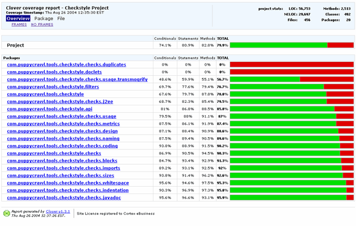
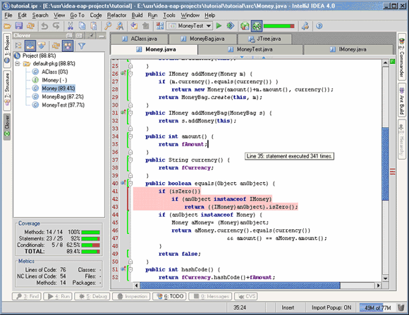
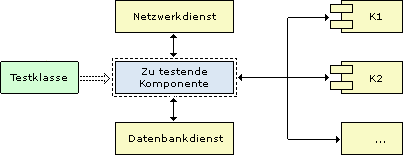
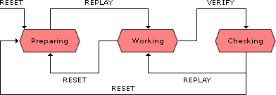
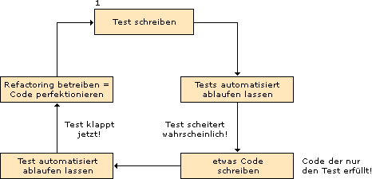
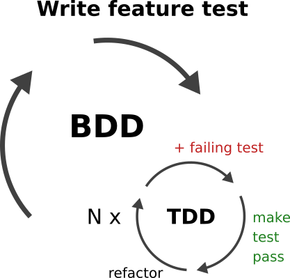

# TESTING

(C) Prof. Dr. Stefan Edlich

---

## OVERIVEW AND GOALS

One of the most important topics in software engineering is the quality assurance of the software being developed. A testing culture in larger software projects is essential. Automated test runs have become an integral part of continuous integration. Testing is carried out automatically and asynchronously across all test levels, independent of the developer's time.

**LEARNING GOALS**

> The aim of this learning unit is to introduce the way of thinking about testing and to get to know the corresponding tools that can sometimes make testing fun.

> It is important that you try out the testing tools yourself, at the same time make them your own and use them in practice! Force yourself to code test-first. This is an important experience that every software engineer should have.

**OUTLINE**

This learning unit contains the following topics:

* Basics and terms on the subject of testing
* Practical testing and tools
* Code Coverage
* Mock objects
* Test Driven Development (TDD)
* TIME SCOPE

TIME NEEDED: You will need around 120 minutes to work through the learning unit and around 60 minutes to complete the exercises.

---

## INTRODUCTION TO TESTING

Software quality is residing above (object-oriented) testing.

According to BALZERT, software Quality was defined back in 1998 as follows:

> **DEFINITION**: “Software quality is understood to mean the entirety of the characteristics and characteristic values of a software product that relate to its suitability to meet specified or assumed requirements.” BALZERT, H. (1998): Textbook of Software Engineering, Volume 2: Software Management, Software Quality Assurance. Heidelberg; Berlin; Oxford: Spectrum Academic Publishing

Software quality is difficult to define for a specific project and must be defined individually.

Quality features (criteria) that need to be defined are crucial. These define what the product must fulfill to ensure a certain quality. The degree of fulfillment of the quality characteristic is a metric for a specific indicator. There can also be levels of quality, so the goal is to achieve the highest possible levels of quality.

For example, software quality can refer to GUI design. The systematic and understandable presence of confirmation and cancel buttons in the application is just one example.

Pic: Example of confirmation and cancel buttons

> **NOTICE**: So try to determine in the early phases of the project **what quality means for your project** and how you will determine & measure it!

---

## MECHANISMS IN PROCESS MODELS

All modern process models take software quality into account.

It is certainly still known how software quality was addressed in the first learning units in the XP, Scrum or Kanban process models. In addition to the actual software quality, **process quality** is also addressed there, which is also very important in addition to pure software quality.

Examples of ensuring quality in the software process include iterative software development, code refactoring, code reviews or pair programming. The key element of this learning unit is the software test, which is implemented in the test methods code.

In addition, there are independent quality models such as: B. that of ISO/IEC 9126:

http://de.wikipedia.org/wiki/ISO/IEC_9126

The book Test Driven Development by KENT BECK  is also highly recommended on this topic.

> BECK, KENT (2003): Test Driven Development by Example. Addison-Wesley Signature Series, ISBN 0-321-14653-0

---

## SOFTWARE TESTING

> **DEFINITION**: Software testing is an automatic or manual process for verifying and validating a software program.

The aim of software testing is, on the one hand, to ensure and increase the quality of the program, thereby minimizing the **risk** of errors.

On the other hand, specific software testing is used to uncover specific errors in the code. These must then be **documented**. However, these should then be **reproduced** in order to be able to create a concrete **test case** for this error. Normally the error is only corrected afterwards!

This usually takes the form of **bug fixes** that can be managed in systems such as Github, Jira or Bugzilla. In a process model that takes error and quality management into account, errors usually need to be released or, in the case of critical errors, escalated.

In this case, releasing means that the error is first corrected and then checked by an independent person and released as solved. The point is that the author of the code does not “hack away” the error, but rather that it is properly documented, reproduced and tested.

Critical errors (perhaps analogous to a software error in a nuclear power plant) must be **escalated** constructively. This means that superiors must be informed and a set of rules that includes error management comes into force.

---

## TEST PLAN AND TEST LEVELS

**TEST PLAN**

Every test, every test procedure and every test concept must be planned. You have to allow enough time for the tests! This is often not taken into account, but can be worth it as removing defects in later phases can be much more expensive.

The tester should also be aware that you can only find the errors that you are looking for. This means that the troubleshooting should be very broad and contain a lot of test cases.

**TEST LEVELS**

Below we will explain in more detail what test granularities there can be. In addition to the pure software tests at the method level, the tests of the actual requirements must of course also be tested. When planning software testing, it is important to consider the levels that can be tested.

**IMPORTANT**

|Test Level|Test Procedures|
|:--------|:--------|
|module, class, method|module test, class test, unit tests|
|Component|Component tests|
|Layer (e.g. MVC)|Testing the subsystems|
|System world|Integration test|

Unit tests are often difficult to perform because components have **dependencies**. You can therefore work with mock objects here (see chapter **“Mock Objects”**). As an example, e.g. E.g. the legendary EJB components of version 2. These need a container to run. However, this is often difficult to integrate into a simple test.

But even simpler components may require network or database connections, which are often not available or are expensive. However, these can then easily be simulated using mock objects.

Of course, a big problem in companies is getting the **time** for testing and quality assurance (even in times where LLMs can generate the tests). Many products are then knitted with a hot needle, contain no or too few tests and are not built **sustainably** in many dimensions. It is important to be vigilant here and keep the quality flag high as a software engineer! 

---

## TEST PROCEDURES FOR SPECIFIC TEST LEVELS

Below we show all the important test procedures in the table below. These testing procedures are standard for software engineers in progressive companies, both conceptually and substantively.

|TEST PROCEDURE|DESCRIPTION|
|:--------|:--------|
|Acceptance tests, acceptance tests, functional tests, UI tests|Here the client is often asked to check whether the software meets their requirements. The software is more or less tried out live.|
|Unit Tests|Here the smallest unit of the object-oriented program (usually the signature of the methods) is tested|
|Boundary-Value Tests|Here the unit tests are designed so that they get extreme values (such as zero, 0, -MAX_INT, +MAX_INT, etc.).|
|Destruction tests, Crash Tests|These tests attempt to simulate inappropriate handling of the software. During the crash test, an attempt is made to cause the system to crash.|
|Stress tests, Load Tests|Exceptional situations are also simulated here. Usually this is e.g. B. the simulated access of tens of thousands of users to the program at the same time or the processing of a large number of transactions.|
|Installation Tests, Integration Tests|This checks whether the installations work or whether there are dependencies that prevent them. Do the components really work together correctly?|
|Regression Tests|Tests are carried out that attempt to reproduce errors that have already been fixed. This is very important in the further development of the software.|
|Random testing|A test based on the use of random data.|

Evolution of software also means evolution of quality assurance. Therefore, errors must not only be fixed, but also documented and tested in test cases. There are cases where the error is corrected, but then recurs later (in a different way) when the software is further developed. Therefore, catching errors in test cases is particularly important here.

---

## KNOWLEDGE OF THE TESTER ABOUT THE COMPONENT

The terms *black, white and gray box testing* below are important standards in software engineering. The table below explains the three variants.
|NAME|EXPLANATION|
|:---|:---|
|**BLACK BOX TESTS**|These tests are written by developers who have no knowledge of the content of the module being tested. The system under test is a black box that can only be viewed from the outside. It is then visible, for example: B. just a method signature or a GUI. Typically, black box testing finds many errors because the test developer thinks differently than the person who created the code being tested.|
|**WHITE BOX TESTS**|A white box test has knowledge of the internal processes of the component being tested. Usually this test is written by the same person. A well-known example is testing for a specific exception. A test is written here to see whether the component also delivers the correct exception when a null or special value is passed, for example.|
|**GRAY BOX TESTS**|This term comes from test-driven development. It is assumed that the test is developed first. The person writing the test only has a vague idea of what the later component will do.|

>NOTE FROM THE PRACTICE:  In good large companies, in addition to the development department, there is often also a **testing and quality assurance department**. There are already people who write tests without knowing the implementation.

Finally, it should be noted again that the automation of testing is playing an increasingly important role. This even applies to all areas: the **test specification**, the **test run** itself, the **test evaluation** and the **test documentation**. Today, tests can and must be generated many times (or at least the test hulls). The tests themselves are carried out automatically in build management. The test reports are then created automatically and aggregated to such an extent that test evaluation requires only minimal effort. In large projects, the results are usually displayed on large monitors with graphics or traffic lights.

---

## UNIT TESTING

The unit test is part of the software process (from the extreme programming). It is particularly important as a prerequisite for refactoring. After every change, program errors should be searched for by **automatically calling all test cases**.

A module can be a **class** whose signatures of its public (or protected) methods are to be tested here. So you test whether a correct/expected output is returned for all input of the methods.

In principle, **private** methods can also be tested – with suitable tools. However, there is sometimes controversy as to whether this makes sense. However, many software engineers are advocates of including private methods in the overall test (where it makes sense).

Of course this is all valid for functional languages.

---

## ASSERTIONS

Assertions are the smallest/lowest level of software testing, which unfortunately are all too often forgotten.

> **DEFINITION**: An assertion tests something in the code! There can therefore be many assertions in a code page. We define: pre-conditions, post-conditions and invatiants. The first two test data upon entry and exit from the function. And invariants test data in code!

Many programming languages have other terms for this, such as: B. verify.

> WEBSOURCE: There is a good overview of this for Java here at Oracle. In Java, the arguments -ae used to be used in the VM

Code for this could look like this:

  CODE
  public class Becks{

     public Object converter(String s, int age){
         assert s != null; // Precondition 1
         assert age > 0:age; // Pre-Condition 2
         // heavy coding
         assert s != null; // Invariant
         // heavy coding
         // e.g. B. append the number to the string
         assert s != null;
         return s; // Post condition
     }
  }

In this example, assertions are like small contracts/assurances, rules in code or MetaCode that check states. For example, they test variables like little **bombs** and explode (=throw an exception) if a condition is not correct. As in the code example here – the age of a person cannot be less than zero.

The intrinsic advantage of such a variant lies in the **locality**! The errors occur **exactly where they happen**. What you want to avoid is that e.g. E.g. a NULL is passed up endlessly through the calling stack/methods and then it pops. Then no one can see through it and understand exactly where the error occurred. Finding the error then costs a lot of money!

> Assertions
Assertions are the smallest/lowest level of software testing, which unfortunately are all too often forgotten.

DEFINITION
An assertion tests something in the code! There can therefore be many assertions in a code page. We define: pre-conditions, post-conditions and invatiants. The first two test data upon entry and exit from the function. And invariants test data in code!

Many programming languages have other terms for this, such as: B. verify.

WEBSOURCE
There is a good overview of this for Java here at Oracle. In Java, the arguments -ae used to be used in the VM

Code for this could look like this:

CODE
public class Becks{

     public Object converter(String s, int age){
         assert s != null; // Precondition 1
         assert age > 0:age; // Pre-Condition 2
         // heavy coding
         assert s != null; // Invariant
         // heavy coding
         // e.g. B. append the number to the string
         assert s != null;
         return s; // Post condition
     }
}
In this example, assertions are like small contracts/assurances, rules in code or MetaCode that check states. For example, they test variables like little bombs and explode (=throw an exception) if a condition is not correct. As in the code example here – the age of a person cannot be less than zero.

The intrinsic advantage of such a variant lies in the locality! The errors occur exactly where they happen. What you want to avoid is that e.g. E.g. a NULL is passed up endlessly through the calling stack/methods and then it pops. Then no one can see through it and understand exactly where the error occurred. Finding the error then costs a lot of money!

> NOTE: In the following Java testing frameworks, assert or assert* (like AssertEquals) is also the most common keyword for the actual testing processes!: 
In the following Java testing frameworks, assert or assert* (like AssertEquals) is also the most common keyword for the actual testing processes!

---

## EXAMPLE: JUNIT

JUnit was born from the idea of eXtreme programming and was developed by ERICH GAMMA and KENT BECK.

The program will not be described in more detail here. Useful information about JUnit can be found at junit.org as well as in all other languages with similar frameworks.

It is the most widely used testing tool that has been ported to almost all languages. There are so-called test runners who find all the tests, execute them and usually display the results graphically.

For version <4 the following applied:

* Test class `XXXTest` derives from `junit.framework`.TestCase
* The test method must be named `testYYY`

From version 4 onwards, annotations were used:

* `@Test` in front of the class
* `@Before, @After` → Code is executed before/after the test method
* `@BeforeClass, @AfterClas`s → Code is executed before/after the test class
* etc.

Annotations in Java are interfaces that are used here as markers. The test runners can find the annotations through the interface and start specific actions.

> **REMARK**: These before/after markups are important and exist in almost all languages and testing frameworks. With Before you usually create all the conditions for testing. So e.g. B. Create finals or variables that contain the test objects or e.g. B. Establish database or network connections. Once the test has been carried out, you have to clean up again. Variables can therefore be deleted or released manually (if this does not happen automatically) or static objects such as database or network connections can be released.

> EXAMPLE: Metadata can be included in the code using the `@` symbol. This was previously only possible via javadoc comments and had to be laborious using e.g. B. XDoclet can be further processed.

For each annotation - such as e.g. `@test` – there must be an interface. Then the compiler can check the annotation. The annotation can then be accessed using tools such as APT or directly from the program code.

This can only be exploited with testing tools. 

> So search for **videos / infos** how to insert junit tests in your language.

**UNIVERSAL LANGUAGE PRINCIPLES**

What general principles have we learned?

* Writing tests is **easy**! Especially since LLM helping to generate these...
* Many tests can be run at once. Bundles of tests are often called **test suites**. In the past, you could mark entire packages with  `*.test` (e.g. `de.edlich.math.test`). All test classes contained therein were then executed at once. Similar concepts of quantity labeling for test groups exist in many test libraries.
* There are methods to prepare and end the test (`setUp, tearDown, @Before, @After`, etc., ... similar in other languages)
* There are mostly either naming conventions to mark test methods or they are annotated.
* You get simple feedback for each test run. Either it worked, then nothing much happens, or the test failed and we get the stack trace, i.e. H. the call hierarchy from main to the method/location/line of code where the error occurred.
* The test runners mostly provide you with visual feedback with a red or green traffic light, which is quite helpful.

---

## TESTING USING OTHER LANGUAGES/FRAMEWORKS

Java may have been one of the pioneers here, but there are many other methods in other languages or other frameworks for testing.

> EXAMPLE There are other interesting test frameworks under Java itself, such as: B. **TestNG**.

> TestNG clearly goes beyond simple unit tests and is much better suited for integration tests. With TestNG you can transport dynamic content into the test classes much better (DataProviders, TestFactories).

> There are extremely flexible ways to configure the test, e.g. B. to form test groups, which is essential in enterprise environments. Grouping groups is also possible. TestNG delivers a detailed HTML report, which also goes very well with an Ant build. The @Before and @After semantics are even finer. The expected exception can be defined (as in JUnit 4 and 5). A probability of success can be specified for tests.

In other popular languages it works analogously.

**PYTHON**

In Python we write code like this for the unittest framework:

    import unittest
    
    class TestStringMethod(unittest.Testcase) # must be derived
     def test_upper(self):
        self.assertEqual("MAX", ... something that sould return "MAX" ...too)

Methods such as `assertEqual(), assertTrue(), assertFalse(), assertRaises(), setUp, tearDown()` are also available here.

**Go**

It looks similar in the increasingly popular Go language:

    import "testing" // "math" needed ...

    func TestAbs(t *testing.T) {
      got := Floor(3.14)
      if got != 1 {
        t.Errorf("Floor(-1) = %d; want 3", got)
     }
    }

Again, the semantics are that the Test keyword in front of the function is a signal for the test runner to call **all** corresponding functions.

**JavaScript**

There are also an infinite number of frameworks in JavaScript that have similar or different test semantics.

An example from the Jest Framework:

    test('adds 1 + 2 to equal 3', () => { expect(sum(1, 2)).toBe(3); });

So there is the keyword test again here, but the following content is more exciting:

* First there is a comment describing the test.
* Then follows a Clojure, i.e. H. an anonymous function () => {} containing the test.
* And finally, a small DSL (Domain Specific Language) that makes it easier to read the test with English words: expect, toBe

We tackle the last two topics, Clojures and DSLs, in the master's degree, as they are important topics in software engineering.

---

## TEST COVERAGE

**Test coverage** is the test coverage by test cases. Furthermore, the test coverage shows the **untested** code locations!

In practice, 80% test coverage is a desirable goal. High test coverage is now an important marketing tool and is playing an increasingly important role in awarding orders and product acceptance. There are now excellent tools (including free ones) that can automate the process of test coverage analysis and carry it out quite comprehensively.

> **TASK**: A lot helps a lot?

> *“High test coverage indicates high code quality!”*

> *“A test coverage of 100% should be aimed for!”*

> Would you agree with these statements? Briefly note down arguments that speak both for and against these statements. Discuss this with your lecturer!

You can find a good, in-depth introduction to the topic of code coverage on the Internet at http://www.bullseye.com/coverage.html

**Test coverage tools**

There are numerous test coverage tools online. You can find this for Java on the Internet at the address: https://en.wikipedia.org/wiki/Java_code_coverage_tools

Some of the most important tools are:

* Clover, (commercial), trial version available
* JaCoCo / Eclemma, open source
* Cobertura, open source

Other tools include:

* JaCoCo
* Quilt
* NoUnit
* Insect
* Hansel
* Jester
* JVMDI code coverage analysis
* Grobo
* jcoverage
* JBlanket

**Example: Clover**

> EXAMPLE: There are three types of measurement here:

> Statement coverage: Number of statements in a class

> Conditional Coverage: How conditional constructs such as if/else are traversed. Ideally, the test should cover everything.

> Method coverage: How many methods of a class are called.

**DEFINITION**

The total coverage comes from a more complex formula:

    TPC = (CT + CF + SC + MC) / (2*C + S + M)

with:

* CT = conditionals that evaluated to "true" at least once
* CF = conditionals that evaluated to "false" at least once
* SC = statements covered
* MC = methods entered

**Example reports with Clover**

The example below shows how you can analyze packages and display the corresponding percentage. You can then drill down further into each package.

Many tools are now so good that they can display the entire code in color. Then you can immediately see which **red spots you have forgotten**.

Pic: Package coverage

Pic: Code coverage

---

## MOCK OBJECTS

Translation programs provide the following explanation for mock objects: **dummy, fake, imitation, pseudo, appearance and deceive** - hence the term mock.

In too many cases it is not so easy to test a unit because the component has too many dependencies. It would therefore be desirable for the tests to have test objects that simulate a real environment for the component being tested. These objects are called **mock objects**. For example, this is an object that acts as if it were a database. This would then return some result sets, which, however, are not important for the actual test.

Tools like http://site.mockito.org (tip!), http://jmock.org or http://easymock.org make writing mock objects easier!

In the following, mock objects are sometimes also called MOs.

**The problem of dependencies**

Applying a test or test class to individual service components presents a problem. In most cases, service components depend on other components or services. (e.g. K1, K2, database services or network services)

Mock objects, on the other hand, can isolate the component under test and simulate a real environment. Then you can concentrate on the actual functionality to be tested!

Pic: Mock example

**Source & Idea**

There are various sources and ideas on the topic of mock objects.

You can find these in the text below.

* Papers by TIM MACKINNON, STEVE FREEMAN, PHILIP CRAIG “Endo Testing: Unit Testing with Mock Objects”

* Conference: “eXtreme Programming and Flexible Processes” in Software Engineering - XP2000

> QUOTE: “Once, said the mock turtle at last, with a deep sigh, I was a real turtle.” Alice in Wonderland, Lewis Carroll

**Technology and features**

Since Java 1.4 there are better options: With `java.lang.reflect.Proxy` you can create dynamic proxies that are based on interfaces. Almost all tools have add-ons that can also generate proxies for classes.

Simply empty mock objects that do their job silently are still not enough. Dynamic mock objects additionally support:

* Predefined return values
* Exceptions Result Chaining
* Parameter tracing
* Count and check the number of calls and order
* Generate default values

A distinction is made between **static** mock objects (can be generated as static code, for example) and **dynamic** mock objects - with proxies or aspect-oriented approaches.

Typical examples in Java are:

* http://www.easymock.org and
* http://www.jmock.org

**State machines of dynamic mock objects**

Dynamic mock objects have a similar functional scheme to a **cassette recorder** (hoping you still remember what that was ;-) ).

After a reset, a recording can be started. From Preparing to Working with Replay, then Verify checks whether what was recorded will actually be played back. This goes both ways.

This means that the mock objects can not only emulate the signature of method components - they also have intelligence, so that you can see whether the test actually used the **right method** - with the right arguments and the right return values - beforehand and then in the test test **has been played**.

Pic: State machines of dynamic mock objects

**A simple example**

The class to be tested, BusinessClass, is the class that e.g. B. should be tested with JUnit. However, it depends on another class called Collaborator which also has such an interface. As a result, BusinessClassTest is the name of the test class that tests the BusinessClass.

Pic: Testing the Class BusinessClass 

In the example below, the dependencies shown above are explained using a health insurance example. Furthermore, the implementation of the class to be tested (here health insurance company) and the test class (TestKrankenkasse) are illustrated, among other things.

> Ask the lecturer for a demo!

Mock objects are tools during the development phase or for real testing.

The programming style requires that the object under test obtain its dependent component dynamically. Via **setter, via factory, aspects or via IoC framework**! This not only promotes good design but also good JDepend metrics. However, these are topics for the other learning units.

And now the whole thing again with setter injection:

    public class Testklasse {
    public class BusinessClass2 {

    private Collaborator coll = null;

    public void setMock(Collaborator c){
        this.coll = c;  //Entweder mock oder etwas reales von Aussen
    }

    public int userClicksSaveDoc (String title){
        if (coll==null) // Wenn nichts da ist, dann default...
            coll = new CollaboratorClass();
        coll.storeDocument(title);   
        return title.length();  // Wir nehmen an, dass der Test OK ist,
                                // wenn die Abhaengigkeiten verfügbar sind
    }

    // Hier mal schnell zur Demonstration als inner class
    class CollaboratorClass implements Collaborator {
        public int storeDocument(String title){
            return title.length();
        }
      }
    }

---

## TEST DRIVEN DEVELOPMENT

> RULE: The idea of Test Driven Development is to write the test case first and then the component, whose test then already exists!

This idea of TDD also comes from **extreme programming** and became popular since the turn of the millennium.

So it starts with a **red bar** or a negative report, but this should be seen as positive. You immediately have a clear mandate as to what needs to be developed.

In extreme cases, there are few specifications or interfaces and the tests even point the way to what should actually be implemented.

So the first test always fails in Test Driven Development. With TDD you have incremental development with feedback from very specific tests.

Two effects of TDD are therefore very **important**:

* Writing the test is a great way to think about the interface! You almost have an architectural view of the object.  **DEFINITION**: This whole process has been called **red-green-refactor** since XP times. One idea here is to get the code running at the end = green, but not make it final yet! Then you have time to finalize it, but you are always monitored by tests that have to stay green! The goal here is not perfection, but rather to pick up speed like in a ping-pong game and be fast before perfection.

**Advantages and features**

TDD (Test Driven Development) promotes testing that is close to programming. These tests are automated and can be repeated as often as required and can be installed using the build tools (ant, gradle, etc.).

Testing with tools like JUnit or TestNG can even be fun. Fixing and finding bugs early is often much more cost-effective than finding the errors later.

> REMARK: A different thought process takes place for the developer as soon as he starts coding the tests. This has an impact on the creation of the code, which is then usually coded cleaner and more error-free by the developer than before.

---

## TDD OTHER AREAS

**AREAS ADJACENT TO TDD**

If we create tests according to this principle and speed is just as much the goal as better component design and lots of secure tests, then it becomes clear to us why the previously mentioned **mocking** is so important: We can only test quickly if we do it quickly be able to isolate the functionality to be tested; So you can quickly remove unpleasant dependencies of the component!

> REMARK: Another aspect that is often forgotten is that tests are also great documentation! The documentation of a software is often out of date. But a look at the tests also shows what we often threw in, or what extremes we threw in there. In this regard, tests are executable documentation!

Two other important areas come into play here (see explanation below):

* Behavior Driven Development (BDD) and
* The Acceptance Test Driven Development (ATDD).

Similar things happen here, just not at the code level, but at a higher level. And even these higher levels are often much better documentation for understanding what software/components/parts do.

So there can be two nested cycles that look like this:

Pic: BDD and TDD as large and small cycles

> TASK: RESEARCH: Tool research => This is where the appropriate tools come into play again

* Selenium, Cypress or Selenide for GUI testing
* Cucumber, JBehave or behave for Python

Please do your own **research**!

**Acceptance Test Driven Development**

The Driven Development acceptance test is basically about features, small use cases or requirements for the system at the highest level.

> EXAMPLE: Let's take an example here: In a **flight booking portal**, a *“feature”* or use case may be that the user must be able to search for flights. This is recorded in a system and development is completed. This is how the functionality is tested by the customer. If the customer successfully accepts this “feature”, this is marked and less important features are initially turned to.

> NOTICE: An “acceptance unit” can now consist of different behavioral parts (behavior, see next section). And these behaviors can be realized with many components that we have tested with TDD. In addition to the picture above, one can even speak of a three-fold nested hierarchy. `ATDD ∈ BDD ∈ TDD`!

**Behavior Driven Development**

Behavior Driven Development is about describing and processing certain parts that contain the behavior of a feature or use case. It was first described by DAN NORTH in 2003 and is also known as Specification Driven Development.

> EXAMPLE: The use case / the flight search feature ✈ can consist of different individual parts:

* Easy transition to flight search from all windows.
* Search button with simple filters
* Results display with filters
* Individual or bulk selection of results for further processing

All of these cases can be described by the behavior of the system.

* {Window A-N} ⇒ Search window display
* {Search button + filter} ⇒ Results display
* {Result display + filter} ⇒ Result display
* {Result display + selection} ⇒ Window M-Z

It is often described in a language that we have already learned about in the learning unit “OOD – (Object-Oriented) **Design”** in the chapter “**Domain-Driven Design** (DDD)”. 

So
* `Given X`
* `and Y and Z...`
* `If A`
* `Then B`

The idea is to describe processes or formal specifications or the behavior of the system in more detail. Once this is done, tools like JBehave, Fit / Fitnesse, or similar ones (which exist for all languages) can take over and, if necessary, monitor whether these quasi-logical statements are true. Therefore, the behavior is often recorded in Wikis, Excel, Word or HTML so that, like XML, it is still readable by humans and machines.

> NOTICE: By the way, development is often equated with additional testing. Companies often say that they do behavior driven development and mean that behavior driven testing is also included or meant.

> Furthermore, the **boundaries** between Acceptance DD / DT and Behavior DD / DT are **fluid** and the tools are often the same. It's just a question of the granularity of the specification, the behavior, the features!

**More TDD specific**

Another important factor is that TDD with lots of good tests ensures that debugging is done much less often. Firstly, we simply have a lot more tests and secondly, it is **much easier to find errors** if you look at which methods have not been tested with which input!

---

## SUMMARY

* For software quality, it is crucial that quality characteristics are defined by which the degree of fulfillment can be measured.
* Software testing is an automatic or manual process for verifying and validating a software program.
* In a process model that takes error and quality management into account, errors usually need to be released or, in the case of critical errors, escalated.
* There are different test procedures for specific test levels.
* Evolution of software also means evolution of quality assurance.
* The automation of testing is playing an increasingly important role, this applies to all areas - specification, test runs, evaluation and documentation.
* Code coverage refers to test coverage through test cases. In practice, a test coverage of 80% is desirable.
* Test objects that simulate a real environment for a component to be tested are called mock objects. * These can isolate the component under test and simulate a real environment.
* A distinction is made between static and dynamic mock objects. Mock objects are tools during the development phase or for real tests.
* In Test Driven Development (TDD), the first test always fails. TDD is incremental development, resulting from feedback from very specific tests.

---

## EXERCISE

You should now gain practical experience with testing!

1. **Test** your own project/code with JUnit (like we did with the calculator) or *Unit
2. Also test for an **exception**!
3. In **TDD mode**, develop or finalize the two test classes with test functions for counting characters to € and images. If you can think of a better/different example to first test a class with methods and then implement it, use this!
4. Write your own use case **mocking** up an unpleasant method! As in presence (code).
5. Apply **test coverage** to your code.

Important for all tasks: I reward your experiences and *not copy-internet / ChatGPT / LLMs & Co*!!

Processing time approx. 60 minutes.

