# REFACTORING

(C) Prof. Dr. Stefan Edlich

---

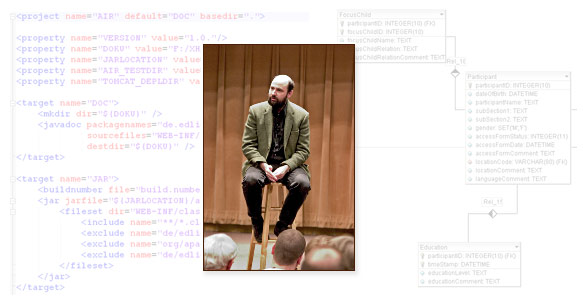

## INTRODUCTION

In this learning unit, the improving refactoring of code, “refactoring”; presented theoretically and practically.

We start with the history of refactoring and deal with program code / source code and its improvement. More important than learning about specific refactorings is developing a feeling for when code can be improved.

If this feeling has been developed through a lot of reading and practical work, then you should know the tools provided by modern development environments. Without this, even simple refactorings (such as renaming classes) can become a nightmare.

In a highly advanced stage of refactoring, you are then able to improve existing code so that design patterns can be integrated.

**LEARNING GOALS**

* Understand refactoring theory
* Identify bad code smells
* Apply refactorings under Eclipse or other IDE
* Know the refactoring catalog
* Know the limits of refactoring

**OUTLINE**
* Introduction to the topic of refactoring
* Literature REF
* Definitions and terms used
* Refactoring theory
* Refactorings
* Refactoring patterns

> Time needed: You will need approximately 120 minutes to complete this learning unit and 60 minutes to complete the exercises.

---

## REFACTORING

The term *refactoring* was first used in this context in 1990 in a paper by PALPH JOHNSON and WILLIAM OPDYKE: 

> QUOTE: “Refactoring: An aid in designing application frameworks and evolving object-oriented systems” Palph Johnson and William Opdyke

OPDYKE received his doctorate in 1992 on the subject of refactoring.

Back then, JOHNSON and OPDYKE wrote about a software refactory that makes it easier to redesign software programs. So the “re-factoring”.

“Factoring” means “factoring” and comes from mathematics (polynomial factorization) and economics, in which it is also understood as the purchase of receivables. But the term in software technology has nothing to do with that.

> NOTICE: In this learning unit, the term will be defined in more detail, but it can already be said that refactoring redesigns and improves the existing program code, but the functionality remains unchanged.

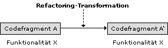

Pic: Refactoring transformation

If you are curious and would like to see a concrete refactoring, we recommend reading the “Refactorings” chapter in the back. A short hop back and forth is definitely welcome!

---

## REFERENCES

The research area of refactoring is still quite young, so there is not a lot of literature on this topic. However, this topic has received a boost (also thanks to MARTIN FOWLER), so that some good quality publications are available:

> Annotated bibliography http://www.refactoring.com

The refactoring page initiated by FOWLER is something like the central information page about refactoring. There is a ton of information and links to be found here. The most important is the “Catalog” subpage, which we will refer to several times.

 > Refactoring techniques https://refactoring.guru/refactoring/techniques

Similar in structure and also interesting.

> Fowler, Martin, Kent Beck, John Brant, William Opdyke, Don Roberts (1999): **Refactoring: Improving the Design of Existing Code**, Addison-Wesley Professional, ISBN 0201485672

A highly recommended classic. Any serious software engineer or software developer should definitely consider purchasing this book. Even when you browse around, you can always find good information, even after years. This book is also available in German under ISBN 3827316308.

> Kerievsky, Joshua (2004): Refactoring to Patterns, Addison-Wesley Professional, ISBN 0321213351

Also a highly recommended classic and standard work for serious software engineers or software developers.

> Wake, William C. (2003): Refactoring Workbook, Addison-Wesley Professional, ISBN 0321109295

The workbook on the topic of refactoring.

> Martin, Robert C. (2008): Clean Code: A Handbook of Agile Software;
Craftsmanship. Prentice Hall, ISBN-13: 978-0132350884

> Roock; Lippert; Stockfleth (2006): Refactoring in Large Software Projects:
Performing Complex Restructurings Successfully. Wiley & Sons, ISBN-13: 978-0470858929

Other literature

> Scott W. Ambler, Pramod J. Sandalage “Refactoring Databases,” Addison-Wesley 2006

---

## DEFINITIONS AND TERMS USED

Important goals are usually pursued when redesigning the program code:

**Readability**

The readability of the source text should be improved.
The programmer or other people who have to work their way into the source code should understand the source code better. This means that the code becomes more maintainable and can be handled more quickly overall. Changes regarding readability affect e.g. B. naming or hiding details.

**Understandability**

The reference to readability implies that the code becomes understandable more quickly. Even with perfect variable names and method names, the code can be far too long and disorganized. Understandability also implies that, in addition to the pure readability of the code, the developer's entire intention becomes transparent.

**Clarity**

For example, code that is broken down into meaningful code fragments and contains clear and unambiguous methods contributes to the clarity of the project.

***Redundancies***

These can be avoided by, for example, storing the same code fragments in just one method. This can also be moved to the super class. Freedom from redundancy is an important requirement of efficient programming, as changes to different code locations easily cause errors.

**Extensibility**

Code that has been cleanly improved according to the principles of refactoring is easier to extend. For example, if the strategy pattern has been incorporated into a chess program via refactoring, the code can easily be expanded to include a new chess engine that calculates differently.

**Modularity**

Long spaghetti code is known from the old Basic days. Refactoring also comes into play here and tries to optimally modularize the code. This also has an impact on expandability and testability.

**Testability**

> Important: In general, this is about being able to perform better tests. Specifically, these are usually unit tests. Of course, regression tests play an important role in these tests, as they prove that the code behaves in the same way afterwards. It would be fatal if a refactoring were carried out with good intentions but the behavior changed in an undesirable direction!

Object-oriented programming paradigms are very important for professional refactoring. Many refactorings work with patterns, superclasses and polymorphism, all concepts that are inconceivable without a modern object-oriented programming language.

It is also very interesting to see that many refactorings can be extremely complex and change-intensive. Therefore, support from IDEs is essential. Modern Java IDEs such as intelliJ IDEA (which were and are pioneers in the area of refactoring), Eclipse or JBuilder therefore provide good refactoring support.

In conclusion, refactoring is an extremely important part of software redesign these days. All too often, source code has to be rewritten in projects. In this case, the developer should have experience with refactorings and know the corresponding “refactoring patterns” well. Refactoring is often part of the development cycle like in test-driven development (Kent Beck) or can even be found in many process models. This used to be part of a code-remote “re-design”. Today, “refactoring” is an established procedure for code-related improvements.

---

## REFACTORING THEORY

In times of lean project budgets and project margins, it is important to be able to react quickly to changes. This includes both design changes and code changes, such as new features. If the refactoring is professionally supported by the know-how and the IDE used, these are important competitive advantages.

Another goal of refactoring is to integrate design patterns into the code. This topic will be discussed in more detail in the later chapters. The need for the use of patterns often only arises during development and cannot always be foreseen in the design. The need for a facade (class accesses too complex), a proxy (tasks have to be placed in front of them) or observer (here even more classes are interested in changing the state of the GUI variables) often arises during coding when architectural changes need to be made. However, integrating these requires a lot of experience.

> **NOTICE**: The term refactoring mostly applies to OO code, but not always. When it comes to targeted and scientifically based changes, we now don't talk about OO code fragments but rather about refactoring. In principle, everything can of course be refactored (script languages, XML code, etc.). However, practice and literature almost always refer to OO languages.

The best-known examples in the literature where refactoring is mentioned or even IDE support is present are Ant files and database schemas.

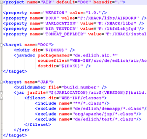

Pic: Extract of the Ant file

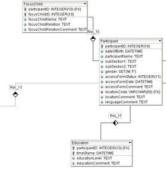

Pic: Extract from the DB schema

Ant build scripts can become large and confusing and database schemas are often inefficient. In many projects, DB schemas get a redesign/refactoring from a professional and the application is suddenly much faster.
ancient tools [JRefactory](https://jrefactory.sourceforge.net/) (Sourceforge project) and [RefactorIT](https://www.refactorit.eu/), there are two IDE-independent Java tools that support refactoring. Some can be integrated into IDEs and offer interesting additional features such as code analysis and refactoring suggestions.

The key point of the extremely important tool support is that A) many refactorings are almost impossible without tools and B) the IDE is important to simply be careful with certain refactorings.

> EXAMPLE A) One of the simplest refactorings is renaming names in the code. Imagine it's about a class that is referenced 42 times in the project. Manual work is impossible here!

> EXAMPLE B) Many refactorings redesign things in a class. Modern IDEs think for themselves and also change the interface!

---

## RISKS AND HANDLING

The refactoring itself is not without risk and should therefore be evaluated critically. Refactoring can cause errors. Another problem is the scope of refactoring, which will be discussed again at the end.

In order to avoid errors during refactoring, the literature often emphasizes that refactorings are only applied to error-free code. Only then is there a proper cycle: correct code → refactoring → (still) correct code. This is the only way to always be on the safe side.

However, it is not clear why refactorings cannot also transform incorrect code into correct code.

> **IMPORTANT**: It is extremely important that unit tests prove the correctness of the refactoring. A series of unit tests should be integrated into the general build cycle (see also the “Continuous Integration” chapter from the “BUI – Build Management” learning unit) and these should ensure correctness before and after refactoring.

A good tip is also to proceed in small steps. This means that even small changes must always be secured via JUnit. This results in less destruction and an easier fallback. Complex refactorings, e.g. B. the design or patterns can also be broken down into smaller units.

> NOTICE: Finally, it should be noted that when refactoring it is important to have solid ground under your feet! This means, for example, the use of UnDo and a version control system. These two tools provide best security when refactoring!

Many IDEs can apply an UnDo to every refactoring (which can sometimes be a very complex operation). Can your IDE do this?

A version control system as git makes it possible to eliminate refactoring errors that are discovered late. So make sure you always work with a version control system. Installing a Subversion server locally and installing Subclipse takes less than half an hour.

---

## THE REFACTORING “SMELL” 

> Question: What exactly is the problem that refactoring solves?

> Answer: "So far it has been said that refactoring improves code. So it's usually the case that the code may not be directly broken, but it is bad in some way. Maybe it's poorly designed. The definition of this bad code will be discussed below. The term “smell” has become established in English-language literature. So source code has a “bad smell”. Our aim is therefore to define and recognize this. We will get to know many “refactoring patterns” later on, which is of course important. However, it is almost even more important to identify the problems in the code, i.e. H. recognizing the “bad smell” than memorizing hundreds of patterns!"

The refactoring “smell” is present when the following situations exist:

**Duplicated code**

Duplicated code is usually caused by copy and paste and is therefore one of the main sources of errors in development. There are therefore tools that search for copy and paste code! Even if the code wasn't copied, it's usually a problem if it occurs multiple times. Changes in this code must then also be carried out in the other code location. It is not very likely that all code fragments will always be edited correctly.

**Long methods**

The problem is known to developers: What was previously in comments in the method is now being programmed out, so that the method becomes longer and longer. And the more you write, the clearer it becomes that an outsider would be less and less likely to understand this method. Is it possible to test the large number of code fragments that are addressed in this method in a more meaningful way?

**Large classes**

This also applies to large classes that become too cumbersome and thus hinder work. Typical representatives here are also GUI classes, which can successfully destroy any UML diagram with their hundreds of meaningless attributes.

**Long parameter lists**

Methods that are overcrowded with parameters also leave a questionable impression. In addition to the bad smell of this signature, you can also usually smell a possible solution, such as encapsulating the transfer data in a transfer object. More on solving such problems later.

> EXAMPLE => **Divergent changes**: MARTIN FOWLER describes in [Fo99] a phenomenon that arises when you introduce variations into a program: you integrate access to a new database or a new financial instrument and each time you have to change a lot of methods in different classes, which is cumbersome. As time goes on, you come to the conclusion that it would be better to handle variations in just one class so that changes can be treated as parameters.

**envy**

This apt term describes the condition in which, for example, a method X of class A is more interested in the data M of class B than in its own data (of class A). Apparently the division of methods and attributes is not very well chosen and requires some changes.

**Too many elementary data types**

Elementary data types are used too often when using encapsulating objects would be more appropriate.

Other possible causes for the “smell” can be clumps of data, switch commands (better polymorphism) and incorrect inheritance hierarchies. The examples presented here and other detailed examples can be found in Fowlers book.

---

## SEARCH AND REFERENCES TO REFACTORING NEEDS

What occurs when the code is poorly designed and what can be done to get more clues about refactorings?

* If more and more time is spent worrying about code that has already been written, it may be an indication that it is not well designed and needs to be refactored.

* In all somewhat extensive projects, you should take a look at the current UML diagram at regular intervals - it's best to print it out regularly and stick it on the wall! As you gain more experience, you notice special things, such as classes that are too full or strange inheritance hierarchies.

* Code analysis **metrics** such as JDepend, described in later lessons, provide clear evidence of poor design. JDepend shows class dependencies, cycles and measures of the abstractness of the code, etc., which can be improved by the following refactoring methods or by introducing design patterns.

---

## REFACTORINGS

> DEFINITION => **Refactoring patterns** The core element of refactoring are so-called refactoring patterns. These are used similarly to design patterns to improve the code. A refactoring pattern is the transformation of the code described at the beginning and usually consists of several work steps. The work steps are often carried out by the IDE. The developer therefore only has to decide which code fragments he wants to apply the pattern to.

MARTIN FOWLER did the work of cataloging the refactorings. He was supported by the community, so many refactorings came from other developers. This catalog can be found at http://www.refactoring.com/catalog and contains all listed refactorings!

Many of the refactorings listed there are deliberately kept **independent** of programming languages. However, if code needs to be used for illustration, it will be in a Java or C# dialect.

> IMPORTANT NOTE: A catalog always has the right to be complete. This also means that many refactorings don't make much sense subjectively. It could just as well be that the interested reader cannot understand some refactorings at all or will never want to use them. This is completely fine. It is important to know the spectrum. Maybe you're more likely to embrace the 10-20 most important refactorings and let his IDE help you with that.

In the following, IDE support is often discussed and Eclipse's refactoring capabilities are explained as an old example. Fortunately, the catalog of refactoring support is sufficiently abstract that IDEs such as Eclipse, JBuilder, Netbeans or IntelliJ IDEA do not differ much.

> NOTICE: Eclipse 3.1 has 31 refactorings. Here are the most important ones:

* `Rename, Move, Change Method Signature, (Undo, Redo)`
* `Convert Anonymous Class to Nested, Convert Nested Type to Top Level`
* `Push down, pull up`
* `Extract interface`
* `Use Supertype Where Possible`
* `Inline,Extract Method`
* `Extract Local Variable, Extract Constant`
* `Convert Local Variable to Field, Encapsulate Field`

Since the refactorings mentioned are among the most important, the following procedure is recommended:

* Please read through and understand how it works on the following pages or in the **Fowler catalogue**.
* Then try it out with your own IDE and test the refactoring pattern, i.e. H. to “warm up” with him.

---

## PROBLEM AND CURE

Before some examples of refactorings (also under Eclipse) are presented in more detail, it is helpful to have a guide to hand that names the “smell” and the associated possible “cure”. This last reference from [Fo99] can only serve as a rough guide here. Without a detailed description of the smell from [Fo99] it is not easy to identify the problems listed below on the left.

In any case, it is helpful to be able to imagine the problems listed on the left in advance. As a result, the solutions on the right side of the previous refactoring overview page can be quickly found and opened.

|odor / “smell”|refactoring / possible solution|
|--------|--------|
|Rename alternative classes with different interfaces|rename method, move method|
|rejected inheritance|replace inheritance with delegation|
|data classes|encapsulate collection, encapsulate field, ove method|
|Chunk of data|pass entire object, extract class, introduce parameter object|
|diverging changes|extract class|
|duplicate code|extract class, extract method, move method up, form template method|
|lazy class|flatten hierarchy, integrate class|
|large class|extract class, extract interface, extract subclass, replace value with object
|comments|extract method, introduce assurance|
|long method|decompose condition, replace method with method object, extract method, replace temporary variable with query|
|long parameter list|pass entire object, replace parameter with method, introduce parameter object|
|message chains|hide delegation|
|envy|move field, extract method, move method|
|bias for elementary types|replace array with object, extract class, introduce parameter object, replace type code with class, replace type keys with subclasses, replace type code with status/strategy, replace value with object|
|parallel inheritance hierarchies|move field, move method|
|Remove shotgun pellets (*1)|move field, integrate class, move method|
|speculative generality|flatten hierarchy, integrate class, rename method, remove parameters|
|switch commands|replace conditional expression with polymorphism, introduce null object, replace parameters with explicit methods, replace type keys with subclasses, replace type code with status/strategy|
|temporary fields|extract class, introduce null object|
|inappropriate intimacy|replace bidirectional association with directional one, hide delegation, move field, move method, replace inheritance with delegation|
|incomplete library class|introduce foreign method, introduce local extension|
|intermediaries|replace delegation with inheritance, integrate method, remove intermediaries|

What is quite interesting about this table is that **comments** (or too many comments) can also have a negative “smell” and in this case can be replaced by a simpler, explanatory method or by a clearly readable assurance. Comments can therefore also be part of a refactoring improvement.

It is always interesting and almost a sport for software engineers to examine the **switch** commands. Since many switch commands can be replaced by more elegant constructs - such as exploiting **polymorphism** - there is something disreputable about the switch command. The sport now is to find a better variant.

What did FOWLER mean by shotgun pellets?

> NOTICE (*1): **Shotgun pellets**

> Suppose you make a change (D1) somewhere in the code. As a result of this change - which you have already done several times - you also have to make changes / adjustments in other places in other classes (D2 to DN).

> The suspicion arises that you could group all the places where you make changes (D1...DN) into one class. The places where further changes are required were described by MARTIN FOWLER as shotgun pellets, which sit “painfully” in the body.

---

## REFACTORING UNDER ECLIPSE

With Eclipse, refactoring support is easily accessible via the right-click menu. It should be noted that the menu is context-sensitive - that is, it depends on what is currently selected (class, method, attributes, code fragment, etc.).

> NOTICE: It is therefore always worthwhile to mark different areas with the right mouse button and have a look what is offered!

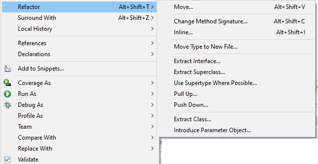

Pic: EclipseRefactoring.png

---

## REFACTORING PATTERNS

In this chapter, some refactorings and some examples from the refactoring catalog are explained in order to gain a practical approach to the subject of refactoring.

However, there is no substitute for experimenting yourself using your / the best IDE!

---

## EXTRACT METHOD

Extract Method extracts smaller ones from a larger method. This has the effect of making the resulting code more readable and testable. But the other goals from the “ANA – Analysis” learning unit in the “Corporate Goals” chapter can also have a positive effect here.

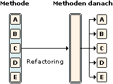

Pic: Extract Method Example

**Calculating a mortgage**

For example, if a mortgage is to be calculated in one method, the following tasks can also be carried out in one method:

* Extract master data
* Get loan amount, annual interest, repayment, special repayment
* Calculate monthly rate
* Calculate the term until it is fully repaid
* Interest payments made during this period
* Total expense for the loan
* Create financial PDF for every single year

However, it is immediately obvious that dividing it into smaller units makes sense:

**Mortgage processing method**

    ... getMaster Data(...)
    ... addFinancialData(...)
    ... calcMonthRare(...)
    ... calcTimeToFinish(...)
    ... calcInterest4Period(...)
    ...calcTotalExpense(...)
    ... createPDF4EachYear(...)

Such a method should be much easier to read than in the case where the method does everything itself. And even if the methods shown here may be private to a class, they can easily be tested using suitable tools (see the learning unit “TEST – Object-Oriented Testing and Test-Driven Development” in the chapter “Test procedures for specific test levels”).

For the sake of accuracy, it should be noted that the methods shown above may address different layers or areas of responsibility. This means that a refactoring is in order anyway, which might even extract classes here, e.g. B. I/O classes for data input and data output such as the PDF report!

MARTIN FOWLER [Fo99] shows an even simpler example:

**Source code before**

    printOwing(double amount) {
      printBanner();
      //print details
      System.out.println("name:" + _name);
      System.out.println("name:" + _name);
    }

Source code later

    printOwing(double amount) {
      printBanner();
      void printdetails(amount);
    }

Source code

    void printDetails(double amount) {
      System.out.println("name:" + _name);
      System.out.println("name:" + _name);
    }

This example seems almost too trivial to be useful. Why should I put two ridiculous print commands into one method with extra effort? That even costs running time!

Nevertheless, the example shows what is at stake. The source code becomes more readable afterwards. If additional output needs to be added, this can be done locally without affecting printOwing. PrintDetails can also be tested better with more complex methods. You can printDetails e.g. B. also provided with aspects.

If you think about it longer, you will find further advantages.

For all these reasons, **Extract Method** is certainly one of the most important refactorings supported by any IDE (that deserves the name IDE).

**IMPORTANT**: However, caution is advised for several reasons:

* What happens to method local variables that are contained in the code segment that you have marked in the IDE? This problem is also recognized and described by Martin Fowler.

**Solution**: These may have to be passed as parameters. This is easy if these variables are only used for reading purposes. It becomes more difficult if these are also changed! Then you would have to submit the results again. Here you have to take a close look to see whether you are entering into a “battle” with variables that could possibly be lost. It's still good that IDEs can also provide support in defining the variables!

* Even more annoying are code sections that e.g. B. encapsulate a return in an if (there are weaknesses in FOWLER here that he himself doesn't mention). A refactoring would completely distort the meaning here, even if all variables were handled correctly! Where should the submethod jump to? Back into the main method? That wasn't the point. An annoying solution here might just be to put the call to the submethod via a bool into an if with return. But maybe there are even better solution suggestions from you!
Fortunately, most IDEs warn in advance - here Eclipse 3.1.

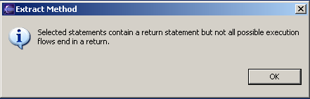

Pic: Warning notice in Eclipse

---

## INLINE METHOD

> DEFINITION: The inline method is the inverse operation of the extract method. In certain cases, the overhead of a method call is not appropriate for readability reasons. In this case, the contents of the method are integrated back into its call. In almost all cases, the reason for calling inline is not performance but rather readability.

**Source code before**

    1 int getRating() {
    2 return ( moreThanFiveLateDeliveries() ) ? 2:1;
    3 }
    4
    5 boolean moreThanFiveDeliveries()
    6 return _numberOfLateDeliveries > 5;
    7 }

**Source code later**

    1 int getRating() {
    2 return (_numberOfLateDeliveries > 5) ? 2:1;
    3 }

As you can see, the `moreThanFiveLateDeliveries` method does not provide any added value because it basically just encapsulates a member variable that has the same name.

The inline refactoring itself cannot only be applied to methods. There are two other applications listed in the refactoring catalog:

**Inline Temp** eliminates a (possibly even previously) temporary variable and replaces it with its assignment:
    double basePrice = anOrder.basePrice();
    return (basePrice > 1000)

Then it becomes easy:

    return (anOrder.basePrice() > 1000)

Obviously, not much changes here in terms of readability, testability, refactorability, etc.

**Inline Class** merges a – possibly – unnecessary class with another class.

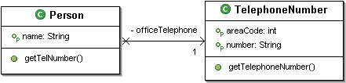

Pic: ClassPerson

becomes

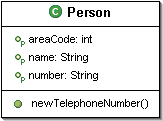

Pic: Inline class

This refactoring is more commonly seen after modeling class diagrams when modeling without attributes and methods. Many classes are then so “thin” that they can be integrated into other classes.

---

## TRIVIAL REFACTORINGS

The following refactorings are not particularly architecturally demanding, but are still extremely important.

**Undo**:
It sounds incredible, but the UnDo function should also be able to undo the last refactoring. Can your IDE do this?

> Question: 
Why is UnDo also a refactoring and why is it so important?

**Answer**: In the literature, UnDo is sometimes included as a refactoring pattern, although it may not be one. It's just a function or a type of pattern to transactionally process all last actions and undo them if necessary.

UnDo is important because there are some refactorings that affect a lot of code and files. The author knows of examples (e.g. with a simple rename of a class method (which is again a dubious refactoring)) where hundreds of code passages and dozens of files are changed. But if you made mistakes during this refactoring or the refactoring is unfavorable, then It is virtually impossible to "undo" by "manually". Here you need an undo. If this is missing, then hopefully a good version management system was used regularly (see the learning unit "DVC - Version and Error Management"), which provides a secure base.

**Redo**:

It was determined that deleting the UnDo of the last refactoring was a mistake and that the refactoring is needed and would now like to have it back.

**Rename**:

Renaming classes, methods, attributes, etc. is also part of the Refatoring catalog and probably the most used. The point here is that renaming cannot be done “by hand” or at the file system level. It starts with the similarity of file and class names within Java, which therefore needs to be taken into account. But since a method can be referenced (or will be, according to Murphy) hundreds of times elsewhere, no one wants to change this by hand. Here everyone is grateful for the machine (=IDE) that takes on this Sisyphean task.

**Move**:

Moving classes (between packages), methods, attributes, etc. is not always easy to do by hand, which is why all good IDEs support this process.

**Change method signature**:
This refactoring changes the method signature in the definition and in all calls.

---

## EXTRACT INTERFACE

> DEFINITION => Extract interface: Creates an interface from the current class. Furthermore, the original class is changed so that this class now implements this newly created interface.

**IMPORTANT**: It is also important here to change all references! This is actually the most important task of this refactoring. All classes that previously referenced the class now implement against interfaces, which usually makes a lot of sense.

Unfortunately, many IDEs have different behavior here: Eclipse, for example, does not include the existing method signatures in the interface. This is actually what you want and you don't want to do it by hand. A default and then deleting methods might be easier.

The refactoring catalog also has an extract package http://www.refactoring.com.

> GERARD M. DAVIDSON writes: “A package either has too many classes to be understandable or it smells confusing / mixed up”

Everyone has probably seen the “smells” when browsing packages: as e.g. java.io with 83 classes in old Java 1.5 times...

--- 

## MORE REFACTORINGS

**Pull Up/Push Down**

Moves fields and methods between class and superclass.

This refactoring is applicable to one or more elements.

> NOTICE: In almost all IDEs, the variables have to be marked correctly with the mouse, otherwise this refactoring cannot be carried out properly automatically.

**EXAMPLE**

Super class money

In a well-known example by KENT BECK [BK03], the classes Dollar and Franc are enriched by a super class Money. Then it is clear that duplicate methods such as the well-known equals() must be raised to eliminate duplicates.

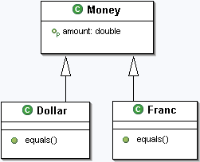

Pic: Pull up

**Encapsulate Field**

Sets the visibility of an attribute to private and adds getter and setter.

A refactoring feature that has long been known from UML modeling tools, but is very useful in an IDE.

> **EXAMPLE**: Notification when a class changes

In an application, a field was previously public. Now other classes should be notified when this class changes:

    public void setNice(int nice) {
      System.out.println("What's interesting is: " + nice);
      this.nice = nice;
    
    // Make "nice" known (java.util.Observable)
      setChanged();
      notifyObservers();
    }

**Convert Local Variable to Field**

Elevates a local variable to the status of a class variable.

This is often the case when the content of this variable can be usefully used in other methods. A practical example has already been shown in Extract Method.

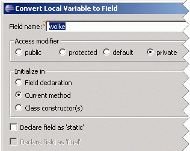

Pic: Convert Field

---

## WEAK REFACTORINGS

Before we finally look at two classic refactoring examples, here are two less important refactorings that are more reminiscent of source code changes. Therefore, these refactorings are more likely to be found in IDEs and less in the “holy” refactoring catalogs.

What is interesting is that the refactoring **spectrum** ranges from small source code manipulation to complex refactorings, such as “weaving” design patterns into an existing architecture.

**Introduce parameters**

An expression is replaced by a parameter. All other methods calling this method are modified to include the expression 22*getTickRate() as a parameter.

    public int experience() {
      int a = 22*getTickRate();
      return processTickRate(a);
    }
The replacement in the source method is then:

    public int experience(int magicNumber) {
      int a = magicNumber;
      return processTickRate(a);
    }

A calling method

    private void doSomething(){experience();}

would then too

    private void doSomething(){experience(22*getTickRate());}

be changed, i.e. H. the expression would be passed itself. This refactoring is also used here to increase readability.

**Extract Local Variable**

If the expression is not intended to be a parameter, but simply a local variable, this refactoring helps. It is very reminiscent of Extract Variable http://www.refactoring.com from MARTIN FOWLER's pattern catalog.

Source code before

    if ( (platform.toUpperCase().indexOf("MAC") > -1) &&
      (browser.toUpperCase().indexOf("IE") > -1) &&
      wasInitialized() && resize > 0 )
    { // do something
    }
becomes:

Source code later

    final boolean isMacOs = platform.toUpperCase().indexOf("MAC") > -1;
    final boolean isIEBrowser = browser.toUpperCase().indexOf("IE") > -1;
    final boolean wasResized = resize > 0;
    if (isMacOs && isIEBrowser && wasInitialized() && wasResized) {
      // do something
    }

Again, the code becomes more readable because most code readers will only read the line in the if and will simply “believe” the definitions.

**Extract Constant**

Here a local constant is turned into a class attribute, which can optionally also be declared as static final (e.g. for pi).

**Use Supertype where Possible**

Helps when trying to use the superclass type instead of a type. This can always be useful, especially when exploiting polymorphism properties.

---

## ARCHITECTURE REFACTORINGS AND EXPLANATORY REFACTORINGS

A large part of the refactorings in the catalog are architecture refactorings, which usually change or move class structures or parts of class diagrams.

**Architecture refactoring example**

A classic example is Collapse Hierarchy and is similar to the inline class refactoring from Eclipse discussed at the beginning. Here the superclass and the subclass do not show much difference and are small enough to merge.

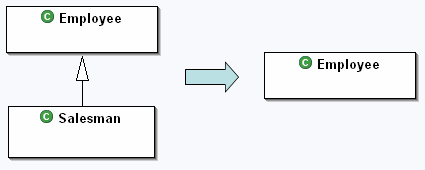

Pic: Collapse Hierarchy

And so perhaps the Salesman lives on only as an attribute in Employee.

However, a lot of refactorings are explanatory. While on the previous pages z. For example, once an explanatory temporary local variable has been introduced, one might as well introduce an explanatory method. So e.g. B. Decompose Conditional

    if (date.before (SUMMER_START) || date.after(SUMMER_END))
      charge = quantity * _winterRate + _winterServiceCharge;
    else charge = quantity * _summerRate;

becomes

    if (notSummer(date))
      batch = winterCharge(quantity);
    else charge = summerCharge(quantity);

This is not an extract method because no existing pieces of code can be excised, but it appears to be similar because of explanatory replacement and simplification.

---

## CONCLUSION

* Refactoring patterns have now become an important and indispensable tool in software development. This is especially true for all cycles similar to TDD (Test Driven Development). Refactoring is also an integral part of XP and all agile software engineering methods in order to get closer to the final goal as quickly as possible with an early prototype.

* With today's extreme cost pressure, it is therefore imperative to be able to adapt quickly and change the code or its architecture.

> **IMPORTANT** It is important not to use refactoring blindly, but to constantly think about its success or performance: Does the refactoring reach all documents? Do they achieve descriptors? All XML files? What happens if I rename an important method, but unfortunately it is referenced via JNDI in the ejb-jar.xml? So it's a question of the scope of the refactoring!

Such cases are particularly bad because they may only be detected late in integration tests and are therefore particularly expensive! Therefore, all files that are not in the source tree or JavaDocs or other meta information must be taken into account.

Fortunately, most refactorings in small projects are relatively harmless and only have local effects.

Thanks to modern IDEs, many complex refactorings have now been demystified. So it's always worth looking into the IDE's refactoring features.

---

## EXERCISE

> Check out all the refactorings of Martin Fowler's catalog: http://www.refactoring.com/catalog

* Play with some of the Fowler refactorings and try them out documented in the IDE.

* Write something very briefly about A) 1-2 refactorings that particularly impressed you and B) about one that you think is unnecessary and C) one that you didn't understand! (this refers to the Fowler catalog)

* Create at least one non-trivial code example of your own that shows the “before and after” state.

Processing time: 40 minutes