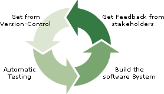
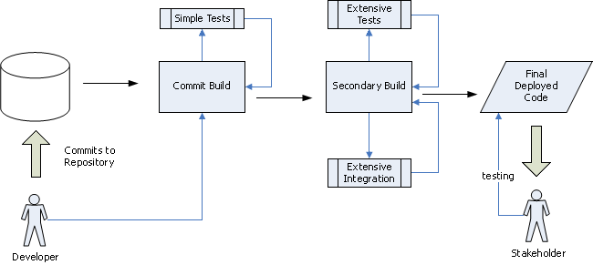
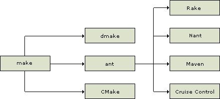
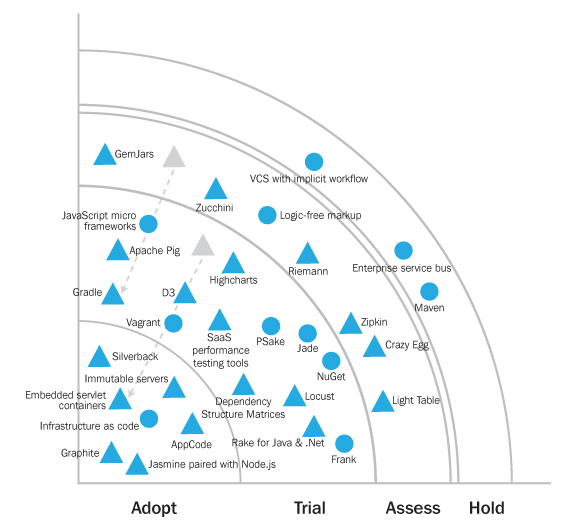

# BUILDMANAGEMENT

(C) Prof. Dr. Stefan Edlich

---

**LEARNING GOALS**

This learning unit describes the function of build management. The aim is to be able to use build management practically and assess its importance within the software life cycle.

* Get to know the historical origins and the make tool as well as some make derivatives
* Classification in the development cycle 
Introduction and practical use of some basic tools

> Note that this unit is always seen in confunction with the CI/CD unit.

---

## BUILD MANAGEMENT AND CONTINUOUS INTEGRATION

In addition to error, configuration, version and release management, the management tasks in the software development process also include build management.

The first build management tools emerged in the 1980s, which often only contained a few files to be compiled. A decade later, software systems became significantly **larger**.

In addition, the **dependencies** of the software to be developed grew. During the development process, a wide variety of components are created by many departments, which then have to be brought together. In addition, e.g. B. Application server required to run the application.

From a technical perspective, there are a variety of **protocols** and **services** that need to be developed and set up. For example, database connections must be established, web services must be accessible, etc. The application is often located in a complete SOA network and can never be viewed in isolation.

> Dependencies make building by hand almost impossible (nevertheless we can still see it in companies: "I works on my computer!")

All of this means that creating an executable application becomes more and more complex: downloading files (from the version management system such as CVS or Subversion), translating, testing, archives such as e.g. B. pack jar, copy, apply, establish connections, start services, etc.

Only then is the application ready and ready to run. It becomes clear very quickly that these processes **cannot be done by hand** every time.

To save time and avoid errors, this process needs to be automated.

> **NOTICE: Configuration management**

Configuration management plays a role in this process, which according to ISO 10007 consists of the following parts:

* Identification
* Surveillance
* Accounting
* Auditing
The simplest example is creating different configurations for hardware platforms. It will e.g. B. a program for LINUX and one for Windows are required.

**Creation of a prototype**

Another point that arises from agile development and the XP principles is the creation of a prototype that can be created at any time - with a mouse click, so to speak. This is an important component that is increasingly required by clients in order to receive continuous feedback about the current status.

For this reason, modern IDEs such as Visual Studio, IntelliJ, JBuilder have **integrated** many build management systems. However, a build cannot always be done from the IDE. In large industrial companies or banks there are builds that have to be run as a batch process at night because they take many hours.

---

## BUILD MANAGEMENT

How is the term build management defined?

> **DEFINITION**: Build management is a process in which a (software) product is created transparently and repeatably. This requires automation of the process. 

Therefore we need:

* There is a stable environment (e.g. naming) under which the process can run.
* This process can be specified/programmed using a build language (usually a scripting language).
* This build can be executed with a tool (make, ant, etc.).
* The build delivers clearly defined results and logs.

The build logs are often empty or non-existent, which, analogous to UNIX conventions, indicates a positive build completion. Colored output and reports, as known from JUnit or corresponding test runners, are even possible.

**Build management goals**

One goal of build management is to make the build of the software **independent** of the software release (version). If possible, a new version should not result in any changes to the build script.

It is important that the target configurations and the different builds for different editions (Linux, Windows, etc.) or formats (jar, ear Enterprise Archive, Webstart, etc.) are **documented** in the same way (also in the build file) as in the tools used (e.g. jdk 21).

Build management has now become so important and complex that it has become a separate profession. Build managers are therefore busy “daily” with (re)defining and carrying out this process.

**A life without build management?**

What would happen if build management wasn't used in a larger company?

* The final product would not run and no one would know the cause.

* Details would simply be forgotten (e.g. running the RMI compiler manually, which would result in the stubs missing).

* The knowledge about the software creation process would not be available and documented centrally, but would be, for example, in the heads of the employees (who are guaranteed to get sick or go on vacation at the “wrong” time), on notes or in various files.

* Assigning the version number (e.g. 1.2.24) would be done manually.

* The processes would take too much time. (Tests or generation of documentation would have to be initiated manually, etc.)

---

## CONTINUOUS INTEGRATION

**MARTIN FOWLER** and **KENT BECK** coined the terms **continuous integration**. They are almost always mentioned in connection with Extreme Programming (see chapter “Extreme Programming (*XP*)” in the learning unit “VOR – Process Models / Agile Models”).

> WEBSOURCE: The most well-known document on continuous integration comes from MARTIN FOWLER and was updated on May 1, 2006: http://martinfowler.com/articles/continuousIntegration.html

The above document contains the following statement:

> **DEFINITION**: “Continuous integration is a way of developing software. The (daily) work of every developer contributes to the fact that integration can be carried out several times a day. These integration builds are checked by the automated build (e.g. through testing) to catch errors as early as possible. Many teams have reported that this approach significantly reduces integration issues. This allows cohesive software to be created more quickly.” Martin Fowler

There are many ways to represent this approach. The most important elements are therefore shown as follows:

---

## BUILD STAGES

The basic idea of a fast automated build is to identify and fix integration problems as quickly as possible. An XP guideline states that a build can be initiated easily and by any developer; **best after checking in new code**. This manually initiated build also serves as a test for this new code, as these are executed in build tests. These builds should **not take longer than 10 minutes**, which is usually achievable (with compiling, testing, packaging, copying, etc.).

**Build in stages**

The build process is usually divided into **stages**, so-called stages. A **stage build** is therefore a process (a “build pipeline”) in which the stages of the build process are passed through one after the other. This is also referred to as a **stage server** on which “committing” and “building” takes place.

**1. Commit Build**

When new code is integrated, the first build is called **commit-build** and is executed. This ensures that, if necessary, tests are run for this code and the build for the main program (the so-called **mainline**) can be created.

**2. Secondary Build**

Further builds such as **secondary builds** will be added later. These are able to carry out more intensive tests and complete the product in a more targeted manner, i.e. H. for example, to create a large war archive (“web archive” from J2EE), which can then be executed on a server such as JBoss or Weblogic. If this process - which is further back in the process - can also be carried out without any problems, these builds can be considered successfully completed.

This process is shown in the following graphic:

Pic: Stages of the build process

---

## CONFIGURATION MANAGEMENT

> **DEFINITION**: ANSI defines configuration management as follows: “Configuration Management [...] is a management process for establishing and maintaining consistency of a product's performance, its functional and physical attributes, with its requirements, design and operational information, throughout its life.”

Configuration management refers to a management approach in which the configuration units/attributes of the product are managed and defined throughout the entire product life cycle. This refers to hardware as well as software and services. For example, certain products can only work in conjunction with a specific service.

**Configuration parts ISO 10007**

ISO 10007 therefore recognizes the following aspects of configuration management:

* KMO - configuration management organization and planning
* AI - configuration identification
* KÜ - configuration monitoring
* KB - configuration accounting
* KA - configuration audit

Build management is therefore in a sense a part of configuration management that relates to the software. How the software is to be configured is centrally defined and documented in the build management script. i.e. for example, for which platform or requirements, which code (or tests or documentation) should be created and installed on the server.

Sometimes build management is (incorrectly) equated with configuration management. This may be appropriate in small projects, but is no longer appropriate for larger concepts (e.g. Toll Collect).

---

## HISTORY AND TOOLS

The history of build management is closely linked to the **make** tool, which still plays an important role today.

This tool has its origins in **UNIX** systems on which code had to be compiled. Compiling it by hand was a tedious task. Often only a few files were changed, which had to be laboriously identified and then translated by hand. Even with commands like "cc *.c" (cc is the compiler and *.c references all C files in this directory) that are easy to type, the compilation process can take too long if many files have been collected but only a few be changed. And what if the source code is distributed across multiple directories? There are 1000 reasons why manual labor is pointless.

**STEWARD FELDMAN** recognized this deficiency and invented a tool that automates these processes. The processes are simply recorded in a build file that looks like a script file. However, other features such as dependencies were crucial back then.

> DEFINITION: Dependencies are dependencies between code or modules. For example, file A may have been changed and not only A but also B needs to be recompiled.

These dependencies can be recognized by modern tools or noted/specified directly in build files.

The classic example of a Makefile is shown below:

**makefile**

    1 all: hello
    2
    3 hello: main.o factorial.o hello.o
    4 g++ main.o factorial.o hello.o -o hello
    5
    6 main.o: main.cpp
    7 g++ -c main.cpp
    8th
    9 factorial.o: factorial.cpp
    10 g++ -c factorial.cpp
    11
    12 hello.o: hello.cpp
    13 g++ -c hello.cpp
    14
    15 clean:
    16 rm -rf *o hello

Make is still being maintained today and has found its place in the GNU Foundation. Thanks to the good support of this tool, GNU make (http://www.gnu.org) is still very important today.

Some of the main make derivatives are shown in the following figure:

Pic: Important make derivatives

After the success of make, a few variants emerged that either rely on platform independence like CMake (http://www.cmake.org) or are specifically tailored for distributed execution like dmake (distributed make) and were developed by SUN for Solaris and OpenOffice became.

**APACHE ANT**

However, one of the pioneers of modern build management is Ant http://ant.apache.org. Ant's breakthrough lies in XML. The Extensible Markup Language was standardized between 1996 and 1999. XML only provided a description that was difficult for humans to read, but particularly easy for machines to read, and was generated by generators. Unlike make, this involves a DTD (Document Type Definition) or a schema that precisely checks the structure of an XML document. Developing editors/accessibility aids in the IDE is now easy.

The developments of XML and Ant have made a quantum leap in build management. Ant itself has been stable in version 1.6 for a long time and is used in almost all relevant and larger Java projects.

Following this success, other companies and communities also developed similar tools. Nant (http://nant.sourceforge.net) for the .Net environment and Rake (http://rake.rubyforge.org) for Ruby are just two examples here.

Finally, there are advanced tools that build on top of (or replace) Ant and, in particular, promote the continuous integration cycle. Maven (http://maven.apache.org) and Cruise Control (http://cruisecontrol.sourceforge.net) are the most popular tools. More detailed descriptions can also be found in [Ba03].

---

## PRINZIPIEN DES BUILDMANAGEMENTS

If you look at the history of build management, one of the questions that arises is: What principles can be derived from it?

Tools and APIs are subject to a continuous process of change. They can hardly always be presented here up to date. In the following chapters, the most important principles are outlined and a selection of tools are briefly presented and evaluated.

Note: Which build management systems are relevant?

As you can see from an old (!) Tech Radar, Ant is no longer included as an industry standard. Maven is mentioned but is on hold. Gradle moves from assess to trial. 

> So please find the newest TechRadar from Thoughtworks!

In hindsight we see that Maven and Gradle did it. But for performance reasons, many companies like Google and Facebook have developed their own new build management systems. Please google **Bazel** and **Buck**!

---

## BUILD MANAGEMENT IN THE XML/ANT AGE

With the adoption of XML since 1998, ANT has established itself as the leading platform for almost a decade.

> WEBSOURCE: The most important thing is the reference to the manual: ant.apache.org/manual/index.html

Here is a simple example from the manual:

    1 <project name="MyProject" default="dist" basedir=".">
    2 <description>
    3 simple example build file
    4 </description>
    5 <!-- set global properties for this build -->
    6 <property name="src" location="src"/>
    7 <property name="build" location="build"/>
    8 <property name="dist" location="dist"/>
    9
    10 <target name="init">
    11 <!-- Create the time stamp -->
    12 <tstamp/>
    13 <!-- Create the build directory structure used by compile -->
    14 <mkdir dir="${build}"/>
    15 </target>
16
    17 <target name="compile" depends="init"
    18 description="compile the source " >
    19 <!-- Compile the java code from ${src} into ${build} -->
    20 <javac srcdir="${src}" destdir="${build}"/>
    21 </target>
    22
    23 <target name="dist" depends="compile"
    24 description="generate the distribution" >
    25 <!-- Create the distribution directory -->
    26 <mkdir dir="${dist}/lib"/>
    27
    28 <!-- Put everything in ${build} into the MyProject-${DSTAMP}.jar file -->
    29 <jar jarfile="${dist}/lib/MyProject-${DSTAMP}.jar" basedir="${build}"/>
    30 </target>
    31
    32 <target name="clean"
    33 description="clean up" >
    34 <!-- Delete the ${build} and ${dist} directory trees -->
    35 <delete dir="${build}"/>
    36 <delete dir="${dist}"/>
    37 </target>
    38 </project>

Let's analyze the advantages and disadvantages here.

Build management in the XML/ANT age
With the adoption of XML since 1998, ANT has established itself as the leading platform for a decade.

WEBSOURCE
The most important thing is the reference to the manual:

ant.apache.org/manual/index.html

Here is a simple example from the manual:
Code: © ant.apache.org

    1 <project name="MyProject" default="dist" basedir=".">
    2 <description>
    3 simple example build file
    4 </description>
    5 <!-- set global properties for this build -->
    6 <property name="src" location="src"/>
    7 <property name="build" location="build"/>
    8 <property name="dist" location="dist"/>
    9
    10 <target name="init">
    11 <!-- Create the time stamp -->
    12 <tstamp/>
    13 <!-- Create the build directory structure used by compile -->
    14 <mkdir dir="${build}"/>
    15 </target>
    16
    17 <target name="compile" depends="init"
    18 description="compile the source " >
    19 <!-- Compile the java code from ${src} into ${build} -->
    20 <javac srcdir="${src}" destdir="${build}"/>
    21 </target>
    22
    23 <target name="dist" depends="compile"
    24 description="generate the distribution" >
    25 <!-- Create the distribution directory -->
    26 <mkdir dir="${dist}/lib"/>
    27
    28 <!-- Put everything in ${build} into the MyProject-${DSTAMP}.jar file -->
    29 <jar jarfile="${dist}/lib/MyProject-${DSTAMP}.jar" basedir="${build}"/>
    30 </target>
    31
    32 <target name="clean"
    33 description="clean up" >
    34 <!-- Delete the ${build} and ${dist} directory trees -->
    35 <delete dir="${build}"/>
    36 <delete dir="${dist}"/>
    37 </target>
    38 </project>

Let's analyze the advantages and disadvantages here too.

**Advantages**:

* Easily machine readable
* Easily expandable

But there are also enough **disadvantages**:

* It is **chatty** and therefore not easy for people to read.
* Even with the help of assistants, you will always find a forgotten / or " somewhere.
* Ant is not powerful; d. H. e.g. B. **not Turing-complete**!

Ant is of course powerful in that arbitrary new tasks can be easily defined. This is done in Java and is wrapped in XML. This makes the tasks themselves Java-powered, which isn't a bad thing.

However, the language that Ant defines is limited to XML Schema. You can use the “AntStructure Task” to generate a DTD (Document Type Definition), but this is also incomplete because attributes often depend on parameters.

This makes it clear that the power of this DTD is far from the power of a programming language, i.e. H. not even Turing-complete. There are the `if/else` constructs, but no jumps or loops. And properties are not variables, but `“final”` constants.

Still, Ant is a powerful industry standard that has lasted for a long time.

The chapter “Other build management systems” explains which build languages had the power to win Ant’s chair.

---

## PRINCIPLES: CONVENTIONS, DEPENDENCIES AND PLUG-IN

Maven is often presented as a much more powerful tool than a bare build tool. In addition to the standard tasks clone, compile, package, test, deployment, the focus is on other project-supporting tasks, such as: B. the work structure, bringing the team together, reporting, etc.

The unique selling points have already been defined:

* Standard frame
* Dependency Management
* Project life cycle
* Plug-in architecture
* All of this is controlled by the Project Object Model (POM).

**Principle: convention before configuration**

The principle says: **Use standard settings, then you don't have to do any configuration work**. These should only be stated if there are justified differences. However, deviations are always possible.

Ruby on Rails by David Heinemeier-Hansson has taken this principle to the extreme many years ago: An MVC environment is automatically generated here, to which the developer has to adapt. This is standard for many tools today; especially with web frameworks.

Maven also has tests, resources, program code and the result in defined folders.

This is sometimes also referred to as standard frames. Not just the places, but also the processes - such as: B. the tests – are standardized.

**Maven Plugins**

Maven itself is an XML parser that only includes a few built-in plugins. All functionality is integrated via the plug-ins. All of this plug-in functionality, as well as the dependencies, are downloaded from central repositories (see e.g. http://search.maven.org). The plug-in knowledge, structure, dependencies and location of the libraries are stored there.

**Dependency Management**

With unique identifiers for the dependency group, artifact, and version number, the current version and corresponding dependencies can be automatically discovered and downloaded from the repository.

**Archetypes**

Archetypes are templates for familiar tasks such as J2EE or web development.

> WEBSOURCE: Introduction to Archetypes https://maven.apache.org/guides/introduction/introduction-to-archetypes.html

They help to establish a correct and uniform project structure in companies and can be customized.

> Conclusion: Many projects rely on Maven instead of Ant to keep the configuration effort low. Maven POM files are typically significantly smaller than ANT files.

---

## PRINCIPLE: TOP DSL

Gradle is based on a '**Groovy DSL**' and was created by HANS DOCKTER.

It also includes some of the principles of Maven:

* extensive dependency management
* defaults = convention over configuration

Let's take a look at a Hello World:

Hello World:

    3 task hello << {
    4 println 'Hello'}}
    5
    6 task world(dependsOn: hello) << { print " World"}

* You can already see here that it is quite flexible and expandable thanks to a syntax similar to that of a programming language.
* It offers many plugins for Java, Groovy, Scala, web projects and similar.
* It integrates well with Maven, Ant or Ivy.

There are also other interesting features:

* Incremental build management
* Parallel execution of UNIT tests
* A demon
* Tasks are dynamic
* a GUI
* Ant tasks are first class objects in Gradle. A complete Ant script can be imported and the tasks can be called transparently from Gradle.

A few examples of the last point.

Gradle and Ant:

    7 task hello << {
    8 String hi = "Ant says Hi!"
    9 ant.echo(message: hi)
    11
    10 }
    12 task zip << {
    13 ant.zip(destfile: all.zip) {
    14 fileset(dir: src) {
    15 exclude(name: **.class)
    16 include(name: **.java)
    17 }
    18 }
    19 }
    20
    21 ant.importBuild 'build.xml'

Additionally, many source directory sets can be defined, for which different dependencies, documents, and even different JDKs can be defined.

Under Ant, defining and referencing files was not always trivial. This is not shorter under Gradle, but it is clearer to understand:

    22 File configFile = file(project1/coredata.json')
    23
    24 FileCollection collection =
    25 files('res/fileA.txt',new File('res/fileB.txt'),['res/fileC.txt',
    26 'res/file.txt'])

Finally, a comparison with Ant:

    27 ant.copy(todir: 'build/img') {
    28   fileset(dir: 'resources/img')
    29 }
    30 task copyTask(type: Copy) {
    31   from 'src/de/edlich/swt/build'
    32   into 'build/src/de/edlich/swt/‘
    33   include '**/*.rb'
    34   exclude { details ->
    35   details.file.name.endsWith('.yaml') &&
    36   details.file.text.contains('beta')
    37   }
    38 }

**Which projects use Gradle?**

Tons of as: Groovy, Grails, Hibernate, Spring (security, integration), Canoo, Griffon, Gant, Aluminum, etc.

Therefore they are in good company here.

**What plug-ins are there?**

* Java, Groovy, Scala, Antlr
* ear, jetty, maven, osgi, war
* checkstyle, codenarc, eclipse, findbugs, jdepend, pmd, sonar
* and many more...

---

## OTHER BUILD MANAGEMENT SYSTEMS

What other build management systems are there?

Please research online. There are several hundred and almost every programming language has its own system!

**Rake**

Rake was built by JIM WEINRICH. Rake is also an interesting DSL in Ruby that relies heavily on dependencies. Unfortunately there are no rake books yet, but there are some rake tutorials.

An example:

    1 task :turn_off_alarm do
    2 puts "Turned off alarm. Would have liked 5 more minutes, though."
    3 end
    4 task :groom_myself do
    5 puts "Brushed teeth."
    6 puts "Showered."
    7 puts "Shaved."
    8 end
    9 desc "I am describing this task"
    10 task :make_coffee do
    11 cups = ENV["COFFEE_CUPS"] || 2
    12 puts "Made #{cups} cups of coffee. Shakes are gone."
    13 end
   14 task :walk_dog do
    15 puts "Dog walked."
    16 end
    17 task :ready_for_the_day
    18 => [:turn_off_alarm, :groom_myself, :make_coffee, :walk_dog] do
    19 puts "Ready for the day!"
    20 end

> QUOTE: “This means you have the full power of the language at hand.” Jason Seifer

> Nowadays almost **every language** has its own build language such as Scala with SBT.

However, the future lies in other systems such as “Google Bazle” or “Facebooks Buck” or integrated CI/CD systems!

**WEBSOURCE**

* https://bazel.build/
* Buck https://github.com/facebook/buck
* https://please.build

Please take a look and try to understand these concepts too.

