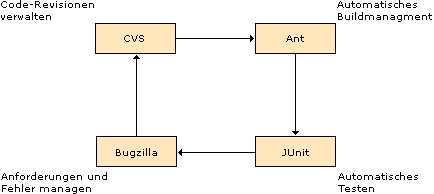
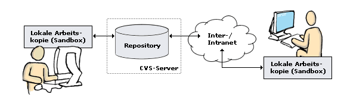
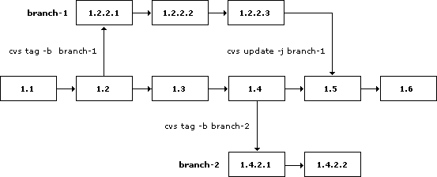
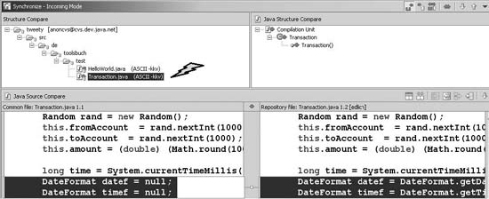
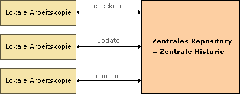
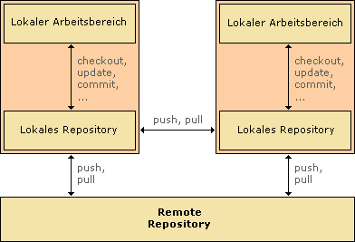

# DVCS - DISTRIBUTED VERSION CONTROL SYSTEMS

(C) Prof. Dr. Stefan Edlich

--- 

**INTRODUCTION**

Software development projects are almost always developed in a team.

The process of build and integration management must be handled (as discussed in the previous learning units). As is well known, software (unfortunately) almost always contains errors or features are missing. These errors must be managed, managed and documented and must not be lost in everyday business. In some cases it is even necessary to go back to an earlier version of the software. Experimenting with the code may also make it necessary to go back to previous versions. The essential and nowadays also simple version management is one of the most important tools in software engineering for managing the code in all variants.

LEARNING GOALS
learning goals

The aim of this learning unit is to understand the concepts of version and error management and to be able to use the two best-known systems in practice.

**OUTLINE**

Structure of the learning unit

* Basics of version management
* Requirements and benefits
* Examples under Eclipse
* subversion
* Error management

You will need approximately 120 minutes to complete this learning unit. It also takes 120 minutes to solve the exercises.

---

## LITERATURE DVC

> **DEFINITION** Git is a version control program that can track, manage, and share entire directory trees. GitHub is a web service that acts as a Git host (sometimes free) and can share it with interested parties.

After Make, RCS and CVS were the market leaders in Subversion for a long time at the beginning of the millennium (33.4% in 2009 according to Forrester Research), Git has taken the lead.

With GitHub and GitLab - to name just two of many hundreds - PaaS services (Platform as a Service) have been created, which usually offer free storage space and thus enable you to get started immediately and free of charge. Bitbucket has even offered both Git and Mercurial protocols since 2012 to avoid the question of which system is better.

The advantages of developing with Git and under the PaaS GitHub are highlighted by several facts:

* Back in 2012, GitHub received $100 million in venture capital.
* Countless companies and projects rely on GitHub: Facebook, Twitter, Microsoft (!), vmware, redhat, LinkedIn, Mozilla, Android, Debian, Eclipse, jQuery, Lunix, PostgreSQL, RubyOnRails

Here's a typical programmer's perspective describing what GitHub is today:

> **QUOTE**: “What do you think of GitHub?” “It started as a place for mothballing unmaintained and unnecessary projects, and that is still most of what is hosted there. But it’s turned into a kind of **World of Warcraft universe for programmers**, where they are ranked by their commits and which projects they have trunk privileges on. I read about a recruiting company built around the idea that GitHub reputation means something, so I guess if you aren’t committing to GitHub you won’t be getting a job at the coolest startups. The good old days of writing FizzBuzz and moving Mt. Fuji during your interview are over.” Linus Torvalds

GitHub has become the Facebook for coders to collaborate, follow, rate, or contribute.

**References**

* Git (http://git-scm.com)
* “git help”
* Github (http://github.com)
* Reference Documentation (https://git-scm.com/docs)
* Book and Videos (https://git-scm.com/doc)

**Books**

* Travis Swicegood, “Git,” The Pragmatic Bookshelf, 2010, ISBN-13: 978-1-934356-72-2
* Scott Chacon, “Pro Git” (free + online) https://git-scm.com/book/en/v2

Ten Things You Didn't Know about Github and Git https://owenou.com/ten-things-you-didnt-know-git-and-github-could-do/

---

## INTRODUCTION AND CONTINUOUS INTEGRATION

A central part of project management is revision/version management or configuration management. The aim is to support the entire project in its growth. It must be possible to ensure correct deliveries and code states at all times.

> DEFINITION: Continuous integration => It is important that version management is seen as part of an overall cycle, which is often referred to as continuous integration. This approach is similar to extreme programming and refers to several tasks that can be supported by the following tools:

* Pull, backup and manage sources: e.g. B. with CVS
* Automate processes and integrate them into a build process: e.g. B. with Ans
* Ensure code quality through testing: e.g. B. with JUnit or *Unit
* Manage defects and requests: e.g. B. with Bugzilla

Pic: Tasks and supporting tools

The goal of continuous integration is to be able to provide executable code at any time. Ideally, the current build always corresponds to the state of development. This means that possible problems with the integration of the system can be identified immediately.

The source code itself is always kept in a central location and is accessed and reused not only manually, but also often through the build process of tools such as Ant (Compile, War, JUnit, etc.).

The entire build process is automated (see also the “BUI – Build Management” learning unit in the “Build Management” chapter) so that just one command (“ant”) or one click creates, delivers (“deploys”) and tests the entire code and executables.

> NOTICE: The aim of this approach in **continuous integration** is that the developer feels less like a lone fighter and instead always sees himself as part of the team. His development work is considered accepted when the entire cycle has been completed and the product or prototype works error-free and is successfully integrated. This is much easier to achieve with a build cycle like this. The integration builds are so successful because they can be carried out with one click and then tests show whether the product works successfully. The difference to previous approaches can be seen here. **Continuous integration** usually saves a lot of money and time. Problems can be resolved earlier, prototypes can be integrated and adequately tested.

---

## DEFINITIONS - VERSION AND CHANGE MANAGEMENT

> DEFINITION: Version management / revision control

Version / Revision management generally refers to the process of managing source code in different versions using a software tool.

In addition to orderly and central data storage, this also involves **release** or **revision** management. This means tracking certain development stages or lines of development and being able to deliver them in an orderly manner at any time.

Version management can in turn be part of **configuration management**. Versions are both “configurations” of the project as well as build information such as language, target environment (Windows, Linux, etc.) or application server. However, there may be other configurations that are not versions (see below).

At this point it is already clear that the process of version management is very difficult without a strategy and tools. Managing version branches or troubleshooting is often a difficult undertaking without the help of tools.

> IMPORTANT: In many (especially small) projects, version management is carried out “manually”. It is often argued that simply copying directories is just as easy. Unfortunately, this thinking often carries over into larger projects and leads to incredible (negative!) surprises later.

The aim of this learning unit is to show that setting up version control environments is now so easy that the small additional time effort should almost always be invested. Working with version control systems such as CVS or Subversion should then be very intuitive and hardly take any time.

Version management systems are always considered here in the context of programming. However, version control systems are increasingly being found in completely different projects. Documentation, book creation, graphic work are just a few examples of the sensible use of a central administration tool.

**DEFINITION**

Change management is therefore the sum of the following systems:

Version management: Versions, for example, of the project's program code
Release Management: Management of releases, i.e. the development lines
Configuration management: Management of all other settings, files and states that are relevant to the functioning of the system (e.g. application server configurations, messaging queues, active web services, etc.)

---

## REQUIREMENTS FOR VERSION CONTROL SYSTEMS

What requirements must a version control system meet:

It must be possible to constantly take “snapshots” of versions (releases).
Source code released by the developer must be transferred to the central / decentralized repository (see next pages).
The responsibilities and control over the source code must be transparent.
It must be possible to trace – especially for documentation purposes – who made which changes and which “features” are now integrated.
The system must resolve or at least make transparent conflicts that arise when the team works with the (same) code.
The process must be easy to manage, e.g. B. through the Eclipse plug-in (sync button).

---

## VERSION CONTROL SYSTEM CONCEPTS

The basic concepts of a version control system like Git are:

* The developer develops in his local sandbox. The code is either initially “checked in” or “checked out” for work and kept local. The image below shows that this can be done locally or remotely. The central core of all version control systems is a repository, which is usually a server application.

Pic: Sandbox

* The check-in of changed source code is provided with a log entry. This is essential for revision documentation. Almost every project offers so-called changelogs for new versions. The project manager can easily create these from the comments on features or changes that the developers have made. Commercial products offer reporting tools for exactly this purpose.

* Each file gets a revision number. This is automatically increased according to certain algorithms and helps to track changes and clearly identify version statuses.

* Files can (but normally do not have to) be locked for editing. This interesting aspect will be discussed in more detail later.

* Version control systems must help to resolve conflicts or at least make them transparent (e.g. reject check-in in the simplest case).

**NOTICE** **Check in/Check out**

**Checkout** = “I take the current version for myself and change it on my computer. That’s my working version and no one sees it.” (according to D. MARCOS).

**Checkin** = “My working version becomes an official project version, which I then make available to everyone else.” (according to D. MARCOS).

**Checking out the same version twice** sometimes leads to parallel versions after change and checkin. The config manager has to decide what should be done at this point: throw away one version or combine both = merge.

---

## IMPORTANT TERMS AND COMMANDS

|Term|Meaning|
|---------|-------------------|
|Repository|The previously mentioned repository is the place where the files are stored. This is usually a server.|
|Commit|A commit is similar to a database transaction and refers to a check-in. In this case, the files from the local sandbox directory are transferred to the server and the changes and comments are managed.|
|Check-Out|In this case, the requested files are transferred from the repository to the developer's local sandbox - essentially an export.|
|Update|An update ensures that all files changed on the server are retrieved and therefore refreshed locally.|
|Merge|A merge brings different versions together. For example, the “Branch” 1.3.12 with version 1.4.2|
|Revision|A revision is a version status within all existing versions.|
|Import|Import means copying the entire file tree into the local workspace.|
|Export|An export is similar to a complete check-out, whereby a new, complete project without revisions is usually transferred to the server.|

**Creating a repository**

The following shows the practical steps of setting up a repository:

    > cvs -d /usr/repository init
    > ls /usr/repository/CVSROOT
    Emptydir config editinfo,v modules,v taginfo
    checkoutlist config,v history notify taginfo,v
    checkoutlist,v cvswrappers loginfo notify,v val-tags
    commitinfo cvswrappers,v loginfo,v rcsinfo verifymsg
    commitinfo,v editinfo modules rcsinfo,v verifymsg,v

The repository is set up here with the CVS command. -d specifies the name of the repository path. The CVSROOT directory is always set up and contains administrative information.

> NOTE: You can that the commands have stayed the same for decades! Although CVS is not used today any more this is why we gave this example. Of course the online course material has the most up to date information using git!

---

## BRANCHES AND TAGS

CVS's / Git's job is to remember all versions of all files. If the user carries out an update, only the latest files are transferred. It is not easy to access different older versions with the same command. The question quickly arises as to how to access older versions of the program.

For this purpose there are symbolic names called tags. These can be used to take a snapshot (like a photo) of the work status.

Pic: Branch

The example above shows that five different files exist and a specific area of these files has been highlighted.

> **DEFINITION: Revision vs release**  A single file is called a version or a revision. If, on the other hand, as in the example above, there are a lot of files that have been awarded, then this is called a release.

Normally a day can simply be assigned. For example, For example, all files can be marked with cvs tag before-midnight.

If you want to further develop an old version (differently), branches must be set. This is done using cvs tag -b branch-1.

Pic: Branches

The example above shows a branch spin-off including repatriation.

---

## ADVANCES OF DVCS

So what are the benefits of DVCS especially when using Git on IDEs that have this built in by default?

* Multiple versions of the program can be easily managed.
* In the event of an error, you can simply revert to an earlier version. At the same time, the integrity of the files is ensured because they all correspond to the same version.
* The documentation of the changes can be used simultaneously for an official changelog and for the official documentation.
* Aggressively changing code in agile project environments is supported by all DVCS and takes place on “safe ground”, so to speak.

**Locking strategies**

Locking means locking files in version control.

**Pessimistic Locking / Lock-Modify-Unlock**

Almost all version control systems support this work strategy, in which the file you are working on is locked. It seems to be the easiest and safest way to avoid conflicts. However, it has been shown that this does not improve efficient work. In many cases, locks are forgotten and lead to problems. Disjoint work on different code locations in a file is also impossible.

**Optimistic Locking / Copy-Modify-Merge**

In contrast, the strategy of **Optimistic Locking** is almost always used, which allows, and even almost motivates, simultaneous work on files!

It has been shown that developers rarely work on the same code. At the same time, in IDEs it is now trivial (one mouse click) to perform a check-in. This greatly minimizes the likelihood of major conflicts occurring.

Any conflicts that arise can usually be eliminated very easily because the IDE can provide a good representation of the differences (see the next chapter “Conflict resolution”).

Optimistic locking has therefore become established everywhere in computer science - including in databases, as MVCC (Multi Version Cuncurrency Control) or e.g. B. in distributed systems. Another argument is that it is much faster!

---

## CONFLICT RESOLUTION

Any synchronization with the repository can show possible conflicts that occurred in optimistic locking mode with other developers:

Pic: Eclipse: Conflicts in optimistic locking mode

The advantage is that you can edit directly in the window that shows the differences. You can also decide which version should ultimately be preferred if, for example, a version was just a test or error. The conflict mode editor always shows which version is “Ingoing” or “Outgoing” and also provides the “Override and Commit” operation.

As already mentioned, developers rarely work on the same code. If they do, they rarely work in the same place. If you work in the same code file in the same place, the merges are easy to do. The effort involved in such very rare cases is less than the effort involved in pessimistic locking!

---

## DISTRIBUTED VERSION CONTROL

The version control systems presented so far all have a central structure with two types of data sets: a central repository to provide all revisions and a local working copy for the user.

**CENTRAL VERSION CONTROL**

The history is only kept centrally. All operations that use data from the repository or transfer data to the repository cannot be carried out locally. To do this, the local workspaces rely on a connection to the central repository.

Pic: Central version control

**DISTRIBUTED VERSION CONTROL**

With distributed version control, each user has their own local repository into which they add changes. The individual individual repositories can exchange information via certain operations (e.g. push, pull) [Dat10].

The local repositories enable largely independent work. A common project platform can be implemented via a remote repository.

Pic: Distributed version control

---

## HOW DISTRIBUTED VERSION CONTROL WORKS AND OPERATIONS

The basis of distributed version control is the “distributed repository”. Each user has their own local repository - complete with history and their own development branches.

These local repositories can operate largely independently. Operations such as E.g.: Adding files to the repository, changing files, logging changes (committing), searching the file history, creating alternative development branches (branching) and merging different branches (merging) take place in the local area. These operations do not require exchange with a central server or another repository.

Without external guidelines, all repositories have equal rights. However, it is also possible to set up a “central” remote repository as a common project platform and to upgrade it hierarchically if necessary. Basic functions for exchanging information between different local repositories or between a local repository and a central server archive are

* **push** (transferring local information to an external, non-local repository) and
* **pull** (copying external, non-local information into your own local repository).

As a key feature, systems that support distributed version control provide the ability to clearly describe one's own history, usually using SHA1 / SHA2 hashes for a clear data identification. 

---

## ADVANTAGES AND DISADVANTAGES OF DISTRIBUTED VERSION CONTROL

Distributed version control has two main advantages: it enables independent and fast work. Most operations can be carried out locally and are therefore significantly faster than with central version control systems. The developer does not rely on a network connection or access to a central server to work effectively. He has all the necessary information and operational options in his local sandbox to be able to work independently. He is also completely free to create and further develop various branches in his local area.

Furthermore, distributed version control is exceptionally democratic and communicative. Development can take different paths, i.e. H. different local repositories, all of which are at the same “hierarchical” level. It is also possible to classify a repository higher in the hierarchy and thus work in a classic central manner.

What is considered more complex is that the revision numbers, which are to be handled transparently in central version control, have to be replaced by globally unique hash values (e.g. SHA 1). Distributing them across different systems results in increased effort in managing revisions. Every developer must know the infrastructure of the “distributed network”.

**Distributed version control tools**

Tools to support distributed version control include: B. Git, Mercurial, Monotone (all open source), Clear Case (proprietary), Bitkeeper (proprietary). The Bazaar system, on the other hand, takes a hybrid approach with or without a central server. But this constantly changes...

Version control with Git is discussed in more detail below.

---

## COMPLETE GIT REFERENCE

ToDo: Missing

## ERROR MANAGEMENT

In medium or large software systems, managing and tracking errors is essential. This is why we often talk about defect, bug, error tracking or management.

However, most systems transition to project management and are processed using integrated tools and features that are required. Error management is then a subfeature of these tools. Features such as the management of missing functionality (Request for Enhancements (RFEs), also called issues or tasks) are part of this project management software and also always part of pure bug tracking systems like the old Bugzilla.

In smaller projects, however, it may be completely sufficient to record errors or the entire project using more general systems - such as wikis.

---

## ERROR MANAGEMENT REQUIREMENTS

The following information is important for describing errors:

* **Text description**

A textual description of the error with information on how to reproduce it.

* **Priority**

The assessment of how serious an error is is usually carried out by a project manager or similar. A certain number of relevant bugs may justify a software update.

* **Configuration**

Information under which exact software and hardware conditions the bug was discovered.

* **System part**

In which component the bug was caused.

* **Additional Information**

Screenshots or log files are often stored here, as they are usually requested by the hotline support for a software product.

Simply detecting bugs is usually not enough. What is needed are systems that manage the whole thing and provide more information.

* **Bug Mapping**

Bugs must be assigned to developers or departments. This also prevents bugs from being fixed by two developers in parallel.

* **Bug Condition**

Bug states are usually ASSIGNED, RESOLVED, VERIFIED or CLOSED. The bug itself usually goes through a lifecycle, which usually consists of FIXED, INVALID, WONTFIX, DUPLICATE and WORKSFORME (cannot be reproduced). In rare cases there is also LATER or REMIND.

* **Bug history**

All past actions on a bug must be recorded. Errors can cause considerable costs, which is why an appropriate (economic) analysis should always be possible afterwards.

* **Parallel work and Permissions**

Bugs must be able to be recorded by any number of people in parallel. Permissions ensure that bugs are only released as fixed if this has been tested and approved by Quality Assurance.

* **Query and Evaluation**

Any search or query formulation about bugs or modules is important. This also includes, if necessary, the generation of reports that can also prepare the whole thing graphically.

> Please search the internet for Bug Managin Systems. Often, if GitHib / GitLab is not used - systems like Jira come into play!

In the early days, a bug in Bugzilla had the following items:

* Product and Component
* Status and Resolution
* Assigned To
* URL, Summary
* Status Whiteboard
* Keywords
* Platform and OS
* Version
* Priority
* Severity
* Target
* Reporter
* CC list
* Attachments
* Dependencies
* Votes and Additional Comments

---

## SUMMARY DVC

* Version and error management are part of the continuous integration cycle and are essential tools in software engineering.
* The first systems were RCS and SCCS, which tried to put an automated management layer on top of “diff” under UNIX.
* Developing with DVCS under a comfortable IDE enables bold development on safe ground without obstacles. All relevant tools are therefore based on modern DVCS tools.
* DVCS enable optimistic locking.
* Bug tracking in projects is integrated into almost all DVCS systems and is therefore usually used directly. Every now and then you find your own server like Jira for bug tracking.

---

## EXERCISE: VERSION MANAGEMENT WITH GIT

* Create a repository in Github or GitLab.
* Push up your own project (e.g. the CCD project) or create a new project!
* Provably use all relevant methods mentioned in the documentation: (the Github repo is proof) push, pull, add, commit, diff, status, rm/mv, etc.
* Experiment with time travel!
* Create two different but similar branches, switch back and forth, and then merge those branches again!
* Create a pull request in GitHub referring to https://github.com/edlich/education! Please reference the pull request with a link or the pull request number! I can hardly assign cryptic GitHub names.

Please do not include the task parts before the pull request in the pull request, but submit them separately!

Make your repo public! (No invitations please for the lecturer)

Processing time approx. 60 minutes