# METRICS

(C) Prof. Dr. Stefan Edlich

---

## OVERVIEW

The “Software Metrics” learning unit is a supplement to the topic of software quality, which also includes the “Testing” learning unit. It's about making a lack of software quality or software complexity visible. Rule violations or problems in the code are listed and optimally visualized. With this help, developers, architects or project managers can better set the course for new quality.

**LEARNING GOALS**

This session has the following objectives:

You will learn about the importance of metrics as a measure of quality and how you can evaluate them in practice.
You will learn the basics and how to calculate them.
You'll learn about code metrics and how to use the tools.
You will learn about architectural metrics and use tools to visualize them.

**OUTLINE**

After a brief introduction to metrics, simple metrics such as the McCabe metrics will be covered first. After the Halstead metrics and code coverage, we discuss the different types of rule violations that many tools aggregate as metrics.
In the second part, JDepend, coupling metrics and the question of debt - the technical debt - follow.
Finally, currently available tools for Java are listed and compared.

**TIME SCOPE**

It takes approximately 120 minutes to complete this unit. Applying a complex tool like SonarQube to an existing project takes about an hour. Simple tools, such as those often integrated into IDEs or DVCS, are much quicker to use.

---

## REFERENCES METRICS

* The classic on the subject of spaghetti code: http://laputan.org/mud

* There’s also a wonderful button/thread analogy that illustrates this: http://akvo.org/blog/the-ball-of-mud-transition

* More information about expressiveness: http://redmonk.com/dberkholz/2013/03/25/programming-languages-ranked-by-expressiveness

* A study on the topic of technical debt: http://insights.sei.cmu.edu/blog/a-field-study-of-technical-debt/

Justin Etheredge, Why does it take so long to build software? http://simplethread.com/why-does-it-take-so-long-to-build-software/

* Cyclic dependencies are evil: http://fsharpforfunandprofit.com/posts/cyclic-dependencies/

* Decoupling Level: A New Metric for Architectural: Maintenance Complexity, ICSE '16 [1]

**TOOLS**

* SonarQube
* CodeScene [2]

---

## MOTIVATION

Metric is anything that can be measured. This refers to measurements or ratios that occur in all areas such as music, physics, mathematics, etc.

> **DEFINITION Software metrics**: 
A software metric is a measurement that says something about the software.

> **DEFINITION**  “A software metric is a function that maps a software unit into a numerical value. This calculated value can be interpreted as the degree of fulfillment of a quality characteristic of the software unit.” (IEEE Standard 1061,1992)

> **EXAMPLE** A simple metric would be e.g. B. the number of lines of code or the number of classes in an OO project. But of course the topic of metrics goes much further – right up to architectural metrics, which say something about the state of the architecture of the software system.

Since good software architecture means maintainability, changeability and testability, this topic is also referred to as “software stability”. It describes how stable the software system is to changes, i.e. H. reacts to its further development.

Basically, there are many types of metrics related to software development. A software project consists, for example, B. from many elements:

* Source code
* binary code
* External libraries
* Build information
* Versioning information
* Forms of meta and additional information (e.g. annotations, JavaDoc, etc.)

This also means that many metrics can be measured. In this chapter we will look at some of them such as: E.g.:

* Complexity metrics
* Test metrics
* Architectural metrics
* Coupling metrics
* Style Metrics

In computer science, there are more types of metrics than just software or code metrics. Many metrics are primarily known from project management, such as: B. the function point metrics or COCOMO for effort estimation.

We will first focus on the simple software metrics and then learn about the architecture metrics.

> NOTICE: **But**: good metrics are not synonymous with good quality! Good quality does not necessarily mean good metrics! But they might correlate or often correlate.

Experience from many projects also shows that the characteristics of metric size and quality often correlate with each other!

Since large projects are being developed today and the quality has to be checked, the visualization of quality metrics is becoming more and more important. This will be discussed towards the end of the module.

> Interview with JONATHAN ALDRICH on the topic of static analysis (45 min): https://www.se-radio.net/2007/06/episode-59-static-code-analysis/

---

## SIMPLE METRICS

It is often helpful to have an overview of very simple code metrics. This includes the following metrics:

**Lines of Code**

The number of lines of code - also called LOC - is a well-known measure when it comes to comparing project sizes. For example, checkstyle has 22,369 lines of code and Apache Tomcat already has 159,364 lines of code, making it one of the larger projects. It is important to know whether all lines of code are included. When all file lines are included, Tomcat has 314,461 lines, which may be due to documentation or configuration files.

Lines of code can have completely different expressions in different languages. This is the **expressiveness** of a language. 1 is often equated with C. Modern dynamic languages often have an expressiveness of 10, 20 or more. This means that encoding can potentially be done ten times as efficiently on average.

For example, compare the line of code in Clojure with a possible implementation in an old Basic dialect:

    1 (filter (fn [x] (= 1 (rem x 2))) (map (fn [x] (* x x)) (range 10)))

> NOTICE: The function returns all odd square numbers between 0 and 100.

Lines of code should always consider the expressiveness of the language.

**Comments**

Number of lines describing the program. As a rule of thumb, this number should be between 30% and 60% of the lines of code.

**Methods/Functions**

The number of methods or functions of a program or project.

**Classes**

The number of classes used is of course also a measure of complexity. Around 2000, the largest German Java software project (Cheops) had around 30,000 classes, which is a lot.

**Packages**

Here the number of packages or namespaces is simply calculated.

**Files**

Files are self-explanatory, but unfortunately not a good measure of the complexity of a software. So there is e.g. B. Ruby programs that are packed into a file and are still very complex (e.g. Kirbybase).

**Duplicates**

Some good tools search the code for similar building blocks. This can happen at different levels, looking for identical lines of code, similar building blocks, or even similar files. Also, this provides good information about whether a refactoring could be done or not. The DRY principle (Don't Repeat Yourself) has often been violated.

For example, For example, the same blocks can be combined in one method, which usually significantly increases the maintainability of the code. Here is an example of an automatic analysis of basic metrics:

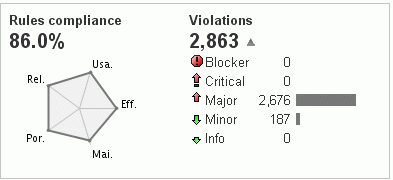

Pic: Analysis of basic metrics

It is helpful if all metrics can be tracked in history. With good tools this is easily possible and you get a graphically prepared output like the following figure.

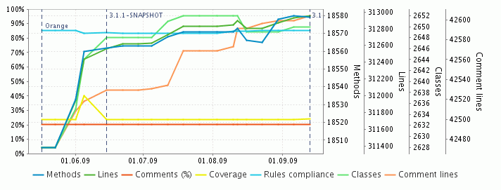

Pic: Basic history as a timeline

Some tools also provide a graphical overview in which the metrics are displayed as weighted areas. By clicking on the area (similar to disk usage tools) you can “drill” into the region or error.

This list will never be complete. There will be more and more features in the code that can be examined or converted into metrics (number of to-do marks, notes, etc.).

---

## McCABE METRICS

One of the most famous metrics is the McCabe metric, named after *THOMAS J. McCABE*. This is a pure code metric that is relatively easy to determine. The basic idea is to automatically determine how complex the code of a software unit (e.g. method or class) is across 10,000 classes.

It is generally assumed that complexity can be calculated by the number of possible paths that can be taken in a program. In this case, this means how many control flows are possible in the program graph.

> **DEFINITION McCabe Cyclomatic Complexity** Each conditional construct (whether it's a loop or an if/else/switch) increases the complexity by 1 (that's why it should be called "conditional complexity").

The equation is:

    M = E - N + P

**Legend**:

* M = the cyclomatic complexity,
* E = the number of edges in the graph,
* N = the number of nodes in the graph and
* P = the number of exit points (return, last command, exit, etc.)

As a rule, the exit point P is reconnected to the entry point and counted as an edge.

    if(a1) code1 else code2 end if(b2) code3 otherwise code4 end

> **Exercise**: Cyclomatic Complexity
 
What is the cyclomatic complexity in the code example above? Draw the graph! Try to solve the problem yourself before looking at the sample solution. Time required: 10 min

---

## HALSTEAD METRIC

One of the lesser known metrics is the Halstead metric, introduced by **MAURICE HOWARD HALSTEAD** in 1977 (!). Nevertheless, it is implemented in many metrics tools because it is easy to calculate by machine. Furthermore, it is a static procedure that does not execute the code but rather analyzes the source code.

This metric can be calculated as follows:

* n1 ⇒ the number of different **operators** used in the code. So it's things like this:

    ! != % %= & && || &= ( )
    * *= + ++ +=
    , - -- -= ->
    . ... / /= : ::
    < << <<= <= = == > >= >> >>=
    ? [ ] ^ ^= { } | |= ~ (for C++)

and `break, case, return, try,` but also `private, friend, static` - but no types.

* n2 ⇒ the number of different **operands** used in the code.

So type declarations `(int, bool, void` and all constants, type names and identifiers that are not reserved names.

* N1 ⇒ the total number of operators in the code.

* N2 ⇒ the total number of operands in the code.

The following numbers can then be calculated from these four values:

|Metric|Calculation|
|--------|--------|
|Program length:|N = N1 + N2|
|Amount of the vocabulary:|n = n1 + n2|
|Halstead volume:|V = N * log2n|
|Halstead length:|L = n1 * log2 n1 + n2 * log2n2|
|Difficulty:|D = (n1 / 2)* (N2/n2)|
|expense:|E = D * V|

The sources even give an estimate of the number of bugs to expect.

This metric only provides lexical dimension information. So the actual complexity is only estimated. In particular, dynamic programming languages that introduce or reduce extreme complexity with constructs such as `currying, fibers, yield` and `closures` certainly defy the attempt to accurately measure complexity.

However, the absolute number is not necessarily relevant. Whether one module has a D-value of 65.25 and another module has a D-value of 67.78 is not that important. It is more important to get a **feeling** for these numbers and to be able to correctly evaluate the exceedance of orders of magnitude as an alarm signal.

> DEEP DIVE: http://www.virtualmachinery.com/sidebar2.htm Article: Complexity and quality of software by XAVIER-NOËL CULLMANN and KLAUS LAMBERTZ verifysoft.com mscoder.pdf (737 KB)

---

## CODE COVERAGE / TEST COVERAGE

There are two different areas of coverage:

* The cover through which the code runs during expiration.
* The test coverage: which controls/checks how well the tests e.g. B. record the methods used.

When talking about coverage, software engineers usually refer to test coverage. Nevertheless, one should specify exactly what is meant.

**Code coverage**

How often a method or piece of code is run is also examined using a metric. This can e.g. This can be very useful, for example, for checking processes or debugging.

  > **Example:** Here is an example from the documentation of the D programming language, which has such a function built directly into the compiler. After the program is executed, defined code points are output with the number of times the line has been traversed:
  
          |/* Eratosthenes sieve prime number calculation. */
          |
          |import std.stdio;
          |
          |bit flags[8191];
          |
          |int main()
         5|{ int i, prime, k, count, iter;
          |
         1| writefln("10 iterations");
        22| for (iter = 1; iter <= 10; iter++)
        10| { count = 0;
        10| flags[] = true;
    163840| for (i = 0; i < flags.length; i++)
     81910| { if (flags[i])
     18990| { prime = i + i + 3;
     18990| k = i + prime;
    168980| while (k < flags.length)
          | {
    149990| flags[k] = false;
    149990| k += prime;
          | }
     18990| count += 1;
          | }
          | }
          | }
         1| writefln("%d primes", count);
         1| return 0;
          |}
    sieve.d is 100% covered
  
(Source: http://www.digitalmars.com/d/2.0/code_coverage.html)

**TEST COVERAGE**

Test coverage has already been discussed in the “TST – Object-Oriented Testing” learning unit in the “Code Coverage” chapter. It's an important metric that often refers to unit tests - but of course tests can also refer to other units:

* Code blocks – did ifs, switches or loops cover or test code blocks?
* Have larger units such as classes or packages been adequately tested? If yes, at what percentage?

Such tools can ideally be integrated into a build management tool (Ant, Maven) and then provide meaningful reports:

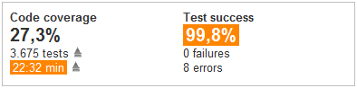

Pic: Code coverage report

Such a metric can be very helpful when working on code. That's why every known development environment has plug-ins that deliver these results.

The interested student should e.g. For example, installing Emma or the eclemma plug-in (http://www.eclemma.org) is recommended. This is done in a few minutes and you will receive the first measurements as shown in the picture:

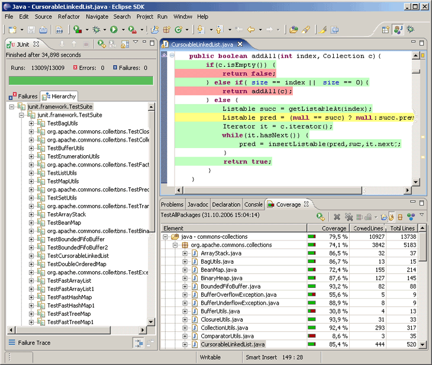

Pic: Coverage metric in Eclipse

---

## RULE VIOLATIONS

There have been excellent tools for reviewing code and programming style for many years. Rule violations are usually displayed as aggregated metrics. The developers can list them individually and then address the problems later.

There are many types of rule violations, such as violating the scope of a style guide or violating rules that the community or you yourself have defined as valid.

For Java, the most popular tools are:

* Checkstyle
* PMD and
* Findbugs

> WEBSOURCE: You can find an overview of other tools online if you search

Here are some examples of what the tools can typically check:

* Documentation in “JavaDoc”:
* Is there a package.html?
* Is the JavaDoc code well formatted?
* Are methods/variables well commented?

Java **naming conventions**:

* Do they follow the naming conventions regexp `"^[a-z]+(\.[a-z][a-z0-9]*)*$"?`
* Is the “Header” and “Imports” OK?
* Avoiding imports with asterisks (“de. vfh. swt. *”)
* No indication of incorrect imports
* No redundant imports
* No unused imports

Specifying “**Size Restrictions**”:

The number of executable pieces of code can be limited (e.g. the number of methods)
The file size and the number of lines can be limited
The length of the method can be limited. Note: This test forces the Extract method refactoring.
A limit on the number of parameters can be set.

Check for whitespaces or tabs.

Check the “order” of the “modifier” in classes. For example, the following applies to Java:

* public
* protected
* Private
* abstract
* static
* final
* transient
* volatile
* synchronized
* native
* strictfp

There can be no “empty blocks”.

Many other “coding standards” are being reviewed:

* Avoiding empty statements.
* Local variables that should not change their value must be final.

Same naming within blocks (shadowing) must be avoided.

* Do not use **magic numbers**. If possible, avoid using superfluous and therefore ineffective numbers (except -1,0,2) and primarily use declarations in final variables that can be supplemented by explanations.
* Missing default in switch design.
* Control variables should not be changed.

    for (int x = 0; x < 1; x++) {x++; }

Unnecessary throws declarations.

Find unnecessary code:

    if (b == true), b || true, !false, etc.

* Correct name definition for JUnit 3 tests.
* Are the same strings present in the code?

A good class design can also be checked:

* Visibility of class variables
* Using final
* Is the class geared towards inheritance?

Not only is it possible to set arbitrary regular expressions to parse a line. Any number of rules can be implemented and expanded.

**EXAMPLE**

Checkstyle example for inefficient code
As you can see here, today's tools also find inefficient code. Here is another example from Checkstyle:

    if (valid())
      return false;
    else
      return true;

This example should be replaced with:

    return !valid();

Some tools like Checkstyle include the following metrics:

* Number of **Boolean equations** `as &&, ||, &, |` and `^` in a command block
* **ClassDataAbstractionCoupling**: Note: This is the Ce of JDepend!
* **ClassFanOutComplexity**: Note: This is the Ca of JDepend!
* **CyclomaticComplexity**: We know that!
* **NPathComplexity**: The number of possible processes. This corresponds to the McCabe metric.
* **JavaNCSS**: Number of lines of code. With restrictions on Method=50, Class=1500, FileMax=2000

> Question: What values do you think make sense for point 6 and the other metrics?

**Summary**

The power and usefulness of style analysis tools for code and system quality should not be underestimated. As an experienced developer, you are usually the first person responsible when thousands of error messages from these tools are displayed at the beginning. Often the desire arises to “comment out” some tests in the configuration file, which switches them off. It would be better to stop here and think about it carefully. It is usually better to address the cause of the error in the code than to reduce error checking.

Tools like checkstyles should always be included in the build from the start or, if necessary, run as a plugin at the push of a button. This can be difficult at the beginning, but in the long term this approach pays off, especially for large projects. Especially because style analysis tools also recognize things that promote good architecture.

**EXAMPLE**

Practical example for Checkstyle
The following shows the configuration and results of Checkstyle. To start, you should consider whether you want to do this under ANT (or a build management system) or as a plugin in your favorite IDE.

* Download checkstyle-all-*.jar
* Declaration of the task:

    <taskdef resource="checkstyletask.properties"
          classpath="lib/checkstyle-all-5.0-beta01.jar" />

* Definition of goals:

    <target name="CHECKSTYLE">
       <checkstyle config="docs/sun_checks.xml">
         <fileset dir="src" includes="**/*.java" />
         <formatter type="plain" />
         <formatter type="xml" toFile="checkstyle_errors.xml" />
       </checkstyle>
    </target>

Including the definition of the analysis, e.g. E.g. sun_checks.xml (possibly remove the things that don't work...). The file has approximately the following content:

    <module name="Checker">
    ...
       <module name="AvoidInlineConditionals"/>
       <module name="DoubleCheckedLocking"/>
       <module name="EmptyStatement"/>
       <module name="EqualsHashCode"/>
       <module name="HiddenField"/>
       <module name="IllegalInstantiation"/>
       <module name="InnerAssignment"/>
       <module name="MagicNumber"/>
       <module name="MissingSwitchDefault"/>
       <module name="RedundantThrows"/>
       <module name="SimplifyBooleanExpression"/>
       <module name="SimplifyBooleanReturn"/>
    ...

As you can see here, specific tests are defined for test terms. All tests are usually well documented and well justified (http://checkstyle.sourceforge.net/checks.html).

Analysis of the result file `checkstyle_errors.xml` or the output on the console.

The XML file will then look something like this:

      1 <?xml version="1.0" encoding="UTF-8"?>
      2 <checkstyle version="5.0-beta01">
      3 <file name="C:\EDLCHESS\EDLENGINE\src\de\edlchess\cmds\PositionCommand.java">
      4 </file>
      5 <file name="C:\EDLCHESS\EDLENGINE\src\de\edlchess\consts\Info.java">
      6 </file>
      7 ... and other files...
      8 <error line="44" column="35" severity="error"
      9 message="'71776119061217280L' should be defined by a constant."
    10 source="com.puppycrawl.tools.checkstyle.checks.coding.MagicNumberCheck"/>
    11
    12 <error line="10" column="9" severity="error"
    13 message="Javadoc comment missing."
    14 source="com.puppycrawl.tools.checkstyle.checks.javadoc.JavadocMethodCheck"/>
    15
    16 <error line="10" column="29" severity="error"
    17 message="The arenaCmd parameter should be declared as 'final'."
    18 source="com.puppycrawl.tools.checkstyle.checks.FinalParametersCheck"/>
    19
    20 <error line="33" column="9" severity="error"
    21 message="The 'identify' method is not designed for inheritance - must be abstract, final or empty."
    22 source="com.puppycrawl.tools.checkstyle.checks.design.DesignForExtensionCheck"/>

* Check all coding conventions
* Checkstyle
* PDM
* Findbugs

---

## JDEPEND METRICS

One of the oldest and most well-known metrics was created by **MIKE CLARK** in the 90s. It provided a code analysis tool that can be found in many other frameworks, IDEs and tools in many languages.

The word “Depend” is already contained in the term “JDepend”, which means “dependence”. It is primarily about analyzing the dependency of the components of a usually larger software system.

According to MIKE CLARK, JDepend's job is to do the following:

> **QUOTE**: “JDepend iterates through a set of Java class and source file directories and generates design quality metrics for each Java package. JDepend allows to automatically measure the quality of a design in terms of its extensibility, reusability and maintainability in order to effectively manage and control package dependencies. Package dependency cycles are reported along with the hierarchical paths of the packages that participate in the package dependency cycles.” Mike Clark

Here too, the source code must be parsed and metrics must be extracted from each class, which are presented below.

**Possibilities**

These metrics allow the extensibility, reusability and maintainability of the code to be measured and evaluated. Better yet, the metrics can indicate that the code may not be easily extendable, reusable, or maintainable.

In software engineering research, the term “software stability” is also used in this context, i.e. H. how stable the software is overall.

**Goals**

What are the goals of JDepend metrics?

1. JDepend promotes **design by contract**. It motivates you to develop stable packages - in the form of interfaces or abstract classes. The goal is that the unstable (frequently changing) classes depend on stable classes and not on other concrete implementations. In this case, different people can also program in parallel/simultaneously against stable interfaces.

2. This promotes the **independence** of the packages. This applies to both your own packages and external packages. The dependencies on external packages (e.g. commons.jar) can be made visible and isolated if necessary. This means that the external functionality can be encapsulated with stable components (e.g. interfaces or abstract classes for facades on the library). Independent, internal packages can also be developed much better in parallel - perhaps even in their own release cycle.

3. JDepend makes **cycles** visible. This will be discussed in more detail later. Cycles are components that depend on each other cyclically. These can be, for example, classes or packages. In practice, cycles are *“deadly”* for the changeability and maintainability of code.

**Metrics**

Let's take a look at the metrics generated by JDepend:

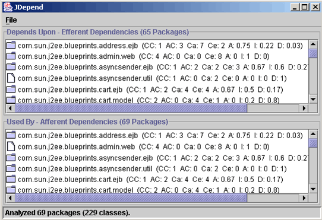

Pic: Output of the JDepend metrics

As you can see, JDepend initially refers to packages, i.e. to the analysis of package dependencies. However, the view can be zoomed in and out, i.e. H. You can also analyze at the class level. However, large projects are typically done at the package level.

---

## JDEPEND METRICS IN DETAIL

Let's look at some of JDepend's metrics.

**The total number of concrete classes, abstract classes and interfaces:**
This number alone is an indicator of whether the package is already too large, for example.

**Dependency/Afferent Couplings (Ca):**

Afferent couplings, which can be translated as “bring”, provide information about how many other packets depend on the packet you are currently looking at. In plain language: In how many other packages will it “pop” if I change something in this package. Of course, the goal is to keep this number as low as possible. J. CLARK even writes here about the responsibility of this package for its services to others.

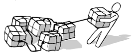

**Efferent couplings (Ce):** 

“Leading out / leading away” (e.g. from the biology of nerve cells). Here you can specify how many other packages my classes need from the packages under consideration. In plain language: how sensitive am I when other classes change. How loud does it pop when other classes change? This seems to be a measure of package independence.

**Abstractness (A):** 

This number reflects a ratio and the values are between zero and one (inclusive). A is defined as `AC/ (CC+AC)`. This means: What is the ratio of abstract classes to all classes? So a package with metric 1 is a completely abstract package that only defines but doesn't actually do anything. When the metric is zero (which is unfortunately too often the case), there are only concrete classes. In conjunction with the instability applied to axes, the points of the packages would then “stick” to the axes.

**Instability (I): **

Instability is a little more interesting. It is calculated using the formula `I = Ce / (Ce + Ca)`. But what does that mean? The denominator is the total number of all dependencies Ce + Ca. So both how sensitive other packages are to changes to the package under consideration, as well as how sensitive the package under consideration is when other packages change. Here a 0 would be a stable package and a 1 would be a completely unstable package.

**Distance to the main line (D):**

This means the distance to the main line. The main line is an idealized line with `A+I=1` (see also pictures on the next page). This value is said to describe how well the package is balanced between abstractness A and stability. A package that lies exactly on this line would be optimally balanced, i.e. H. the distance d is minimized. The completely abstract package `A=1` is also completely stable (`I=0`). On the other hand, a package that is only concrete is very unstable because it does not depend on interfaces or abstract classes.

**Package Dependency Cycles:** 

The output of cycles is also very interesting and important. When packages contain many cycles, class changes lead to chain reactions of further changes. The developers are then just debugging and can't make any progress with the content. A phenomenon often observed in many companies.

There are many cases of cycles:

* Cycles can be between classes. As a rule, classes from different packages are considered here. But cycles between classes within a package are also dangerous. For example, a class X from package Y needs B from package B. And then Y again X. This is a **direct** cycle.

* Cycles can also occur between **more than two** different packages.
E.g. A -> B -> C -> A. This means that all three classes are involved in one cycle.

* Finally, there are indirect cycles. In the example above, if there is still a class P that requires package A, it is also indirectly dependent on this cycle and will be marked accordingly by JDepend / analysis tools.

---

## JDEPEND IN THE BUILD CYCLE AND D

Tools that determine such metrics should of course be integrated into the build cycle to be available to developers, project managers or quality assurance as part of the continuous integration process. This means that the entire JDepend process (or other tools that determine the same or similar metrics) is started and e.g. B. a *. txt report can be generated for shipping. Calling JDepend from build management tools like ANT is therefore relatively simple:
  
    <target name="jdepend">
       <jdepend outputfile="docs/jdepend-report.txt">
         <exclude name="java.*"/>
         <exclude name="javax.*"/>
         <classespath>
           <pathelement location="build" />
         </classespath>
         <classpath location="build" />
     </jdepend>
 </target>

Source: http://clarkware.com/software/JDepend.html

> EXAMPLE: Some other tools allow you to include cycle searches as JUnit tests. Here is an example:

    1  import java.io.*;
    2  import java.util.*;
    3  import junit.framework.*;
    4 
    5  public class DistanceTest extends TestCase {
    6 
    7  private JDepend jdepend;
    8 
    9  public DistanceTest(String name) {
    10   super(name);
    11 }
    12
    13 protected void setUp() throws IOException {
    14   jdepend = new JDepend();
    15   jdepend.addDirectory("/path/to/project/ejb/classes");
    16   jdepend.addDirectory("/path/to/project/web/classes");
    17   jdepend.addDirectory("/path/to/project/thirdpartyjars");
    18 }
    19
    20 /**
    21  * Tests the conformance of a single package to a
    22  * distance from the main sequence (D) within a
    23  * tolerance.
    24 */
    25
    26 public void testOnePackage() {
    27
    28 double ideal = 0.0;
    29 double tolerance = 0.125; //project-dependent
    30
    31 jdepend.analyze();
    32
    33 JavaPackage p = jdepend.getPackage("com.xyz.ejb");
    34 assertEquals("Distance exceeded: " + p.getName(),
    35   ideal, p.distance(), tolerance); }
    36 /**
    37   * Tests the conformance of all analyzed packages to a
    38   * distance from the main sequence (D) within a tolerance.
    39 */
    40  public void testAllPackages() {
    41     
    42    double ideal = 0.0;
    43    double tolerance = 0.5; //project-dependent
    44    
    45   Collection packages = jdepend.analyze();
    46  
    47   Iterator iter = packages.iterator();
    48     while (iter.hasNext()) {
    49       JavaPackage p = (JavaPackage)iter.next();
    50       assertEquals("Distance exceeded: " + p.getName(),
    51       ideal, p.distance(), tolerance);
    52     }
    53   }
    54   public static void main(String[] args) {
    55       junit.textui.TestRunner.run(DistanceTest.class);
    56   }
    57 }
Source: http://clarkware.com/software/JDepend.html

In the example, the sources in the upper area are read in, then JDepend is called completely and it is checked whether cycles are included. These can then be output completely via the data structure p. There are even more examples on the JDepend website on how to: B. can test for d (you will find an explanation later). For many languages there are tools on the market that do this (e.g. Macker for Java).

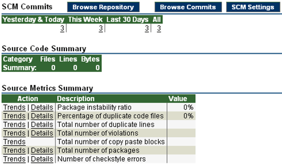

Pic: Measurement of the Instability

**Analysis of JDepend graphics**

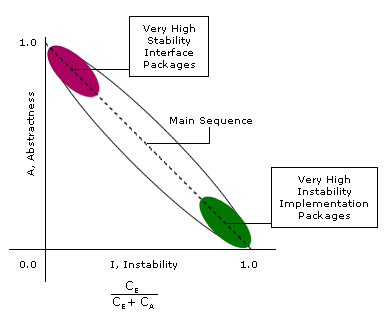

Pic: Main Sequence Graphics

In the first image you can see the Main Sequence tracing the line `A+I`. This shows that packages cannot be completely abstract (`A=1`) and completely stable (`I=1`) at the same time. There should always be a balance between concrete classes on the one hand and abstract classes/interfaces on the other.

Pic: Distance to the Main Sequence

(Star: Class A de.vfh.swt.metriken.cpool; Cross: B) Class de.vfh.swt.metriken.media)

In the second picture we see a package A that is pretty far up to the left. It can be concluded that there are obviously many abstract classes and high stability (I is small).

The second point has few abstract classes and too many concrete classes. There is high instability here (I is large). From all points a d, d. H. the distance to the “Main Sequence” can be calculated. This should then be considered individually and added up if necessary.

> **Low abstraction packages should depend on high abstraction packages!**

In an ideal world there would only be implementation classes that depend on abstract classes. However, in the real world you have to make compromises...

JDepend measures the distance of the packet to the “Main Sequence” D.

> **NOTICE**: The greater the distance D between the package and the “Main Sequence”, the greater the probability that the package can tolerate review or refactoring.

Of course, these are only indications that must be specifically examined and in special cases may be unfounded. Nevertheless, experience shows that packages with a huge `D` can certainly tolerate refactoring. Similar to pointing out good test coverage.

---

## COUPLING METRICS

Another very interesting metric area is coupling. This refers to the degree to which the components are connected to each other.

There are two different areas:

* **Cohesion**: roughly means connection / bond strength

* **Coupling**: refers to the coupling/connection and is often also referred to as dependency.

Cohesion is examined e.g. B. the methods of a class/component and how they relate to each other. The goal is for one class/component to accomplish one task, not multiple. If this is the case, there is a high degree of cohesion. These classes are more maintainable, modifiable and of course easier to understand. On the other hand, there is usually little coupling.

The counterexample would be a class with low cohesion. Here the class and its methods would fulfill many tasks. Most of the time there is a lot of coupling as more external components require this class. The present component is therefore much more difficult to change and understand. When refactoring, the class should be redesigned so that it only performs one task.

A key element of cohesion is whether the component can be meaningfully decomposed into independent parts and whether the set of two parts provides the same service as before the decomposition.

> WEBSOURCE: Further material on this topic can be found here: aivosto.com/project/help/pm-oo-cohesion.html

---

## EXAMPLES: PRESSMANN METRICS

There are different types of measurement with the coupling, as different coupling variants can be considered and these can be weighted differently. So can e.g. B. the communication of the modules such as data exchange, parameter transfer, use of additional data, etc. can be considered.

Here's an example.

PRESSMANN came up with the idea of doing the following:

* di: Number of Data as input parameter
* ci: Number of input parameter control structures
* d0: Number of outgoing data 
* c0: Number of outgoing control structures
* gd: Number of global used data
* gc: Number of global used control structures
* w: Amount of called modules (this is Ce of JDepend!)
* r: Amound of modeuls that call the current module (Ca!)

This metric also takes control data into account, i.e. when a module transmits control information to another module, this is weighted more heavily than if only simple processing data is taken into account.

PRESSMANN has defined the coupling as follows:

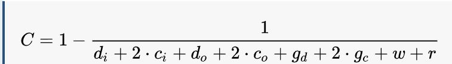

A method without no side effects would be a method with a single input parameter `di = 1` and one oputput parameter `d0 = 1`, e.g. the calculation of an interest. As this is called by one module (`r = 1`) the denominator must be 3 in the equation above.

This usually results in a minimum `C` value of `0.67`. Of course, this value is not greater than one.

Let's take another example:

There are three input parameters and one output parameter, one control parameter and no global variables are used. The module uses two other modules and is called in four other places in the code.

It follows:

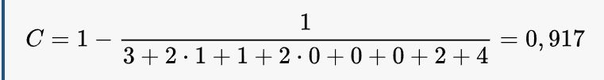

It is certainly debatable whether the given weighting makes sense. Other metrics might weight Ca and Ce more heavily than simple input parameters (data).

---

## THE ACD METRIC

Another - perhaps even more accurate - metric is measured by SonarJ and comes from **JOHN LAKOS**.

We're going to go a little deeper here.

An architectural approach was already mentioned in which the components were entered into a grid and grouped logically. An axis can be e.g. B. refer to the layer model: show the view at the top and the data storage layer at the bottom. Additional layers or logical domain objects can be placed on a different axis. Let's look at the following figure.

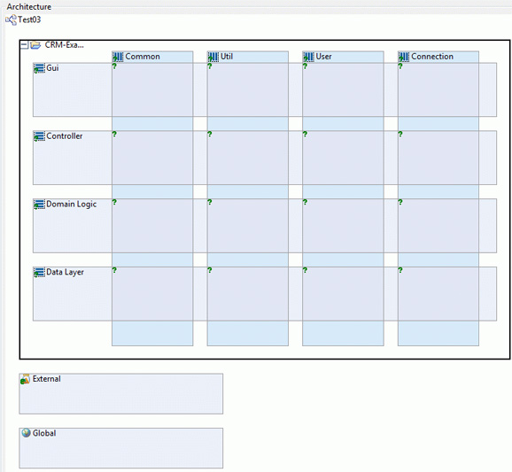

Pic: Definition of an architecture

At this point it is important for architects to know how the “call flow” is determined. Can any component call any other component “spaghetti style”? Or does a top-down with left-to-right approval make much more sense? The latter of course makes more sense, which is why there are many tools - like SonarJ or Macker - that test something like this.

If you take out one component and look at what other components are being called, you can create a graph. This graph can refer to both packages in large systems and classes in small systems.

> **NOTICE**: As already explained in the Design session, the following will show that packages should not access each other in an unstructured manner. Access to package B of component A (or e.g. package de.vfh.swt.A) is better done via one or a few interfaces (quasi facade interfaces) that provide the functionality in a bundled manner.

The recorded graph is itself a measure of the degree of coupling. A large graph with many cycles is logically much more difficult to maintain and modify because many more code points are affected. Therefore, a small and cycle-free graph always makes sense.

> **EXAMPLE**: Calculation of the ACD metric

How is the ACD metric calculated? Let's look at an example:

Pic: Component graph

The figure shows some components from A to E, which can represent both classes and packages. A uses B and C. B uses D and indirectly also E. C uses F. In the first variant there are no cycles. In the second variant, D also uses C again, creating a cycle.

> **ACD** stands for **Average Component Dependency** and describes the average component dependency according to LAKOS. However, no distinction is made between control and data flow.

According to the ACD method, each component is initially assigned an A because it is implicitly dependent on itself. Draw the above diagram on paper and fill in the numbers. Then you start from the bottom and add the sum of the underlying/dependent numbers in each component.

For the first cycle-free variant you get the following result:

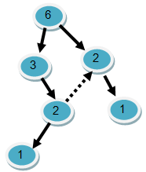

Pic: Case 2

The ACD metric is calculated by dividing the sum of all values by the number of nodes! In our example: **ACD = 15 / 6 = 2.5**. This means that on average each node depends on itself (=1) and another 1.5 nodes.

Now if we add a critical cycle from D to C and from C to A, the numbers change significantly. We get the following graph:

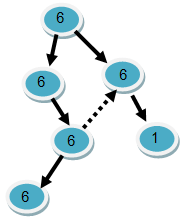

Pic: Case 3

We can see here that in the cycle each account actually depends on each other. The circle in question therefore receives a value of 6 at each node. If you calculate the new mean dependency, a completely different picture emerges: “**ACD = 31 / 6 = 5.17**”. That's a much higher value, which certainly indicates a refactoring.

What happens when you compare two graphs? Let's take our graph above with one cycle and a value of 4.33. We want to compare it to a graph that looks similar, has 100 nodes, but has no cycle.

In this case, the 100 node graph could have a much higher ACD value simply due to the absolute number of nodes. Nevertheless, this graph could be “cleaner” than the lower order small cycle graph. To get comparable values, we have to divide again by the number of nodes. Only then do we get a relative value that is independent of the number of nodes. So we call it “rACD” and define it:

* **ACD** = Number of Dependencies / Number of Nodes

* **rACD** = ACD / number of nodes

We obtain:

* Graph 1: `rACD1 = 2.5 / 6 = 0.4167`

* Graph 2: `rACD2 = 4.33 / 6 = 0.7267`

It turns out that for cycle-free graphs a maximum value of 0.5, i.e. H. **50%** can be achieved. However, a lower value would be better.

> **TASK**: Cycle-free graphs => Use examples to illustrate why it is impossible to achieve a value greater than 50% in cycle-free graphs as the number of nodes increases! Processing time: 15 minutes

Experience has shown that an rACD value for larger graphs is a very likely indication of cycles in the graphs under consideration.

The Sonar team (according to ZITZEWITZ, Java Magazine 2.2007, p. 30) comes to the conclusion that further formulas can be derived from experience which - depending on the node size - provide good values for rACDs:

* At **200** nodes the rACD should be less than **15%**.
* At **1000** nodes the rACD should be less than **7.5%**.

The following meaningful connection can be made:

    rACDmax=1.5*(1/(2^log5(n))) where n > 200

(only god knows how this equation can be derived... ;-)

---

## SUMMARY COUPLING METRICS

The coupling metrics presented here automatically provide a good overview of the **“interlocking”** of components. Cycle-free components with the lowest possible rACD are helpful.

These metrics can be quickly determined using modern tools and can be displayed in appropriate colors. Developers and architects can immediately see which packages or components are critical so refactoring can be performed.

Ideally, you should use such metrics from the beginning and sound the alarm with good tools, as this promotes the natural growth of a good architecture!

---

## TECHNICAL DEBT

As early as 1992, Ward Cunningham came up with the idea of calling the number of errors, rule violations and complexity **technical debt**. Loosely explained, this means that you are guilty of something because something can be improved on the technical side.

There are various reasons for this guilt. For example:

* bad architecture/design
* lots of code metric violations
* too much complexity
* too much coupling
* cyclic dependencies

Some errors may be easier to correct. But there is also an intrinsic complexity that is usually more difficult to resolve or reduce. Other problem areas are long-term in nature (architecture) and some are short-term in nature (missing JavaDoc) as these are easier to solve.

The entire issue addresses a topic that is often encountered in the industry. There is pressure to get a product to market quickly. Therefore, a **“quick-and-dirty”** solution is implemented. The product ships with a **Technical Debt (TD)**, including all the **“crap”** that is in the code. As in financial accounting, a loan has been taken out (debt), and now interest has to be paid on it. The interest rates are set more or less high because the product - as a rule - always has to be further developed first. However, the higher the number of injuries, the more difficult it becomes to develop and modify the program. The developers now have to invest a lot more time in debugging.

The ideal goal for the software provider is to ship the product with zero debt. The buyer's expectation is to purchase a product with the lowest possible technical debt. Unfortunately no one does this!

This topic is often discussed in forums and other committees. What's also interesting is that modern tools try to express the debt as a monetary value. This means that all metrics are converted into human days. How many human days will it take to eliminate the number of bugs in the code and architecture metrics? Human days can - depending on wage levels - be converted into monetary value.

> NOTICE: What is crucial is that the software costs not only consist of the development costs, but that there are also much higher maintenance costs, training costs, change costs, etc., which must be taken into account!

This is done using the Sonar tool as follows:

    Debt (in human days) = cost_to_fix_duplications + costs_for_remediation_violations + cost_to_comment_public_API + costs_for_resolving_undiscovered_complexity + cost_to_bring_complexity_below_threshold

Here we have:

|Term|Calculation|
|--------|--------|
|Duplications =|cost_to_fix_one_block * duplicated_blocks|
|Violations =|cost_to fix_one_violation * mandatory_violations|
|Comments =|cost_to_comment_one_API * public_undocumented_api|
|Coverage =|cost_to_cover_one_of_complexity * uncovered_complexity_by_tests (80% coverage is the goal)|
|Complexity =|cost_to_split_a_method * (function_complexity_distribution >= 8) + cost_to_split_a_class * (class_complexity_distribution >= 60)|

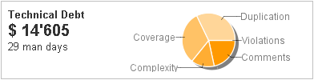

Pic: Sonar - calculation of development days and $

The number is intended to motivate those responsible or developers to invest in quality. This is particularly useful if the technical debt leads to significant “interest payments” (expenses).

Of course, it is clear that this absolute number most likely has nothing to do with reality. There may even be cases where high technical debt isn't such a bad thing. And here too it is like the JDepend metrics (e.g. the d). It's not the absolute number that counts, but the experience you get with such graphics and numbers (which you can always go into further detail with a simple click).

Such metrics and tools raise awareness of the quality score. This is usually just as important as being the first on the market with a product. Quality is one of the top priorities when it comes to dominating the market in the long term and prevailing against the competition.

**REFERENCES:**
* Technical Debt: Why It Will Ruin Your Software https://labcodes.com.br/blog/en-us/development/tech-debt/
* Martin Fowler's comment: https://www.martinfowler.com/bliki/TechnicalDebt.html
* Heise article by Eberhard Wolff: https://www.heise.de/ratgeber/Qualitaetsinvestitionen-statt-technischer-Schulden-2063864.html
* Cognitive Horizon: https://chriskohlhepp.wordpress.com/law-of-tangental-complexity/

---

## TOOLS

The tools mentioned so far mostly offered pure code metrics. To improve the architecture, there are programs that integrate low-level analysis from Checkstyle or PMD. On this page you will find examples of such tools for the Java language. There are similar tools for .NET and other languages such as Ruby or Python.

The tools are divided into two license types: commercial and free programs. The free ones are divided into three categories according to their abilities:

* General purpose tools,
* Purely physical dependency analysis and
* Dependency analysis against a logical structure.

The commercial tools listed here all have a graphical user interface (hereinafter in English version):

* **SonarQube**: SonarQube is currently the most widely used tool and also the only modern one in this list. It is available in the cloud and as an installation. With 27 programming languages, a wide field is covered. Experience has shown that installation is often not easy - but once in production it is an extremely helpful assistant.

* **SonarJ**: The most expensive and at the same time most powerful tool comes from the German company Hello2morrow (hello2morrow.com). The architecture is divided horizontally and vertically to form subsystems in the levels. Java artifacts (classes and packages) are associated with it. For developers, there is an Eclipse plugin that flags architecture violations as a problem at development time. Class relationships can be broken virtually so that the effects of refactorings are immediately visible. SonarJ works with class files. Source code is included to explain dependencies. An Ant task generates HTML reports and stops the build in case of architecture violations. Some metrics are listed in the interface and reports.

* **Lattix LDM**: Lattix, an American company, makes LDM. This organizes the structure into matrices according to the DSM12 approach (en.wikipedia.org/wiki/Design_structure_matrix). Since no logical structure can be defined, LDM does not find architectural violations. Automation is therefore not possible. Packages can be used to create rules that can be accessed. UML diagrams in the XMI exchange format should be able to be imported. In connection with MDA projects, the structure should be analyzable. However, importing simple diagrams from MagicDraw in XMI format seems to be problematic.

* **Structure101**: The program was developed by the Irish company Headway Software. Like Lattix, Structur101 also follows the DSM approach and also offers further visualizations of the packages. A logical model is based on the Java package hierarchy. Structure101 assumes that packages at the same level in the package hierarchy have the same logical meaning. Because of the strong relationship between logical and physical structure, most views focus only on classes and packages. At each package level, it identifies areas that are not related to other packages. It uses only a few metrics. You can install it into a build system using the command line. An Eclipse plugin displays architecture violations at development time.

* **STAN**: The manufacturer Odysses Software produces STAN (Structure Analysis for Java). It is available as an Eclipse plugin and as a separate application. STAN does not allow definition of logical structures, so all analysis is performed at the packet level to which various metrics are applied. Extensive reports with charts can be created. The trial version can only be used to review a test project.

With the exception of JDepend, none of the following free tools have a graphical user interface. They are designed to run with the build and generate a report, usually in HTML format. The free, general-purpose tools examine the architecture in different ways. The following two tools include a variety of other free tools.

* **Sonar**: Sonar (sonar.codehaus.org (no longer available)) is referred to as a “Code quality management platform”. A tool for analyzing dependencies is still missing, but it is on the list of requirements. Many metrics are used, some of which are presented graphically. A special feature is that each analysis result is persisted so that it can be displayed later on timelines. Sonar runs as a standalone server and comes with a web application as a user interface. The project under investigation must be configured for Maven. Sonar's graphical representation is very informative and attractive. Sonar is the only platform that calculates technical debt and displays it in the form of monetary debt.

* **XRadar**: XRadar (xradar.sourceforge.net) uses two tools, JDepend and DependencyFinder, to investigate on dependencies. A logical structure can be defined in layers and their subsystems. XRadar generates extensive reports (spider chart) and checks for architecture violations during build using Maven or Ant. The logical structure and other diagrams are graphically displayed. It offers various metrics for which limits can be configured. Configuring a test project other than the one provided is not easy because error messages are lost in the long log. XRadar evaluates the reports from several reports to provide a historical overview. This includes various diagrams about the development of the metric results.

* **JarAnalyzer**: JarAnalyzer considers a Jar file as a component and analyzes the dependencies to other Jar files (kirkk.com/main/Main/JarAnalyzer (no longer available)). The result is a report and a dot file. The dot file can be converted into a graphic that displays Jar files with their dependencies.

* **JDepend**: It analyzes the class files and creates a report with dependency metrics (github.com/clarkware/jdepend). All information refers to the package level, including used and dependent packages. In addition, a diagram can be created using a dot file. It displays each package and its relationships.

* **DependencyFinder**: (depfind.sourceforge.io) It offers a range of investigation tools. Only some of them are applied to metrics. A complete scan takes a relatively long time and results in an XML file of 100 MB. HTML reports are generated from this.

The free dependency tools for the logical structure check only provide results in text form:

dependometer: (sourceforge.net/projects/dependometer/) A logical structure can be created in layers and functional sections. A run repeatedly aborts at maximum memory allocation and has written 4GB of data to disk.

* **Architecture rules**: (sourceforge.net/projects/dependometer/) The configuration of the logical structure is not well documented. Consequently, no result report is generated. The Architecture Rules editions lack useful details.

* **SA4J**: SA4J (Structural Analysis for Java) was developed by AlphaWorks / IBM (alphaworks.ibm.com/tech/sa4j (no longer available)), but development was discontinued in beta 2004. Installing the program is complicated.

* **Macker**: (innig.net/macker) Macker only checks for violations during the build and creates an HTML report. A logical structure can be created in components. Package pattern configuration is powerful, but not well documented for component structures. The report and a check against the logical structure run quickly. In case of violations, the build system receives an error message with the not allowed dependencies.

* **Japan**: (japan.sourceforge.net) You can define the logical structure at the package level without specifying patterns. Each dependency must be described individually. In addition to Ant, IntelliJ is also supported. There is no report. The effort cannot be recovered.

* **Classycle**: (classycle.sourceforge.net) An HTML report provides a detailed view of dependencies. The logical structure can be defined in layers and components. The report and a check against the logical structure run quickly. In case of violations, the build system receives an error message with the not allowed dependencies.

The following two tables summarize the results. Kom. stands for commercial software and FOSS for free open source software. The “Attempt” line gives an impression of the effort required to operate the tool successfully (++ = high success).

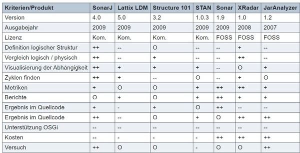

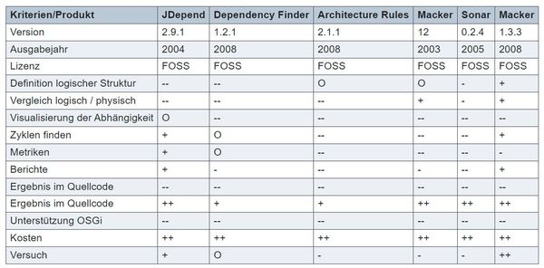

---

## SUMMARY

* Metrics are an important tool for quality assurance. It's not the absolute metrics that are interesting, but rather the relationship to a problem and the relationships between the metrics.
* Interesting complexity metrics related to the code can also be calculated from simple metrics such as McCabe or Halstaed.
* Code violation metrics are another important area. There are a variety of tools that are helpful.
* When it comes to cycles, abstract programming and package dependency analysis, JDepend is one of the most important basic tools. Many of the principles have been integrated into other tools.
* When it comes to architectural analysis, there are tools that allow you to check accesses and thus force a better design (e.g. only top-down accesses).
* With other metrics, such as B. the rACD measure, the intrinsic module complexity can be measured. These metrics can give architects valuable information on design decisions, which can sometimes be detrimental.
* With the Technical Debt, new interesting metrics are now available to measure the totality of all violations - in the area of code metrics and architecture metrics - and to report them as expenditure debt (in $ or €).

---

## EXERCISE METRICS

Goal: Gain demonstrable practical experience with tools on the subject of metrics and be able to interpret the output in a meaningful way.

Try to gain experience with two metrics tools.

For example, we recommend:

* SonarQube (also in the cloud version, but often a bit problematic to install)
* JDepend
* Checkstyle, Findbugs, PMD
* A test coverage tool (such as the former Eclemma)
or any other tool. 

There are many more good tools or lint tools for almost every language. [in 2021 e.g.: Spotbugs (old Findbugs), Sonarlint, CodeMR] and many of them are integrated in good ides as IntelliJ or Visual Studio Code

Processing time approx. 60 minutes