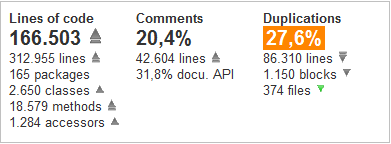

# METRICS

(C) Prof. Dr. Stefan Edlich

---

## OVERVIEW

The “Software Metrics” learning unit is a supplement to the topic of software quality, which also includes the “Testing” learning unit. It's about making a lack of software quality or software complexity visible. Rule violations or problems in the code are listed and optimally visualized. With this help, developers, architects or project managers can better set the course for new quality.

**LEARNING GOALS**

This session has the following objectives:

You will learn about the importance of metrics as a measure of quality and how you can evaluate them in practice.
You will learn the basics and how to calculate them.
You'll learn about code metrics and how to use the tools.
You will learn about architectural metrics and use tools to visualize them.

**OUTLINE**

After a brief introduction to metrics, simple metrics such as the McCabe metrics will be covered first. After the Halstead metrics and code coverage, we discuss the different types of rule violations that many tools aggregate as metrics.
In the second part, JDepend, coupling metrics and the question of debt - the technical debt - follow.
Finally, currently available tools for Java are listed and compared.

**TIME SCOPE**

It takes approximately 120 minutes to complete this unit. Applying a complex tool like SonarQube to an existing project takes about an hour. Simple tools, such as those often integrated into IDEs or DVCS, are much quicker to use.

---

## REFERENCES METRICS

* The classic on the subject of spaghetti code: http://laputan.org/mud

* There’s also a wonderful button/thread analogy that illustrates this: http://akvo.org/blog/the-ball-of-mud-transition

* More information about expressiveness: http://redmonk.com/dberkholz/2013/03/25/programming-languages-ranked-by-expressiveness

* A study on the topic of technical debt: http://insights.sei.cmu.edu/blog/a-field-study-of-technical-debt/

Justin Etheredge, Why does it take so long to build software? http://simplethread.com/why-does-it-take-so-long-to-build-software/

* Cyclic dependencies are evil: http://fsharpforfunandprofit.com/posts/cyclic-dependencies/

* Decoupling Level: A New Metric for Architectural: Maintenance Complexity, ICSE '16 [1]

**TOOLS**

* SonarQube
* CodeScene [2]

---

## MOTIVATION

Metric is anything that can be measured. This refers to measurements or ratios that occur in all areas such as music, physics, mathematics, etc.

> **DEFINITION Software metrics**: 
A software metric is a measurement that says something about the software.

> **DEFINITION**  “A software metric is a function that maps a software unit into a numerical value. This calculated value can be interpreted as the degree of fulfillment of a quality characteristic of the software unit.” (IEEE Standard 1061,1992)

> **EXAMPLE** A simple metric would be e.g. B. the number of lines of code or the number of classes in an OO project. But of course the topic of metrics goes much further – right up to architectural metrics, which say something about the state of the architecture of the software system.

Since good software architecture means maintainability, changeability and testability, this topic is also referred to as “software stability”. It describes how stable the software system is to changes, i.e. H. reacts to its further development.

Basically, there are many types of metrics related to software development. A software project consists, for example, B. from many elements:

* Source code
* binary code
* External libraries
* Build information
* Versioning information
* Forms of meta and additional information (e.g. annotations, JavaDoc, etc.)

This also means that many metrics can be measured. In this chapter we will look at some of them such as: E.g.:

* Complexity metrics
* Test metrics
* Architectural metrics
* Coupling metrics
* Style Metrics

In computer science, there are more types of metrics than just software or code metrics. Many metrics are primarily known from project management, such as: B. the function point metrics or COCOMO for effort estimation.

We will first focus on the simple software metrics and then learn about the architecture metrics.

> NOTICE: **But**: good metrics are not synonymous with good quality! Good quality does not necessarily mean good metrics! But they might correlate or often correlate.

Experience from many projects also shows that the characteristics of metric size and quality often correlate with each other!

Since large projects are being developed today and the quality has to be checked, the visualization of quality metrics is becoming more and more important. This will be discussed towards the end of the module.

> Interview with JONATHAN ALDRICH on the topic of static analysis (45 min): https://www.se-radio.net/2007/06/episode-59-static-code-analysis/

---

## SIMPLE METRICS

It is often helpful to have an overview of very simple code metrics. This includes the following metrics:

**Lines of Code**

The number of lines of code - also called LOC - is a well-known measure when it comes to comparing project sizes. For example, checkstyle has 22,369 lines of code and Apache Tomcat already has 159,364 lines of code, making it one of the larger projects. It is important to know whether all lines of code are included. When all file lines are included, Tomcat has 314,461 lines, which may be due to documentation or configuration files.

Lines of code can have completely different expressions in different languages. This is the **expressiveness** of a language. 1 is often equated with C. Modern dynamic languages often have an expressiveness of 10, 20 or more. This means that encoding can potentially be done ten times as efficiently on average.

For example, compare the line of code in Clojure with a possible implementation in an old Basic dialect:

    1 (filter (fn [x] (= 1 (rem x 2))) (map (fn [x] (* x x)) (range 10)))

> NOTICE: The function returns all odd square numbers between 0 and 100.

Lines of code should always consider the expressiveness of the language.

**Comments**

Number of lines describing the program. As a rule of thumb, this number should be between 30% and 60% of the lines of code.

**Methods/Functions**

The number of methods or functions of a program or project.

**Classes**

The number of classes used is of course also a measure of complexity. Around 2000, the largest German Java software project (Cheops) had around 30,000 classes, which is a lot.

**Packages**

Here the number of packages or namespaces is simply calculated.

**Files**

Files are self-explanatory, but unfortunately not a good measure of the complexity of a software. So there is e.g. B. Ruby programs that are packed into a file and are still very complex (e.g. Kirbybase).

**Duplicates**

Some good tools search the code for similar building blocks. This can happen at different levels, looking for identical lines of code, similar building blocks, or even similar files. Also, this provides good information about whether a refactoring could be done or not. The DRY principle (Don't Repeat Yourself) has often been violated.

For example, For example, the same blocks can be combined in one method, which usually significantly increases the maintainability of the code. Here is an example of an automatic analysis of basic metrics:

Pic: Analysis of basic metrics

It is helpful if all metrics can be tracked in history. With good tools this is easily possible and you get a graphically prepared output like the following figure.

Pic: Basic history as a timeline

Some tools also provide a graphical overview in which the metrics are displayed as weighted areas. By clicking on the area (similar to disk usage tools) you can “drill” into the region or error.

This list will never be complete. There will be more and more features in the code that can be examined or converted into metrics (number of to-do marks, notes, etc.).

---

## McCABE METRICS

One of the most famous metrics is the McCabe metric, named after *THOMAS J. McCABE*. This is a pure code metric that is relatively easy to determine. The basic idea is to automatically determine how complex the code of a software unit (e.g. method or class) is across 10,000 classes.

It is generally assumed that complexity can be calculated by the number of possible paths that can be taken in a program. In this case, this means how many control flows are possible in the program graph.

> **DEFINITION McCabe Cyclomatic Complexity** Each conditional construct (whether it's a loop or an if/else/switch) increases the complexity by 1 (that's why it should be called "conditional complexity").

The equation is:

    M = E - N + P

**Legend**:

* M = the cyclomatic complexity,
* E = the number of edges in the graph,
* N = the number of nodes in the graph and
* P = the number of exit points (return, last command, exit, etc.)

As a rule, the exit point P is reconnected to the entry point and counted as an edge.

    if(a1) code1 else code2 end if(b2) code3 otherwise code4 end

> **Exercise**: Cyclomatic Complexity
 
What is the cyclomatic complexity in the code example above? Draw the graph! Try to solve the problem yourself before looking at the sample solution. Time required: 10 min

---

## HALSTEAD METRIC

One of the lesser known metrics is the Halstead metric, introduced by **MAURICE HOWARD HALSTEAD** in 1977 (!). Nevertheless, it is implemented in many metrics tools because it is easy to calculate by machine. Furthermore, it is a static procedure that does not execute the code but rather analyzes the source code.

This metric can be calculated as follows:

* n1 ⇒ the number of different **operators** used in the code. So it's things like this:

    ! != % %= & && || &= ( )
    * *= + ++ +=
    , - -- -= ->
    . ... / /= : ::
    < << <<= <= = == > >= >> >>=
    ? [ ] ^ ^= { } | |= ~ (for C++)

and `break, case, return, try,` but also `private, friend, static` - but no types.

* n2 ⇒ the number of different **operands** used in the code.

So type declarations `(int, bool, void` and all constants, type names and identifiers that are not reserved names.

* N1 ⇒ the total number of operators in the code.

* N2 ⇒ the total number of operands in the code.

The following numbers can then be calculated from these four values:

|Metric|Calculation|
|--------|--------|
|Program length:|N = N1 + N2|
|Amount of the vocabulary:|n = n1 + n2|
|Halstead volume:|V = N * log2n|
|Halstead length:|L = n1 * log2 n1 + n2 * log2n2|
|Difficulty:|D = (n1 / 2)* (N2/n2)|
|expense:|E = D * V|

The sources even give an estimate of the number of bugs to expect.

This metric only provides lexical dimension information. So the actual complexity is only estimated. In particular, dynamic programming languages that introduce or reduce extreme complexity with constructs such as `currying, fibers, yield` and `closures` certainly defy the attempt to accurately measure complexity.

However, the absolute number is not necessarily relevant. Whether one module has a D-value of 65.25 and another module has a D-value of 67.78 is not that important. It is more important to get a **feeling** for these numbers and to be able to correctly evaluate the exceedance of orders of magnitude as an alarm signal.

> DEEP DIVE: http://www.virtualmachinery.com/sidebar2.htm Article: Complexity and quality of software by XAVIER-NOËL CULLMANN and KLAUS LAMBERTZ verifysoft.com mscoder.pdf (737 KB)

---

## CODE COVERAGE / TEST COVERAGE

There are two different areas of coverage:

* The cover through which the code runs during expiration.
* The test coverage: which controls/checks how well the tests e.g. B. record the methods used.

When talking about coverage, software engineers usually refer to test coverage. Nevertheless, one should specify exactly what is meant.

**Code coverage**

How often a method or piece of code is run is also examined using a metric. This can e.g. This can be very useful, for example, for checking processes or debugging.

  > **Example:** Here is an example from the documentation of the D programming language, which has such a function built directly into the compiler. After the program is executed, defined code points are output with the number of times the line has been traversed:
  
          |/* Eratosthenes sieve prime number calculation. */
          |
          |import std.stdio;
          |
          |bit flags[8191];
          |
          |int main()
         5|{ int i, prime, k, count, iter;
          |
         1| writefln("10 iterations");
        22| for (iter = 1; iter <= 10; iter++)
        10| { count = 0;
        10| flags[] = true;
    163840| for (i = 0; i < flags.length; i++)
     81910| { if (flags[i])
     18990| { prime = i + i + 3;
     18990| k = i + prime;
    168980| while (k < flags.length)
          | {
    149990| flags[k] = false;
    149990| k += prime;
          | }
     18990| count += 1;
          | }
          | }
          | }
         1| writefln("%d primes", count);
         1| return 0;
          |}
    sieve.d is 100% covered
  
(Source: http://www.digitalmars.com/d/2.0/code_coverage.html)

**TEST COVERAGE**

Test coverage has already been discussed in the “TST – Object-Oriented Testing” learning unit in the “Code Coverage” chapter. It's an important metric that often refers to unit tests - but of course tests can also refer to other units:

* Code blocks – did ifs, switches or loops cover or test code blocks?
* Have larger units such as classes or packages been adequately tested? If yes, at what percentage?

Such tools can ideally be integrated into a build management tool (Ant, Maven) and then provide meaningful reports:

Pic: Code coverage report

Such a metric can be very helpful when working on code. That's why every known development environment has plug-ins that deliver these results.

The interested student should e.g. For example, installing Emma or the eclemma plug-in (http://www.eclemma.org) is recommended. This is done in a few minutes and you will receive the first measurements as shown in the picture:

Pic: Coverage metric in Eclipse

---

## RULE VIOLATIONS

There have been excellent tools for reviewing code and programming style for many years. Rule violations are usually displayed as aggregated metrics. The developers can list them individually and then address the problems later.

There are many types of rule violations, such as violating the scope of a style guide or violating rules that the community or you yourself have defined as valid.

For Java, the most popular tools are:

* Checkstyle
* PMD and
* Findbugs

> WEBSOURCE: You can find an overview of other tools online if you search

Here are some examples of what the tools can typically check:

* Documentation in “JavaDoc”:
* Is there a package.html?
* Is the JavaDoc code well formatted?
* Are methods/variables well commented?

Java **naming conventions**:

* Do they follow the naming conventions regexp `"^[a-z]+(\.[a-z][a-z0-9]*)*$"?`
* Is the “Header” and “Imports” OK?
* Avoiding imports with asterisks (“de. vfh. swt. *”)
* No indication of incorrect imports
* No redundant imports
* No unused imports

Specifying “**Size Restrictions**”:

The number of executable pieces of code can be limited (e.g. the number of methods)
The file size and the number of lines can be limited
The length of the method can be limited. Note: This test forces the Extract method refactoring.
A limit on the number of parameters can be set.

Check for whitespaces or tabs.

Check the “order” of the “modifier” in classes. For example, the following applies to Java:

* public
* protected
* Private
* abstract
* static
* final
* transient
* volatile
* synchronized
* native
* strictfp

There can be no “empty blocks”.

Many other “coding standards” are being reviewed:

* Avoiding empty statements.
* Local variables that should not change their value must be final.

Same naming within blocks (shadowing) must be avoided.

* Do not use **magic numbers**. If possible, avoid using superfluous and therefore ineffective numbers (except -1,0,2) and primarily use declarations in final variables that can be supplemented by explanations.
* Missing default in switch design.
* Control variables should not be changed.

    for (int x = 0; x < 1; x++) {x++; }

Unnecessary throws declarations.

Find unnecessary code:

    if (b == true), b || true, !false, etc.

* Correct name definition for JUnit 3 tests.
* Are the same strings present in the code?

A good class design can also be checked:

* Visibility of class variables
* Using final
* Is the class geared towards inheritance?

Not only is it possible to set arbitrary regular expressions to parse a line. Any number of rules can be implemented and expanded.

**EXAMPLE**

Checkstyle example for inefficient code
As you can see here, today's tools also find inefficient code. Here is another example from Checkstyle:

    if (valid())
      return false;
    else
      return true;

This example should be replaced with:

    return !valid();

Some tools like Checkstyle include the following metrics:

* Number of **Boolean equations** `as &&, ||, &, |` and `^` in a command block
* **ClassDataAbstractionCoupling**: Note: This is the Ce of JDepend!
* **ClassFanOutComplexity**: Note: This is the Ca of JDepend!
* **CyclomaticComplexity**: We know that!
* **NPathComplexity**: The number of possible processes. This corresponds to the McCabe metric.
* **JavaNCSS**: Number of lines of code. With restrictions on Method=50, Class=1500, FileMax=2000

> Question: What values do you think make sense for point 6 and the other metrics?

**Summary**

The power and usefulness of style analysis tools for code and system quality should not be underestimated. As an experienced developer, you are usually the first person responsible when thousands of error messages from these tools are displayed at the beginning. Often the desire arises to “comment out” some tests in the configuration file, which switches them off. It would be better to stop here and think about it carefully. It is usually better to address the cause of the error in the code than to reduce error checking.

Tools like checkstyles should always be included in the build from the start or, if necessary, run as a plugin at the push of a button. This can be difficult at the beginning, but in the long term this approach pays off, especially for large projects. Especially because style analysis tools also recognize things that promote good architecture.

**EXAMPLE**

Practical example for Checkstyle
The following shows the configuration and results of Checkstyle. To start, you should consider whether you want to do this under ANT (or a build management system) or as a plugin in your favorite IDE.

* Download checkstyle-all-*.jar
* Declaration of the task:

    <taskdef resource="checkstyletask.properties"
          classpath="lib/checkstyle-all-5.0-beta01.jar" />

* Definition of goals:

    <target name="CHECKSTYLE">
       <checkstyle config="docs/sun_checks.xml">
         <fileset dir="src" includes="**/*.java" />
         <formatter type="plain" />
         <formatter type="xml" toFile="checkstyle_errors.xml" />
       </checkstyle>
    </target>

Including the definition of the analysis, e.g. E.g. sun_checks.xml (possibly remove the things that don't work...). The file has approximately the following content:

    <module name="Checker">
    ...
       <module name="AvoidInlineConditionals"/>
       <module name="DoubleCheckedLocking"/>
       <module name="EmptyStatement"/>
       <module name="EqualsHashCode"/>
       <module name="HiddenField"/>
       <module name="IllegalInstantiation"/>
       <module name="InnerAssignment"/>
       <module name="MagicNumber"/>
       <module name="MissingSwitchDefault"/>
       <module name="RedundantThrows"/>
       <module name="SimplifyBooleanExpression"/>
       <module name="SimplifyBooleanReturn"/>
    ...

As you can see here, specific tests are defined for test terms. All tests are usually well documented and well justified (http://checkstyle.sourceforge.net/checks.html).

Analysis of the result file `checkstyle_errors.xml` or the output on the console.

The XML file will then look something like this:

      1 <?xml version="1.0" encoding="UTF-8"?>
      2 <checkstyle version="5.0-beta01">
      3 <file name="C:\EDLCHESS\EDLENGINE\src\de\edlchess\cmds\PositionCommand.java">
      4 </file>
      5 <file name="C:\EDLCHESS\EDLENGINE\src\de\edlchess\consts\Info.java">
      6 </file>
      7 ... and other files...
      8 <error line="44" column="35" severity="error"
      9 message="'71776119061217280L' should be defined by a constant."
    10 source="com.puppycrawl.tools.checkstyle.checks.coding.MagicNumberCheck"/>
    11
    12 <error line="10" column="9" severity="error"
    13 message="Javadoc comment missing."
    14 source="com.puppycrawl.tools.checkstyle.checks.javadoc.JavadocMethodCheck"/>
    15
    16 <error line="10" column="29" severity="error"
    17 message="The arenaCmd parameter should be declared as 'final'."
    18 source="com.puppycrawl.tools.checkstyle.checks.FinalParametersCheck"/>
    19
    20 <error line="33" column="9" severity="error"
    21 message="The 'identify' method is not designed for inheritance - must be abstract, final or empty."
    22 source="com.puppycrawl.tools.checkstyle.checks.design.DesignForExtensionCheck"/>

* Sun Code Conventions https://www.oracle.com/java/technologies/javase/codeconventions-contents.html
* Checkstyle
* PDM
* Findbugs

---

## JDEPEND METRICS

