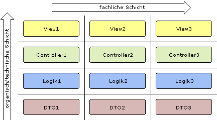

# ARCHITECTURE

(C) Prof. Dr. Stefan Edlich

---

> „One of an architect's most important tasks is to eliminate irreversibility in software design“, **Martin Fowler**

> „Architecture is selling options“, **Gregor Hohpe**

> „Architecture is structure that can withstand any earthquake“, **Danny Reschke**

---

## LEARNING GOALS

After UML and the methodology of the analysis and design cycle were introduced in the previous learning units, it is now a matter of taking this knowledge into account in a good architecture and thus gaining general architecture know-how.

Such knowledge can mainly only be acquired in practice and in discussions with colleagues, professionals or the lecturer.

This learning unit is intended to lay a foundation for practical work and discussions by:

* Techniques, areas and procedures are explained.
* You will learn about terms used in software architecture.
* The importance of design patterns technology architectures /
Learn about architectural styles and design patterns in software architecture. (e.g. **Enterprise Design Patterns**)

In this learning unit, you as a prospective architect will be asked to create a kind of “Swiss knife” in the form of a checklist. This learning unit contains dozens of perspectives, tools, principles, levels, design patterns, architectures, etc., all of which form **the basis for an understanding of architecture**. Each individual may not be particularly exciting. But **taken as a whole, all the points together** make up an architecture portfolio.

**TIME SCOPE**

You will need 120 minutes to complete this learning unit.

Approximately 2 hours are allocated for developing, presenting and discussing your own rudimentary software architecture.

---

## REFERENCES

There are some good German books on this topic, such as those from VOGEL and BIEN. (Enterprise) pattern books are also essential in this category, as good architectures have such EE patterns.

A curated list: https://github.com/mhadidg/software-architecture-books

**ARTICLES**

* Durable Architectures: Identifying and Eliminating Technical Debt
Dr. Carola Lilienthal (informatik-aktuell.de) and as an LNL video! https://www.linkedin.com/learning/langlebige-software-architekturen/architekturprinzipien-und-kognitive-psychologie?u=68873474

* Gernot Starke, Architecture Series: Part 1, Part 2, Part 3

* Component-based software technology: What's left today?
Dr. Lofi Dewanto, Manuel Klein (heise.de)

**BOOKS**

* LILIENTHAL, CAROLA: Long-lasting software architectures, d Punkt Verlag Analyze, limit and reduce technical debt, dPoint Verlag, 978-3-86490-729-6

* MARTI, ROBERT C.: Clean Architecture, Addison Wesley, 978-0134494166, 2017

* VOGEL, ARNOLD, ET AL. (2008): Software Architecture. Basics - concepts - practice. Spektrum Academic Publishing, ISBN-13: 978-3827415349
* RALF REUSSNER, WILHELM HASSELBRING (2006) Handbook of software architecture. dpunkt Verlag, ISBN-13: 978-3898645591

* BUSCHMANN ET AL. (2007): A System of Patterns: Pattern-Oriented Software Architecture. Wiley & Sons, ISBN-13: 978-0471958697 (see also chapter “Enterprise Design Patterns”)

* GERNOT STARKE (2008): Effective software architectures. A practical guide. Hanser, ISBN-13: 978-3446412156

* MARTIN FOWLER (2003): Patterns of Enterprise Application Architecture. Addison-Wesley Longman, ISBN-13: 978-0321127426

* IAN GORTON (2006) Essential Software Architecture. Springer, ISBN-13: 978-3540287131

* MARTIN VAN DEN BERG, MARLIES VAN STEENBERGEN (2006): Building an Enterprise Architecture Practice: Tools, Tips, Best Practices, Ready-to-Use Insights (Enterprise). Springer Netherlands, ISBN-13: 978-1402056055

MISCELLANEOUS

* aim42, Dr. Gernot Starke, aim42.github.io
* Simon Brown - The lost art of software design youtube.com/watch?v=XPSZC3mJRO0&t=28s (46:15)
* Mikio Braun (margint.blog) Software at Scale
* Software quality is like beauty subs.emis.de/LNI/Proceedings/Proceedings259/129.pdf

---

## INTRODUCTION ARC

Please imagine a large project where there are 50-100 domain classes and hundreds of views in the GUI. The budget of the project is many millions of euros. There are around 20 developers sitting in front of you who want to get started straight away and have different knowledge and experiences. Why is this a problem?

You might guess that in addition to good project management and the usual specifications, analysis and design results, good software architecture is generally required.

The developers involved, the components and data must be provided with a lot of information / guidelines and visions and coordinated. If this doesn't happen, spaghetti code is created in a short time - then the developers no longer understand the code and the system is no longer maintainable.

The term architecture is difficult to grasp because its content is often subjective.

> **DEFINITION**: Software architecture gives an IT system a meaningful structure, arrangement and framework. These consist, for example, of rules for the interaction or structure of the components.

Additional definitions can be found on the Carnegie Mellon Software Engineering Institute website.

> WEBSOURCE: What Is Your Definition of Software Architecture Software https://insights.sei.cmu.edu/library/what-is-your-definition-of-software-architecture/ Engineering Institute (resources.sei.cmu.edu).

The above definition refers to two essential elements:

* **Division / Identification**: The code elements must be clearly separable but grouped. The software developers have to “learn the ropes” and be able to determine the level of abstraction in visibility. Code is separated in a distinguishable manner and/or grouped sensibly. For example, in classes, packages, design patterns, deployment views, etc.

* There are **rules** for the interaction of the components. Certain accesses are prohibited, permitted or may only function in certain ways.

These include things like:

* No access to private methods
* Package a.b.c should not access package g.n.z directly
* The communication between components A and B takes place via a web service
* Package d.e.f accesses package d.e.g only via a facade
Why are these two points so important?

There are several good reasons for good software architecture.

* Software should not be in the form of a **Big Ball of Mud** (*laputan.org*), i.e. a large pile of mud. The unstructured accumulation of (often functional) code units becomes confusing.
* If the code becomes **complex**, it can be better understood if it is structured. You find your way around better.
* Code is easier to **extend** and maintain when it is structured.
* Structure in the software system reflects **domains and task areas**. These can then be processed much better and independently by the respective specialized people.
* **Correctness and quality** can be better ensured in good architecture.

The goals of structuring are sometimes be **contradictory**. As with design patterns in general, the code with structure or patterns can become larger, which can often be a disadvantage.

Architecture is - for obvious reasons - often compared to the art of construction, as was done in Design Patterns with the work of Christopher Alexander (wikipedia.org). In the art of architecture, there are also structures, instructions and best practices for the construction of an architectural object (house, skyscraper, bridge, etc.). In particular, Christopher Alexander coined the term "native language" aka design patterns, which had a decisive influence on software technology.

**Maintenance** is an essential goal of software architecture. Maintainable software **minimizes** the **effort** required for maintenance and care. Unfortunately, this can only be measured indirectly. The chapter “**Cohesion and Coupling**” deals with this cohesion/coupling of software. There are many direct factors that cannot be measured, but which can make a software product unmaintainable (e.g. inappropriate naming). Software must be quick to learn and quick to change.

So we note:

The aim of a good software architecture is essentially:

* Changeability (We have been wrong! The world changed!)
* Maintainability (Might live a long time!)
* Readability
* Quality

These criteria have already been addressed in the Refactoring, Design or Design Patterns learning units.

---

## WHAT IS IT ALL ABOUT?
Architecture encompasses a wide variety of tasks and disciplines and, as a whole, is extremely confusing. VOGEL, ARNOLD ET AL. tried to organize the areas.

**WHAT**

This is about the type of architecture: software architecture, data architecture, security architecture, enterprise architecture, integration architecture, network architecture, management architecture. And of course all of the architectural components presented below.

**WHERE**

Which software layers are used?
Where are components located?
What architectural levels are there?

**WHY**

Why does the problem structure, large and small, determine this architecture? Why do components have to be arranged and communicate like this?

**BY WHICH**

Which patterns, frameworks and technology architectures should be used?

**BY WHOM**

Deals with the people involved. There is not just the architect. In order to find the best architecture, you have to exchange ideas with many other groups of people, for example from design and requirements determination.

**HOW**

This point deals with the architect's approach.

All of these points are addressed in the following.

---

## BUILDING BLOCKS OF AN ARCHITECTURE

In literature but also in practice, there are many levels through which an architect can influence the structures and rules of the system.

In a figurative sense, these are **conceptual tools** that are available to architects to design the system according to the goals and quality characteristics mentioned in the introduction - essentially changeability, maintainability and comprehensibility.

Of course, this does not mean tools in the sense of tools.

---

## VISION

To a large extent, architecture is also a vision, and not just a vision of the entire system, but also a vision of the components.

Two examples:

> **EXAMPLE** Impulse 1 for architectural vision

A client GUI should communicate with an engine via a protocol. Initially 4 commands are known. The developer can intercept the 4 commands and stubbornly implement them. However, if the pattern vision of a pluggable selector is initially supplied, we think and implement it differently. Because a pluggable selector has already implemented the logic for distribution. The actual logic for the command is then implemented in an extra class for each command.

> **EXAMPLE** Impulse 1 for architectural vision

Consider a specification:

* Torque 500 NM at 2000 revolutions/minute
* Power 295 kW (400 HP)
* Consumption 8-10 l/100 km at 90 km/h
* 8 cylinders
* Direct injection

Here too you can start developing and building straight away. But what is the vision? What's that supposed to mean? Is a race car or a truck the goal? As you can see here, visions can replace or supplement many specifications (example according to BIEN).

---

## PACKAGES AND NAMING

Packages are the most important design tools for software architecture. They are namespaces that ideally help with structuring and separating the components.

Packages are tools for structuring layers and the perspectives of developers or others. At the same time, they represent a respective aspect of the IT system to be developed. For example, the persistence layer could be mapped in the `de.swt.flugbuchung.persistenz` package.

Packages are grouped vertically. The technical component in this area is located on the horizontal level. As already explained in the design part, it always makes sense to divide horizontally and vertically. So both vertically in layers and technically within the layers. Subject-specific components can be classes.

Separate and group both packages and functional components.

Pic: Example of grouping in layers

> **NOTICE**: People who are inexperienced in software development tend to summarize things. It often feels like it's easier to keep track of things when they're all in one place or in one file. This feeling often arises when you are actually deep into the topic. However, it is much better for others involved in the development (or if you are away for a while) to keep things small!

Ultimately, everyone involved in the architecture and development has the architectural means of naming. Across the entire vertical and horizontal level, appropriate naming can help ensure that both separation and logical cohesion become clear.

---

## PATTERNS, ENCAPSULATION, ABSTRACTION

Design Patterns and Enterprise Design Patterns are an extremely important part of architecture. A design pattern structures components and orchestrates access. A design pattern is therefore an architectural unit. Orchestrating here means controlling mutual access.

Design patterns already help in the documentation to make it easier for developers to understand the system and expand it if necessary.

> **Example of design pattern** Good developers will already have an idea in mind how the system can be expanded when the architects say that subsystem A is structured according to a strategy pattern. Even without the developers having seen the 5 existing classes, they know that an algorithm selection occurs by name and they only need to know the general interface - for example a chess strategy according to alpha-beta or monte-carlo! Mean value strategy: Arithmetic or Geometric!

Surprisingly, most systems - even larger ones - get by with relatively few (5-10) patterns. However, the correct choice of patterns is also crucial for the good architecture of the system.

The principle of encapsulation is based on hiding things from the outside. It is also an important feature of architecture, e.g. B. Avoid spaghetti code. This principle reduces the cohesion/coupling of the components. See also all SOLID patterns.

**Example of encapsulation**

> Components/classes can be separated into public and private. Interfaces can be defined for the public part.

> Packages should usually also ensure that their components are encapsulated. For example, For example, facades can be defined for package access that publish a suitable interface.

A core principle of an architect is to pay attention to abstraction, for example:

** Are there concepts for abstraction?
** Are interfaces and abstract classes used?
** Is MDA (Model Driven Architecture) used?

What about the three questions or how should they be understood here?

Software that maintains the right balance of concrete and abstract components is less sensitive to change - and therefore may also be less strongly coupled.

---

## RESPONSIBILITY, TALKATIVENESS, BRITTLENESS

Now let's look at a few more architectural means/descriptions according to A. BIEN.

Each component should only do what it is intended/responsible for.

As already mentioned, components should carry out small tasks - but they should be implemented thoroughly and correctly. In the Refactoring learning unit, we learned many examples of how to identify and eliminate incorrect responsibilities.

> **EXAMPLE: Responsibility**

* Does one method already do too much? Does it have to be cut up using the extract method?
* Is a method too interested in other classes' data?
* Does a class itself handle many internals of other classes, e.g. B. a class “Person” that already contains the data “Purchase” and “Payment”!

Developers almost always lean towards large components that are supposed to do everything at once. This may be efficient for insiders (one-man developers). In the long term, however, such a system is much more difficult to maintain and understand.

> **Small classes and talking methods**: A well-known software developer once reported on a joint code session with KENT BECK. It was noticeable that BECK used extremely small classes and speaking public(!) methods. The visitor reported that this alone resulted in a very luminous system architecture.

**CHATTINESS**

BIEN understands the chattiness of a system as the degree of communication that is necessary to design a system. We have learned so far that it can make sense to decouple an IT system and, for example, introduce protocol interfaces (e.g. an RMI or a web service protocol). This usually has a positive effect on the degree of coupling of the system. And of course also on the distributability of the system.

On the other hand, systems can also communicate to death - just as there can be constant meetings in companies without any real work being done. There are famous examples of systems that – designed as web services – no longer scale.

In such a case, the architect must find the balance between decoupling and anti-talkativeness. Not an easy task!

**BRITTLENESS**

The term brittleness has already been discussed in connection with the topic of coupling and is strongly related to it.

---

## STANDARDS

The decision of the underlying and used technology by the software architect - for example the use of Java EE with JBoss - is also the decision for a specific standard.

This exemplary statement already implies some standards such as: B. the use of Enterprise Java Beans or a communication protocol such as JMS.

In fact, the architectural areas already mentioned suggest that standards and frameworks are a small, although important, part of architectural activity. They imply an architecture that can then no longer be changed. For example, an application using Ruby on Rails cannot be implemented without an MVC architecture.

Other important standard elements are:

* Coding standards
* Tool standards such as test frameworks, build frameworks, CI/CD tools, etc.

The choice of underlying framework regularly generates heated debates. In particular, GUI technologies (rich vs. thin), databases and database mappers are often the subject of an evaluation that is often far too small. Often, own frameworks are even implemented, although standards offer more reliable alternatives.

This also makes it clear that there are not so much scientific standards or standardization standards as e.g. B. *H.261* are meant.

---

## ARCHITECTURE PRINCIPALS